# Mia-Platform Backoffice Tutorial

In this tutorial, we will install and configure the Mia-Platform Backoffice, customize its visual appearance, and create our first sample page with a table. This page will be connected to real data through the CRUD service. Consider this guide as your starting point to explore all the capabilities of the Mia-Platform Backoffice.

## What We Will Build

Throughout this tutorial, we will:

- [Set Up the Microservices](#setup-the-microservices)
- [Customize the Backoffice Appearance](#customize-the-backoffice-appearance)
- [Create a Backoffice Table Page](#create-a-backoffice-table-page)
- [Connect the Page to the Backoffice Menu](#connect-the-page-with-the-backoffice-menu)
- [Save and Deploy the Backoffice](#save-and-deploy)

## Prerequisites

Before starting, you should be familiar with the [Mia-Platform Backoffice](/microfrontend-composer/what-is.md) concepts and have the following:

- A CRUD microservice already created, follow the [CRUD Tutorial](/getting-started/tutorials/rest-api-for-crud-on-data.mdx) if needed.

## Setup the Microservices

You can install the Backoffice using either the Application or the individual microservices. For this tutorial, we will use the Application.

1. Go to Applications and click on the `Create New Application` button.
2. Search for `Backoffice` and click on the card.
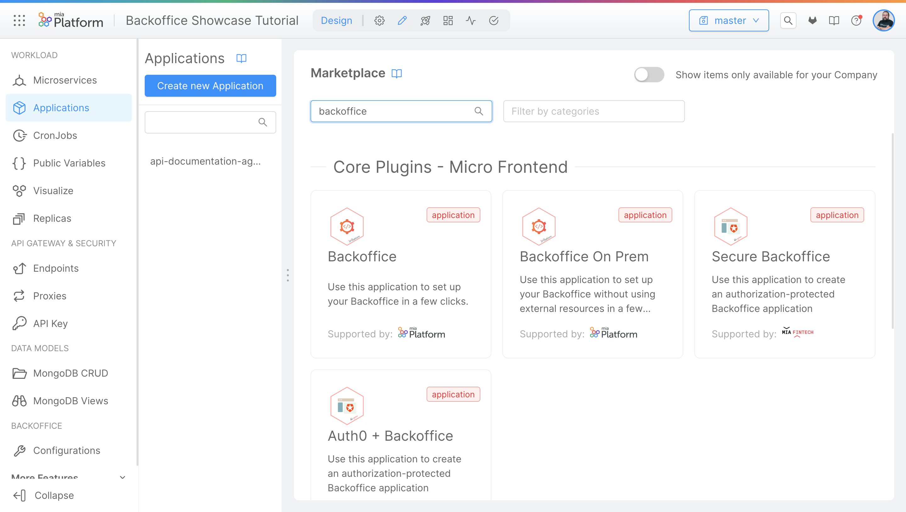
3. Follow the wizard, selecting if you want to install new microservices or use existing ones.
4. At the end, click the `Create` button and then save the new Application.
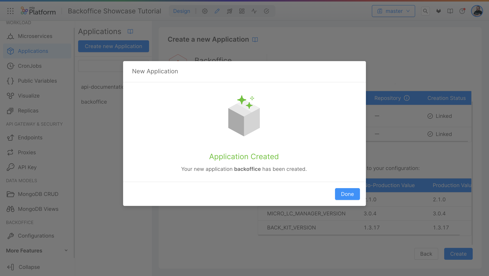

## Customize the Backoffice Appearance

Next, navigate to the Backoffice Configuration to manage all settings. Here you can customize the appearance, navigation menu, add new pages, connect to APIs, and manage all configurations.

### Customizing Appearance

1. Click on the `Configurations` button in the left menu under the `Backoffice` section.
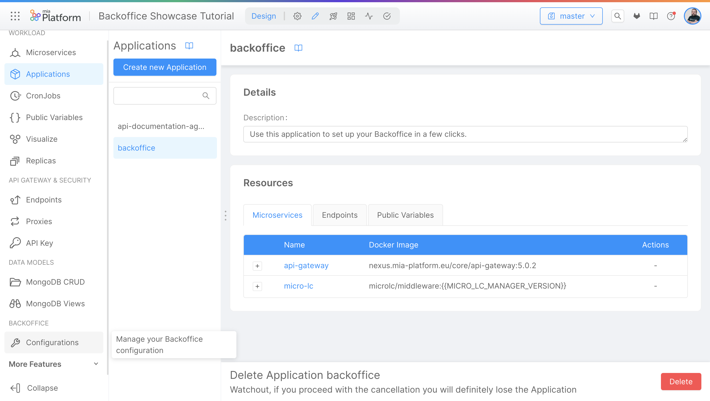
2. Go to the `Layout` tab, then click on the `Layout` button to view the configuration.
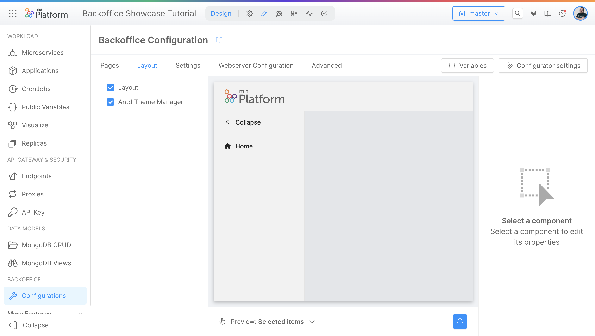
3. Inside the `Layout` section, use the no-code features to customize appearance. Preview your changes in the center of the page.

### Specific Customizations

You can further customize the following settings:

* **Visualization Mode**: Use `Fixed Sidebar` to show the menu on the left side.
* **Logo Settings**:
  * **URL**: Define the Backoffice logo with a URL.
  * **Alternative Text**: Set `Mia-Platform` as alternative text.
  * **On Click Href**: Use `./home/` as the URL when clicked.
  * **URL Configuration**: Click to open a modal where you can specify the type (`string`) and URL for the logo (`https://www.mia-platform.eu/static/img/basics_logo.svg`).

Under the `Advanced Properties`, you can customize additional settings:

* **Help Menu URL**: Define `https://www.docs.mia-platform.eu/` as the URL for the help link, displaying a question mark icon in the header.
* **Head Configuration**: Customize the Backoffice head configuration, setting `Mia-Platform Backoffice` as title and `https://www.mia-platform.eu/static/img/basics_favicon/apple-icon-60x60.png` as favicon.

## Create a Backoffice Table Page

Now we can create a new page that will display data from the CRUD microservice. To initiate the creation, click on the `Pages` tab followed by the `Create New Page` button.

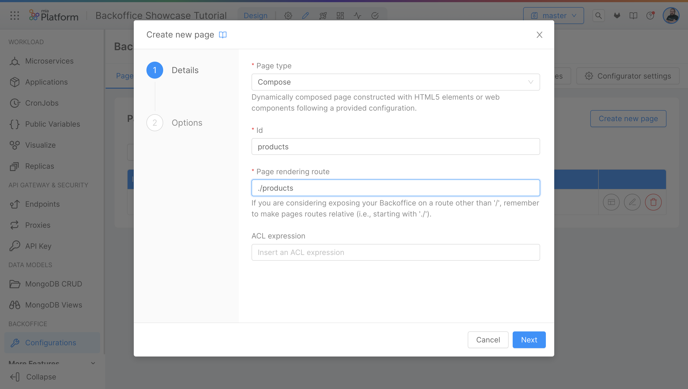

Within the modal, you'll have options to:
* `Page Type`: Designate the type of the page. For this example, select `Compose`.
* `Id`: Assign an ID to the page. This must be unique, and for our demonstration, we'll use `products`.
* `Path`: Define the path for the page. This too should be unique. We'll set it as `./products`.

:::info
Every URI in the Backoffice is linked to the Backoffice base path. For instance, the home page is represented by `./home/`.
:::

Upon navigating to the wizard's second step, you can outline additional page properties.

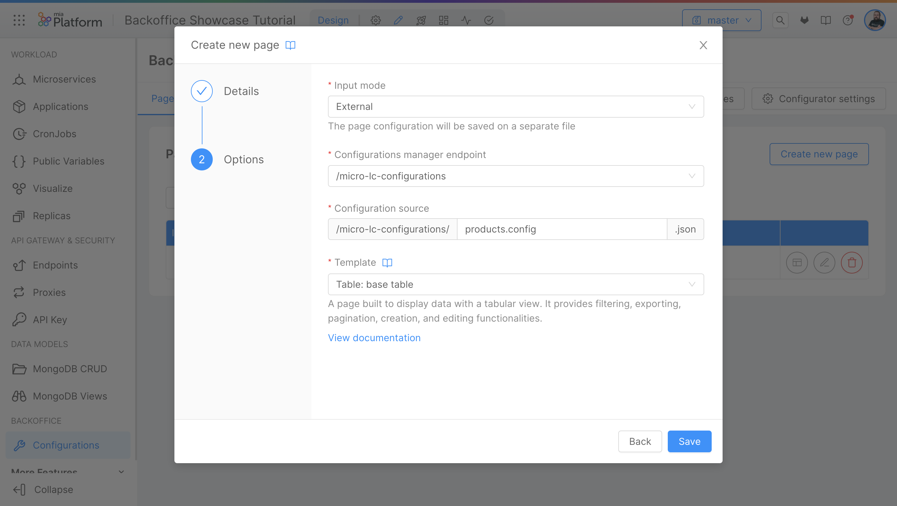

In this section:
* `Input mode`: This determines the page's input model. We'll choose `External`.
* `Configuration Manager Endpoint`: State the endpoint for the Configuration Manager. For our needs, `(/micro-lc-configurations)` is suitable.
* `Configuration Source`: Retain the default value as automatically provided by the wizard.
* `Template`: Select the desired template for the page. While `Table` is our choice now, subsequent tutorials will explore alternative options.

Once done, click on `Save` to preserve the new page and begin its customization.

### Create CRUD to Read and Write Table Data

To evaluate the new page, it's essential to create a CRUD microservice and expose the relevant data through an endpoint, facilitating reading and writing operations on our table.

:::warning
If you're unfamiliar with CRUD microservices, consider consulting the [CRUD Tutorial](/getting-started/tutorials/rest-api-for-crud-on-data.mdx).
:::

For our example, let's employ a basic CRUD microservice featuring a `Product` entity endowed with the subsequent properties:
* `name`: A mandatory string.
* `description`: An optional string.
* `price`: A mandatory number.

The data CRUD will be exposed via an endpoint named `products`.

Below is the CRUD schema, excluding the default CRUD attributes (_id, creatorId, createdAt, updaterId, updatedAt, and \_\_STATE\_\_):

```json
[
   {
      "name":"name",
      "type":"string",
      "required":true,
      "nullable":false,
      "encryptionEnabled":false,
      "encryptionSearchable":false,
      "sensitivityValue":0
   },
   {
      "name":"price",
      "type":"number",
      "required":true,
      "nullable":false,
      "encryptionEnabled":false,
      "encryptionSearchable":false,
      "sensitivityValue":0
   },
   {
      "name":"description",
      "type":"string",
      "required":false,
      "nullable":false,
      "encryptionEnabled":false,
      "encryptionSearchable":false,
      "sensitivityValue":0
   }
]
```
Now, the CRUD data can be exposed using an endpoint named `products`.

### Customize the Table Page

Within the `Pages` tab, located under the `Backoffice` section, you'll find the `Products` page we recently created. Click on the `Compose` button (placed on the left of the "Edit" button) to access the page composer.

#### CRUD connector

Before diving into table customization and its associated forms for insertion and updates, specify the CRUD connector for data reading and writing. Click on the `Connectors & Adapters` followed by `CRUD Client` on the left panel.

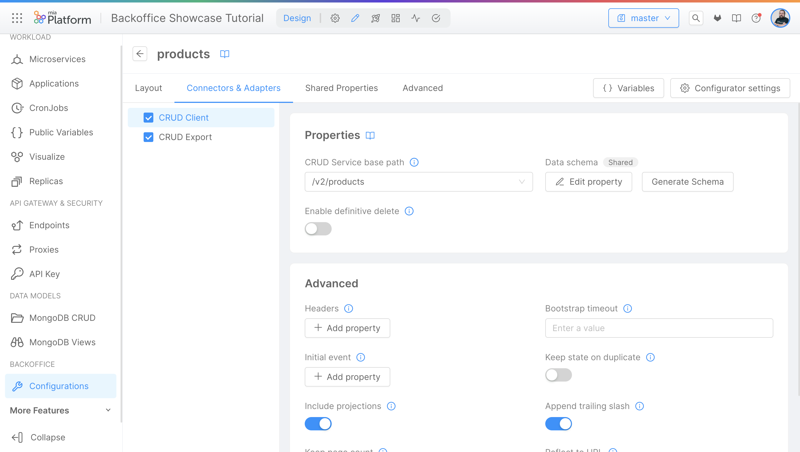

On the right, input the `CRUD Service Base Path` to set the CRUD microservice endpoint, opting for `(/v2/products)`. Click `Generate Schema` to automatically construct the microservice's schema.

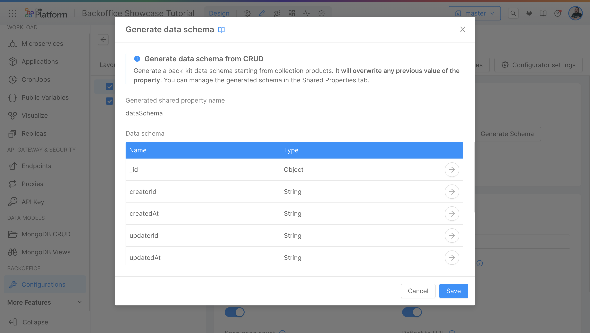

Given the CRUD Schema, this modal displays all CRUD fields. Generate the schema by clicking `Save`.

#### Edit the Table Schema

Navigate back to the layout page via the `Layout` tab to modify the table schema. The preview showcases a default schema generated earlier. This tutorial, however, will limit display to `name`, `price`, and `description` fields. Adjust the schema by clicking `Main`, then `Table` on the left panel.

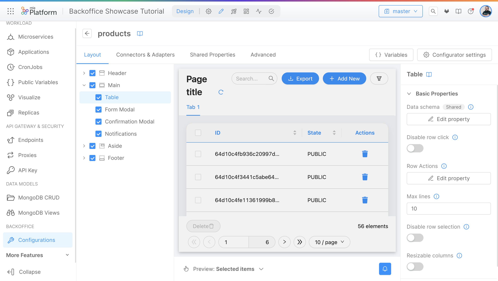

Within the right panel's `Basic Properties`, select `Edit Property` under the `Data Schema` label. Here, customize the data schema for the page. Since we're focusing on the `name`, `price`, and `description` fields, remove all extraneous ones like _id, creatorId, createdAt, updaterId, updatedAt, and \_\_STATE\_\_. Toggle on `Use custom value` to edit the schema.

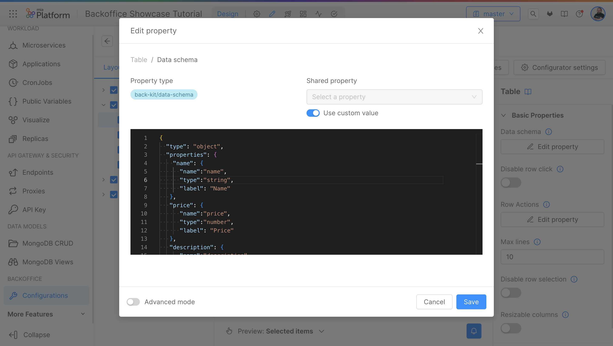

To exclusively display the `name`, `price`, and `description` fields, apply this schema:

```json
{
  "type": "object",
  "properties": {
    "name": {
      "name": "name",
      "type": "string",
      "label": "Name"
    },
    "price": {
      "name": "price",
      "type": "number",
      "label": "Price"
    },
    "description": {
      "name": "description",
      "type": "string",
      "label": "Description"
    }
  }
}
```

If all is ok, we can click on the `Save` button to save the schema and then check the table preview that now show only the `name`, `price` and `description` fields.

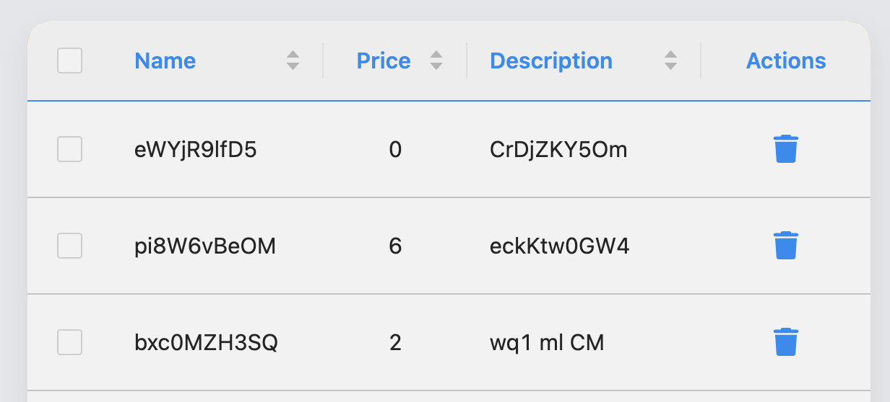

### Edit the Forms Schema

Now we can edit the insert and update form schema to show only the `name`, `price` and `description` fields.

To modify the form schema in the `Layout` tab on the left panel we can click on the `Main` button and then on the `Form Modal` button.

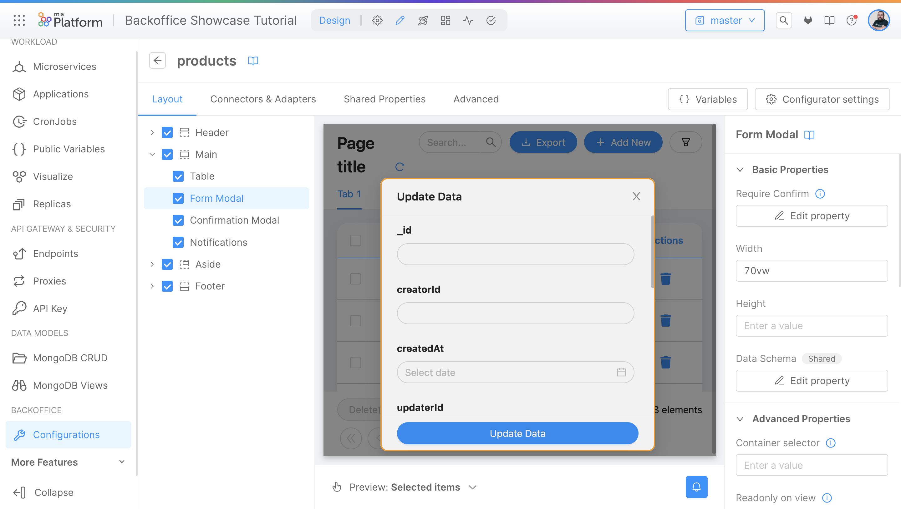

On the right panel, in the `Basic Properties` section, we can click on the `Edit Property` under the `Data Schema` label. To change the default schema, we can enable the `Use custom value` and then we can edit the schema.

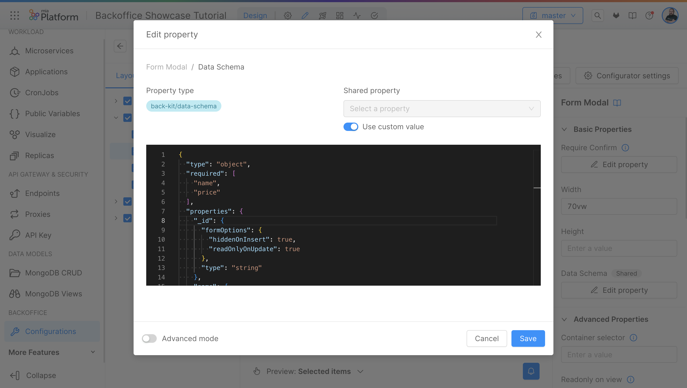

In this case, we want to show only the `name`, `price` and `description` fields in the insert and update form so we can remove all the other fields (creatorId, createdAt, updaterId, updatedAt and \_\_STATE\_\_). About the `_id` field, we can remove it from the insert form (using the `hiddenOnInsert` property in `formOptions` object) because it is an auto-generated field, but we can show it in the update form using the `readOnlyOnUpdate` property in `formOptions` object.

Below the schema that we can use for the insert and update form:

```json
{
  "type": "object",
  "required": ["name", "price"],
  "properties": {
    "_id": {
      "formOptions": {
        "hiddenOnInsert": true,
        "readOnlyOnUpdate": true
      },
      "type": "string"
    },
    "name": {
      "type": "string"
    },
    "price": {
      "type": "number"
    },
    "description": {
      "type": "string"
    }
  }
}
```

If everything is set correctly, click on the `Save` button to save the schema. After that, you can check the form preview. It should now display only the `name`, `price`, and `description` fields in the insert form, along with the `name`, `price`, `description`, and `_id` (set as readOnly) fields in the update form.

#### Export functionality

To export the data in the table, you need to specify the export functionality in the page composer. First, navigate to the `Connectors & Adapters` tab and then click on the `CRUD Export` button on the left panel.

Specify the `CRUD Service Base Path` by using the same endpoint as the CRUD connector (`/v2/products`). Next, click on the `Edit Property` under the `Data Schema` label to specify the export schema. For this example, you would want to export only the `_id`, `name`, `price`, and `description` fields, so you can reuse the schema created for the form.


In this step, you'll also need to activate the `Use custom value` option to modify the schema.

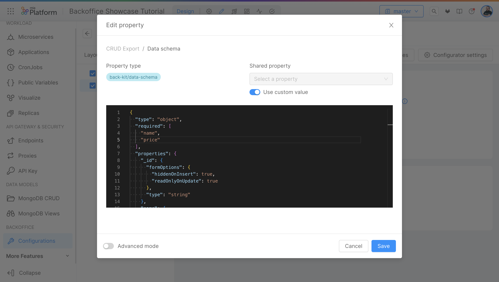

Below is the schema suitable for the Export functionality:

```json
{
  "type": "object",
  "required": [
    "name",
    "price"
  ],
  "properties": {
    "_id": {
      "formOptions": {
        "hiddenOnInsert": true,
        "readOnlyOnUpdate": true
      },
      "type": "string"
    },
    "name": {
      "type": "string"
    },
    "price": {
      "type": "number"
    },
    "description": {
      "type": "string"
    }
  }
}
```

### Personalize the Page

It's now time to give the page a personal touch by modifying the title and tab label.

Go to the `Layout` tab on the left panel and click on the `Header` button, followed by the `Title` button. On the right panel, modify the title using the input box under the `Content` label. For this guide, we'll use `Products` as the title.

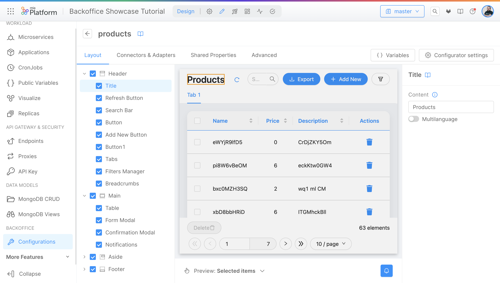

To update the tab label, click on the `Tabs` button located on the left panel under the `Header` button. Then, on the right panel, click `Edit Property` under the `Tabs` label. In the appearing modal, select the `Edit` option.

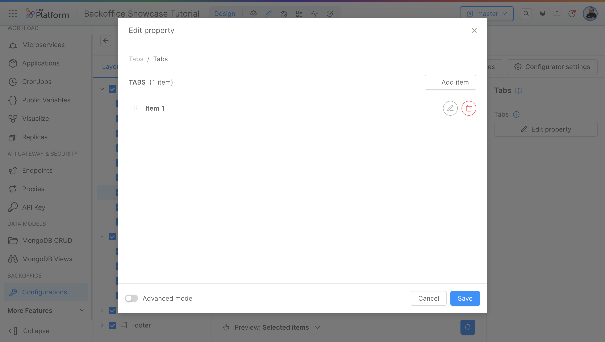

Now, you can modify the tab properties. For our example, change the `Title` input to `All`.

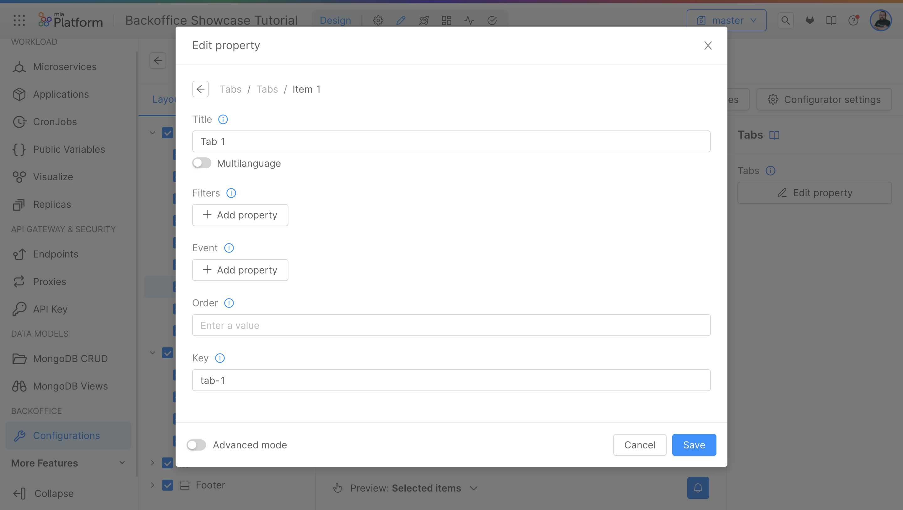

## Connect the Page with the Backoffice Menu

You're now ready to link the page to the menu. Go back to the `Layout` tab, click on the `Layout` button on the left, and then select `Edit Property` under the `Menu Items` label. In the modal that appears, choose `Edit` for the sole item in the list, and then modify:
* `id` to `products`
* `label` to `Products`

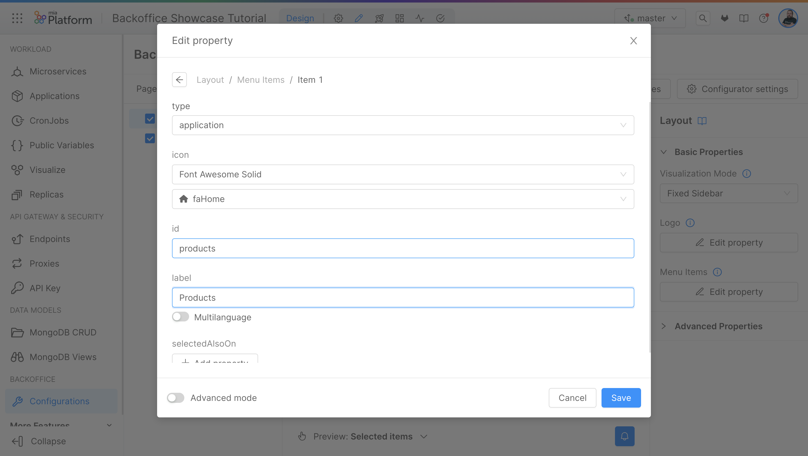

To set the new page as the default, go to the `Settings` tab. In the left panel, click on the `URIs` button and then, in the `Default URL`, input the new page path (`./products`).

:::info
All the URLs in the configuration are relative to the page path. So, if you're referencing a page in the same directory, use `./` as a prefix. If it's a page in a subdirectory, the path should be `./subfolder/page`.
:::

## Save and Deploy

With all the configurations in place, save your changes and then deploy. For further details on the deploy command, consult the [Console Handbook](/getting-started/handbooks/project/usage.md).

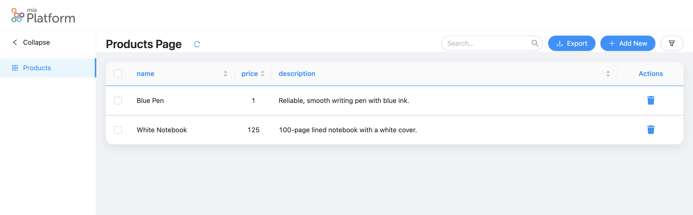

## Backoffice Tutorials

In this tutorial, you've learned how to set up the Backoffice and create a new Table Page using the Backoffice Page Composer.

Also, make sure to check out:
* In the [Backoffice Templates Tutorial](/getting-started/tutorials/backoffice/templates.mdx), explore how to configure various page types with the Backoffice Page Composer and an iFrame Page.
* The [Backoffice Microfrontends Tutorial](/getting-started/tutorials/backoffice/microfrontends.mdx) provides guidance on configuring a Microfrontend using Angular or React, and its integration into the Backoffice.
