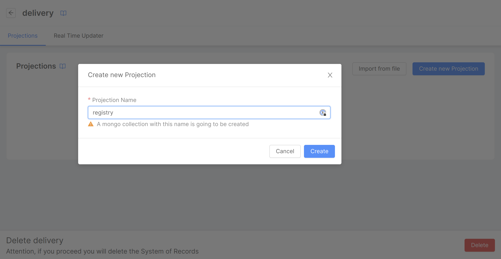
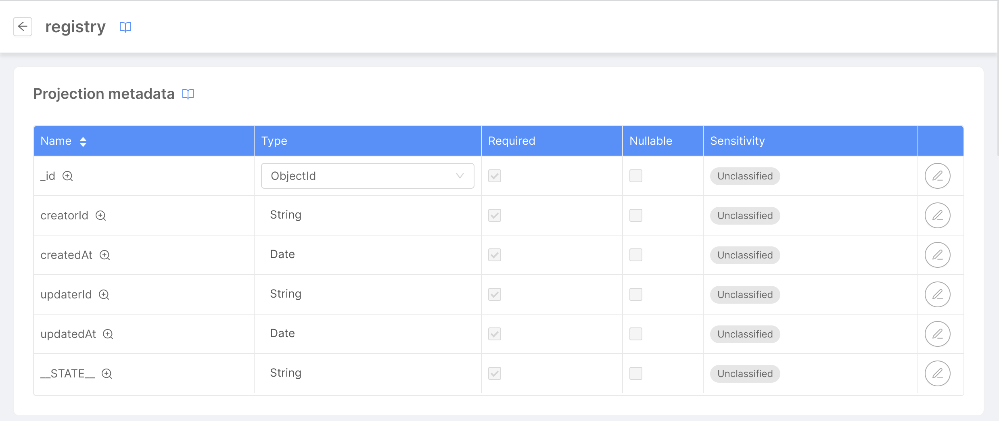
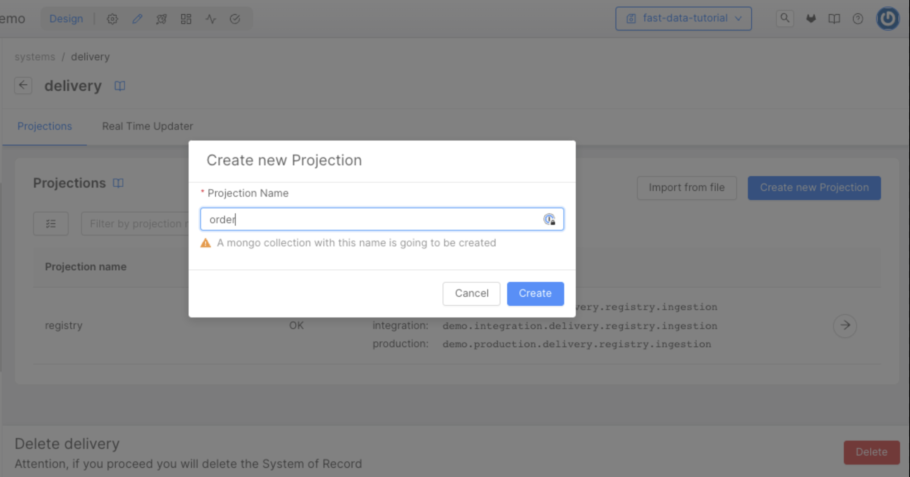
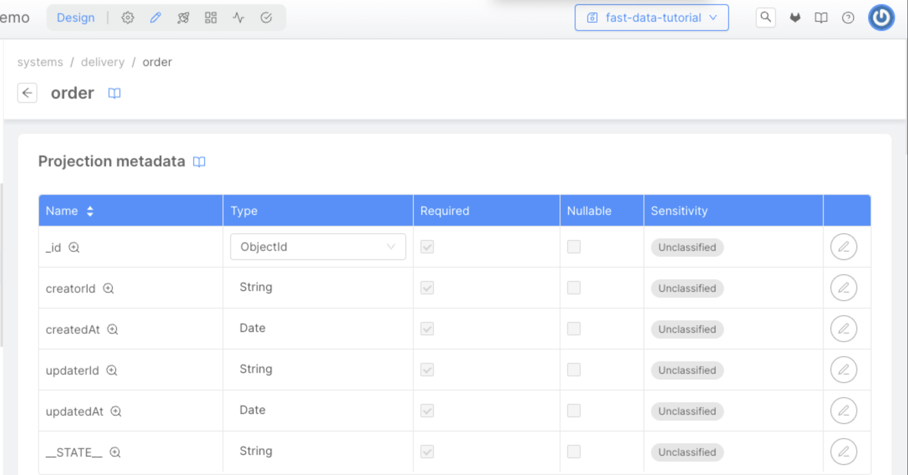
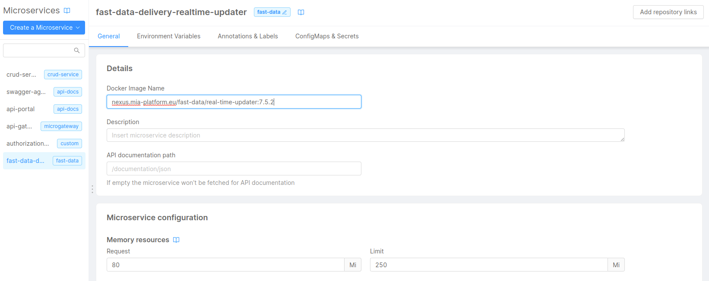
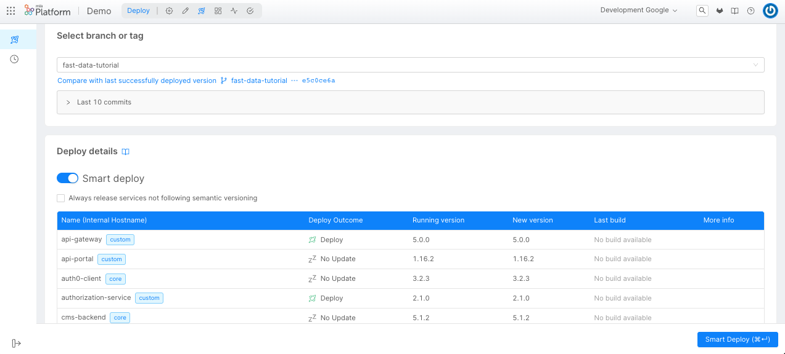
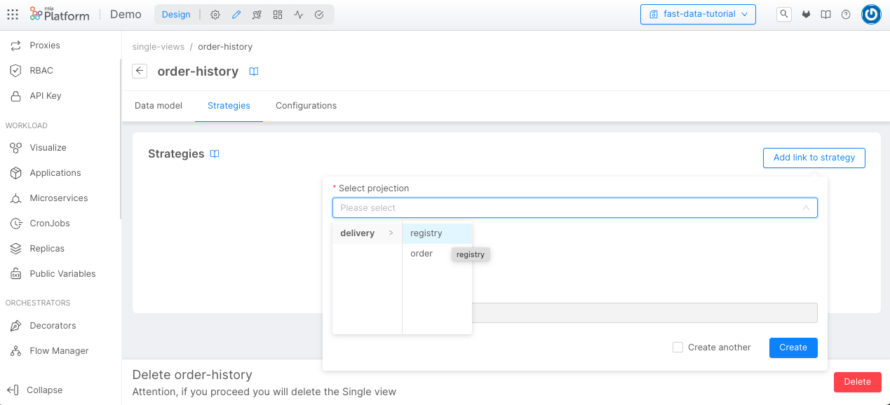

import Tabs from "@theme/Tabs";
import TabItem from "@theme/TabItem";

**Fast Data** is an event-driven architecture that allows you to collect data, manipulate and aggregate it from your systems in near real-time using a data stream approach.

## What We Will Build

In this tutorial, we will create a simple example of a Single View dedicated to a history of orders made by a customer. To do that we will expect to receive data from two
different tables: a table that includes a registry of customer data (like the name, address and so on) and a table for a single order (with date, price and the identifier of
the customer included in the registry).

We are going also to create the microservices that will store the data received in separate collections (we will call them _Projections_) and aggregate the Single View.

To do that, in the console, you will:
  - Generate two Projections where we will store the data;
  - Connect two endpoints to the Projections;
  - Create a Single View Low Code that will aggregate the data from the two projections;
  - Create an endpoint that will consume the data from the Single View;
  - Test the Single View.

## Prerequisites

Before starting this tutorial, you need to be familiar with the concepts of [Fast Data architecture](/fast_data/architecture.md), including [Projections](/fast_data/configuration/projections.md), [Single View](/fast_data/configuration/single_views.md), and Kafka (including producers and consumers).
For the technical part of this tutorial, an up-and-running Kafka cluster is required.

## System of Records

A System of Records is a container of _Projections_, which is are architectural objects responsible for storing the data in a persistent storage, to have a fast and scalable way to decouple the data from the source system.
We will use this projections to have an easy way to read a 1:1 copy of the data from the source systems, and later it will be used to aggregate the data from the source systems, using the Single View Creator.

The architectural component responsible for creating and updating the projection is the _Real-Time Updater_ service.
To simplify, this microservice is a Kafka consumer that will consume the data from the source systems and will update the projection.

In this tutorial, we can imagine a simple delivery platform where the data are the registry and the order of the customers.
So, we will create a single System of Records with two projections (one for the registry and one for the order) attached to a single Real-Time Updater.

### Microservice Real-Time Updater

:::info
From version `11.7.0` of the Console, the _Real-Time Updater_ service must be created manually with the guide explained in this paragraph. 

If you're using an older version, you can skip this paragraph since the service to be automatically created when saving the configuration after creating the System of Records.
:::

The first step is to create the microservice _Real-Time Updater_, that will be attached to the System of Records we will create. To do so, we move to the _Microservices_ section of the console. From here we can click on the
"Create a Microservice" button on the top-left corner to open the Marketplace and select our microservice.

We can find it under the name of *Real-Time Updater*.


After selecting the _Real-Time Updater_ service, the only thing you need to choose is a unique name (we suggest _fast-data-delivery-realtime-updater_) and, eventually the description. Once clicked on the "Create" button, the service
will be created and we will be redirected to the service page. Now we need to configure all the parameters of the microservice. Here is an example of the fields that we need to configure:

- **PROJECTIONS_DATABASE_NAME**: the name of the database that will be used to store the data of the Projections
- **PROJECTIONS_CHANGES_COLLECTION_NAME**: the name of the collection that will be used to store the changes of the Projections (we suggest _fd-pc-delivery_)
- **KAFKA_BROKERS**: the list of the kafka brokers that will be used to send the data to the Projections
- **KAFKA_GROUP_ID**: the group id that will be used to consume the data from the source systems
- **KAFKA_SASL_USERNAME**: the username that will be used to login to the kafka brokers
- **KAFKA_SASL_PASSWORD**: the password that will be used to login to the kafka brokers
- **KAFKA_SASL_MECHANISM**: the mechanism that will be used to login to the kafka brokers

:::info
The Real-Time Updater includes more optional parameters that might be included via Environment Variables. If you need to know more about them, you can [read the documentation of the Real-Time Updater](/fast_data/configuration/realtime_updater.md).
:::

### Create the System of Records

Before starting to create projections, we need to create the System of Records (_SoR_) representing the source system we want to connect to.

To create a SoR follow the steps below:
1. Open the page Projection in the Fast Data section of our left menu;
2. Click on the button "Create new System of Records":

3. In the dialog, choose the name (which will act as an identifier of the System of Record, we will call it _delivery_) and the Kafka message format (choose the format you want to use for the messages sent on the Kafka topics) and then click on "Go to system page":

4. Now we can create the projections inside this System of Records:


### Registry Projection

The first projection we will create is the registry and it will store the data of the registries.

Inside a System of Records page, we need to click on the "Create new Projection" button. A modal will open allowing the user to choose the Projection name. Click on "Create" to create the Projection.


Once the projection is created, you will be automatically redirected to the page of the registry projection. On this page, we can see its data schema and other configurations related to it.


#### Fields

Now we need to define the fields that we want to store in the Projection. You can do that by clicking the "Add field" button located at the top-right of the "Fields card".


:::info
It is mandatory to define at least one custom field. Also, you must define at least one field as _Primary Key_ (select the related checkbox).
:::

:::info
You can leave _defaultIdentity_ as a value for _Cast Function_ when entering the fields for this tutorial.
In this way, every value inside the payload received from the Source Systems will be saved in the database without further customizations.
:::

For the scope of this tutorial, we ask you to add the following fields:

| Field           | Type   | Description                                                       |
|-----------------|--------|-------------------------------------------------------------------|
| **registry_id** | String | The registry ID. Check this field as "Required" and "Primary Key".|
| **name**        | String | The name of the customer to whom the registry refers.             |
| **email**       | String | The email of the customer to whom the registry refers.            |
| **phone**       | String | The phone of the customer to whom the registry refers.            |
| **address**     | String | The address of the customer to whom the registry refers.          |
| **city**        | String | The city of the customer to whom the registry refers.             |
| **state**       | String | The State of the customer to whom the registry refers.            |

#### Ingestion Topics

At the bottom of the same page, we can also see the Kafka topics for each environment. There are two types of topics (_Ingestion topics_ and _PR Update topics_)
but within the scope of this tutorial, only the ingestion topics are considered. The Kafka Ingestion topics will be used by the Real-Time Updater
to receive the data from the Source Systems so that the Projections will be updated, but we will discuss this later.


These are the topics defined in Kafka where we expect to receive messages related to the update of projections. The following are the suggested names for the Ingestion topics:

- **demo.development.delivery.registry.ingestion**: the topic that will be used to send the data to the registry projection in the _development_ environment
- **demo.integration.delivery.registry.ingestion**: the topic that will be used to send the data to the registry projection in the _integration_ environment
- **demo.production.delivery.registry.ingestion**: the topic that will be used to send the data to the registry projection in the _production_ environment

The Kafka topic names can be changed in the configuration, but please mind that their name must be unique, and thus cannot be reused in other projections.

:::info
The application does not create Kafka topics for you. If you decide to use a different Kafka topic name, please be sure the topic already exists and it is fully operational.
The Real-Time Updater, the service that receives the update from the source System, will crash at startup if there is a topic not defined in Kafka.
:::

### Order Projection

The second projection we will create is the _order_ one. This projection will store the data of the user's orders.
Again, inside a System of Records page, we need to click on the button "Create new Projection", input _order_ as the projection name and click on "Create".



Once the projection is created, we can see the page of the _order_ Projection.



#### Fields

Similar to the _registry_ Projection, we ask you to add the following fields:

| Field           | Type   | Description                                                    |
|-----------------|--------|----------------------------------------------------------------|
| **order_id**    | String | The order ID. Check this field as "Required" and "Primary Key".|
| **name**        | String | The name of the product.                                       |
| **price**       | Number | The price of the product.                                      |
| **date**        | Date   | The date when the order was placed.                            |
| **registry_id** | String | The registry ID of the customer who placed the order.          |

#### Ingestion Topics

These are the topics defined in Kafka where we expect to receive messages related to the update of projections. The following are the suggested names for the Ingestion topics:

- **demo.development.delivery.order.ingestion**: the topic that will be used to send the data to the order projection in the _development_ environment
- **demo.integration.delivery.order.ingestion**: the topic that will be used to send the data to the order projection in the _integration_ environment
- **demo.production.delivery.order.ingestion**: the topic that will be used to send the data to the order projection in the _production_ environment

### Attach the Real-Time Updater to the System of Records

:::info
Attaching a service to a System of Records is required only with version `11.7.0` of the Console or above. Otherwise, the service will be automatically created and attached to the System
:::

The last step to finish the configuration of the System of Records is to attach the Real-Time Updater we originally created. To do so, move to the _Services_ tab where a placeholder will inform you that no services
have been attached yet and suggest you to select one from the list of compatible services.


After choosing the _fast-data-delivery-realtime-updater_ and clicking to "Attach service" a new page will inform you that the service have been attached successfully. You can enter inside the service page (by clicking the arrow button on
the right side of the table) to finalize the configuration by selecting the projections that will be managed by the Real-Time Updater (in our case, both _Registry_ and _Order_ projection).

Then, we are ready to save the configuration.

### Configure Real-Time Updater ConfigMaps

After saving the configuration, we can return to the _fast-data-delivery-realtime-updater_ microservice to notice several differences: 
some environment variables have been modified (such as the INVARIANT_TOPIC_MAP, SYSTEM_OF_RECORDS) and several new ConfigMaps have been created.



Among these, two of them needs to be configured:

- The **ER Schema**, which is a ConfigMap in JSON format that represents a classic entity-relationship model, so it is used to know how the data of different projections are connected.
- The **Projection Changes Schema**, which is a ConfigMap in JSON format that represents the path that goes from one projection to another and will be used to find the Single View key
(in this tutorial it will be _registry_id_) that needs to be updated.

The goal of these configurations is to create a relationship from the _order_ Projection to the _registry_ Projection. So whenever an Order or a Registry is updated, we will store it in a dedicated
collection in MongoDB that a Single View associated with that Registry has to be re-aggregated (so, updated with the latest values of the Projections).


#### ER Schema

In our example, the ER Schema ConfigMap will define a relationship where one Customer (stored in the _registry_ Projection) can have multiple Orders (stored in the _order_ Projection).


You can configure the ER Schema in no code or low code mode:

<Tabs
  defaultValue="no-code"
  groupId="real-time-updater-er-schema"
  values={[
      { label: 'No Code', value: "no-code", },
      { label: 'Low Code', value: "low-code", },
  ]}
>

<TabItem value="no-code">

:::info
The following explains how to configure an ER Schema using the "No Code" feature. To do so, please make sure that this feature is enabled in your project. You might need to ask your Project Administrator for it.
:::

To configure the ER Schema with the No Code, you need to return to the "Projection" section, and then select the "ER Schemas" tab. From there, you can create a new ER Schema, by clicking the "Create new ER Schema" button:
a modal will prompt you to choose a name for your ER Schema (we suggest: _delivery-er-schema_). After that, you will be redirected to the ER Schema canvas.


The configuration of the ER Schema with the "No Code" is explained in detail in the [dedicated section](/fast_data/configuration/config_maps/erSchema.md#use-the-no-code),
but we include here a quick guide on how to create the ER Schema with the needed relationships:
- In the right side panel you can see the list of Projections inside the System of Record _delivery_: drag the collections _registry_ and _order_ to the canvas in the middle of the screen.
- Inside the canvas, draw a line from the dot at the right of the _registry_ Projection to the _order_ Projection: you'll see that the line remains visible with a small "!" icon in the middle,
which means that the relationship has been created but the condition inside is empty.
- the right side panel should show the details of the relationship. From here you'll need to:
  - change the "Condition Type" value of "A -> B" to _One to many_.
  - click on the "Edit Rules" button to open the Rules Modal: click on "+ Rule" and then fill the input fields with "registry_id" both for the _registry_ and the _order_ Projection. Finally, click the "Save" button.

The final result should resemble the following image:


After that, the ER Schema is already completely configured. To be used in the Real-Time Updater microservice, however, you need to copy the JSON code (visible by clicking on the "\<\/\>" button at the top-left side of the canvas)
and paste it in the ER Schema ConfigMap of the microservice (from the "Microservices" section, select the Real-Time Updater named _fast-data-delivery-realtime-updater_,
go to the "ConfigMaps & Secret" and select the "er-schema" tab).

</TabItem>

<TabItem value="low-code">
To change the ER Schema Config Map, move to the page of the Real-Time Updater and click on the <i>ConfigMaps & Secrets</i> tab. After that, select the <i>er-schema</i> ConfigMap.
Its content must be replaced with the following:

```json {4,6,10} showLineNumbers
{
  "version": "1.0.0",
  "config": {
    "registry": {
      "outgoing": {
        "order": {
          "conditions": {
            "registry_to_order": {
              "condition": {
                "registry_id": "registry_id"
              },
              "oneToMany": true
            }
          }
        }
      },
      "order": {
        "outgoing": {
          "registry": {
            "conditions": {
              "order_to_registry": {
                "condition": {
                  "registry_id": "registry_id"
                },
                "oneToMany": false
              }
            }
          }
        }
      }
    }
  }
}
```

In this example, we can see that the relationship goes from registry to order (from line 4 to line 16) and vice versa.

The relationship is represented by the following two conditions:
- _registry_id_ (from order): _registry_id_ (from the updated registry). The condition is _One to One_, meaning that one order is related to one and only one registry item.
- _registry_id_ (from registry): _registry_id_ (from the updated order). The condition is _One to Many_, meaning that one registry might be related to multiple orders.

The condition is used to generate a `where` condition inside a MongoDB query: in this case, the condition can be translated as
"where the registry_id inside order projection equals the value of the registry_id field of the registry projection".

In the context of the Real-Time Updater, the only relationship needed is the one going _from order to registry_, because when an order is updated, we want to see if there is already a document inside
the _registry_ Projections that shares the same _registry_id_. If so, that document will be used as a reference to update the related Single View.

But in the example above, we decided to configure the relationship both ways to be able to use the same JSON also in the service that aggregates the Single View (the _Single View Creator_).
</TabItem>


</Tabs>

#### Projection Changes Schema

The _Projection Changes Schema_ is a ConfigMap that represents the path that goes from one entity to another, and it is used to find the Single View key.
We will talk about the Single View key in the next section, but remember that the Single View key is the primary key of our Single View, and we need to obtain the Single View key from the updated Projection (or that follows the ER Schema until we reach a projection that contains the Single View key).

The reason why we need to configure this ConfigMap is that, when we will update each Projection, we need to know the Single View keys to update.

Inside our example we can see that the Single View key is the registry_id, so we need to configure the Projection Changes Schema to know each path that goes from the projection to each other projection that contains the Single View key.
In this example, we have the registry_id in both the Registry Projection and in the Order Projection, so we need to configure the Projection Changes Schema to read the registry_id from the updated Projection.

```json {4,7,9,13,15} showLineNumbers
{
  "version": "1.0.0",
  "config": {
    "order-history": {
      "paths": [
        {
          "path": [ "order", "registry" ],
          "identifier": {
            "registry_id": "registry_id"
          }
        }
      ]
    }
  }
}
```

With this configuration, the Single View that we are going to create can be updated with both of the following ways:
- if we update the Projection _registry_, then we can read the registry_id directly from there.
- if we update the Projection _order_, we will search the related document inside the Projection _registry_, then we can read the registry_id.

You can find a more thorough explanation of the _Projection Changes Schema_ on the [dedicated page](/fast_data/configuration/config_maps/projection_changes_schema.md) of the documentation.

### Expose Projection Endpoints

At this point, we have configured the microservice, we already have one system of records and two projections, but we need to expose the Projection endpoints. It is not mandatory to expose the Projection endpoints to create, update and work with the Single View, but if you want to expose the raw data stored in the projection you need to create the endpoints.

In the Endpoint section, we can click on the **Create new endpoint** button to create the Projection's endpoints.


Inside the creation page, we can choose the endpoint path. Inside the type we need to select "Fast Data Projection" and, in the Fast Data Projection dropdown menu, we can choose the Projection that we want to expose.
We can create two different endpoints, one for the registry and one for the order.

:::info
Remember that the endpoint connected to the Fast Data will create just the read endpoint: so, we can't create, update, and delete the data stored in the Projection using a REST request.
:::

### Testing Projection

Now it's time to [save](/getting-started/handbooks/project/usage.md#save-changes) and [deploy](/getting-started/handbooks/project/usage.md#deploy-changes) the new configuration.


After that, we can try to send a message to the Kafka Topic created in the previous steps, and we can see the data stored in the Projection using the APIs available in the [API Documentations](/console/project-configuration/documentation-portal.md).

Following are example responses from the API Documentations for Registry and Order Projections after the Kafka messages have been successfully processed.

Here is the response for the Registry Projection after we created a customer with id `reg-1`.
``` json
[
  {
    "_id": "63ceb97233241d6536c857e759c02",
    "__STATE__": "PUBLIC",
    "address": "customer address",
    "city": "customer city",
    "createdAt": "2023-01-23T16:44:33.006Z",
    "email": "customer1@mail.com",
    "name": "customer 1",
    "phone": "customer phone",
    "registry_id": "reg-1",
    "state": "customer state",
    "updatedAt": "2023-01-23T16:44:33.006Z"
  }
]
```

Here is the response for the Order Projection after we created an order with id `ord-1`.
``` json
[
  {
    "_id": "63cebcb6d65321231236c857e76b6ab",
    "__STATE__": "PUBLIC",
    "createdAt": "2023-01-23T16:58:30.201Z",
    "date": "23/1/2023",
    "name": "order-1",
    "order_id": "ord-1",
    "price": "123",
    "registry_id": "reg-1",
    "updatedAt": "2023-01-23T16:58:30.201Z"
  }
]
```

## Single View

The Single View is an architectural object that it's used to store the aggregate data from the Projections. The goal of the Single View is to store the data already aggregated and ready to use from the Projection.
A good approach is to store the data in Single Views dedicated to each channel and each use. For example, if inside the client we use the data from the registry and the order in the same interface, we can create a Single View called "registry_and_order" and store all the useful data in this Single View.

In this tutorial, our Single View is called _order-history_ and we will create an object schema with the registry information and the orders information linked to the registry.

### Microservice Single View Creator Configuration

First of all, we need to create a microservice that we will attach to the Single View that we're going to create. This microservice is called "Single View Creator", and it's available in the microservice Marketplace.


Here we have two different plugins: the first one is for the Single View Creator, and the second one is for the Single View Creator Low Code.
We will go for the latter since we want to leverage the usage of ConfigMaps for a quicker configuration of the microservice. We suggest naming it _single-view-creator-delivery_.

Now we need to configure all the parameters of the microservice, here is an example of the fields that we need to configure:

- **PROJECTIONS_CHANGES_COLLECTION**: it is the name of the collection that includes the Projection Changes generated by the Real-Time Updater, and it must have the same value set in that microservice (we previously suggested _fd-pc-delivery_).
- **SINGLE_VIEWS_COLLECTION**: should be the name of the single view which your single view creator is responsible for (we suggest _order-history_, the same name as the Single View we are going to create).
- **SINGLE_VIEWS_ERRORS_COLLECTION**: it is the name of a MongoDB CRUD you want to use as a collection for the single view errors (we suggest: _order-history-errors_).
- **SINGLE_VIEWS_PORTFOLIO_ORIGIN**: should be equal to the SYSTEM_ID you have set in PROJECTIONS_CHANGES_COLLECTION (if you follow our name conventions, you will set _delivery_)
- **TYPE**: identifies the type of projection changes that need to be read. It should be the same as the Single View name you want to update (also here we are going to call it _order-history_).

:::info
The Single View Creator includes more optional parameters that might be included via Environment Variables. If you need to know more about them, you can [refer to the related documentation section](/fast_data/configuration/single_view_creator.md#environment-variables).
:::

The microservice also needs the following ConfigMaps to work properly:
  * **Single View Key**: this is the key that will be used to store the Single View
  * **ER-Schema**: the ER Schema (should be the same as the one used in the Projection Microservice)
  * **Aggregation**: the aggregation that will be used to calculate the Single View

But we are going to update these later, inside the Single View page.

### Single View "order-history"

Inside our Single View, each document is an object that contains the registry information about the user and the information about the orders associated with the user.

We need to open the Single Views page in the Fast Data section of our left menu, then click on the **Create new Single View** button, and we can create a new Single View called "order-history".


Here we can choose the name of the Single View.


#### Fields

Now we need to create the fields of the Single View, inside this tutorial we will create the following fields:

| Field           | Type             | Description                                                       |
|-----------------|------------------|-------------------------------------------------------------------|
| **registry_id** | String           | The registry ID. This field must be marked as "Required".         |
| **name**        | String           | The name of the customer to whom the registry refers.             |
| **city**        | String           | The city of the customer to whom the registry refers.             |
| **state**       | String           | The State of the customer to whom the registry refers.            |
| **orders**      | Array of objects | The orders associated to the registry.                            |

It is important to also define the JSON Schema for the _order_ field of the Single View. You can edit the field and add the following JSON to the _order_ field:
``` json
{
  "properties": {
    "id": {
      "type": "string"
    },
    "price": {
      "type": "number"
    },
    "name": {
      "type": "string"
    },
    "date": {
      "type": "Date"
    },
    "additionalProperties": false,
    "type": "object"
  }
}
```

:::info
We can of course create more fields: here we omitted the email, phone and address fields because we don't need to expose them in our Single View.
:::


#### Strategies

Now we need to create the strategies of the Single View. Strategies are used to define when the data need to be updated in a Single View. For example, when we update the registry we need to update the Single View information.
In this tutorial, we will create two strategies: the first one is for the registry's update and the second one is for the order's update.

Inside our Single View "order-history", click on the **Add link to strategy** button.


Now we will choose the System Of Records and the Projection that we want to link to the Strategy; in our case, "delivery" and "registry".


Last but not least, we need to choose the Strategy Source. In this case, we will use the "Low Code" strategy, then we can click on the **Create** button.


Then we can create the strategy also to the Order Projection, following the same process.


:::info
We need to define one strategy for each Projection because when the projection is affected by a change, we need to calculate which single views are impacted.
This is made possible by the strategies. With the "Low Code Strategy", the system will automatically calculate the impacted single views.
:::

### Attach Single View Creator to Single View

The last configuration that you need to do is to attach the newly created Single View Creator microservice to our order-history Single View.

Inside the Single View Page, go to the "Single View Creators" tab. A placeholder will inform the user that a Single View Creator must be attached.


From there, select the _single-view-creator-delivery_, then click the "Add single view creator" button. The selected Single View Creator microservice will
show up on the page, and the "->" button at the right side of the table will open a new page where it will be possible to configure the ConfigMaps.

#### ER Schema

The ER-Schema is the same one we used in the Projection Microservice. We can duplicate the configMap, or we can use a [Shared ConfigMap](/development_suite/api-console/api-design/services.md#shared-configmaps).

<Tabs
  defaultValue="no-code"
  groupId="single-view-creator-er-schema"
  values={[
      { label: 'No Code', value: "no-code", },
      { label: 'Low Code', value: "low-code", },
  ]}
>

<TabItem value="no-code">

:::info
The following explains how to configure an ER Schema for the Single View Creator microservice using the "No Code" feature.
Please make sure that your project has activated this feature. You might need to ask your Project Administrator for it.
:::

If we've used the "No Code" feature before, the ER Schema will be already saved as _delivery-er-schema_.
Inside the _ER Schema_ tab, there will be a dropdown field from which we can select the _delivery-er-schema_.
By doing that, the ConfigMap will already be completely configured.

</TabItem>

<TabItem value="low-code">

Here's the ER Schema we used before, which must be pasted inside the Editor of the _ER Schema_ tab.

```json showLineNumbers
{
  "version": "1.0.0",
  "config": {
    "registry": {
      "outgoing": {
        "order": {
          "conditions": {
            "registry_to_order": {
              "condition": {
                "registry_id": "registry_id"
              },
              "oneToMany": true
            }
          }
        }
      },
      "order": {
        "outgoing": {
          "registry": {
            "conditions": {
              "order_to_registry": {
                "condition": {
                  "registry_id": "registry_id"
                },
                "oneToMany": false
              }
            }
          }
        }
      }
    }
  }
}
```

For the aggregation, we will use the relationship from _registry_ to _order_, since we will aggregate the Single View starting from the document found in _registry_ that will include the list of
_order_ accessed via the condition _registry_to_order_.

</TabItem>

</Tabs>

#### Aggregation

The aggregation is the configMap that will be used to define the rules on how the Single View will be calculated.
In this configuration, we will get our dependencies from the projection and the description of how we want to map the dependencies to the Single View Data Model.

In our case, we will map _registry_id_, _name_, _city_ and _state_ from the Projection _registry_, and the order list from the Projection _order_.

<Tabs
  defaultValue="no-code"
  groupId="single-view-creator-aggregation"
  values={[
      { label: 'No Code', value: "no-code", },
      { label: 'Low Code', value: "low-code", },
  ]}
>

<TabItem value="no-code">

:::info
The following explains how to configure an Aggregation using the "No Code" feature, available from version `11.3.0` of the Mia-Platform Console.
Please make sure that your project has activated this feature. You might need to ask your Project Administrator for it.
:::

To have an exhaustive explanation of how to configure an Aggregation with the "No Code" feature, you can refer to the [specific documentation page](/fast_data/configuration/config_maps/aggregation.md#use-the-no-code).

Assuming that the ER Schema has already been selected (see previous paragraph), here is a list of steps to be executed to configure the Aggregation:
* Selecting the "Aggregation" tab, you'll be required to select a Base Projection which is the Projection from where the mapping will begin:
in our tutorial, we select the Projection _registry_ and click on "Set base projection". After this, the Single View Data Model will show up to the left, ready for the configuration.
* Select the field _registry_id_: a panel will open to the right where we can select the dependency _registry_ and the field _registry_id_.
* Select the field _name_: a panel will open to the right where we can select the dependency _registry_ and the field _name_.
* Select the field _city_: a panel will open to the right where we can select the dependency _registry_ and the field _city_.
* Select the field _state_: a panel will open to the right where we can select the dependency _registry_ and the field _state_.
* Select the field _orders_: it will open a panel with the list of fields inside the Array of Objects _orders_ defined in the Data Model.
* Click on the "Edit dependencies (0)" to create the dependency between _registry_ and _order_ in the Aggregation: inside the modal click first on the "Add dependency" button to start configuring the dependency.
* Select the Source Projection _registry_: the rest of the form should fill automatically and a click on the "Add dependency" button will generate the dependency.
* Click on "Save" to update the Aggregation with the new dependency.
* Select the field _id_: a panel will open to the right where we can select the dependency _order_ and the field _order_id_.
* Select the field _price_: a panel will open to the right where we can select the dependency _order_ and the field _price_.
* Select the field _name_: a panel will open to the right where we can select the dependency _order_ and the field _name_.
* Select the field _date_: a panel will open to the right where we can select the dependency _order_ and the field _date_.

After the following steps, the Aggregation is completely configured and applied to the ConfigMap.
You can click on the toggle "Advanced Mode" at the bottom-left of the page to review your configuration in a JSON format.

:::info
in case you want to reset the aggregation by changing the Base Projection, you have to go to the _Settings_ tab and click the "Edit" button inside the "General" card.
:::

</TabItem>

<TabItem value="low-code">

```json {4,6,10,14,22} showLineNumbers
{
  "version": "1.0.0",
  "config": {
    "SV_CONFIG": {
      "dependencies": {
        "registry": {
          "type": "projection",
          "on": "_identifier"
        },
        "ORDERS": {
          "type": "config"
        }
      },
      "mapping": {
        "registry_id": "registry.registry_id",
        "name": "registry.name",
        "city": "registry.city",
        "state": "registry.state",
        "orders": "ORDERS"
      }
    },
    "ORDERS": {
      "joinDependency": "order",
      "dependencies": {
        "order": {
          "type": "projection",
          "on": "registry_to_order"
        }
      },
      "mapping": {
        "id": "order.order_id",
        "price": "order.price",
        "name": "order.name",
        "date": "order.date"
      }
    }
  }
}
```

- **The "SV_CONFIG"** is the starting point of the configuration of the Single View.
  - **The "dependencies"** are the dependencies that will be used to calculate the Single View.
    - **The "registry"** is the dependency that will be used to get the _registry_ information directly from the Projection with the condition, using the identifier of the Projection Change as a search condition to the Projection document.
    - **The "ORDERS"** is a calculated dependency that will be described below.
  - **The "mapping"** are the fields, taken from the defined dependencies, that compose the Single view.
    - **The "registry_id"** is the field registry_id from the Registry projection.
    - **The "name"** is the field name from the Registry projection.
    - **The "city"** is the field city from the Registry projection.
    - **The "state"** is the field state from the Registry projection.
    - **The "orders"** is the calculated field that will be used to get the order list from the Order Projection.
- **"ORDERS"** is the configMap that will be used to explain how the order list will be calculated.
  - **The "joinDependency"** is used to define that this dependency is a 1:N (1 registry to N orders), and to define that the property returned will be an array of "order" objects
  - **The "dependencies"** are the dependencies that will be used to calculate the order list.
    - **The "order"**  is the dependency that will be used to get the order information directly from the Projection, with the condition explained in the ER-Schema (registry_to_order) as a search condition to the Projection documents.
  - **The "mapping"** are the fields from the Order Projection that will be used to calculate the order fields in the array of orders returned from the ORDERS config.
    - **The "id"** is the field id from the Order projection.
    - **The "price"** is the field price from the Order projection.
    - **The "name"** is the field name from the Order projection.
    - **The "date"** is the field date from the Order projection.

</TabItem>

</Tabs>

#### Single View Key

The Single View Key is a ConfigMap in JSON format to create a relationship between the identifier of the projection change and the Single View fields
to get a query that, executed in the Single View collection, retrieves the Single View document to be updated.

<Tabs
  defaultValue="no-code"
  groupId="single-view-creator-single-view-key"
  values={[
      { label: 'No Code', value: "no-code", },
      { label: 'Low Code', value: "low-code", },
  ]}
>


<TabItem value="no-code">

:::info
The following explains how to configure a Single View Key using the "No Code" feature, available from version `11.3.0` of the Mia-Platform Console.
Please make sure that your project has activated this feature. You might need to ask your Project Administrator for it.
:::

To configure the _Single View Key_ with the "No Code" feature, you can refer to the [specific documentation page](/fast_data/configuration/config_maps/singleViewKey.md#using-the-no-code).

Here is a quick list of operations to execute to configure correctly the Single View Key:
* move to the "Settings" page and go to the "Single View Key" card.
* click on the "Configure" button to open a modal to start configuring the Single View Key.
* click the "Add Single View Key": a new line will appear with two input fields.
* as _Single View Primary Field_, which is a field of the Single View, select _registry_id_.
* as _Projection Identifier_, which is the projection identifier defined in the [Projection Changes Schema](#projection-changes-schema),
select _registry_id_ (which is, for our example, the same name of the Base Projection _registry_).
* you can review the updates by clicking the toggle "Advanced Mode" and, when you are sure everything is fine, click on "Save".

Now also the Single View Key ConfigMap is completely configured.

</TabItem>

<TabItem value="low-code">

In the Low Code Single View Creator we need to set the following JSON in the Code Editor inside the "Single View Key" tab:
```json
{
  "version": "1.0.0",
  "config": {
    "registry_id": "registry_id"
  }
}
```
The condition inside the _config` object is represented by:
  * registry_id (from the Single View document): registry_id (obtained from the Projection Change document)

</TabItem>

</Tabs>

### Expose Single View Endpoints
Now we have the Projections, the Single View and each configuration ready to be used, we need to expose the Single View endpoints.

1. Return to the *Endpoints* menu on the left;
2. Select **Create new endpoint**;
3. Choose the Base Path;
4. Choose **Single View** as Type;
5. Select from the list the name of our Single View, in this case: _/order-history_.


Now we can [commit](/getting-started/handbooks/project/usage.md#save-changes) our changes, [deploy](/getting-started/handbooks/project/usage.md#deploy-changes), and try our [Fast Data](/fast_data/architecture.md) sending data from the Kafka Topic, and see the result in the Single View using the endpoints.

### Testing Single View

You can now consume the order-history Single View using the APIs available in the [API Documentations](/console/project-configuration/documentation-portal.md).

Here you can see the response for the order-history Single View for the same data we used for [testing the Projections](#testing-projection). We can see that `ord-1` order is exposed in the **orders** array for `reg-1` customer.

``` json {6,12}
[
  {
    "_id": "63ceb97fd6536c857e75a0f2",
    "__STATE__": "PUBLIC",
    "updatedAt": "2023-01-23T16:58:47.805Z",
    "registry_id": "reg-1",
    "name": "customer 1",
    "city": "customer city",
    "state": "customer state",
    "orders": [
      {
        "id": "ord-1",
        "price": "123",
        "name": "order-1",
        "date": "23/1/2023"
      }
    ]
  }
]
```

And here you can see the response with more customers and orders. The customer `reg-1` has now more orders that are aggregated in the **orders** list.

``` json {6,12,18,29,35}
[
  {
    "_id": "63ceb97f123123d6536c857e75a0f2",
    "__STATE__": "PUBLIC",
    "updatedAt": "2023-01-23T17:06:47.845Z",
    "registry_id": "reg-1",
    "name": "customer 1",
    "city": "customer city",
    "state": "customer state",
    "orders": [
      {
        "id": "ord-1",
        "price": "123",
        "name": "order-1",
        "date": "23/1/2023"
      },
      {
        "id": "ord-2",
        "price": "10",
        "name": "order-2",
        "date": "23/1/2023"
      }
    ]
  },
  {
    "_id": "63c123ebea7d6123123123536c857e775f93",
    "__STATE__": "PUBLIC",
    "updatedAt": "2023-01-23T17:06:47.859Z",
    "registry_id": "reg-2",
    "name": "customer 2",
    "city": null,
    "state": null,
    "orders": [
      {
        "id": "ord-3",
        "price": "25",
        "name": "order-3",
        "date": "23/1/2023"
      }
    ]
  }
]
```
