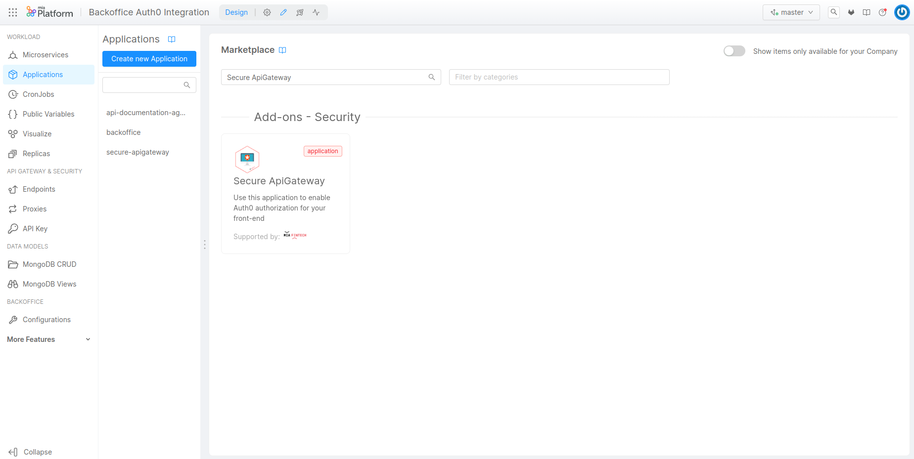
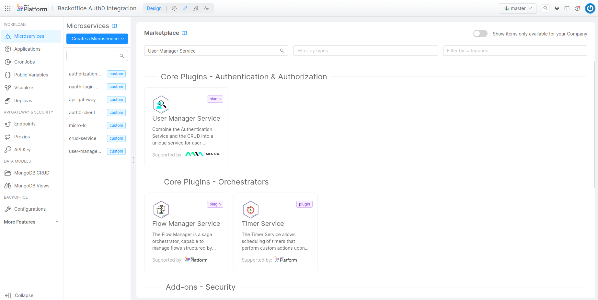
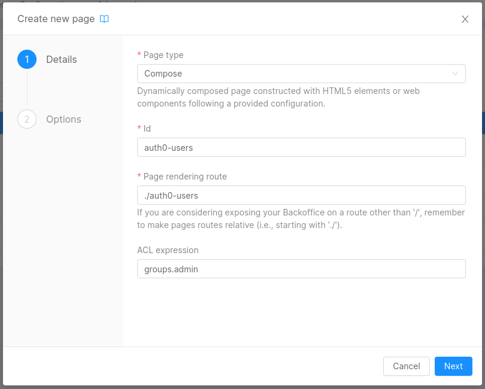
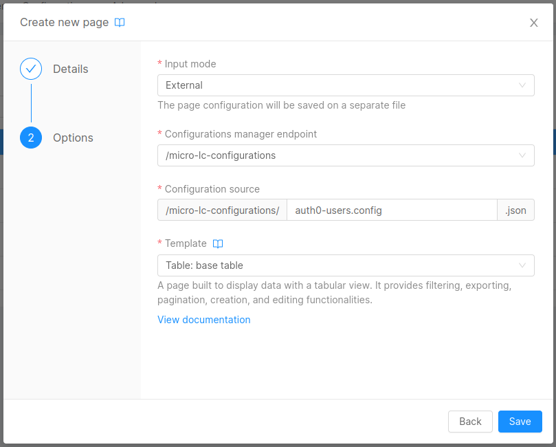
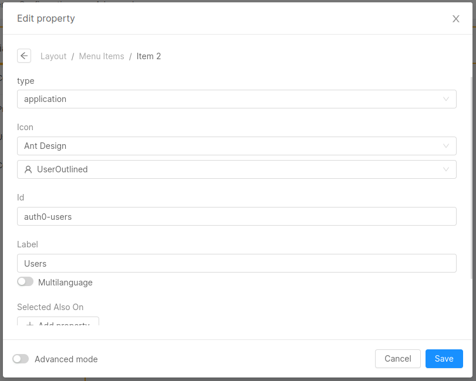
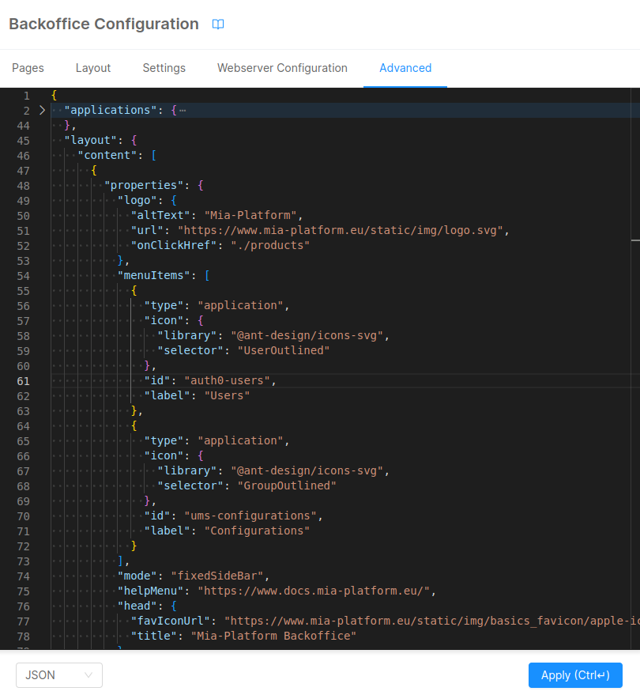
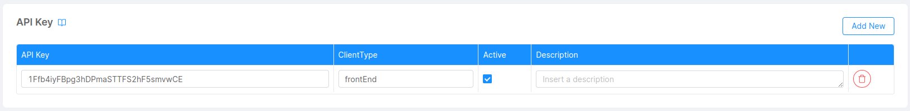
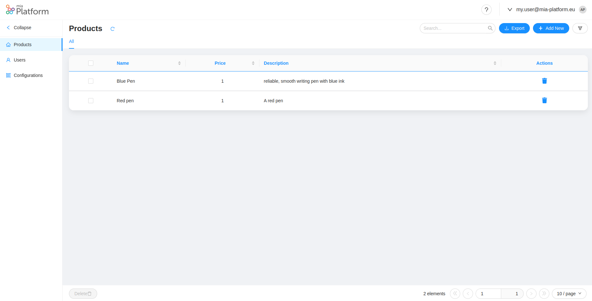
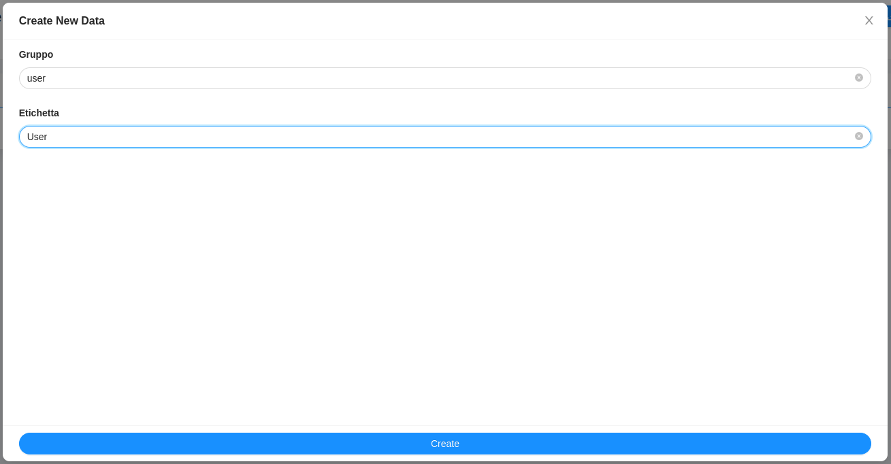

# Mia-Platform Microfrontend Composer Integration with Auth0

In this tutorial, we will guide you through the process of securing Mia-Platform Microfrontend Composer using Auth0 as your Identity Provider. In particular, we will see how to:
- protect the Mia-Platform Microfrontend Composer with the Auth0 login page;
- create, delete and manage both Auth0 users and users' groups from dedicated pages on Mia-Platform Microfrontend Composer;
- use the ACLs feature of Mia-Platform Microfrontend Composer to display to the user only the subset of pages and components they are authorized to access.

## What We Will Build

Throughout this tutorial, we will:

- [Create the necessary Microservices](#create-the-necessary-microservices)
- [Configure the Microservices and Auth0](#configure-the-microservices-and-auth0)
- [Configure the Microfrontend Composer application](#configure-the-microfrontend-composer-application)
- [Configure the authentication process](#configure-the-authentication-process)
- [Save and Deploy the Microfrontend Composer](#save-and-deploy)
- [Create a user using Microfrontend Composer](#create-a-user-using-microfrontend-composer)

## Prerequisites

Before starting this tutorial, you should be familiar with the concepts of the [Mia-Platform Microfrontend Composer](/microfrontend-composer/overview.md).
We also recommend to complete the [Microfrontend Composer Tutorial Basics](/getting-started/tutorials/microfrontend-composer/basics.mdx).

## Create the necessary Microservices

Create the [Secure API Gateway](/runtime_suite_applications/secure-api-gateway/10_overview.md) application:
1. Go to Applications and click on the `Create New Application` button.
2. Search for `Secure ApiGateway` and click on the card.

3. Follow the wizard, selecting if you want to install new microservices or use existing ones.
4. At the end, click the `Create` button and then save the new Application.

This application will create the following:
* Microservices
    - `Authorization Service`
    - `Api Gateway`
    - `Auth0 Client`
    - `OAuth Login Site`
* Endpoints
    - `/web-login`
    - `/authorize`
    - `/oauth/token`
    - `/userinfo`
    - `/logout`
* Public Variables
    - `AUTH0_NAMESPACE`
    - `AUTH0_CALLBACK_URL`

In order to handle the users on `Auth0`, you need to add the [User Manager Service](/runtime_suite/user-manager-service/10_overview.md):
1. Go to Microservices and click on the `Create a Microservice` button.
2. Search for `User Manager Service` and click on the card.

3. Choose the name of the service and then click the `Create` button.

## Configure the Microservices and Auth0

All the microservices that you have added in the previous step are Mia-Platform plugins, so you don't need to write code, but just to configure them.

### API Gateway

You can follow this page: [API Gateway Configuration](/runtime_suite_applications/secure-api-gateway/20_configuration.md#api-gateway).

When the configuration is completed, you should have added to the *server-extension.conf* file the advanced configuration for the `api-gateway` to redirect calls that need authentication to the Login page.

### Authorization Service

You can follow this page: [Authorization Service Configuration](/runtime_suite_applications/secure-api-gateway/20_configuration.md#authorization-service).

When the process is completed, you should have added the `authorization-service` configuration inside the *auth.json* file.

### Auth0 and Auth0 Client

In order to configure the `auth0-client`, the first step is to setup the **Auth0 Tenant**. You can follow this page: [Configure Auth0](/runtime_suite/auth0-client/30_configure_auth0.md) (for the scope of this tutorial you can avoid steps 3 and 4).

Once the tenant configuration is completed you should have created:
- one regular application
- one M2M application for user management
- a rule to inject the id token
- one user with the following `app_metadata`:
```json
{
  "groups": [
    "admin"
  ]
}
```

On Auth0 beware to set the following logout url:
```
https://your-microfrontend-composer-project.mia-platform.eu/web-login
```

Now, you can configure the `auth0-client` service. It accepts the following environment variables:

- __LOG_LEVEL__: defines the logging level of the logger (default: `{{LOG_LEVEL}}`)
- __HTTP_PORT__: defines the http port to use (default: 8080)
- __SESSION_SCOPE__: defines the scope of the session
- __REDIS_MODE__: defines the redis mode (normal or sentinel) (default: normal)
- __REDIS_HOSTS__ (__required__): defines the redis hosts (default: `{{REDIS_HOSTS}}`)
- __SERVICE_CONFIG_FILE_NAME__ (__required__): defines the service config name (default: config)
- __SERVICE_CONFIG_PATH__ (__required__): defines the service config path (default: /configs)

The Auth0-Client service uses a single config map called `auth0-client-config` and the file, `config.json`, containing the configuration must follow this example:

```json
{
  "clients": {
    "frontEnd": {
      "auth0Url": "{{AUTH0_NAMESPACE}}",
      "clientId": "{{AUTH0_CLIENT_ID}}",
      "clientSecret": "{{AUTH0_CLIENT_SECRET}}",
      "redirectUrl": "{{AUTH0_CALLBACK_URL}}",
      "scopes": [
        "offline_access",
        "profile",
        "email",
        "website"
      ]
    }
  },
  "defaultClient": "frontEnd",
  "managementClient": {
    "auth0Url": "{{AUTH0_NAMESPACE}}",
    "clientId": "{{AUTH0_USER_MANAGEMENT_CLIENT_ID}}",
    "clientSecret": "{{AUTH0_USER_MANAGEMENT_CLIENT_SECRET}}",
    "supportedConnections": [
      "{{AUTH0_CONNECTION}}"
    ],
    "defaultCreateUserConnection": "{{AUTH0_CONNECTION}}"
  },
  "customClaimsNamespaces": [
    "{{MIA_NAMESPACE}}app_metadata",
    "{{MIA_NAMESPACE}}user_metadata"
  ]
}
```
In order to complete this configuration you have to define the following **Public Variables**:
* `AUTH0_NAMESPACE`: the namespace of your tenant on Auth0 (i.e. https://tenant-name.eu.auth0.com/)
* `AUTH0_CALLBACK_URL`: the url already defined during Auth0 configuration (i.e. https://your-microfrontend-composer-project.mia-platform.eu/web-login/callback)
* `AUTH0_CONNECTION`: `Username-Password-Authentication`, the default Auth0 database
* `MIA_NAMESPACE`: the namespace you already set in the Rules configuration on Auth0

And **Secreted Variables**:
* `AUTH0_CLIENT_ID`: the Client ID of your Regular Application (you can find it inside `Dashboard > Applications > Your Regular Application`)
* `AUTH0_CLIENT_SECRET`: the Client Secret of your Regular Application (you can find it inside `Dashboard > Applications > Your Regular Application`)
* `AUTH0_USER_MANAGEMENT_CLIENT_ID`: the Client ID of your M2M Application (you can find it inside `Dashboard > Applications > Your M2M Application`)
* `AUTH0_USER_MANAGEMENT_CLIENT_SECRET`: the Client Secret of your M2M Application (you can find it inside `Dashboard > Applications > Your M2M Application`)

### User Manager Service

You can configure `user-manager-service` following this page: [User Manager Service Configuration](/runtime_suite/user-manager-service/10_overview.md).

During the configuration you have to:
* create a CRUD collection for **Auth0** Users (i.e. `auth0_users`) and populate the variable `USERS_CRUD_ENDPOINT` (i.e. `/auth0-users`). For the collection you can import the following fields:
```json
[
    {
        "name": "_id",
        "description": "_id",
        "type": "ObjectId",
        "required": true,
        "nullable": false
    },
    {
        "name": "creatorId",
        "description": "creatorId",
        "type": "string",
        "required": true,
        "nullable": false
    },
    {
        "name": "createdAt",
        "description": "createdAt",
        "type": "Date",
        "required": true,
        "nullable": false
    },
    {
        "name": "updaterId",
        "description": "updaterId",
        "type": "string",
        "required": true,
        "nullable": false
    },
    {
        "name": "updatedAt",
        "description": "updatedAt",
        "type": "Date",
        "required": true,
        "nullable": false
    },
    {
        "name": "__STATE__",
        "description": "__STATE__",
        "type": "string",
        "required": true,
        "nullable": false
    },
    {
        "name": "userGroup",
        "type": "string",
        "required": true,
        "nullable": false,
        "sensitivityValue": 0,
        "encryptionEnabled": false,
        "encryptionSearchable": false
    },
    {
        "name": "authUserId",
        "type": "string",
        "required": false,
        "nullable": false,
        "sensitivityValue": 0,
        "encryptionEnabled": false,
        "encryptionSearchable": false
    },
    {
        "name": "username",
        "type": "string",
        "required": false,
        "nullable": false,
        "sensitivityValue": 0,
        "encryptionEnabled": false,
        "encryptionSearchable": false
    },
    {
        "name": "email",
        "type": "string",
        "required": false,
        "nullable": false,
        "sensitivityValue": 0,
        "encryptionEnabled": false,
        "encryptionSearchable": false
    },
    {
        "name": "blocked",
        "type": "boolean",
        "required": false,
        "nullable": false,
        "sensitivityValue": 0,
        "encryptionEnabled": false,
        "encryptionSearchable": false
    },
    {
        "name": "expirationDate",
        "type": "Date",
        "required": false,
        "nullable": false,
        "sensitivityValue": 0,
        "encryptionEnabled": false,
        "encryptionSearchable": false
    },
    {
        "name": "expirationId",
        "type": "string",
        "required": false,
        "nullable": false,
        "sensitivityValue": 0,
        "encryptionEnabled": false,
        "encryptionSearchable": false
    },
    {
        "name": "name",
        "type": "string",
        "required": false,
        "nullable": false,
        "sensitivityValue": 0,
        "encryptionEnabled": false,
        "encryptionSearchable": false
    }
]
```
* create a CRUD collection for **User Manager Service** configuration (i.e. `ums_configurations`) and populate the variable `UMS_CONFIG_CRUD_ENDPOINT` (i.e. `/ums-configurations`). For the collection you can import the following fields:
```json
[
    {
        "name": "_id",
        "description": "_id",
        "type": "ObjectId",
        "required": true,
        "nullable": false
    },
    {
        "name": "creatorId",
        "description": "creatorId",
        "type": "string",
        "required": true,
        "nullable": false
    },
    {
        "name": "createdAt",
        "description": "createdAt",
        "type": "Date",
        "required": true,
        "nullable": false
    },
    {
        "name": "updaterId",
        "description": "updaterId",
        "type": "string",
        "required": true,
        "nullable": false
    },
    {
        "name": "updatedAt",
        "description": "updatedAt",
        "type": "Date",
        "required": true,
        "nullable": false
    },
    {
        "name": "__STATE__",
        "description": "__STATE__",
        "type": "string",
        "required": true,
        "nullable": false
    },
    {
        "name": "userGroup",
        "type": "string",
        "required": true,
        "nullable": false,
        "sensitivityValue": 0,
        "encryptionEnabled": false,
        "encryptionSearchable": false
    },
    {
        "name": "crudSchema",
        "type": "RawObject",
        "required": true,
        "nullable": false,
        "sensitivityValue": 0,
        "encryptionEnabled": false,
        "encryptionSearchable": false
    },
    {
        "name": "label",
        "type": "string",
        "required": true,
        "nullable": false,
        "sensitivityValue": 0,
        "encryptionEnabled": false,
        "encryptionSearchable": false
    },
    {
        "name": "authUserCreationDisabled",
        "type": "boolean",
        "required": false,
        "nullable": false,
        "sensitivityValue": 0,
        "encryptionEnabled": false,
        "encryptionSearchable": false
    }
]
```
* Fill the `ADDITIONAL_HEADERS_TO_PROXY` environment variable with this value: `acl_rows,x-request-id,request-id,cookie,authorization,client-type,host,x-forwarded-host`.
* Fill the `USERINFO_ADDITIONAL_PROPERTIES` environment variable with this value: `permissions`.

Then you have to add new endpoints and modify some of the existing ones (beware that for all the following endpoints the `Rewrite Base Path` must be equal to the `Base path`):
* remove the `/oauth/token` endpoint linked to `auth0-client` and create the same endpoint linked to `user-manager-service`
* remove the `/userinfo` endpoint linked to `auth0-client` and create the same endpoint linked to `user-manager-service`
* add the `/refreshtoken` endpoint linked to `user-manager-service`
* add the `/users` endpoint linked to `user-manager-service`
* add the `/ums-configurations` endpoint linked to `ums-configurations` CRUD path

## Configure the Microfrontend Composer application
Now that you have configured all the microservices you need to follow these last steps to configure the Microfrontend Composer to enable the creation of Auth0 users.

### Create the pages

First of all, you need to create the pages to handle **users** and `user-manager-service` **configurations**:
1. Go to Configurations, select the `Pages` tab and click on the `Create new page` button.
2. Select the following configuration


3. Click the `Save` button.
4. Repeat the first 3 steps to create the page for the `user-manager-service` configurations with only these changes:

| Field                    | Value                |
|--------------------------|----------------------|
| **Id**                   | ums-configurations   |
| **Page rendering route** | ./ums-configurations |

### Link the pages with the CRUD collections

Now you can link the Microfrontend Composer pages with the CRUD collections.
For `users`:
1. Select the configuration for the new `users` just created.
2. Click on `Advanced` tab.
3. Search for `"basePath": "/data-source-endpoint"` and change it with `"basePath": "/users"`.
4. Click on the `Apply` button.
5. Click on `Connectors & Adapters` tab, and then on `CRUD Client`.
6. Click on `Edit property` button under the `Data schema` section.
7. Toggle the `Use custom value` switch and paste the following schema:
```json
{
  "type": "object",
  "properties": {
    "_id": {
      "type": "string",
      "label": "ID",
      "visualizationOptions": {
        "hidden": true
      },
      "formOptions": {
        "hidden": true
      }
    },
    "__STATE__": {
      "type": "string",
      "label": "State",
      "enum": [
        "PUBLIC",
        "DRAFT",
        "TRASH",
        "DELETED"
      ],
      "visualizationOptions": {
        "hidden": true
      },
      "formOptions": {
        "hidden": true
      }
    },
    "name": {
      "label": "Name",
      "type": "string"
    },
    "email": {
      "label": "Email",
      "type": "string"
    },
    "userGroup": {
      "type": "string",
      "label": "Group"
    }
  },
  "required": [
    "userGroup"
  ]
}
```
8. Click on `Layout` tab, then on `Main` and `Table`.
9. Click on `Edit property` button under the `Data schema` section on the right-side menu.
10. Toggle the `Use custom value` switch and paste the previous schema.
11. Click on `Form Modal` and then on the `Edit property` button under the `Data Schema` section on the right-side menu.
12. Toggle the `Use custom value` switch and paste the following schema:
```json
{
  "type": "object",
  "properties": {
    "_id": {
      "type": "string",
      "label": "ID",
      "visualizationOptions": {
        "hidden": true
      },
      "formOptions": {
        "hidden": true
      }
    },
    "__STATE__": {
      "type": "string",
      "label": "State",
      "enum": [
        "PUBLIC",
        "DRAFT",
        "TRASH",
        "DELETED"
      ],
      "visualizationOptions": {
        "hidden": true
      },
      "formOptions": {
        "hidden": true
      }
    },
    "name": {
      "label": "Name",
      "type": "string"
    },
    "email": {
      "label": "Email",
      "type": "string"
    },
    "userGroup": {
      "type": "string",
      "label": "Group"
    }
  },
  "required": [
    "userGroup"
  ]
}
```

For `ums-configurations`:
1. Select the configuration for the new `ums-configurations` just created.
2. Click on `Connectors & Adapters` tab, and then on `CRUD Client`.
3. Select `/v2/ums-configurations` as CRUD Service base path.
4. Click on the `Generate Schema` button, then `Save` on the opened modal.
5. Click on `Layout` tab, then on `Main` and `Table`.
6. Click on `Edit property` button under the `Data schema` section on the right-side menu.
7. Toggle the `Use custom value` switch and paste the following schema:
```json
{
  "type": "object",
  "properties": {
    "_id": {
      "type": "string",
      "label": "ID",
      "visualizationOptions": {
        "hidden": true
      },
      "formOptions": {
        "hidden": true
      }
    },
    "__STATE__": {
      "type": "string",
      "label": "State",
      "enum": [
        "PUBLIC",
        "DRAFT",
        "TRASH",
        "DELETED"
      ],
      "visualizationOptions": {
        "hidden": true
      },
      "formOptions": {
        "hidden": true
      }
    },
    "userGroup": {
      "type": "string",
      "label": "Group"
    },
    "crudSchema": {
      "type": "object",
      "label": "CRUD Schema",
      "default": {
        "type": "object",
        "required": [
          "email",
          "userGroup",
          "name"
        ],
        "properties": {
          "email": {
            "type": "string",
            "format": "email"
          },
          "userGroup": {
            "type": "string"
          },
          "name": {
            "type": "string"
          }
        }
      },
      "visualizationOptions": {
        "hidden": true
      },
      "formOptions": {
        "hidden": true
      }
    },
    "label": {
      "label": "Label",
      "type": "string"
    },
    "authUserCreationDisabled": {
      "label": "Disable user creation",
      "type": "boolean",
      "default": false,
      "visualizationOptions": {
        "hidden": true
      },
      "formOptions": {
        "hidden": true
      }
    }
  },
  "required": [
    "name"
  ]
}
```
8. Click on `Form Modal` and then on the `Edit property` button under the `Data Schema` section on the right-side menu.
9. Toggle the `Use custom value` switch and paste the following schema:
```json
{
  "type": "object",
  "properties": {
    "_id": {
      "type": "string",
      "label": "ID",
      "visualizationOptions": {
        "hidden": true
      },
      "formOptions": {
        "hidden": true
      }
    },
    "__STATE__": {
      "type": "string",
      "label": "State",
      "enum": [
        "PUBLIC",
        "DRAFT",
        "TRASH",
        "DELETED"
      ],
      "visualizationOptions": {
        "hidden": true
      },
      "formOptions": {
        "hidden": true
      }
    },
    "userGroup": {
      "type": "string",
      "label": "Group"
    },
    "crudSchema": {
      "type": "object",
      "label": "CRUD Schema",
      "default": {
        "type": "object",
        "required": [
          "email",
          "userGroup",
          "name"
        ],
        "properties": {
          "email": {
            "type": "string",
            "format": "email"
          },
          "userGroup": {
            "type": "string"
          },
          "name": {
            "type": "string"
          }
        }
      },
      "visualizationOptions": {
        "hidden": true
      },
      "formOptions": {
        "hidden": true
      }
    },
    "label": {
      "label": "Label",
      "type": "string"
    },
    "authUserCreationDisabled": {
      "label": "Disable User Creation",
      "type": "boolean",
      "default": false,
      "visualizationOptions": {
        "hidden": true
      },
      "formOptions": {
        "hidden": true
      }
    }
  },
  "required": [
    "name"
  ]
}
```

### Add the pages to the Microfrontend Composer

Then you can add the newly created pages to the Microfrontend Composer menu:
1. Click on the `Layout` tab.
2. Select `Layout` from the left-side menu.
3. Click on the `Edit property` button under the `Menu Items` section on the right-side menu.
4. On the opened modal click on the `Add item` button.
5. Choose the following configuration: 
6. Click on the `Save` button.
7. Repeat the first 6 steps to add the `user-manager-service` configurations page, choosing your favorite *Icon* and with the following changes:

| Field     | Value              |
|-----------|--------------------|
| **Id**    | ums-configurations |
| **Label** | Configurations     |

### Define the ACLs

With the **ACL Expressions** you've just set, users outside `groups.admin` will see these pages in the left-side menu of the Microfrontend Composer, but will receive a 404 status code page.
In order to hide them the newly created pages, you need to add the ACLs in your advanced configuration:
1. Click on `Advanced` tab.
2. Add this expression `"aclExpression": "groups.admin"` under `layout > content > properties > menuItems` as property of `auth0-users` and `ums-configurations` applications.
3. Click on the `Apply` button.
The result with be similar to the following:



### Set the user menu

Then you have to set the user menu:
1. Click on the `Layout` tab.
2. Select `Layout` from the left-side menu.
3. Click on the `Edit property` button under the `Login and user context menu` section on the right-side menu, under the `Advanced Properties`.
4. On the opened modal click fill the `User Context URL` with the value `/userinfo`
5. Click on the `Add property` button related to `Logout` section.
6. Fill the `Redirect Url` with `/logout?redirect=/web-login?redirect=/microfrontend-composer`.
7. Click on the `Save` button.

## Configure the authentication process

In order to protect your Microfrontend Composer you need to follow these steps:
1. Go to Endpoints, select `/microfrontend-composer` and check the `Authentication required` checkbox under the `Endpoint settings`
2. Set the following variables on `Authentication Service`:
  - `USERINFO_URL`: http://user-manager-service/userinfo
  - `AUTHORIZATION_HEADERS_TO_PROXY`: cookie,authorization,client-type

The final configuration step is to change the API key client type with the one defined as defaultClient in the Auth0 Client configuration.

:::info
This step will allow the oauth-login-site microservice to obtain the right client key necessary for the authorization process.
:::

1. Go to `API Key`.
2. Click on the `Add new` button.
3. Create a new API Key with the following configuration and click on the `Create` button.



After that, you have finally completed the configuration of the authentication process.

## Save and Deploy

With all the configurations in place, save your changes and then deploy. For further details on the deploy command, consult the [Console Handbook](/getting-started/handbooks/project/usage.md).



## Create a user using Microfrontend Composer
In order to create your first user you need to create a configuration. To do that:
1. Click on `Configurations` page.
2. Click on `Add new` button.
3. Fill the form with the following parameters:

4. Click on `Create` button and `Confirm` on the warning modal.

Now it's possible to create the first user:
1. Click on `Users` page.
2. Click on `Add new` button.
3. Fill the form with the `Name` and `Email` of your first user and using `user` as `Group`.
4. Click on `Create` button and `Confirm` on the warning modal.

Congratulations! You have successfully created your first user using the microfrontend-composer.
If you try to access the Microfrontend Composer with this new user you won't see the users management pages that are protected with the ACLs created in the previous steps.
Now if you delete the created user it will be blocked on Auth0 and marked as `TRASH` inside the CRUD collection.

## Microfrontend Composer Tutorials

In this tutorial, you've learned how to set up the integration between Microfrontend Composer and Auth0 and to create Auth0 users using the Microfrontend Composer.

Also, make sure to check out:
* The [Microfrontend Composer Basics Tutorial ](/getting-started/tutorials/microfrontend-composer/basics.mdx) where we demonstrate how to create a new Microfrontend Composer and how to create a new Microfrontend Composer Page using the Microfrontend Composer Table Template.
* In the [Microfrontend Composer Templates Tutorial](/getting-started/tutorials/microfrontend-composer/templates.mdx), explore how to configure various page types with the Microfrontend Composer Page Composer and an iFrame Page.
* The [Microfrontend Composer Microfrontends Tutorial](/getting-started/tutorials/microfrontend-composer/microfrontends.mdx) provides guidance on configuring a Microfrontend using Angular or React, and its integration into the Microfrontend Composer.
