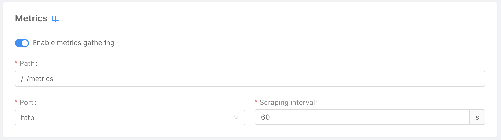
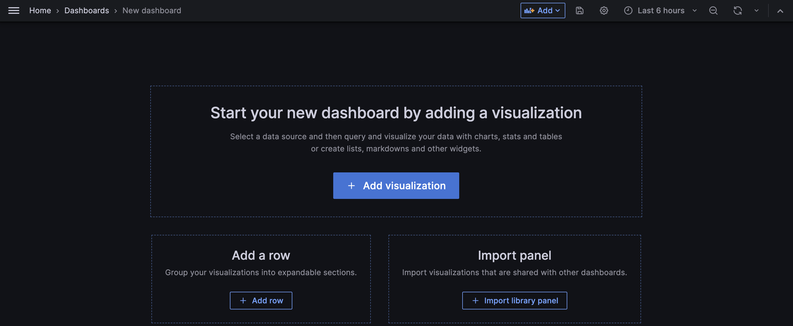
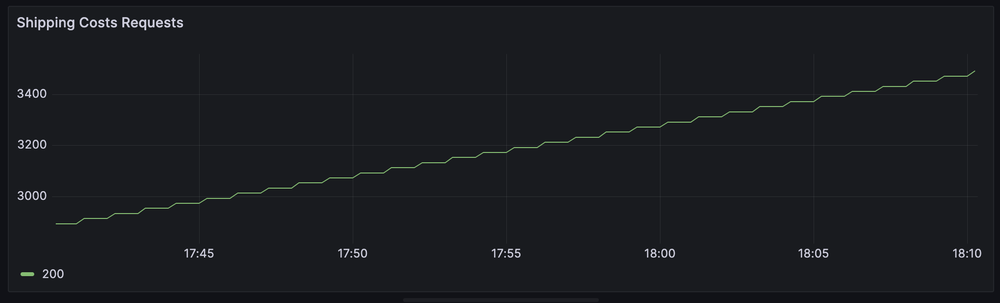

import VideoBox from "./../../../src/components/VideoBox";

In this tutorial we are going to add custom metrics to a custom micro-service, that will be later collected by a monitoring system like the _Prometheus Operator_. 

These metrics will then be available in [Grafana](/paas/grafana.md) to use in personalized dashboards based on user-defined queries.

## Pre-Requisites

Before starting, we assume that you have already created the `shipping-cost` microservice from the [Create a custom Microservice tutorial](/getting-started/tutorials/create-a-custom-microservice.mdx).

:::info
Since there can be different libraries to handle custom metrics, we will consider the library provided by [our Nodes.js service launcher lc39](https://github.com/mia-platform/lc39/blob/master/docs/main-entrypoint.md#prometheus-metrics), used by the [Node.js Template](https://github.com/mia-platform-marketplace/Node.js-Custom-Plugin-Template/).
Therefore, javascript will be used as example language for this tutorial. Other languages and frameworks may provide different modes to expose metrics.  
:::

More-over, the project where the service has been created must have a monitoring system such as Prometheus configured from the [Microservice Monitoring Section](/development_suite/api-console/api-design/microservice-monitoring.md):

This monitoring system should also be configured as data source to Grafana, to view metrics inside the dashboards.

## Define Custom Metrics

Consider the `/shipping-cost` route of the micro-service. We want to add a custom metric to count, the number of requests submitted to the endpoint based on the response status code.

Lets create a `metrics.js` file that exports a `getMetrics` function: 

```js title=/metrics.js
module.exports.getMetrics = function getMetrics(prometheusClient) {
  const shippingCostCounter = new prometheusClient.Counter({
    name: 'custom_shipping_cost_metric',
    help: 'Custom metric to count shipping costs requests',
    labelNames: ['status'],
  })
  return {
    shippingCostRequests,
  }
}
```

This function will be used by _lc39_ to decorate the fastify instance with a prometheus client from the [fastify-metrics](https://github.com/SkeLLLa/fastify-metrics) library. 
In particular, we are defining a **counter** called `custom_shipping_cost_metric`, which represents a value that can only increase monotonically. Also, this value can be grouped by a label called status, based on the http status code returned by the micro-service.

The counter is then stored in a variable called `shippingCostCounter`, that we will use later on our micro-service to increment the number of the metric.

:::tip
By default, the metrics collected by the micro-service will be exposed under the `/-/metrics` path.
:::

Now, lets commit our changes to the micro-service and configure the new metrics endpoint from the Console.

## Expose Metrics Endpoint

Go to the `shipping-costs` micro-service configuration: since the Service Monitor has been enabled, you can see a new Monitor tab under the readiness and liveness routes.



This section enables on Deploy the creation of a Service Monitor resource, that will instruct the monitoring system to collect metrics every 60 seconds from the `/-/metrics` endpoint.  
Now save the configuration with the current version of the micro-service containing the _Prometheus Client_ and release it.

<details><summary>Access the metrics endpoint:</summary>
<p>

If you have a direct access with `kubectl` to the environment you have deployed your application, try to access locally the `shipping-cost` micro-service using port-forwarding on port 3000

```bash
kubectl port-forward svc/shipping-cost 3000:80
```

Now let's make the following http request to the service using curl:

```bash
curl localhost:3000/-/metrics
```

You should receive a `text/plain` content type having a structure like this:


```
# HELP custom_shipping_cost_metric mia platform plugin custom metric
# TYPE custom_shipping_cost_metric counter Custom metric to count shipping costs requests
custom_shipping_cost_metric = 0
```
</p>
</details>

## Update custom metrics

Now custom metrics have been deployed, but they are not updated automatically by the micro-service. 

As we said before, the goal of the custom metric is to count the number of either successfull or failed requests.

So, we have to edit the handler code of the `/shipping-cost` endpoint to access our custom metric and increment it.

```js title=/handlers/getShippingCost.js {9,21,30}
async function handler(req, rep) {
  // ... get customerEmail 
  let customerCrudRes;
  try {
    customerCrudRes = await crudClient.get(`/customers/`, {
      query: { email: customerEmail },
    });
  } catch (error) {
    this.customMetrics.shippingCostCounter.inc({status: 404})
    return rep.code(404).send({ error: "Customer does not exist" });
  }

  const [customer] = customerCrudRes.payload;

  let orderCrudRes;
  try {
    orderCrudRes = await crudClient.get(`/orders/count`, {
      query: { customerId: customer._id },
    });
  } catch (error) {
    this.customMetrics.shippingCostCounter.inc({status: 404})
    return rep.code(503).send({ error: "Error in Order collection" });
  }

  const numberOfOrders = orderCrudRes.payload;

  const shippingCost =
    numberOfOrders > 0 ? DEFAULT_SHIPPING_COST : NEW_CUSTOMER_SHIPPING_COST;

  this.customMetrics.shippingCostCounter.inc({status: 200})
  return rep.code(200).send({ shippingCost });
}
```

The prometheus client defined before, along with its metrics, can be accessed inside the handler's scope from the variable `customMetrics`: here, at each point of the code that we're returning a response, we increment the counter's value by calling the `inc()` function.

Also, since we wanna group metrics based on the status code provided by the endpoint, we are passing to the function the value of the label `status`, so that there will be a different counter for each value of the `status` label.    

Now, you can release the changes on the micro-service and release the new version. By performing http requests, you can see from the metrics endpoint the increase of the metric `custom_shipping_cost_metric`.

<details><summary>Test the behavior of your metrics:</summary>
<p>

Metrics can be tested also by using TDD! Let's take the `shipping-cost` unit test written during the previous tutorial and add an additional assert for the metrics response.

```js title=test/index.test.js {22-25,27}
  t.test("Default customer shipping cost", async (t) => {
    const NEW_CUSTOMER_SHIPPING_COST = 5.99;
    const DEFAULT_SHIPPING_COST = 10;
    const CRUD_BASE_URL = "http://crud-service";
    const getCustomerScope = nock(CRUD_BASE_URL)
      .get(`/customers/`)
      .query({ email: mockedCustomer.email })
      .reply(200, [mockedCustomer]);

    const getOrderScope = nock(CRUD_BASE_URL)
      .get(`/orders/count`)
      .query({ customerId: mockedCustomer._id })
      .reply(200, 1);

    const response = await fastify.inject({
      method: "GET",
      url: "/shipping-cost",
      query: {
        customerEmail: mockedCustomer.email,
      },
    });
    const metricsResponse = await fastify.inject({
      method: "GET",
      url: "/-/metrics"
    });
    // ... endpoint response asserts
    const counter = getCounter(metricsResponse.payload) // extract counter value from metricsResponse
    t.strictSame(counter, 1);
  });
```
Since the response of the `/-/metrics` endpoint is of content type `text/plain`, you have to parse the metric line, for example with a `getCounter`utility function.
There are several libraries that parse the content of prometheus metrics, such as [parse-prometheus-text-format](https://github.com/yunyu/parse-prometheus-text-format).
</p>
</details>

## Create Grafana Dashboards based on Custom Metrics

Now that custom metrics are correctly exposed by the micro-service and collected by the monitoring system, lets go over Grafana and create a new dashboard.



Grafana lets you create panels of different kinds containing one or more [PromQL queries](https://prometheus.io/docs/prometheus/latest/querying/basics/), which will be executed on the default datasource where your custom metric is stored.

In this case, we want to create a time-series visualization where we can group the different values of the counter by the status, that either can be `200`, `404` or `503`. We will call the panel _Shipping Costs Requests_ and insert the following PromQL query

```promql
sum by(status) (custom_shipping_cost_metric)
```

This query will:

* fetch all series matching metric `custom_shipping_cost_metric`;
* calculates sum over dimensions while preserving label `status`.

Once you've executed this query, you'll see that the time-series visualization is showing the metric representing the number of requests received by the service over the time range provided. 



If you try to perform GET requests to the `"/shipping-cost"` endpoint, you will see the counter increase. That's it, you have defined your custom metric and shown it on a Grafana visualization! 

:::tip
This dashboard can also be embedded into the Console using the [Dashboard Section](/development_suite/monitoring/dashboard.md).
:::