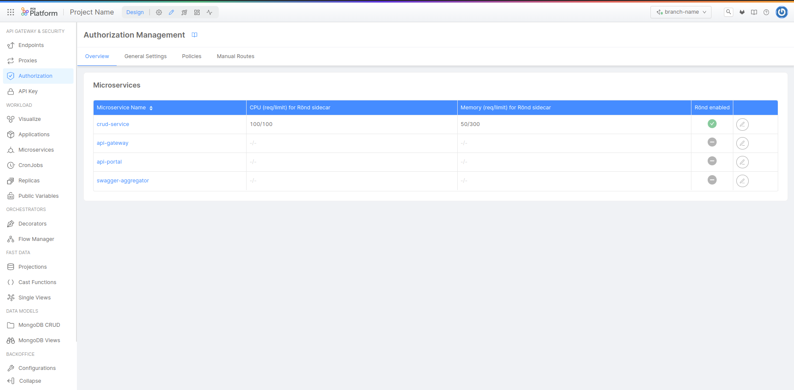
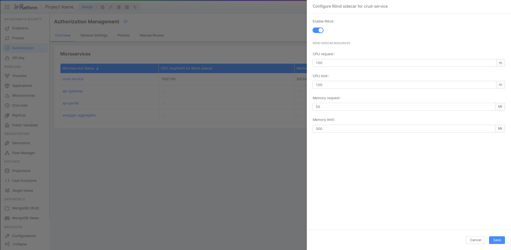
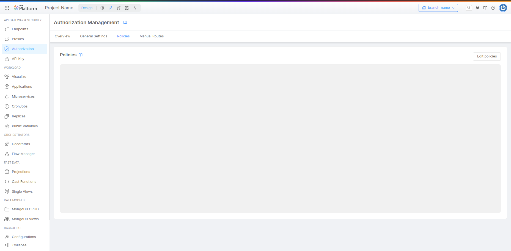
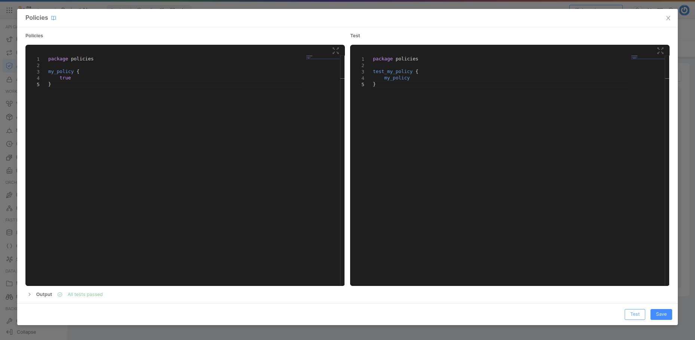
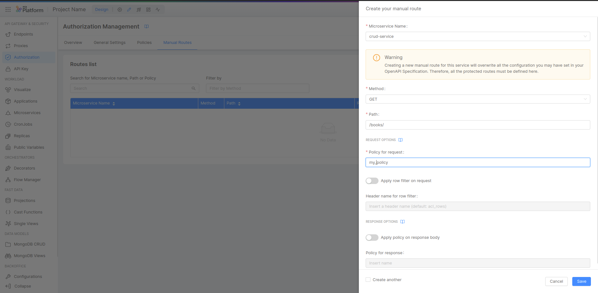
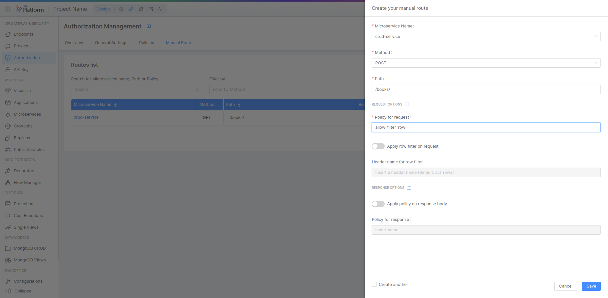
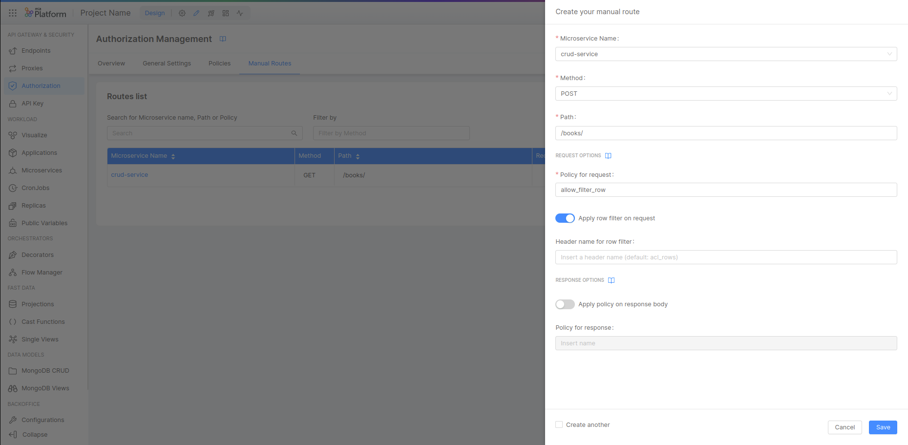
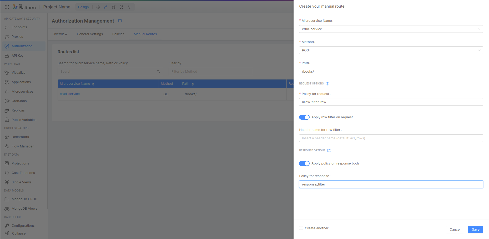

import VideoBox from "./../../../src/components/VideoBox";

**[Rönd](https://rond-authz.io) is an authorization mechanism** built on top of user Roles.
Rönd helps you to decouple actions that user can perform (generally known as _permissions_) and their higher-level Role inside an information system.
Rönd allows you to define your custom permissions, grouping them by Roles, and assigning those Roles to your users (or even groups of users).

In this tutorial we will see how to add this [authorization layer](/development_suite/api-console/api-design/authorization.md) to our [Endpoints](/development_suite/api-console/api-design/endpoints.md).

## What We’ll Build

In this tutorial we will connect Rönd to the CRUD endpoints.
Specifically, we will connect Rönd to:

- Restrict and limit incoming requests
- Apply Rows Filtering to remove items from the result set
- Apply Response Filtering to remove fields from the results

## Prerequisites

Before starting, make sure you already have a CRUD with public endpoints correctly configured in your environment.
For this example, we will use the books example.
If you don't have it yet, you can easily set it up following the [Create a Rest API in 5 minutes](/getting-started/tutorials/rest-api-for-crud-on-data.mdx) guide
and using the following <a download target="_blank" href="/docs_files_to_download/tutorial/rbac-tutorial-schema.json">JSON schema</a>.

We’ll assume that you have some familiarity with **Rego** language. More information about Rego is available [here](https://www.openpolicyagent.org/docs/latest/policy-language/).

Before starting:

- You will **create a CRUD called books**, with the data schema explained before.
- **Connect the CRUD books to the endpoints** to publicly expose your data.
- **Insert into your CRUD some useful data** to do some tests
- Check that the system is working properly (with CRUD request via API portal or cURL requests)

## Enable Rönd

The first step is to enable Rönd within your service. In this case we will use the CRUD system, but you can enable Rönd for any microservice.

Select **Authorization** from the menu on the left:


The Authorization screen is composed by four different tabs.

The first tab **Overview** show you the list of your microservices. For each microservice you can see if Rönd is enabled or not.
In our case, the goal is to enable Rönd for your CRUD service (by clicking on the **Edit** button), then we can choose the CPU and Memory resources available for the Rönd Sidecar.
Specifically, we can choose the CPU Request, CPU Limit, Memory Request, and Memory Limit.

Now we can save the changes and deploy the new configuration.

Now Rönd is enabled, and of course every route in the CRUD is protected by default. If you try to make a request to any CRUD endpoint, the system will return an error 403 "_User is not allowed to request the API_". See the example below:

```bash
curl --request GET --url 'https://<your-host>.mia-platform.eu/v2/books/' --header 'accept: */*'

{"error":"","statusCode":403,"message":"User is not allowed to request the API"}
```

Now we can start to write our first policy. In simple words, you can see a policy as a set of rules.

## Allow Policy

Now we can enable our first allow policy to authorize the requests.
By default, the policies can authorize requests (returning a boolean value), add a MongoDB query (to the incoming request as an header) or can apply data manipulation (in the response).
For example, you can choose to enable an allow policy to authorize the request, and in the same time you can apply a row filter to limit the exposed row. In the same way, you can apply policies to edit the data structure in order to remove property to the output object (using the response filter).

For this step, we will only use the allow policy to authorize (or not) the request. In this step we will create an allow policy to authorize the GET request to the CRUD.

Inside the **Policies** tab, we can edit the empty policy using the **Edit policies** button.


The **Policy Editor** is made of two different editors:

- On the left one, you can write your authorization policies
- On the right you can insert tests to validate your policies.

We always recommend writing tests, so in case of changes it will be easier to verify that the policies actually meet your needs.

Let's write our first policy: this will be a simple policy that will authorize all calls in which it will be used.


On the left side we write our policy, where we import the package policies. Then, we create the "allow_all" policy, which has `true` as the only answer.
On the right we find his test: in this case we want to verify that by executing the policy file the result of "allow_all" is the boolean `true`!

The policy "allow_all" example:

```rego
package policies

allow_all {
  true
}
```

The test for the "allow_all" policy:

```rego
package policies

test_allow_all {
  allow_all == true
}
```

:::info
**package policies** is the default package name used by the system for recognized policies package. It's mandatory to use "package policies" to use the policies.
:::

Now we can open the **Manual Routes** tab, and we can choose the policy "allow_all" to open the endpoint.


In the detail:

- Microservice Name: crud-service
- Method: GET
- Path: /books/
- Allow Policy: allow_all

In this case we will apply the "allow_all" policy to the endpoints /books/ (with GET method) of the crud-service microservice.

If we run again the request to the endpoint, the result is the list of your books, because the policy "allow_all" is applied to the endpoint.

```bash
curl --request GET --url 'https://<your-host>.mia-platform.eu/v2/books/' --header 'accept: */*'

[
  {"_id":"620bc957634b240014b06de2", ...},
  {"_id":"620bc957634b240014b06de4", ...},
  ...
]
```

In this case, we have Rönd enabled, but the GET endpoint is authorized by default (exactly as if Rönd had not been configured for the GET method).

:::warning
It is possible to apply the policy to endpoints **using wildcard**, for example:

- Microservice Name: crud-service
- Method: GET
- Path: /\*
- Allow Policy: allow_all
  In this case we will apply the "allow_all" policy to each endpoint of the crud-service microservice.
  **By default, this kind of policy authorizes each path (with each method) within the microservice endpoints. Pay attention to avoid security problems!**
  :::

The next step is to close the endpoint. For this we can create another policy and apply it (under certain conditions) to the endpoint with the `GET` method.

In our policies config we can create another policy, the "allow_filter_row" policy:

```rego
package policies

allow_all {
  true
}

allow_filter_row {
  input.request.method == "GET"
  count(input.request.headers["X-Api-Key"]) != 0
}
```

- **input.request.method == "GET"**
  This line verifies that the request method is `GET`. If the method is not `GET`, the policy fails and the request is not authorized (with the error 403).
- **count(input.request.headers["X-Api-Key"]) != 0**
  This line is verifies that the request has the `X-Api-Key` header. If there is not the `X-Api-Key` header, the policy fails and the request is not authorized (with the error 403).
  Note: for this tutorial we will verify only the presence of the key, but not if the value is correct.

:::info
Our policies can be composed by many operations. Each operation is chained to the following operation by the "AND" operator. If one of this condition will return `false`, the policy will fail! It's possible to use the "OR" operator to combine different conditions, the example at the end of this tutorial shows how to use the "OR" operator.
:::

In the **Manual Routes** tab we can update our route:


In the detail:

- Microservice Name: crud-service
- Method: GET
- Path: /books/
- Allow Policy: allow_all_row

In this case, the policy "allow_all_row" is applied to the /books/ endpoint with the `GET` method to the CRUD microservice.

Now we are able to call the /books/ endpoint with the `GET` method for the CRUD microservice, only if the request has the `X-Api-Key` header. Again, for this example we will verify only the presence of the key, but not if the value is correct.

Example for path /books/ with the `GET` method and without the `X-Api-Key` header:

```bash
curl --request GET --url 'https://<your-host>.mia-platform.eu/v2/books/' --header 'accept: */*'

{"error":"RBAC policy evaluation failed","statusCode":403,"message":"You do not have permissions to access this feature, contact the project administrator for more information."}
```

Example for path /books/ with the `GET` method and the `X-Api-Key` header:

```bash
curl --request GET --url 'https://<your-host>.mia-platform.eu/v2/books/' --header 'accept: */*' --header "X-Api-Key: something"

[
  {"_id":"620bc957634b240014b06de2", ...},
  {"_id":"620bc957634b240014b06de4", ...},
  ...
]
```

Example for another path or method:

```bash
curl --request GET --url 'https://<your-host>.mia-platform.eu/v2/books/620bc957634b240014b06de2' --header 'accept: */*'

{"error":"","statusCode":403,"message":"User is not allowed to request the API"}
```

## Rows Filter

Now we are able to allow the request to the endpoint /books/ with the `GET` method and the `X-Api-Key` header.
In this step we will also apply a filter to the rows returned by the endpoint. This kind of filter is called "row filter", and it is used to pass one supplementary filter to the microservice.

The filter works as a new header appended to the request containing a mongo query based on the evaluation of your policy. The target service (for example our CRUD microservice) should know how to use it in order to add the eventual new conditions. The query then is applied, performing the specific filter action to the rows returned by the microservice CRUD. For example, your generic request to the microservice /books/ will return all the rows, but if you want to filter the rows returned by the microservice CRUD you can use the filter **STATE** published.

:::warning
By default, the filter is set in the `acl_rows` header and it works only like a filter for an MongoDB query for the microservice CRUD; if you wish to use it with a different service you have to implement the query management strategy.
:::

:::warning
It's possible to use the response filter to filter the rows returned by the microservice. However, this practice is not recommended, as this kind of filter in the returned data can generate unpredictable results.
:::

In the example from the previous section, we have limited the request to the microservice CRUD using the `X-Api-Key` header. Now we want to filter the rows returned by the microservice CRUD by the value of the "published" field, returning only the rows with the value `true`.

Before starting, we can run the request to the /books/ endpoint with the `GET` method and the `X-Api-Key` header to verify if the data returned by the microservice CRUD have heterogeneous values:

```bash
curl --request GET --url 'https://<your-host>.mia-platform.eu/v2/books/' --header 'accept: */*' --header "X-Api-Key: something"

[
  {"_id":"620bc957634b240014b06de2","published":false, ...},
  {"_id":"620bc957634b240014b06de4","published":false, ...},
  {"_id":"620bc957634b240014b06de3","published":false, ...},
  {"_id":"620bc957634b240014b06de5","published":false, ...},
  {"_id":"620bc957634b240014b06de7","published":true, ...},
  {"_id":"620bc957634b240014b06de6","published":true, ...},
  {"_id":"620bc958634b240014b06de8","published":true, ...},
  {"_id":"620bc958634b240014b06de9","published":true, ...},
  {"_id":"620bc958634b240014b06dea","published":false, ...},
  {"_id":"620bc958634b240014b06dec","published":false, ...},
  {"_id":"620bc958634b240014b06dee","published":true, ...},
  {"_id":"620bc958634b240014b06ded","published":false, ...},
  {"_id":"620bc958634b240014b06deb","published":false, ...},
  {"_id":"620bc958634b240014b06def","published":false, ...},
  {"_id":"620bc958634b240014b06df0","published":false, ...},
  {"_id":"620bc958634b240014b06df1","published":false, ...},
  {"_id":"620bc958634b240014b06df3","published":false, ...},
  {"_id":"620bc958634b240014b06df2","published":false, ...},
  {"_id":"620bc958634b240014b06df4","published":true, ...},
  {"_id":"620bc958634b240014b06df5","published":false, ...}
]
```

To apply the filter, we can edit the "allow_filter_row" policy in this way:

```rego
allow_filter_row {
  input.request.method == "GET"
  count(input.request.headers["X-Api-Key"]) != 0

  resource := data.resources[_]
  resource.published == true
}
```

:::info
The row filter is always included in the allow policy. In our case, the authorization and the row filter are applied within the same policy.
:::

Nothing changes (for the first two lines) defined in the previous example: they continue to verify if the method is `GET` and if the `X-Api-Key` header is present.
The next two lines are responsible to apply the row filter to the rows returned by the microservice CRUD:

- Firstly, we iterate on `data.resources`
- For each resource we verify if the "published" field is `true`

After these changes, we will go back to the **Manual Routes** section to enable the row filter option in our route.


:::info
By default, the parameter used to insert the filter is `acl_rows` (used by default in the microservice CRUD to enable the row filter). You can change the `acl_rows` with another header name using the optional input box (for example if you will use your custom microservice).
:::

We can verify again the data returned by the microservice CRUD after saving and deploying the changes:

```bash
curl --request GET --url 'https://<your-host>.mia-platform.eu/v2/books/' --header 'accept: */*' --header "X-Api-Key: something"

[
  {"_id":"620bc957634b240014b06de7","published":true, ...},
  {"_id":"620bc957634b240014b06de6","published":true, ...},
  {"_id":"620bc958634b240014b06de8","published":true, ...},
  {"_id":"620bc958634b240014b06de9","published":true, ...},
  {"_id":"620bc958634b240014b06dee","published":true, ...},
  {"_id":"620bc958634b240014b06df4","published":true, ...}
]
```

Now our endpoint will return only the rows with the value `true` in the "published" field.

## Response Filter

Now we are able to allow the request to the /books/ endpoint with the `GET` method, with the `X-Api-Key` header, and the filtered rows returned by the endpoint. As we can see in the previous example, the filter is applied to the rows returned by the microservice. However, we can also apply the filter to the response returned by the endpoint, and not to the property returned by each row.

In this step we will create a new policy called "allow_filter_response", and we will use the response filter to remove the "salesForecast" field from the response returned by the /books/ endpoint. The idea is to limit the data fields returned by the endpoint.

Our goal in this step is to remove the "salesForecast" field from the response, effectively removing it to the object returned by the endpoint.

Before starting, we can run the request to the /books/ endpoint with the `GET` method and the `X-Api-Key` header to verify if the data returned by the microservice CRUD have the "salesForecast" field:

```bash
curl --request GET --url 'https://<your-host>.mia-platform.eu/v2/books/' --header 'accept: */*' --header "X-Api-Key: something"

[
  {"_id":"620bc957634b240014b06de7","published":true,"salesForecast":4010000, ...},
  {"_id":"620bc957634b240014b06de6","published":true,"salesForecast":175000, ...},
  {"_id":"620bc958634b240014b06de8","published":true,"salesForecast":46000, ...},
  {"_id":"620bc958634b240014b06de9","published":true,"salesForecast":2500000, ...},
  {"_id":"620bc958634b240014b06dee","published":true,"salesForecast":1560000, ...},
  {"_id":"620bc958634b240014b06df4","published":true,"salesForecast":193000, ...}
]
```

Now we can create the policy "allow_filter_response" in this way:

```rego
response_filter[output] {
  output := [x | x := object.remove(input.response.body[_], ["salesForecast"])]
}
```

In this policy we declare how the response filter will be applied:

- our policy had output called `[output]`
- the [output] is the object returned by the endpoint
- output := [x | x := object.remove(input.response.body[_], ["salesForecast"])]
  - cycle the array of objects returned by the endpoint using the iterator input.response.body[_]
  - for each object in the array we remove the "salesForecast" field
  - return the array of objects inside our output variable

:::caution
**Be careful**, the written policy must respect the syntax `policy_name[return_value]{...policyContent}` and must return the new value of the modified data.
:::



At this point we can verify again the data returned by the microservice CRUD, after saving and deploying the changes:

```bash
curl --request GET --url 'https://<your-host>.mia-platform.eu/v2/books/' --header 'accept: */*' --header "X-Api-Key: something"

[
  {"_id":"620bc957634b240014b06de7","published":true, ...},
  {"_id":"620bc957634b240014b06de6","published":true, ...},
  {"_id":"620bc958634b240014b06de8","published":true, ...},
  {"_id":"620bc958634b240014b06de9","published":true, ...},
  {"_id":"620bc958634b240014b06dee","published":true, ...},
  {"_id":"620bc958634b240014b06df4","published":true, ...}
]
```

We have successfully removed the "salesForecast" field from each object returned by the endpoint.

## Use OR operator to concatenate multiple policies

In the previous example we have created policies only using AND operator, it's possible use multiple condition merged with the OR operator to create a new policy.

Here an example:

```rego
  allow_policy_with_or_operator{
    input.request.method == "POST"
  }{
    input.request.method == "PUT"
  }
```

The policy above will allow the request if:

- the request method is `POST`
- or if the request method is `PUT`

In generally the assertions delimitate by an curly braces block are concatenate with the AND operator, but you can concatenate many curly braces blocks and they are merged with the OR operator.
