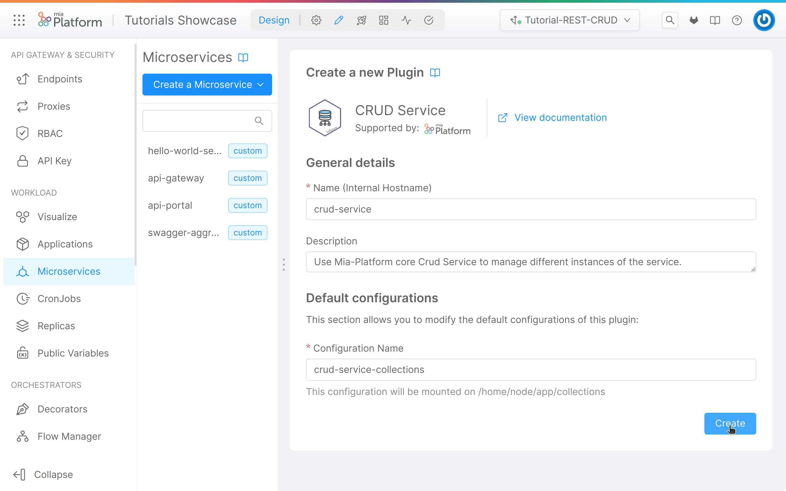
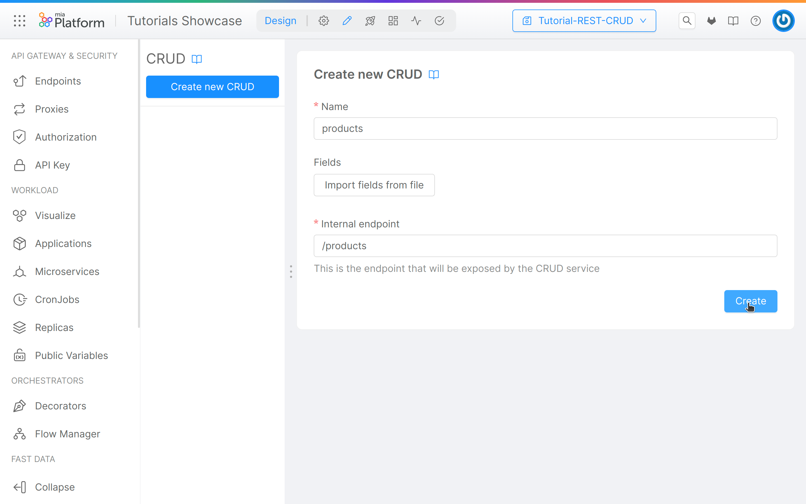
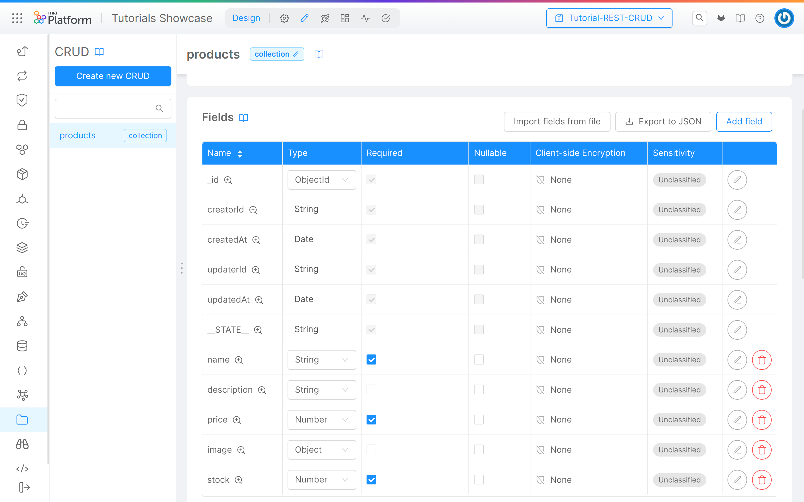
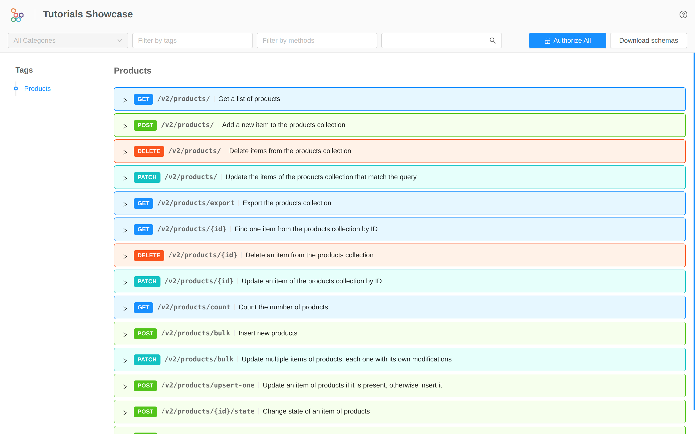
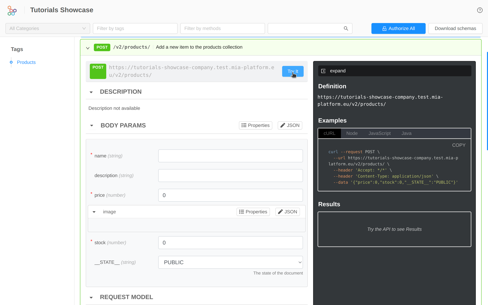

import SourceCodeBlock from "./../../../src/components/SourceCodeBlock";

# REST API for CRUD on data

A **REST API is an application programming interface** that conforms to the constraints of REST architectural style, and allows **for interactions with RESTful web services**.
REST APIs **allow clients** (like mobile, web and other applications) **to read, write, and edit the data** of a system (like servers, databases, and many others) **hiding the implementation details** of the system itself.

In this tutorial we will see how to use **Mia-Platform Console** to **configure and expose outside the project a REST API to perform CRUD operations** (Create, Read, Update, Delete) on a data collection.

## What We’ll Build

In this tutorial we will create a CRUD collection rappresenting generic products and expose it through REST API. More specifically, we will:

- Set up a _CRUD Service_;
- Create the products _CURD collection_;
- Add fields to the collection;
- Expose the CRUD via REST API;
- Test the API through _API Portal_.

## Prerequisites

In order to start the tutorial you need:

1. A URL to connect to a MongoDB Database.

:::tip
You can connect to any MongoDB instance. If your are using Mia-Platform Console in PaaS, you can request a MongoDB Database managed by Mia-Platform by opening a proper Service Request. Before opening a Service Request, check if a MongoDB Database was already provided for you or your team during Company creation or Project creation phases.
:::

Better to have:

- Some familiarity with **API** and **REST** concepts. More information about API is available [here](/getting-started/guidelines/rest-api-vademecum.md).

:::info
If you have already done the [previous tutorial](/console/tutorials/configure-marketplace-components/microservice-hello-world.mdx), you can skip the rest of the section and directly start the tutorial.
:::

Before starting, we will assume that, you already have a clean project in Mia-Platform Console. In order to know how to create a project on Mia-Platform Console, read [this guide](/console/project-configuration/create-a-project.mdx).

The project must:

1. Be integrated with a [deploy pipeline](/infrastructure/self-hosted/pipeline-configuration.md);
1. Have an [ingress route](/infrastructure/paas/traefik.md) with `api-gateway` as `service`;
1. Have an [API Gateway](/runtime_suite/api-gateway/10_overview.md) or a [Envoy API Gateway](/runtime_suite/envoy-api-gateway/overview.md) in your project;
1. Have a properly configured [API Portal](/runtime_suite/api-portal/10_overview.md) and [Swagger Aggregator](/runtime_suite/swagger-aggregator/10_overview.md).

:::tip
If your are using a Mia-Platform Console in PaaS and the project has been created using the "Mia-Platform Basic Project Template", the project already satisfies conditions 1 and 2.
:::

## Create _CRUD Service_

The first step is to create the [_CRUD Service_](/runtime_suite/crud-service/10_overview_and_usage.md) plugin, its purpose is to abstract Data Collections allowing developers to expose CRUD APIs over the database in an easy, scalable, and secure way.
In order to do it, from the _Design_ area of the project, we must:

1. From the sidebar, go to the _Microservices_ section;
1. Click on the _Create a Microservice_ button;
1. In the dropdown menu, select _From Marketplace_ option;
1. Type `CRUD Service` in the search bar;
1. Select the "_CRUD Service_" card from the list of results;
1. Click on the _Create_ button applying the default fields;
1. Save the changes. You don't know how to do it? Take a look at [Mia-Platform handbook](/getting-started/handbooks/project/usage.md#save-changes)!

## Create a new CRUD collection

After creating the _CRUD Service_ you can create a new _CRUD collection_ that contains all the information about the products of a library. To do so, you can take advantage of the UI for the _CRUD service_ configuration provided by Mia-Platform Console. Using the sidebar, you must move into the [_MongoDB CRUD_](/development_suite/api-console/api-design/crud_advanced.md) section of the project.

In the left area of this section you can find the button **"Create new CRUD"** and the list of all collection of the project. In our case this list is empty since we started from scratch.

To create the "products" collection:

1. Select **"Create new CRUD"**;
1. Fill the input:
   - **Name**: it is the CRUD collection name, in this case `products`;
   - **Internal Endpoint**: it is the endpoint exposed by the _CRUD Service_, by default it is the same as the name, but it can be changed. In this case we can use `/products`;
1. Click on the _Create_ button.
1. Save the changes.

## CRUD collection configuration

Once you have created a collection it is time to configure its schema. As you will notice the Mia-Platform Console has already created some **default fields that can not be changed**. These fields are necessary for the proper functioning of the CRUD collection:

| Field         | Type     | Required | Nullable | Description       |
| ------------- | -------- | -------- | -------- | ----------------- |
| \_id          | ObjectId | Yes      | No       | The document id   |
| creatorId     | String   | Yes      | No       | The creator id    |
| createdAt     | Date     | Yes      | No       | The creation date |
| updaterId     | String   | Yes      | No       | The updater id    |
| updatedAt     | Date     | Yes      | No       | The update date   |
| \_\_STATE\_\_ | String   | Yes      | No       | The state         |

Moreover, you can notice that:

- in the _Indexes_ section, an [index](/development_suite/api-console/api-design/crud_advanced.md#indexes) on the `_id` field and one on the `createdAt` field has been created
- in the _Internal Endpoints_, `/products` [endpoint](/development_suite/api-console/api-design/crud_advanced.md#crud-service-exposed-routes) has been created with default `__STATE__` set as `PUBLIC`.

:::note
Since the default `__STATE__` is `PUBLIC`, newly created items will have `PUBLIC` state by default (i.e. when an explicit `__STATE__` value is not provided in the request)
:::

At this point, we can modify the DB schema by creating the required properties of your CRUD collection, in this case the one about the products. To do so, you can choose between 2 options:

1. Manually adding the properties;
2. Importing the properties from a JSON file.

### Option 1: Manually add CRUD collection fields

In order to create the fields manually, you must click on the **Add field** button.

In this interface you can add:

- **Name** (required): the name of the field;
- **Description**: the description of the field;
- **Type** (required): the type of the field. Accepted values are:
  - String, Number, Boolean, Date, GeoPoint, Object, Array of String, Array of Number, Array of Object, or ObjectId;
- **Required**: if the field is required;
- **Nullable**: if the field is nullable;
- **Client-side Encryption**: if the field use the client-side encryption;
- **Allow search on encrypted field**: if the encrypted field is searchable;
- **Sensitivity**: the GDPR sensitivity. Accepted values are:
  - Unclassified, Public, Confidential, Secret, Top Secret;
- **GDPR Description**: the GDPR description

:::tip
At bottom of the drawer you can select **"create Another"** to create another field after creating the one in progress. By selecting this option the drawer will not disappear after confirming the creation of the field, so that you can immediately proceed with the configuration of the new one.
:::
Once you have filled in all the needed properties you can create the field by clicking on the **"Create"** button.

For this example we will create the following fields:

| Name        | Type   | Required | Nullable | Description                    |
| ----------- | ------ | -------- | -------- | ------------------------------ |
| name        | String | Yes      | false    | Name of the product            |
| description | String | No       | false    | Description of the product     |
| price       | Number | Yes      | false    | Price of the product           |
| image       | Object | No       | false    | Image of the product           |
| stock       | Number | No       | false    | How many products are in stock |

After adding these fields, you can read the properties in the CRUD page:

Once you have created all the fields, remember to **save** the changes!

:::tip
You can use the **"Export to JSON"** button to download the current CRUD schema for future imports!
:::

### Option 2: Import CRUD collection

You can add fields from a JSON file compliant to the [the schema](/development_suite/api-console/api-design/crud_advanced.md#how-to-create-the-fields-of-your-crud-by-importing-a-json) required by the _CRUD service_. For this example, we will use the file that you can download <a download target="_blank" href="/docs_files_to_download/tutorial/rest-api-tutorial-schema.json">here</a>. If you prefer, you can create a new JSON file containing the following schema:

Click to see the tutorial schema:

<SourceCodeBlock filePath="/docs_files_to_download/tutorial/rest-api-tutorial-schema.json" />

In order to import the fields from a file, we must:

1. Click on the **"Import fields from file"** button;
1. In the dialog box, select the file you want to use.

Once you have created all the fields, remember to **save** the changes!

:::tip
You can import fields during the creation phase of a new CRUD Collection, by clicking on the "Import fields from file" button, as you can see in the [image](/getting-started/tutorials/rest-api-for-crud-on-data.mdx#create-a-new-crud-collection).
:::

## Expose the CRUD using an endpoint

In order to make CRUD operations on the newly created collection available from outside the project, we will now **add an endpoint**.

:::tip
If you don't know how to do it take a look at the [first tutorial](/console/tutorials/configure-marketplace-components/microservice-hello-world.mdx#expose-the-hello-world-microservice-api)
:::

The parameters to set for the endpoint are the following ones:

- **Base path**: `/products`
- **Type**: in the dropdown menu select _"CRUD"_
- **CRUD Base Path**: in the dropdown menu select `/products`

Our configuration is ready. You can **save** and **deploy** it in a runtime environment! You don't know how to do it? Take a look at [Mia-Platform handbook](/getting-started/handbooks/project/usage.md#deploy-changes)!

## Try CRUD endpoints with API Portal

You can now go to the API portal: from your Project Overview, click on the "Go to Documentation" link of the environment you have deployed in. Under the **products** tag, you can see the list of **endpoints** that will allow us to read, write, edit, and delete the information on your CRUD collection.

You can perform some insertions using POST call and then try to read the data using the GET request.

:::note
Remember that, by default, the GET API will only return data having `PUBLIC` as **STATE**.

Note that [the configuration we implemented](#crud-collection-configuration) was done in such a way that elements are created by default with `PUBLIC` state.
:::

Here you can find an **overview of the API Portal**:

By **expanding a method**, you will find everything you need to make an call. In this case, for example, the POST call:

