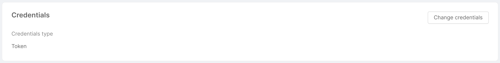
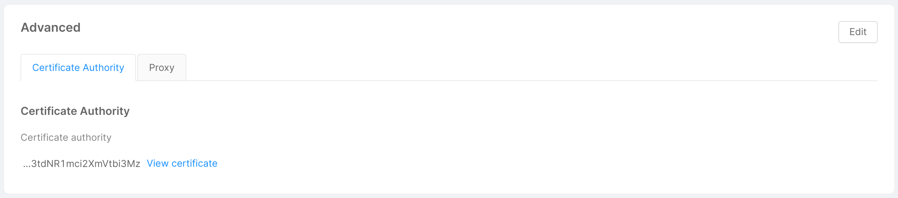
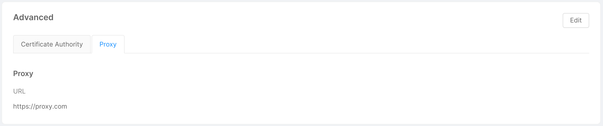
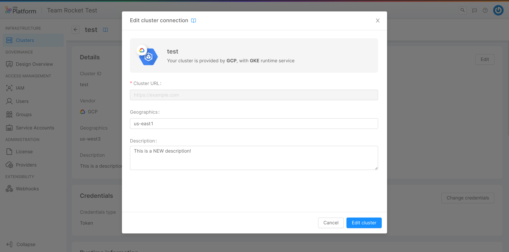

## Connect a Cluster

You can connect a cluster by clicking on the "Add cluster connection" button, located in the page's top right corner. A modal will show up, and, through a few steps, you will be asked to enter some information related to the cluster.

### Step 1: Runtime Service

In this step, you are required to choose the cluster's vendor and runtime service. You can do so by selecting a vendor tab and clicking on the card related to the runtime service you want to use. Further information on the supported vendors and runtime services can be found [here](/development_suite/clusters-management/vendors-runtime-services.md).

In case your vendor is not supported by the Console, don't worry! You can still select the "Other" tab and choose a runtime service.

### Step 2: Details

In this step, you can insert some general details about your cluster:

* **Cluster ID** (*required*): friendly identifier of the cluster, assigned by the user while connecting the cluster to the Console;
* **Cluster URL** (*required*): URL used to connect to the cluster, which indicates where the cluster is exposed;
* **Geographics**: a label used to describe the location of the cluster;
* **Description**: a brief description of the cluster.

### Step 3: Credentials

In this step, you are required to insert some information about the cluster credentials:

* **Credentials Type** (*required*): the type of credentials used to authenticate requests to the cluster. Only the "Token" type is currently supported;
* **Service account token** (*required*): JWT token needed by the service account to perform operations on the cluster.
To extract it, refer to [this paragraph](/development_suite/clusters-management/clusters-overview-setup.md#ca-and-token).

:::info
All credentials data are stored in an encrypted MongoDB collection.
For more information about MongoDB encryption, take a look at the dedicated [documentation page](/runtime_suite/crud-service/30_encryption_configuration.md).
:::

:::caution
Credentials entered at this stage, for security reasons, will never again be shown to the user, who will be able to replace them with new ones but not visualize them again.
:::

### Step 4: Advanced

In this step, you can insert some advanced information about the cluster:

* **Certificate authority**: CA certificate for the TLS connection with the cluster.
  To extract it, refer to [this paragraph](/development_suite/clusters-management/clusters-overview-setup.md#ca-and-token);
* **Proxy URL**: URL of the proxy used to connect to the cluster, usually needed when the cluster is exposed on a private network.

By clicking on "Add cluster", the connection to the cluster will be set, and it will appear as a new entry in the table.

:::note
A syntactic check is performed at the moment of data entry, but the Console will verify their correctness on saving, contacting the cluster to establish the connection.  
Therefore, inserting a wrong URL, token, or certificate will result in a network error because the cluster will not be contacted successfully, and thus it will not be connected nor saved.
:::
:::danger
In case the service account is not configured on the specific cluster, upon creation of an environment associated with that cluster the Console will not be able to generate the token needed for deployment. More information on how to connect the service account can be found [here](/development_suite/clusters-management/clusters-overview-setup.md#configure-and-connect-the-service-account-to-the-cluster).
:::

## View Cluster Information

By clicking on the arrow button located in the rightmost column of a cluster entry in the table, a new page will show up, displaying information about the specific cluster through a few cards:

* **Details**: this card shows the information inserted by the user when connecting the cluster to the Console, and allows to modify this information through the "Edit" button in the top right corner, as further explained [below](#edit-a-cluster-connection).

* **Credentials**: this card shows the cluster credentials type, and allows to replace cluster credentials through the "Change credentials" button in the top right corner, as further explained [below](#edit-a-cluster-connection).

* **Runtime information**: this card shows the runtime information of the cluster, taken by aggregating data from the machines on which the cluster is hosted. More specifically:
  * **Kubernetes version**: Git version of the Kubernetes master node associated with the cluster;
  * **RAM**: the total amount of RAM used by the machines (in MiB);
  * **CPU**: the total amount of CPU used by the machines (in terms of number of cores);
  * **Nodes**: number of nodes associated with the cluster.

* **Utilization**: this card simply shows the environments installed on the cluster, and the projects associated with these environments. A search bar allows you to quickly find the project you are looking for, filtering the data in the table.

* **Advanced**: this card shows the advanced cluster information inserted by the user when connecting the cluster to the Console. It is divided into 2 tabs: "Certificate Authority" and "Proxy", each of which displays the related information. The "Edit" button in top right corner allows opens a modal identical to the one shown in the [step 4 of cluster connection](#step-4-advanced), and allows the user to remove or modify this information, as further explained [below](#edit-a-cluster-connection).

Clicking on the "View certificate" button allows the user to visualize the base64 CA certificate in both human-readable and plain versions in a two-tabs modal. The "Expanded view" tab displays the human-readable version of the certificate, while the "Text view" tab shows its plain version, and a copy button in the modal footer allows the user to quickly copy the plain base64 CA certificate.

  

  

  

  

## Edit a Cluster Connection

As mentioned in the previous section, it is possible to modify (most of) the information inserted by the user while connecting the cluster to the Console. To do this, you can use the appropriate "Edit" buttons in the top right corner of the cards (for credentials, being a real replacement rather than a modification of the existing ones, the button is called "Change credentials").

A click on the button opens a modal very similar to the one seen when connecting the cluster, specific for the information to modify. For example, clicking on "Edit" button of the "Details" card will display the modal below. By clicking on "Edit cluster" (or "Change credentials" in the case of credentials), the connection to the cluster will be updated.

## Remove a Cluster Connection

In the bottom part of the page, there is a footer which allows you to remove the cluster connection from the Console. By clicking on the "Remove" button, a modal will be displayed, asking for confirmation of the removal.

After entering the name in the input field and clicking "Remove", a loading and finally a feedback of successful removal will be shown. Closing the modal will then redirect you to the clusters table. In case of errors, an informative feedback will be shown instead, and the "Close" button will not perform any redirection.

:::note
Removing a cluster connection is only possible if the cluster has no connected environment.
:::
