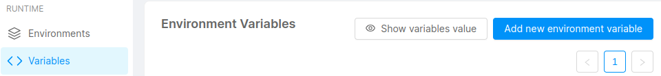
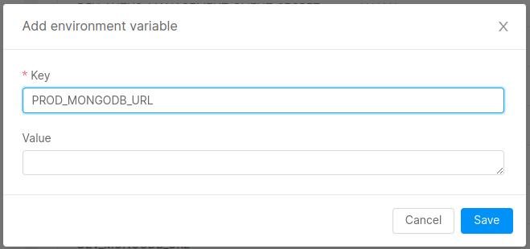

In this guide you will see how to configure a list of development tools in order to use them in the Mia-Platform Console.

## MongoDB database

The Mia-Platform Console allows you to create, manage and delete the collections inside a mongoDB database.

If you have an external instance of MongoDB this guide will help you connect a database to the Mia-Platform Console.

:::info
Here is how to [create a database](https://www.mongodb.com/basics/create-database) given a MongoDB Atlas account.
:::

### Requirements

- Mia-Platform Console
- MongoDB Atlas credentials account

### Configuration

This section explains how to create a new environment variable with the MongoDB connection string  in order to integrate the database with the Mia-Platform Console.

:::info
Here you can find an introduction about [environment variables](/docs/development_suite/set-up-infrastructure/env-var).
:::

To perform this action you must be in the _Project Settings_ section of the Console:

1. On the left-side column select the _Variables_ tab to access the **Environment Variable** section. 

2. Click on the _Add new environment variable_ button to see the creation modal:

  