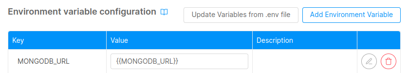

In this guide you will see how to configure a list of development tools in order to use them in the Mia-Platform Console.

## MongoDB database

The Mia-Platform Console allows you to create, manage and delete the collections inside a mongoDB database.

If you have a MongoDB instance accessible via web this guide will help you connect a database to the Mia-Platform Console. In this guide the examples are made using MongoDB Atlas.

:::info
Here is how to [create a database](https://www.mongodb.com/basics/create-database) given a MongoDB Atlas account.
:::

### Requirements

- Mia-Platform Console
- MongoDB Atlas credentials account
- MongoDB Atlas database

### Configuration

This section explains how to create a new environment variable with the MongoDB connection string  in order to integrate the database with the Mia-Platform Console.

:::info
Here you can find an introduction about [environment variables](/development_suite/set-up-infrastructure/env-var-intro.md).
:::

To perform this action you must be in the _Project Overview_ area of the Console:

1. On the left-side column select the _Variables_ tab to access the **Environment Variable** section. 


2. Click on the _Add new environment variable_ button to see the creation modal.


- **Key** set the value `<PREFIX>MONGODB_URL`. In the example the prefix is `PROD_`.
- **Value** set the connection string to the mongo database.

:::info
Here is how to [get the connection string](https://www.mongodb.com/docs/guides/atlas/connection-string/) on MongoDB Atlas. 
:::

The connection string must be of this format:

```
mongodb+srv://<username>:<password>@<hostname>/<databaseName>?retryWrites=true&w=majority
```

Then click on the **Save** button.

3. If not setup in the project, **create** the CRUD Service.
You can follow [this guide](/tutorial/rest_api/quick_rest_api.mdx#create-crud-service) to create the service.

In the **Environment variable configuration** of the service you can reference the newly created environment variable using this notation `{{MONGODB_URL}}`.




4. Now you are ready to work with your CRUDs.

:::warning
- Currently, if the database is already populated, all records in all collections must be decorated with the `__STATE__` field set to `'PUBLIC'` in order to access the data.
All records that do not have the `__STATE__` field are not returned by the crud-service.
In addition, all collections must be defined in the Mia-Platform Console.
- Indices not defined in the Mia-Platform Console are all deleted from the crud-service if they are not named with the prefix `preserve_`.
:::