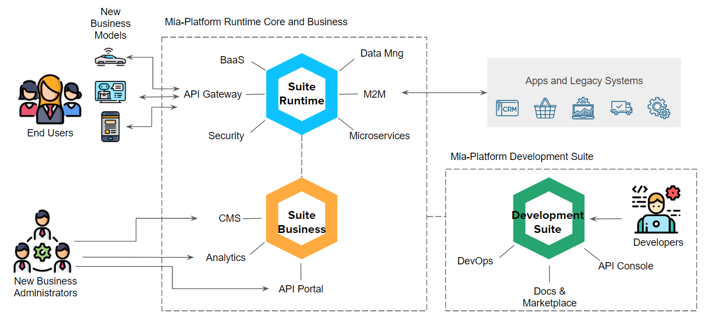

# Benvenuto sulla documentazione di Mia-Platform

[Quickstart con Mia-Platform](development_suite/quick_rest_api.md): scopri come creare e rilasciare una REST API in 5' minuti

La piattaforma si compone di tre suite:

* La **Development Suite**: La suite per creare e rilasciare la piattaforma in pochi click
* La **Runtime Suite**: la suite di componenti tecnologici
* La **Business Suite**: I nostri componenti per gestire dati e servizi

**Le suite**

### Visione Architetturale
Come le tre suite dialogano e interagiscono con gli utenti e con le strutture del cliente.

