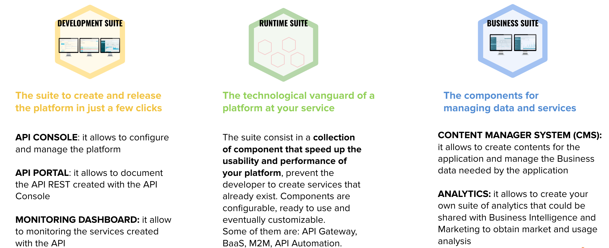
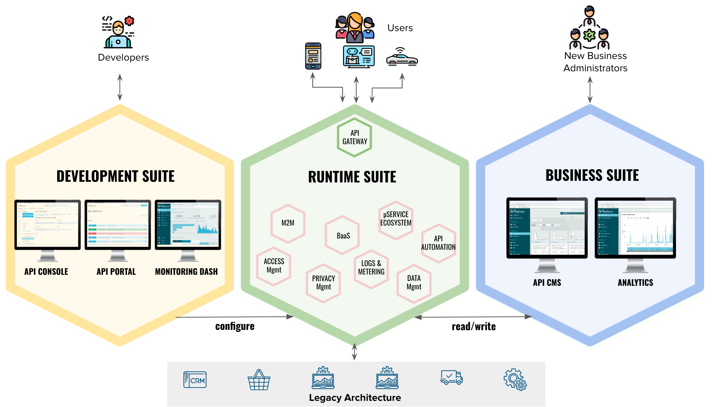

# Welcome to the Mia-Platform documentation

[Quickstart with Mia-Platform](development_suite/api-console/api-design/quick_rest_api.md):discover how to create and release a REST API in 5 minutes

The platform consists of three suites:

* The **Developers Console**: The suite to create and release the platform in a few clicks
* The **Runtime Components**: all our innovative technological components
* The **Business Components**: Our components to manage data and services

**The suites**

### Architectural Vision
How the three suites interact and interact with users and with customer facilities.

