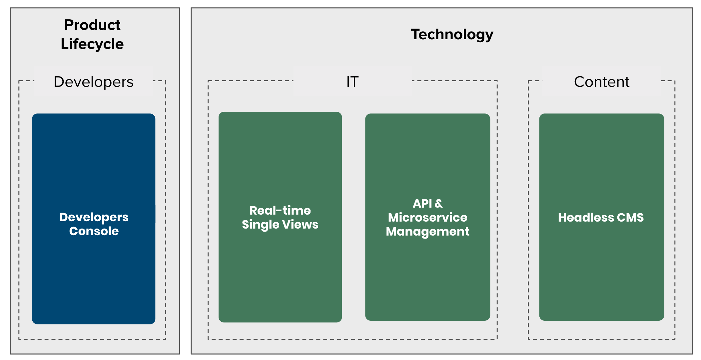

# Welcome to the Mia-Platform documentation

[Quickstart with Mia-Platform](development_suite/api-console/api-design/quick_rest_api.md):discover how to create and release a REST API in 5 minutes

The product helps developers in two areas:

* on the one hand the management of the life cycle of a software product with a dedicated product: **the Developers console**  
* on the other hand it accelerates the creation of digital platforms with dedicated products.  
  In particular:
    * **Real-time Single view** : the components for aggregate data
    * **API & Microservices Management** : all our innovative technological components to manage API & Microservices
    * **Headless CMS** :  to manage data and services

**Products Overview**

