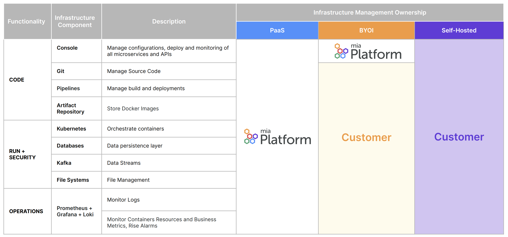

Mia-Platform can be adopted in three different ways, according to your needs:

- **Platform as a Service (PaaS)**: Purchase Mia-Platform as a fully managed environment, ready to use for your development teams. Further information available [here](/paas/overview.md).
- **Bring Your Own Infrastructure (SaaS)**: Purchase Mia-Platform as a managed service but keep the runtime infrastructure under your control and management.
- **Self Hosted (on-premises)**: Purchase Mia-Platform’s License to be installed and managed on your own infrastructure. Further information available [here](/self_hosted/self_hosted_requirements.md).

The SaaS distribution is the most widely adopted by our customers. In the picture below, you can see what each model offers:

