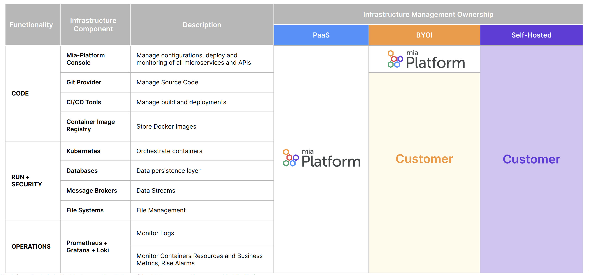

Mia-Platform can be adopted in three different ways, according to your needs:

- **Platform as a Service (PaaS)**: Purchase Mia-Platform as a fully managed environment, ready to use for your development teams. Further information available [here](./paas/overview.md).
- **Bring Your Own Infrastructure (SaaS)**: Purchase Mia-Platform as a managed service but keep the runtime infrastructure under your control and management. Further information available [here](./byoi/overview.md).
- **Self Hosted (on-premises)**: Purchase Mia-Platform License and have everything installed and managed on your own infrastructure. Further information available [here](./self-hosted/self-hosted-requirements.md).

The BYOI distribution is the most widely adopted by our customers. In the picture below, you can see what each model offers:

If you are interested in PaaS or BYOI, you can [book a free demo](https://contact.mia-platform.eu/ask-for-a-demo-mia-platform) and then agree for a PoC.  
For Self Hosted, you can purchase the license and start your project right away.
