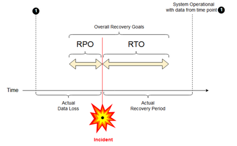

Business Continuity is Mia-Platform's ability to prevent interruptions to mission-critical services, and to reestablish full function as quickly and smoothly as possible after a disaster has occurred.

Mia-Platform is committed to ensure Business Continuity by actively working on its 3 key elements:

- *Resilience*: designing measures and procedures in order to keep its operating at its maximum capability, as well as to maintain communication and accepting chances after an incident has happened;
- *Contingency*: implementing procedures which can include hardware replacement and contracting third-party vendors for assistance;
- *Recovery*: planning strategies for post-failure procedures. So, disaster recovery is just a subset of Business Continuity planning.

By definition, Business Continuity should involve two distinct areas: [Business Continuity Planning](#mia-platform-business-continuity-planning) and [Business Continuity Management](#mia-platform-business-continuity-management).

## Mia-Platform Business Continuity Planning  

**Business Continuity Planning** involves all planning activities aiming to ensure organizations overcome any interruptions and disasters as quickly as possible.

### Mia-Platform Console infrastructure overview  

Since Mia-Platform Console has a stateless microservice architecture, every microservice of the platform should be:

- Redundant: every microservice should be replicated on different nodes, to ensure high reliability;
- Scalable: every microservice should be prepared for tasks (or requests) to increase at any time;
- Stateless: every microservice should not have a different behavior linked to the order of how the calls are received, but the session is managed at the application level.

The *microservice orchestration* is delegated to Kubernetes, which allows the infrastructure to self-heal. Thus, whenever a failure occurs, Kubernetes will automatically restore the desired state.

MongoDB cluster guarantees *persistence* and failover, thanks to the system replication set of the database server itself.

Access to the services via API goes through a replicated and scalable Traefik Ingress Controller, before reaching the Kubernetes Cluster Services.

Putting it all together, by definition, the likelihood of downtime of the service is rather low.

## Mia-Platform Business Continuity Management

**Business Continuity Management** ensures plans are always available, so that organizations can experience the minimum possible day-to-day disruption.

### Planned and unplanned events management

The factors which affect the Mia-Platform business continuity are both planned (i.e. platform and infrastructure updates) and unplanned (i.e. down of the infrastructure, hacker attacks, natural disasters, urgent hotfix releases, platform loading time exceeding the design limits, human errors).

In order to guarantee the business continuity for applications deployed in Mia-Platform PaaS, in case of **planned events**, bear in mind the following guidelines:

- The delivery pipeline has to be up-to-date and with no error notifications. Visit our page about [how to setup a pipeline](../self-hosted/pipeline-configuration.md) for more details;
- The microservices should be replicated at least twice (each replica on a different node). Visit our page about [how to configure replicas](/development_suite/api-console/api-design/replicas.md);
- If there are NON-backward-compatible updates, all the applications must be successfully tested using the latest version;
- A roll-back plan to the previous version of the application should be available in case of errors;
- If external services (i.e. MongoDB) have a service outage, applications should be able to properly reconnect as soon as they are up and running.

Furthermore, it is up to Mia-Platform PaaS to ensure the backups are kept up to date.

On the other hand, **unplanned events** are trickier to deal with. Therefore, in order to improve the service continuity, consider the following actions when designing your application workload:

- Implement autoscaling of nodes and services, to improve redundancy and availability;
- Adopt HTTP / HTTPS IP filtering to block malicious requests;
- Plan consistent backups for applications and data;
- Add support for multiregion/multizone deployments for failover.

All the above guidelines are already implemented in Mia-Platform SaaS Console, in order to provide the best Business Continuity as possible. On Mia-Platform PaaS, the previous guidelines can be implemented according to the agreements defined with the customer.

## Mia-Platform Disaster Recovery Planning

A clear disaster recovery pattern is critical for a cloud-native platform such as Mia-Platform. Disaster recovery involves a set of proactive decisions and procedures that enable the recovery or continuation of vital technology infrastructure and systems, following a natural or human-induced disaster.

There is a key difference between *disaster recovery* and *high availability*. High availability is a resiliency characteristic of a system, which is implemented by designing it as a feature of the primary system.

### Definitions

There are two main industry terms to be defined:

- **Recovery point objective (RPO)**: the maximum targeted time period in which data (transactions) might be lost from an IT service due to a major incident.
- **Recovery time objective (RTO)**: the targeted duration of time and a service level within which a business process must be restored after a disaster.

### Mia-Platform RPO - RTO

Mia-Platform tests its Disaster Recovery Plan regularly, noting any issues that come up and adjusting its plan accordingly. If you are a Mia-Platform client/partner, you can request the Disaster Recovery plan details to your referent. The Mia-Platform PaaS RPO value is typically between 0-6 hours, while the RTO value is typically between 0-24 hours.
