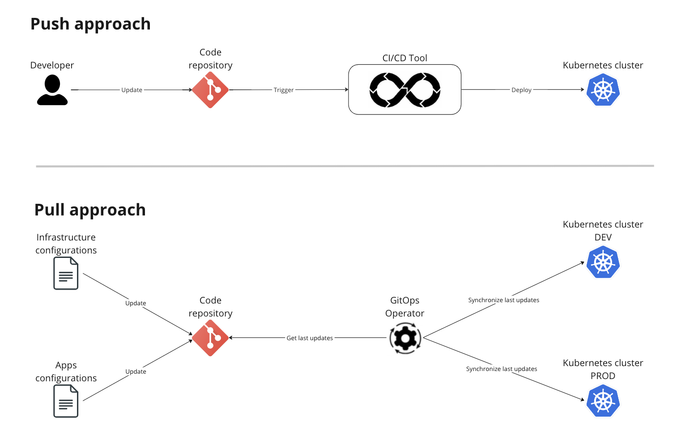

Sometimes you could need to keep your kubernetes cluster private and not publicly reachable for security reasons.

The reasons to do this are different:
* you want to improve the cluster security;
* company's policies impose this limitation on the infrastructure;
* you don't expose APIs to be publicly used, but just for internal purpose;
* ... and so on

The ways to do this are different too, but in this document we will assume that you already own a private cluster, regardless of the used approach.

What does it mean to have a private cluster for _Software Life Cycle Management_?

On the Mia-Platform Console we "directly" interact with the kubernetes clusters in few pages:
* __Runtime page__: represents the overview of the runtime environment status and allows the user to see and interact with elements on kubernetes (depends on the user permissions);
* __Deploy page__: when enabling the smart-deploy toggle, the Mia-Platform Console query the kubernetes cluster to show the user differences between the actual release and the new release;
* __Deploy page__: deploying a project will usually trigger the deploy pipeline to update the kubernetes resources with the new version.

How can we handle the operations above if the cluster is private?

# TL;DR;
Following a recap table that shows you the different approaches and which use cases are they appropriate for.

# Proxy is the way

The proxy solution solved all the use cases listed above because using, for example, a bastion proxy, you can:
* allow the _Runtime page_ to reach the cluster, authenticating it through on the proxy with an AuthN/AuthZ flow;
* allow the _Deploy service_ to reach the cluster, authenticating it through on the proxy with an AuthN/AuthZ flow, to get the actual kubernetes resources and to publish new resources on the cluster.

You can set the proxy you need to reach the cluster directly on the Mia-Platform Console, during the cluster creation in your company page.
To do that you can:
* Navigate, through the Mia-Platform Console, to your company settings page;
* Click on the _Clusters_ menu;
* Click on the _Add cluster connection_ button (or editing an existing one);
* Insert cluster's details, until you reach the _Advanced_ section of the "Cluster creation stepper";
* Insert the proxy's URL and, if you need it, a TLS certificate, as reported in [this documentation page](/development_suite/clusters-management/connect-and-manage-cluster.mdx#step-4-advanced).

:::warning
If you have a __Pure License__ Mia-Platform Console instance and the Mia-Platform Console is installed on the same runtime environment, you couldn't need the proxy because the communications between the Mia-Platform Console and the cluster will be internal.

__<u>N.B.</u>__ despite that, you could need a proxy or a VPN connection to reach the Mia-Platform Console UI, based on your infrastructure configurations.
:::

# Virtual Private Cloud network
A _Virtual Private Cloud_ network (_VPC_ from now) is a virtual version of a physical network useful to let servers on different networks to communicate each other as if they where in the same one.

Almost all cloud providers have their version of a _VPC_, for example:

[__Google Cloud__](https://cloud.google.com/vpc/docs/vpc)
> A Virtual Private Cloud (VPC) network is a virtual version of a physical network that is implemented inside of Google's production network by using Andromeda.

 

[__AWS__](https://docs.aws.amazon.com/vpc/latest/userguide/what-is-amazon-vpc.html)
> With Amazon Virtual Private Cloud (Amazon VPC), you can launch AWS resources in a logically isolated virtual network that you've defined. This virtual network closely resembles a traditional network that you'd operate in your own data center, with the benefits of using the scalable infrastructure of AWS.

 

[__Azure__](https://learn.microsoft.com/en-us/azure/virtual-network/virtual-networks-overview)
> Azure Virtual Network is a service that provides the fundamental building block for your private network in Azure. An instance of the service (a virtual network) enables many types of Azure resources to securely communicate with each other, the internet, and on-premises networks.

## How can a VPC solve the problem?
The VPC can completely or partially solve the problem.

### Runtime page and Smart Deploy section
Configuring a _VPC_ you can create a link between:
* the cluster the Mia-Platform Console is installed on;
* your destinations clusters;

in this way the services inside the Mia-Platform Console cluster will be able to reach the destination clusters, allowing the Console to correctly show you the _Runtime_ and the _Smart Deploy_ sections.

:::info
The cluster the Mia-Platform Console is installed on strictly depends on your Mia-Platform license ([PaaS](/paas/overview.md), [BYOI](/byoi/overview.md) or [Self hosted](/self_hosted/self_hosted_requirements.md)).

Contact your Mia-Platform referent to know more about that.
:::

### What about the deploy pipeline?
The operation of the deploy pipeline really depends on the specific use case.

The Mia-Platform Console _Deploy page_ allows the user to trigger a deploy using the configured _Continuous Delivery_, but it's just a trigger, the Mia-Platform Console will not do the deploy itself.

The _VPC_ creates a virtual network between two phisically different networks. If the deploy pipeline tool is installed on the same Mia-Platform Console cluster, you can solve this problem too, because the deploy tool will already be able to reach the destination clusters; otherwise you can:
* install another VPC, between the deploy tool pipeline server;
* use the [_Pull_ strategy](#pull-instead-of-push) instead of the _Push_ strategy.

:::info
Pull and Push are different approaches with their different pros and cons.

The _Push_ approach (most common one) is based on a tool that, when triggered, pushes the resources (_yml_ files) on the kubernetes cluster to update it.

The _Pull_ approach involves an agent installed on k8s instead; the agent periodically, or based on specific rules that depend on the tool you are using, pulls the resources and synchronize them with the resources on the cluster, if needed.
:::

# Pull instead of push
The _Pull_ strategy can be implemented in different ways and with different tools. In Mia-Platform we suggest the following ones:
* [__ArgoCD__](https://argo-cd.readthedocs.io/en/stable/);
* [__GitLab Agent__](https://docs.gitlab.com/ee/user/clusters/agent/ci_cd_workflow.html).

## ArgoCD

## GitLab Agent

