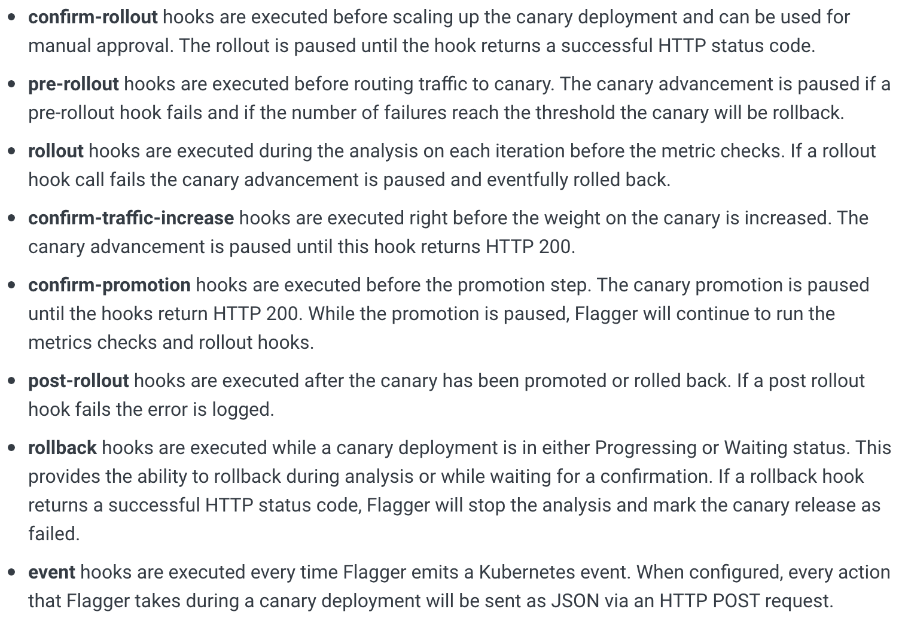
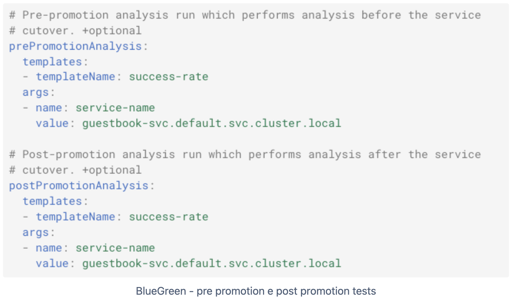
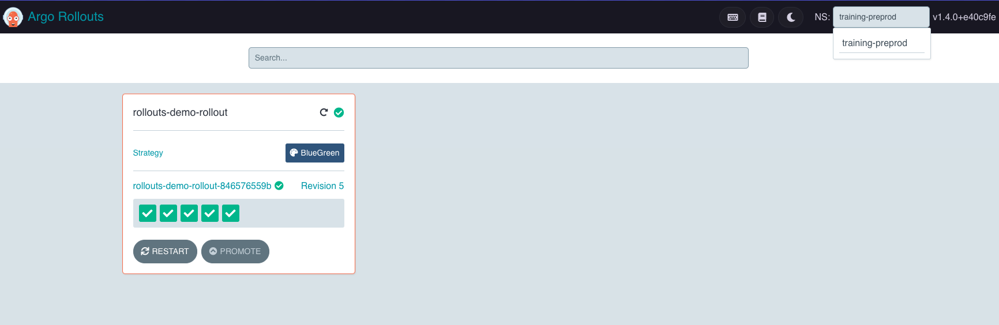
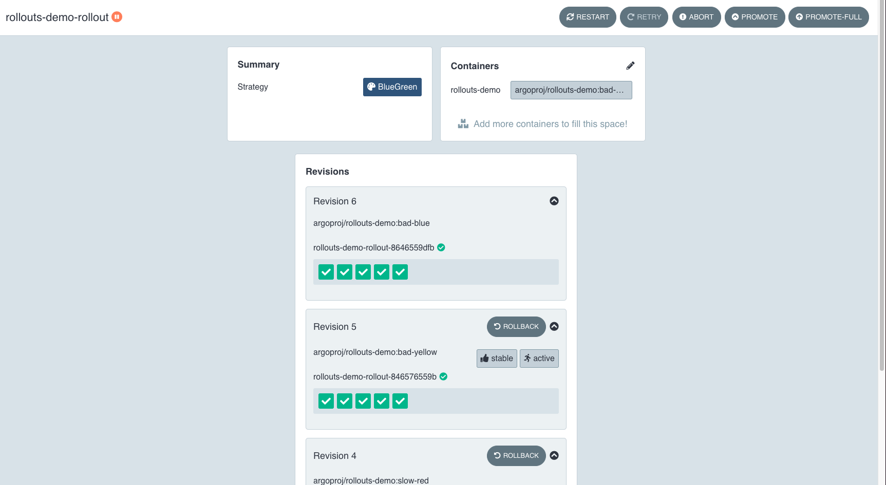
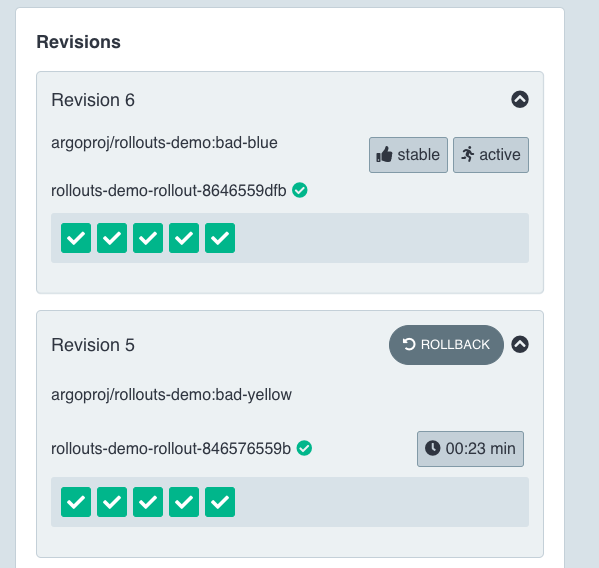

# Deployment tools

Kubernetes offers, by design, two deployment strategies:

* Recreate: terminates the pod and, once terminated, scales up the new one;
* Rolling Update (the default one): the new pod is scaled up and, when ready and healthy, the old one is terminated;

look at the [official documentation](https://kubernetes.io/docs/concepts/workloads/controllers/deployment/#strategy) for more information.

Sometimes the user needs other deployment strategies, not supported by design using Kubernetes.
For this reason we analyzed some tool to fulfil this need:

* [Flagger](https://flagger.app/) from Flux;
* [Argo-rollouts](https://argo-rollouts.readthedocs.io/) from Argo.

:::warning
The tools above are not fully integrated into the Mia-Platform Console. The user can handle resources through the console and the projects configurations, but not through the Mia-Platform Console UI with a no-code approach.
:::

## [Flagger](https://docs.flagger.app/) from Flux

Flagger is a OSS tool developed by [Flux](https://fluxcd.io/).

Flagger allows the user to implement two other deployment strategies:
* canary: the traffic is partially routed to the new version of the service, partially to the old one;
* blue/green: the new version is deployed (green) but the traffic still goes to the old version (blue), until the new version is "approved" for promotion. Once approved, the traffic is switched to new version of the service and the old one is shutted down.

:::warning
The blue/green strategy provided by Flagger is not a real blue/green **on Kubernetes** because Flagger does not switch the traffic from the blue to the green version; once "approved" for promotion, Flagger updated the blue version and terminates the green one; the blue version is always **the only stable one**. 
:::

Flagger allows to implement one or both (simultaneously too) the strategies above using:
* the kubernetes standard resources (deployment, services and so on);
* a *Custom Resource Definition* called `Canary`;

allowing the user to handle resources using the Mia-Platform Console and the projects configurations.

:::warning
Deleting a `Canary` resource will cause the kubernetes resources deletion too.
:::

### Blue/Green strategy

#### Lifecycle through the Mia-Platform Console

Creating, on the Mia-Platform Console, a service called `my-hello-world`, the console will automatically generate:
* a k8s Deployment manifest for `my-hello-world`;
* a k8s Service manifest for `my-hello-world`.

The `Canary` file is to be manually created inside the project configuration repository, the location is based on your project structure.

Once the `Canary` CRD is created, deploying the project will cause:
* the creation of the k8s resources **created automatically by the console**;
* the creation of the Canary resource **created manually by the user**;

and Flagger will automatically:
* create a new k8s deployment `my-hello-world-primary`, equals to the `my-hello-world` one;
* create a new k8s service `my-hello-world-primary` that points to the deployment above;
* edit the `my-hello-world` service, adding the `-primary` suffix on the match label selector;
* create a new k8s service `my-hello-world-primary` that will be used for the blue/green release;
* scale down the `my-hello-world` deployment, because is replaced by the `-primary` one, handled by Flagger.

Updating the `my-hello-world` deployment will cause a new Blue/Green deployment start, so that the user can still handle the service lifecycle through the Mia-Platform Console.

#### Blue/Green deployment lifecycle

During a blue/green deployment, Flagger will perform some operation, as reported in the following image:


1. The v1 of `my-hello-world` is up and running;
2. The user deploys the v2 of `my-hello-world` through the console:
  * Flagger deploys the v2 with the `-canary` suffix;
  * the v1 is still up and running and serves the traffic to the users;
  * the conformance test step starts;
3. Flagger runs the load tests, if specified: if the failure treshold is reached, the release is aborted;
4. Flagger check metrics, if specified: if the failure treshold is reached, the release is aborted;
5. Flagger validates the SLOs;
6. Flagger promotes the new v2 version and terminates the old v1.

:::info
Blue/Green and Canary strategies can be mixed to allow some user to start using the new v2 version before the promotion (progressive traffic shifting).
:::

#### Tests automation

Flagger executes a precise tests lifecycle, as shown in the previous paragraph, and provides different ways to automate tests.

The main types are:
* [**metrics analysis**](https://docs.flagger.app/usage/metrics): allows to specify one or more metrics to be analyzed to promote/rollback the release. Flagger supports different metrics providers (Prometheus, Dynatrace, Datadog and so on);
* [**webhooks**](https://docs.flagger.app/usage/webhooks): hooks of different types executed during the deploy, with different purposes.

Using the tools above Flagger allows the users to completely automate the promotion of a release, without the need of manual actions.

Despite that, is still possible to pause the deploy lifecycle in different points for manual actions using the right hooks types, as reported in the following image:



:::info
Flagger exposes Prometheus metrics to show statistics about releases. There are ready to use Grafana dashboards too.
:::

#### Examples

Following an example of `Canary` file that allows to deploy, in the `training-development` namespace, the `api-gateway` service using the Blue/Green strategy and send notification to a Google Chat channel:

```yaml
apiVersion: flagger.app/v1beta1
kind: Canary
metadata:
  name: api-gateway
  namespace: training-development
spec:
  provider: kubernetes
  targetRef:
    apiVersion: apps/v1
    kind: Deployment
    name: api-gateway
  progressDeadlineSeconds: 60
  service:
    port: 8080
    portDiscovery: true
  analysis:
    interval: 5s
    threshold: 2
    iterations: 10
    analysis:
    webhooks:
      - name: "ask for confirmation"
        type: confirm-rollout
        url: http://flagger-loadtester.training-development/gate/check
      - name: "notify"
        type: event
        url: <GOOGLE_CHAT_URL>
        metadata:
          text: "Ready for promotion"
      - name: "promote"
        type: confirm-promotion
        url: http://flagger-loadtester.training-development/gate/halt
      - name: "rollback"
        type: rollback
        url: http://flagger-loadtester.training-development/rollback/check
```

## [Argo-rollouts](https://argo-rollouts.readthedocs.io/) from Argo

Argo rollouts is a tool included into the [Argo project](https://argoproj.github.io/) that allows to use other deployment strategies:
* canary: the traffic is partially routed to the new version of the service, partially to the old one;
* blue/green: the new version is deployed (green) but the traffic still goes to the old version (blue), until the new version is "approved" for promotion. Once approved, the traffic is switched to new version of the service and the old one is shutted down.

Argo rollouts allows to implement one of the strategies above using:
* the kubernetes standard resources (deployment, services and so on);
* a *Custom Resource Definition* called `Rollout`.

:::warning
The default behavior of Argo rollouts is to **replace the existing deployments** manifests with the `Rollouts` manifest directly, that will handle the related pods; despite that, Argo rollouts allows to refer an existing deployment.
:::

### [Rollout CRD](https://argo-rollouts.readthedocs.io/en/stable/features/specification/)

The `Rollout` CRD allows the user to handle the lifecycle of a service using one of the following approaches:
* handle the pods lifecycle by replacing the kubernetes `Deployment`;
* refer an existing kubernetes`Deployment` without replacing it.

An Argo rollouts `Rollout` CRD is very similar to a kubernetes `Deployment` to:
* specify replicas and pod template;
* specify deployment strategies different from the default ones:
  * Canary;
  * Blue/Green.

### Blue/Green strategy

#### Lifecycle through the Mia-Platform Console

As previously reported, argo-rollouts has two use approaches:
* using standard kubernetes resources;
* using the `Rollout` CRD referencing existing deployments.

:::warning
Using `argo-rollouts` with the Mia-Platform Console only supports the second method, referencing existing deployments.
In this way, the services lifecycle can still be handled through the console.
:::

Creating, on the Mia-Platform Console, a service called `my-hello-world`, the console will automatically generate:
* a k8s Deployment manifest for `my-hello-world`;
* a k8s Service manifest for `my-hello-world`.

The `Rollout` file is to be manually created inside the project configuration repository, the location is based on your project structure.

Once the `Rollout` CRD is created, deploying the project will cause:
* the creation of the k8s resources **created automatically by the console**;
* the creation of the Rollout resource **created manually by the user**;

and argo-rollouts will wait for deployment updates.

Once the deployment has been updated through the console, e.g. we update the `my-hello-world` service to v2, argo-rollouts will:
* start a new `Rollout` process, deploying N replicas of the `my-hello-world` service v2;
* keep `my-hello-world` service v1 up and running, to serve the traffic;
* wait for the promotion result:
  * **OK:** argo-rollouts switches the traffic from the v1 service (blue version) to the v2 service (green version) and terminates the v1 version;
  * **KO:** argo-rollouts shuts down the v2 service and the v1 will remain the used version.

:::info
Argo-rollouts provides a real blue/green deployment, because the green version will replace the blue one.
:::

#### Rollout promotion and manifest

With argo-rollouts the promotion can be automatically or manually done but, contrary to Flagger, it is most lacking in the automatic promotion but it is still possible to configure some automatism:



The blue/green strategy has the following properties:
```yaml
spec:
  strategy:
    blueGreen:
      autoPromotionEnabled: boolean
      autoPromotionSeconds: *int32
      antiAffinity: object
      activeService: string
      previewService: string
      prePromotionAnalysis: object
      postPromotionAnalysis: object
      previewReplicaCount: *int32
      scaleDownDelaySeconds: *int32
      scaleDownDelayRevisionLimit: *int32
```

The main ones are:
* **autoPromotionEnabled**: to let argo-rollouts automatically promote the green version or not;
* **activeService**: the k8s service related to the deployment;
* **previewService**: the optional k8s service to expose the green version during the rollout.

#### Argo dashboard and kubectl plugin - The game changers

Argo-rollouts provides out of the box two very useful features:
* **[interactive dashboard](https://argo-rollouts.readthedocs.io/en/stable/dashboard/)**: useful dashboard that allows the user to see rollouts, promote or rollback and so on;
* **[kubectl plugin](https://argo-rollouts.readthedocs.io/en/stable/features/kubectl-plugin/)**: allows to run specific operations on rollouts (e.g. promote, rollback and so on); it can be very useful to be used in automatic pipelines.

The interactive dashboard can be exposed through the kubectl plugin, executing `kubectl argo rollouts dashboard` and allows to:
* show the rollouts of on or more namespaces of the cluster:


* show the details of a specific rollout, during a rollout too:


* promote or rollback a specific rollout:


#### Examples

Following an example of `Rollout` file that allows to deploy, in the `training-development` namespace, the `rollouts-demo` existing deployment service using the Blue/Green strategy with the **automatic promotion disabled**:

```yaml
apiVersion: argoproj.io/v1alpha1
kind: Rollout
metadata:
  name: rollouts-demo-rollout
spec:
  replicas: 5
  revisionHistoryLimit: 2
  selector:
    matchLabels:
      app: rollouts-demo
  workloadRef:
    apiVersion: apps/v1
    kind: Deployment
    name: rollouts-demo
  strategy:
    blueGreen:
      activeService: rollouts-demo
      autoPromotionEnabled: false
```