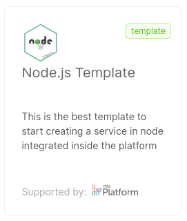

As a Console user, you can contribute to the Marketplace by creating new items of any kind. You can choose to make them available on the internal Company, or request for them to be published.

In this section, we dive into the process of creating a new item for the Marketplace, analyzing the main differences between different types of items and providing some configuration examples.

:::info

There are different methods to manage Marketplace items, described in details in the [related page](/marketplace/add_to_marketplace/manage_marketplace_items.md)

:::

## Public and Internal Company Marketplace

The **Mia-Platform public Marketplace** is the place where every Company can find most of the items needed to set up its Project architecture. It is publicly available on Mia-Platform Console, meaning that all Companies can view and make use of its items.

However, a Company might want to have its own internal Marketplace, fulfilled also with items that must not be shared with everyone else outside the Company.


## Creation of a Marketplace Item

Creation of a Marketplace item consists of two steps. The first is writing a Marketplace Item configuration file, then you have to upload it to the Console.

You have to ways to upload the item file:
- by using [`miactl`](/cli/miactl/10_overview.md), the official Mia-Platform CLI tool (recommended)
- by creating it in the CMS

:::info

To create Marketplace items you need to be a *Company Owner* or a *Project Administrator* at Company level

:::

### Marketplace item visibility and the `tenantId` field

When creating a new Marketplace item, you always need to set the `tenantId` related to the Company you are creating the item in.

You can also contribute to the **Mia-Platform Marketplace** by making your Marketplace item accessible to other Companies: visit [this page](/marketplace/add_to_marketplace/marketplace_items_accessibility.md) for further information on this point.

## Marketplace items

A Marketplace **Item** (also referred to as **Component**) is the basic unit of the Marketplace and represents a software resource available for use within Mia-Platform Projects.

These components provide various functionalities and can be integrated into Mia-Platform Projects to streamline development and configuration processes.

The Mia-Platform Marketplace contains items belonging to many types, with different use cases.

To use a Marketplace item in a Project, a user have to **create** it; depending on the type, the creation of an element has different consequences on the Project.

### Item Types

The Marketplace is composed of items with the following types.

- **Plugins**: items for which users have no access to the actual code. Users will still be able to download their Docker image, in order to configure and use them within their Projects.
- **Templates** and **Examples**: archives for which a new repository is generated. The developer will have direct access to the new repository (created in their Project scope) and will be able to evolve its code at will. A template is a repository that, net of the development environment and framework setup, is empty; an example, instead, also implements some features tailored to help the user better familiarize with the development environment.  
- **Applications**: bundles of resources that can be created and configured in the Mia-Platform Console within a few clicks. [Applications](/marketplace/applications/mia_applications.md) are composed of microservices (Plugins, Examples, and Templates), endpoints, CRUD collections, and public variables. Users can monitor if all the resources composing an application have been correctly set up inside the project, as well as access their corresponding repository or configuration.  
- **Proxy**: specific configurations used to invoke APIs that are not part of the current project but may be exposed by an external provider or another project. You can find more information about proxies in this [section](/development_suite/api-console/api-design/proxy.md).  

:::note

Marketplace items are identified by a **Category** (e.g. Data Stream, Data Visualization, Insurance, Healthcare... ).

Once the request has been taken over, together with the Mia-Platform referent it will be possible to determine whether the item can be associated to a pre-existing category, or whether a new category will be needed.

:::

## How to configure a new item

Each Marketplace item is identified by a specific data model (a JSON document). Such models are stored on a MongoDB collection and can be modified through the Marketplace section of the Console CMS.

In the [Examples](#examples) section, you will find a few samples of preconfigured items configurations.

:::info
If you don't have the right permission to access the Console CMS, you should hand over the newly created item configuration to one of your Mia-Platform referents.

They will then be responsible for adding your data to the Marketplace items collection.
:::

### Common to every item

Here below are listed all the properties that must be provided for each type of item:

- **`name`** (required): the item name appearing in the Marketplace card
- **`description`**: a brief description (10 to 20 words) regarding the service functionalities
- **`type`**: the type of your item (plugin, template, example, application, or proxy)
- **`comingSoon`** and **`releaseStage`**: properties to identify the maturity of the item (learn how to configure them in a [dedicated section](#release-stage-of-a-new-item) later on this page)
- **`categoryId` **: a label to help categorize items by their purpose or use case. As specified before, categories are only created internally at Mia-Platform. The `categoryId` of a item uniquely determines both a specific category and a sub-category (e.g. Start from Code (category) - Node.js (subcategory) will be identified by the `categoryId` "nodejs")
- **`supportedBy`**: a label to identify the company that has produced the item (only used if `supportedByImage` is not provided)
- **`tenantId`** (required): the ID of the Company the item belongs to
- **`imageUrl`** and **`supportedByImageUrl`**: respectively the image that will be associated with the item and the image that will be associated with the company that has produced it.
  
#### Adding images

The procedure of adding images differs if you are using CMS or Miactl:

##### With `miactl`

To upload the *image* and *supportedByImage* with the `miactl marketplace apply` command, you need to add the respective `image` and `supportedByImage` keys to the object.

Refer to the [related miactl documentation](/cli/miactl/30_commands.md#apply) to know the exact specifications of such object.

##### With the CMS

It is possible to add images using dedicated input fields:  

 

The final result will be as follows:  



### Common to microservice items (Plugins, Templates, Examples)

Each property described in the following paragraphs regarding the microservices configuration must be configured under the property `resources/services/:serviceId` as follows:

```json
{
  "name": "Example",
  ...
  "resources": {
    "services": {
      "example": {
        "defaultEnvironmentVariables": [...],
        "defaultConfigMaps": [...],
        ...
      }
    }
  }
}
```

Here below are listed all the properties that you can provide for each microservice item:
  
- **`itemId`**: a unique item id that can be used to identify the item and all the services generated from it. Each service created using this item will have the identifier value in the **sourceComponentId** property.
- **`defaultEnvironmentVariables`**: the environment variables that will overwrite the default environment variables applied by DevOps Console.  
  In particular, for each of them you need to provide:  
  - **`name`**: the variable name (generally, a key written in `UPPER_SNAKE_CASE`)
  - **`value`**: the variable default value
- **`defaultConfigMaps`**: the default ConfigMaps, if any, that will be mounted inside the container of the microservice.  
  In particular, for each of them you need to provide:  
  - **`name`**: the name of the ConfigMap
  - **`mountPath`**: the directory where the ConfigMap data will be added  
  
  You can also provide:
  - **`files`**: a list of files where the ConfigMap data will be stored. Each file should be an object with the following properties:
    - **`name`**: the name of the file
    - **`content`**: the initial content of the file
  - **`usePreserve`**: a boolean the indicates whether the existing files and directories in the mountPath directory should be preserved or not. If not set, it will be considered as false.
- **`defaultSecrets`**: the default secrets, if any, to be mounted inside the container of the  microservice.
  In particular, for each of them you need to provide:  
  - **`name`**: the name of the secret file  
- **`defaultProbes`**: the readiness and liveness paths of the service. By modifying the map of the probes, you can overwrite the default paths applied by DevOps Console.
- **`defaultLogParser`**: one of the following log parser types:
  - `mia-plain`: collects logs but does not parse them
  - `mia-json`: parses JSON logs based on the documented format
  - `mia-nginx`: parses logs of Nginx that were created using templates and services of Mia-Platform (website and api-gateway)
- **`defaultAnnotations`**: the service annotations, which can be used to provide additional information about your services for various purposes (such as configuration, monitoring, or automation). The annotations that starts with `mia-platform.eu` are reserved, you are not allowed to use them.
- **`defaultLabels`**: the service labels, which can be used to categorize, group, and select your service. The labels that starts with `mia-platform.eu` are reserved, you are not allowed to use them.
- **`defaultDocumentationPath`**: the APIs documentation path.
- **`defaultResources`**: CPU and memory limitations of the service, which can be used to overwrite the default limitations imposed by DevOps Console for these parameters.
- **`visibility`**: this property determines the visibility of the Marketplace item you are creating. If not set, the service will only be visible within the specified Company mentioned in the tenantId property.
  - **`allTenants`**: a boolean that indicates whether your service should be visible to all other tenants, making it accessible if set to `true`.
- **`providerId`**: the id of the provider that should be used to perform Git operations on your Marketplace item repository. If left unset, your project Git provider will be used instead.

:::caution
Please note that in this configuration **`min`** corresponds to the **`request`** value while **`max`** corresponds to the **`limit`** value specified in the Kubernetes documentation.  

In addition, measurement units are required. Resources are expressed in terms of milliCPUs (m) and MebiBytes (Mi) respectively for CPU and Memory.
:::

#### Configure Console Links

A service created from the Marketplace can feature custom links to other Console pages, managed by different microfrontend Plugins. To configure them on newly created services set up new objects in the `links` property for each template or plugin you wish.

A link is an object shaped as follows:

- **`label`** *string* (required): the label to be shown in the link button, does not support internationalization and it is shown right next to a  *View* copy (e.g. with the label set to **Resource** the resulting button will be **View Resource**);
- **`targetSection`** *string* (required): the name of the registered microfrontend where the link should land (e.g. `flow-manager`);
- **`enableIf`** *string*: the name of a feature toggle to be used to optionally display the link.

### Plugins

If the service you want to publish is a **Plugin**:

- The service must be a **Docker image**.  
- The Docker image must be pushed on an accessible registry. If you use the **Mia-Platform registry**, your Mia-Platform referent will provide the credentials to do it.

The Docker image must be specified in the `dockerImage` field in the service Marketplace document.

The service documentation of your plugin will be accessible from a specific link in the Marketplace, you also need to provide the documentation URL of your plugin and this must be inserted in the `documentation` field:  

```json
{
  "documentation" : {
    "type" : "externalLink",
    "url" : "https://docs.my-plugin.com/docs/configuration"
  }
}
```

### Example and Templates

If the service you want to publish is either an **Example** or a **Template**, then:

- The service must be a remote **Git repository**.
- The URL to the tar.gz version of the Git project must be specified in the `archiveUrl` field, optionally you can specify either the `sha` or the `ref` as query parameters. If you don't have access to CMS, this should be provided to your Mia-Platform referent in form of a Git clone URL.
- The service should ensure a Continuous Integration (CI) to update the service image any time his code is modified, through the `pipelines` field you can set up the CI file by yourself or use instead Mia-Platform pipeline templates.  
To use the templates provided by Mia-Platform, you can contact your referent to configure the pipeline templates within your Console installation. When creating your microservice, the Console will also generate a CI file (e.g. `.gitlab-ci.yml`) alongside the service files.
- The service must be well documented and the field `documentation` helps in it.  
In fact, during service creation, it is possible to access the service documentation by clicking on `View documentation` button, which will appear only if the `documentation` field has been filled correctly.  
Two properties must be specified inside `documentation`:  
  - `type`, currently only two types exist:
    - `markdown`: represents a markdown file (with `.md` file extension), for example, a `README.md` file inside of a Git repository.
    - `externalLink`: represents a link to an external website page, for example to Mia Platform documentation.
  - `url`, contains the URL where the markdown file can be retrieved (if its type is `markdown`), or the link where the user should be redirected (if its of type `externalLink`).  

:::caution

By adding an **Example** or a **Template**, the code provided will act as a boilerplate for everyone creating a service from that Marketplace item, therefore that code will be accessible to all Console users.

:::  

Once the user creates a new microservice starting from your template or example, the Console will create a new Git repository in which it will copy all the template files.

:::info

Further details on creating a template are provided by visiting [this documentation page](/marketplace/templates/template_create.md).

:::

#### Configure Marketplace Placeholders

The files of your template repository can contain some special placeholders that will be replaced by the Console at the creation of the new microservice:

- `mia_template_image_name_placeholder`: name of the docker image entered by the user;
- `%CUSTOM_PLUGIN_PROJECT_NAME%`: name (label) of the Console project;
- `mia_template_project_id_placeholder`: id of the Console project;
- `mia_template_service_name_placeholder`: service name chosen by the user;
- `%CUSTOM_PLUGIN_SERVICE_DESCRIPTION%`: description of the service chosen by the user;
- `%CUSTOM_PLUGIN_CREATOR_USERNAME%`: username of the user who created the service;
- `%CUSTOM_PLUGIN_PROJECT_GIT_PATH%`: full path of the repository of the Git provider;
- `%GIT_PROVIDER_PROJECT%`: name of the Git project entered by the user (e.g. GitHub repository or GitLab project).
- `%GIT_PROVIDER_GROUP%`: name of the group of Projects entered by the user (e.g. GitHub organization or GitLab group).
- `%GIT_PROVIDER_BASE_URL%`: URL base of the Git provider.
- `%NEXUS_HOSTNAME%`: docker registry hostname.

:::warning

The following placeholders still work but are deprecated: it is recommended not to use them as they will be deleted in future versions.
Considering changing them with the corresponding placeholders described above.

:::

- `%CUSTOM_PLUGIN_IMAGE_NAME%`: name of the docker image entered by the user
- `%CUSTOM_PLUGIN_PROJECT_ID%`: id of the Console project;
- `%CUSTOM_PLUGIN_PROJECT_NAMESPACE%`: id of the Console project;
- `%CUSTOM_PLUGIN_SERVICE_NAME%`: service name chosen by the user.

### Applications

Currently, applications support 4 types of resources:

- Services (Plugins, Templates, Examples)
- Endpoints
- CRUD collections
- Public Variables

Therefore an application will include a `resources` field with the following structure:

```json
{
  "services": {},
  "endpoints": {},
  "collections": {},
  "unsecretedVariables": {},
}
```

:::info
Only the `services` field must be necessarily configured for an application configuration to be valid.
:::

#### Configure Services

The `services` field of an application is an object composed of properties that reflect the microservice configurations seen in the previous paragraphs.

Thus, if you plan to add a plugin, a template, or an example to your application you can follow the same configuration. Remember to add general details to every microservice, such as name and description.

#### Configure Endpoints

The `endpoints` field of an application is an object composed of properties named as the endpoints composing it.

Here below are listed all the properties that must be provided for each endpoint:

- **`defaultBasePath`**: the base path of the endpoint
- **`defaultPathRewrite`**: the default path rewrite of the endpoint
- **`description`**: a brief description (10 to 20 words) regarding the endpoint functionalities
- **`type`**: a label to identify the type of endpoint:
  - **`custom`**: linked to a Microservice
  - **`crud`**: linked to a CRUD collection
  - **`view`**: linked to a MongoDB view
  - **`external`**: linked to an External Proxy
  - **`cronjob`**: linked to a CronJob
  - **`cross-project`**: linked to a cross-project proxy
  - **`fast-data-projection`**: linked to a Fast Data projection
  - **`fast-data-single-view`**: linked to a Fast Data single view
- **`tags`**: array of strings to arbitrarily catalog the endpoint in the Console
- **`public`**: whether the endpoint should require authentication
- **`showInDocumentation`**: whether the endpoint should appear in the API Portal section
- **`secreted`**: whether the endpoint should require an API key
- **`service`**: present only in custom type endpoints, identifies the microservice the endpoint is linked to
- **`collectionId`**: present only in CRUD type endpoints, identifies the collection the endpoint is linked to
- **`pathName`**: present only in CRUD type endpoints, identifies the path name of the collection di endpoint is linked to
  
:::caution
When you add an endpoint to an application make sure the resource the endpoint is linked to (microservice, collection, etc.) is also present in the application configuration.
:::

- **`routes`**: routes already configured for your endpoint.
  Each route should specify the following properties:
  - **`id`**: route id (e.g. POST/users)
  - **`verb`**: route verb: `GET`, `POST`, `PUT`, `PATCH`, `DELETE`
  - **`path`**: route path (e.g. /)
  - **`public`**: whether the route should require authentication
  - **`showInDocumentation`**: whether the endpoint should appear in the API Portal section
  - **`secreted`**: whether the endpoint should require an API key
  - **`allowUnknownRequestContentType`**: permit request content type different from application/json
  - **`allowUnknownResponseContentType`**: permit response content type different from application/json.

:::info
Every route boolean value (such as public, secreted, etc.) must comply with the following inheritance structure:

```json
{
  "inherited": {"type": "boolean"},
  "value": {"type": "boolean"}
}
```

:::

#### Configure Collections

The **collections** field of an application is an object composed of properties named as the collections composing it.

Here below are listed all the properties that must be provided for each collection:

- **`id`**: the collection identifier (e.g. users)
- **`description`**: a brief description (10 to 20 words) regarding the collection functionalities
- **`defaultName`**: name proposed to the user when creating the collection
- **`type`**: `collection`, `view`
- **`tags`**: array of strings to arbitrarily catalog the collection in the Console
- **`fields`**: array of fields composing your collection data model.  
  Each field should specify the following properties:
  - **`name`**: the name of the field
  - **`description`**: a brief description (10 to 20 words) regarding the field purpose
  - **`type`**: `string`, `number`, `boolean`, `date`, `Geopoint`, `RawObject`, `Array_string`, `Array_number`, `Array_RawObject`, `ObjectId`
  - **`required`**: whether this field should be required in the data model
  - **`nullable`**: whether this field could be set to null
  - **`sensitivityValue`**: the level of data sensitivity associated with this field
  - **`sensitivityDescription`**: a brief description regarding the sensitivity classification
  - **`encryptionEnabled`**: whether this field should be encrypted in the database
  - **`encryptionSearchable`**: a brief description regarding the reason for the encryption
  
:::info
You can find more information regarding **sensitivity** and **encryption** properties in the [**gdpr** section](/development_suite/api-console/api-design/gdpr.md) of the documentation.
:::

- **`indexes`**: array of indexes used in your collection.  
  Each index should specify the following properties:
  - **`name`**: name of the index
  - **`type`**: `normal`, `geo`, `hash`, `TTL`
  - **`unique`**: whether this index should be unique
  - **`fields`**:array of fields composing your index data model. Index fields follow the same configuration expressed for collection fields
- **`internalEndpoints`**: array of internal endpoints present in your collection.  
  Each field should specify the following properties:
  - **`basePath`**: path of the internalEndpoint
  - **`defaultState`**: `DRAFT`, `PUBLIC`.

#### Configure Public Variables

The **unsecretedVariables** field of an application is an object composed of properties named as the public variables composing it.

Here below are listed all the properties that must be provided for each public variable:

- **`productionEnv`**: value to be used in production environments
- **`noProductionEnv`**: value to be used in no production environments

## Best Practices!

Here are listed some useful advice to strengthen your items:

- **Test**: each service must have well-tested code;
- **Logs**: each service should display the logs, to inform users about the actions they are currently performing and if any errors have been found during their execution.

## Release Stage of a new item

From the CMS of the Console, users can associate items with a **release stage** label that will help users identify the maturity of the item.

If you just started developing your item you can select the **coming soon** option to inform users about the imminent publication of your item.

Alternatively, you can choose among the available labels of a Marketplace item lifecycle:

- preview
- beta
- stable

For more information regarding release stages, take a look at the [items lifecycle](/marketplace/overview_marketplace.md#marketplace-item-lifecycle) section.

## Marketplace Items Examples

<details><summary>Example of a Plugin</summary>
<p>

```json
{
  "name": "MongoDB Reader",
  "description": "Provide MongoDB aggregation pipelines as REST API.",
  "type": "plugin",
  "categoryId": "database",
  "supportedBy": "mia-platform",
  "image": [
    {
      "_id": "5db0105743875a0011618815",
      "name": "MongoDB Reader.png",
      "file": "image.png",
      "size": 1532,
      "location": "/path/to/your/image.png",
      "sync": 0,
      "trash": 0
    }
  ],
  "supportedByImage": [
    {
      "_id": "5db0106143875a0011618816",
      "name": "MiaPlatform.png",
      "file": "imageSupport.png",
      "size": 139694,
      "location": "/path/to/your/imageSupport.png",
      "sync": 0,
      "trash": 0
    }
  ],
  "repositoryUrl": "https://git.tools.mia-platform.eu/platform/core/mongodb-reader",
  "documentation": {
    "type": "markdown",
    "url": "https://raw.githubusercontent.com/mia-platform-marketplace/Node-Template/master/README.md"
  },
  "resources": {
    "services": {
      "mongodb-reader": {
        "type": "plugin",
        "name": "mongodb-reader",
        "description": "Provide MongoDB aggregation pipelines as REST API.",
        "repositoryUrl": "https://git.tools.mia-platform.eu/platform/core/mongodb-reader",
        "dockerImage": "nexus.mia-platform.eu/core/mongodb-reader:2.0.4",
        "defaultEnvironmentVariables": [
          {
            "name": "LOG_LEVEL",
            "value": "{{LOG_LEVEL}}"
          },
          {
            "name": "HTTP_PORT",
            "value": 8080
          }
          {
            ...
          }
        ],
        "defaultConfigMaps": [
          {
            "name": "config-map-1",
            "mountPath": "/home/node/app/config",
            "files": [
              {
                "name": "config.json",
                "content": "{\"version\":\"1.0.0\",\"config\":{}}"
              }
            ]
          }
        ],
        "defaultSecrets": [
          {
            "name": "my-secret",
            "mountPath": "/home/node/app/secret",
          }
        ],
        "defaultResources": {
          "cpuLimits": {
            "min": "10m",
            "max": "100m"
          },
          "memoryLimits": {
            "min": "100Mi",
            "max": "300Mi"
          }
        },
        "defaultProbes": {
          "liveness": {
            "path": "/-/healthz"
          },
          "readiness": {
            "path": "/-/ready"
          }
        },
        "defaultLogParser": "mia-json",
        "defaultDocumentationPath": "/documentation/json",
        "componentId": "myId",
        // if type is example or template archiveUrl is required, while pipelines is optional
        "archiveUrl": "https://git.tools.mia-platform.eu/api/v4/projects/238/repository/archive.tar.gz",
        "pipelines": {
          "gitlab-ci": {
            "path":"/path/to/your/pipeline/file/name.yml/raw"
          }
        }
      },
    // if the type is application, more than one object can be inserted, allowing you to define more than one microservice configuration.
    }
  } 
}
```

</p>
</details>

<details><summary>Example Application configuration</summary>
<p>

```json
{
  "name": "Developer Portal",
  "description": "Use this application to set up your Developer Portal in a few clicks.",
  "type": "application",
  "categoryId": "dev-portal",
  "supportedBy": "mia-platform",
  "image": [
    {
      "_id": "5db0105743875a0011618815",
      "name": "Dev Portal.png",
      "file": "image.png",
      "size": 1532,
      "location": "/path/to/your/image.png",
      "sync": 0,
      "trash": 0
    }
  ],
  "supportedByImage": [
    {
      "_id": "5db0106143875a0011618816",
      "name": "MiaPlatform.png",
      "file": "imageSupport.png",
      "size": 139694,
      "location": "/path/to/your/imageSupport.png",
      "sync": 0,
      "trash": 0
    }
  ],
  "documentation": {
    "type": "externalLink",
    "url": "https://docs.mia-platform.eu/docs/dev_portal/overview"
  },
  "resources": {
    "services": {
      "crud-service": {
        "defaultConfigMaps": [
          {
            "name": "crud-service-collections",
            "mountPath": "/home/node/app/collections",
            "files": [],
            "link": {
              "targetSection": "collections"
            },
            "viewAsReadOnly": true
          }
        ],
        "defaultDocumentationPath": "",
        "defaultEnvironmentVariables": [
          {
            "name": "LOG_LEVEL",
            "value": "{{LOG_LEVEL}}"
          },
          {
            "name": "HTTP_PORT",
            "value": "3000"
          },
          {
            "name": "COLLECTION_DEFINITION_FOLDER",
            "value": "/home/node/app/collections"
          }
        ],
        "defaultResources": {
          "cpuLimits": {
            "max": "200m",
            "min": "100m"
          },
          "memoryLimits": {
            "max": "250Mi",
            "min": "70Mi"
          }
        },
        "description": "",
        "dockerImage": "nexus.mia-platform.eu/core/crud-service:5.2.1",
        "mapEnvVarToMountPath": {
          "collections": {
            "envName": "COLLECTION_DEFINITION_FOLDER",
            "type": "folder"
          }
        },
        "name": "crud-service",
        "repositoryUrl": "https://git.tools.mia-platform.eu/platform/core/crud-service",
        "type": "plugin",
        "componentId": "crud-service"
      },
      "docusaurus": {
        "archiveUrl": "https://git.tools.mia-platform.eu/api/v4/projects/8576/repository/archive.tar.gz",
        "defaultEnvironmentVariables": [
          {
            "name": "HTTP_PORT",
            "value": 8080
          }
        ],
        "defaultLogParser": "mia-nginx",
        "description": "",
        "name": "docusaurus",
        "repositoryUrl": "https://git.tools.mia-platform.eu/platform/dev-portal/mia-docusaurus/",
        "type": "template"
      }
    },
    "collections": {
      "components": {
        "id": "components",
        "description": "Collection of components",
        "defaultName": "components",
        "tags": [],
        "fields": [
          {
            "name": "name",
            "type": "string",
            "required": true,
            "nullable": false,
            "sensitivityValue": 0,
            "encryptionEnabled": false,
            "encryptionSearchable": false
          },
          {
            "name": "description",
            "type": "string",
            "required": false,
            "nullable": false,
            "sensitivityValue": 0,
            "encryptionEnabled": false,
            "encryptionSearchable": false
          }
        ],
        "indexes": [
          {
            "name": "_id",
            "type": "normal",
            "unique": true,
            "fields": [
              {
                "name": "_id",
                "order": 1
              }
            ]
          }
        ],
        "internalEndpoints": [
          {
            "basePath": "/components",
            "defaultState": "DRAFT"
          }
        ]
      }
    },
    "endpoints": {
      "/bff": {
        "defaultBasePath": "/bff",
        "defaultPathRewrite": "/",
        "description": "Endpoint /bff",
        "type": "custom",
        "tags": [],
        "public": false,
        "showInDocumentation": false,
        "secreted": false,
        "allowUnknownRequestContentType": false,
        "allowUnknownResponseContentType": true,
        "forceMicroserviceGatewayProxy": true,
        "service": "dev-portal-marketplace-backend",
        "routes": {
          "POST/requests": {
            "id": "POST/requests",
            "path": "/requests",
            "verb": "POST",
            "public": {
              "inherited": true
            },
            "secreted": {
              "inherited": true
            },
            "acl": {
              "inherited": true
            },
            "backofficeAcl": {
              "inherited": true
            },
            "showInDocumentation": {
              "inherited": true
            },
            "allowUnknownRequestContentType": {
              "inherited": true
            },
            "allowUnknownResponseContentType": {
              "inherited": true
            },
            "preDecorators": [],
            "postDecorators": []
          }
        }
      },
      "/components": {
        "defaultBasePath": "/components",
        "defaultPathRewrite": "/components",
        "description": "Endpoint /components",
        "type": "crud",
        "tags": [],
        "collectionId": "components",
        "pathName": "/",
        "public": true,
        "showInDocumentation": true,
        "secreted": false,
        "allowUnknownRequestContentType": false,
        "allowUnknownResponseContentType": false,
        "forceMicroserviceGatewayProxy": false,
        "routes": {}
      }
    },
    "unsecretedVariables": {
      "LOG_LEVEL": {
        "productionEnv": "info",
        "noProductionEnv": "debug"
      },
      "COMPONENTS_VERSION": {
        "productionEnv": "0.10.4",
        "noProductionEnv": "latest"
      }
    }
  }
}
```

</p>
</details>