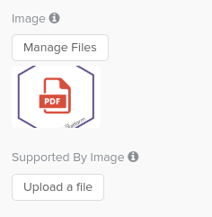

The Console is able to generate new services starting from a git project or from an existing docker image.

Services are viewable on Mia-Platform Marketplace, filterable on the basis of type and category.

Currently, all Marketplace components are associated to one of the following typologies:

* **plugins** are services for which users have no access to the code, however they will be able to download the docker image, configure it and use it within their projects.  
* **templates** and **examples** share the same characteristic of being archives from which a new repository is generated. The developer will have direct access to these new repositories (being created in their own Project scope) and can evolve at will. A template is a repository which, net of the development environment and framework setup, is empty; an example instead also implements some example features tailored to help the user better familiarize with the development environment.  
* **applications** are bundles of resources: microservices (Plugins, Examples and Templates), endpoint, CRUD collections and public variables that can be created and configured with a few clicks, thanks to a handy wizard in the Mia-Platform Console. Every installed [application](../applications/mia_applications) can be visualized in a dedicated card on Mia-Platform Console, from which you can access to its microservices with their repositories.  
* **proxy** is a specific configuration to invoke an API that is not part of the Project itself but may be exposed by an external provider or another Project. [Here](../../development_suite/api-console/api-design/proxies) it is possible to find more information about proxies.  

Marketplace component also have a label that identify their category (e.g. Data Stream, Data Visualization, Insurance, Healthcare ...).    
Who wants to contribute to our Marketplace can choose to associate a new component to one pre-existing category, or to propose a new one by contacting their Mia-Platform referent.  

We are going to show the guidelines on how to add a service to our Marketplace, whatever the type is: `plugin`, `template`, `example` or `application`.  

## How to add a new service to Mia-Platform marketplace 

Each marketplace service is identified by some data, which are stored on a MongoDB collection and it is possible to modify them through the Console CMS in the Marketplace section. Each service has a corresponding JSON document on the Marketplace collection. [Here](#example-of-service) an example of this document. 

:::info
If you don't have the right permission to access the CMS of the Console you should provide all the following information to your Mia-Platform referent and he will add the service to the Marketplace. 
:::

### Common to every services

Some of the fields in the example documents must be provided for each type of service and are listed below:

- **name** specifies the service name  
- The **service logo** and **powered-by logo** are the logo of the company that has produced the service, it is possible to add both using `image` and `supportedByImage` fields in the appropriate section:  
    
  The result will be as the following:  
  
- **description** is a brief description (ten to twenty words) of the service functionalities.  
- **categoryId** helps to group services by their purpose.
Note that the categoryId shown into the body of a service uniquely identifies the association of a specific category with a specific sub-category.
- **defaultEnvironmentVariables** lists, if any, the environment variables that will overwrite the default environment variables applied by DevOps Console. In particular, for each of them you need to provide:  
  - **name**: variable's name. (generally a key written in `UPPER_SNAKE_CASE`) 
  - **value**: default value of the variable
- **defaultConfigMaps** list the default ConfigMaps, if any, to be mounted inside the container. In particular, for each of them you need to provide:  
  - **name**: file's name
  - **content**: initial content of the file
  - **defaultSecrets** list the default Secrets, if any, to be mounted inside the container. In particular, for each of them you need to provide:  
    - **name**: file's name  
- **defaultResources** is used to configure the CPU and memory limitations of the service. You can overwrite the default limitations imposed by DevOps Console for **CPU** and **Memory**
:::warning
Please note that in the default resources configuration `min` corresponds to the `request` value in Kubernetes while `max` corresponds to the `limit` value in Kubernetes.  
Also, measurement units are required. Resources are expressed in terms of milliCPUs and MebiBytes for respectively CPU and Memory.
:::
- **defaultProbes** can be used to configure the readiness and liveness paths of the service. By modifying the map of the probes, you can overwrite the default paths applied by DevOps Console.  
- With **defaultLogParser** it is possible to select a log parser type, you have to select one defaultLogParser among these:
  * `mia-plain` to collecting logs but not parsing them
  * `mia-json` to parsing JSON logs based on the documented format
  * `mia-nginx` to parsing logs of Nginx that were created using templates and services of Mia-Platform (website and api-gateway)
- **defaultDocumentationPath** specifies the APIs documentation path. 
- **componentId** specifies a unique component id which can be used to identify the Marketplace from the services borned thorugh this marketplace component. Each service created through this marketplace component will have this identifier in the `sourceComponentId` property.

### Plugins

If the service you want to publish is a **plugin**:

- The service must be a **Docker image**.  
- The Docker image must be pushed on an accessible registry. If you use the **Mia-Platform registry**, your Mia-Platform referent will provide the credentials to do it. 

The Docker image must be specified in the `dockerImage` field into the service Marketplace document.

The service documentation of your plugin will be accessible from a specific link in the marketplace, you also need to provide the documentation URL of your plugin and this must be inserted in the `documentation` field:   

```json
{
  "documentation" : {
    "type" : "externalLink",
    "url" : "https://docs.my-plugin.com/docs/configuration"
  }
}
```

### Example and Templates

If the service you want to publish is either an **Example** or a **Template**, then:

- The service must be a remote **Git repository**.
- The URL to the tar.gz version of the git project must specified in the `archiveUrl` field, optionally you can specify either the `sha` or the `ref` as query parameters.  
if you don't have access to CMS this should be provided to your Mia-Platform referent in form of Git clone URL.
- The service should ensure a Continuous Integration (CI) to update the service image any time his code is modified, through the `pipelines` field you can set up the CI file by yourself or use instead Mia-Platform pipeline templates.  
In order to use the templates provided by Mia-Platform you can contact your referent to configure the pipeline templates within your Console installation. In fact, when creating your microservice, the Console also generates a CI file (e.g. `.gitlab-ci.yml`) along side the service files.
- The service must be well documented and the field `documentation` helps in it.  
In fact, during service creation, it is possible to access the service documentation by clicking on `View documentation` button, which will appear only if the `documentation` field has been filled correctly.  
Two properties must be specified inside `documentation`:  
  * `type`, currently only two types exist:
    * `markdown`: represents a markdown file (with `.md` file extension), for example a `README.md` file inside of a git repository.
    * `externalLink`: represents a link to an external website page, for example to Mia Platform documentation.
  * `url`, contains the url where the markdown file can be retrieved (if its type is `markdown`), or the link where the user should be redirected (if its of type `externalLink`).  

:::warning
By adding an **Example** or **Template** the code provided will be a base starting point to everyone that creates a service starting from this marketplace element, so this code will be accessible to all Console users.
:::  

Once the user creates a new microservice starting from your template or example, the Console will create a new Git repository in which it will copy the all template files.
The files of your template repository can contain some special strings that will be replaced by the Console at the creation of the new microservice:

- `mia_template_image_name_placeholder`: name of the docker image entered by the user;
- `%CUSTOM_PLUGIN_PROJECT_NAME%`: name (label) of the Console project;
- `mia_template_project_id_placeholder`: id of the Console project;
- `mia_template_service_name_placeholder`: service name chosen by the user;
- `%CUSTOM_PLUGIN_SERVICE_DESCRIPTION%`: description of the service chosen by the user;
- `%CUSTOM_PLUGIN_CREATOR_USERNAME%`: username of the user who created the service;
- `%CUSTOM_PLUGIN_PROJECT_GIT_PATH%`: full path of the repository of the Git provider;
- `%GIT_PROVIDER_PROJECT%`: name of the Git project entered by the user (e.g. GitHub repository or GitLab project).
- `%GIT_PROVIDER_GROUP%`: name of the group of project entered by the user (e.g. GitHub organization or GitLab group).
- `%GIT_PROVIDER_BASE_URL%`: URL base of the Git provider.
- `%NEXUS_HOSTNAME%`: docker registry hostname.

:::warning
The following strings still work but are deprecated: it is recommended not to use them as they will be deleted in future versions
:::

- `%CUSTOM_PLUGIN_IMAGE_NAME%`: name of the docker image entered by the user;
- `%CUSTOM_PLUGIN_PROJECT_ID%`: id of the Console project;
- `%CUSTOM_PLUGIN_PROJECT_NAMESPACE%`: id of the Console project;
- `%CUSTOM_PLUGIN_SERVICE_NAME%`: service name chosen by the user.

#### Don’t forget the best practices of the development! 

* **Test**: the component must have well tested code;
* **Logs**: each service should display the logs, in order to inform the user about what actions he is performing and if any errors have been found during their execution.

### Configure Console Links

A service created from marketplace can feature custom links to other console pages, managed by different microfrontend plugins; to configure them on newly created services setup new objects in the `links` property for each template or plugin you wish.

A link is an object shaped as follows:

- `label` _string_ (required): the label to be shown in the link button, it does not support internationalization and it is shown right next to a _View_ copy (e.g. with label set to **Resource** the resulting button will be **View Resource**);
- `targetSection` _string_ (required): the name of the registered microfrontend where the link should land (e.g.: `flow-manager`);
- `enableIf` _string_: the name of a feature toggle to be used to optionally display the link. 

### Notify about the existence of a new component into the Marketplace

From the CMS of the Console, user can define the proper Release Stage of the component that will appear visible to users, marked with one among the available labels of a Marketplace component lifecycle. For more information, give a look to our [lifecycle stages](../overview_marketplace#marketplace-component-lifecycle).

### Example of Service

<details><summary>Example configuration of a service</summary>
<p>

```json
{
  "name": "MongoDB Reader",
  "description": "Provide MongoDB aggregation pipelines as REST API.",
  "type": "plugin",
  "categoryId": "database",
  "supportedBy": "mia-platform",
  "image": [
    {
      "_id": "5db0105743875a0011618815",
      "name": "MongoDB Reader.png",
      "file": "image.png",
      "size": 1532,
      "location": "/path/to/your/image.png",
      "sync": 0,
      "trash": 0
    }
  ],
  "supportedByImage": [
    {
      "_id": "5db0106143875a0011618816",
      "name": "MiaPlatform.png",
      "file": "imageSupport.png",
      "size": 139694,
      "location": "/path/to/your/imageSupport.png",
      "sync": 0,
      "trash": 0
    }
  ],
  "repositoryUrl": "https://git.tools.mia-platform.eu/platform/core/mongodb-reader",
  "documentation": {
    "type": "markdown",
    "url": "https://raw.githubusercontent.com/mia-platform-marketplace/Node-Template/master/README.md"
  },
  "resources": {
    "services": {
      "mongodb-reader": {
        "type": "plugin",
        "name": "mongodb-reader",
        "description": "Provide MongoDB aggregation pipelines as REST API.",
        "repositoryUrl": "https://git.tools.mia-platform.eu/platform/core/mongodb-reader",
        "dockerImage": "nexus.mia-platform.eu/core/mongodb-reader:2.0.4",
        "defaultEnvironmentVariables": [
          {
            "name": "LOG_LEVEL",
            "value": "{{LOG_LEVEL}}"
          },
          {
            "name": "HTTP_PORT",
            "value": 8080
          }
          {
            ...
          }
        ],
        "defaultConfigMaps": [
          {
            "name": "config-map-1",
            "mountPath": "/home/node/app/config",
            "files": [
              {
                "name": "config.json",
                "content": "{\"version\":\"1.0.0\",\"config\":{}}"
              }
            ]
          }
        ],
        "defaultSecrets": [
          {
            "name": "my-secret",
            "mountPath": "/home/node/app/secret",
          }
        ],
        "defaultResources": {
          "cpuLimits": {
            "min": "10m",
            "max": "100m"
          },
          "memoryLimits": {
            "min": "100Mi",
            "max": "300Mi"
          }
        },
        "defaultProbes": {
          "liveness": {
            "path": "/-/healthz"
          },
          "readiness": {
            "path": "/-/ready"
          }
        },
        "defaultLogParser": "mia-json",
        "defaultDocumentationPath": "/documentation/json",
        "componentId": "myId",
        // if type is example or template archiveUrl is required, while pipelines is optional
        "archiveUrl": "https://git.tools.mia-platform.eu/api/v4/projects/238/repository/archive.tar.gz",
        "pipelines": {
          "gitlab-ci": {
            "path":"/path/to/your/pipeline/file/name.yml/raw"
          }
        }
      },
    // if type is application, more than one object can be inserted, allowing you to define more than one microservice configuration.
    }
  } 
}
```
</p>
</details>
