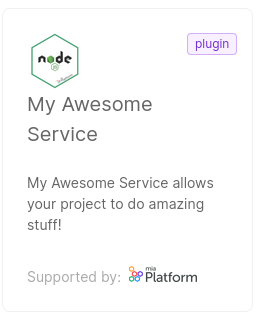

There are three main methods to create, modify and delete Marketplace items:

* (recommended) Use [`miactl`](/cli/miactl/10_overview.md), the Mia-Platform command line interface tool.
* Open an issue on Mia-Platform [Github community page](https://github.com/mia-platform/community).
* (deprecated) Use the [CMS](/business_suite/guide_cms.md).

## How to use `miactl` to manage the Marketplace


First of all, you need to setup `miactl`, as explained in the [dedicated doc](/cli/miactl/20_setup.md).

With the `miactl marketplace` subcommands, you can perform several actions, described here below.

### Create an item 

:::info

You need to have *Company Owner* or *Project Administrator* role at Company level to perform this action

:::

Imagine you are a software developer, working for the Company "Acme Corporation".

You have developed a new service (for example a NodeJS service) 
called "My Awesome Service", and you want it to be available in the Marketplace of your Company.

First of all, you need to create a JSON file as explained in [this guide](/marketplace/add_to_marketplace/contributing_overview.md#how-to-configure-a-new-component). 
Save the file in the current directory, for example as `myMarketplaceItem.json` file.

The file contents will probably look like this:
```json
{
  "description": "My Awesome Service allows your project to do amazing stuff!",
  "documentation": {
    "type": "externalLink",
    "url": "https://docs.example.org/AwesomeService"
  },
  "image": {
    "localPath": "./awesomeService.png"
  },
  "name": "My Awesome Service",
  "publishOnMiaDocumentation": true,
  "repositoryUrl": "https://git.example.org/awesome-service",
  "resources": {
    "services": {
      "api-portal": {
        "componentId": "api-portal",
        "containerPorts": [
          {
            "from": 80,
            "name": "http",
            "protocol": "TCP",
            "to": 8080
          }
        ],
        "defaultEnvironmentVariables": [
          {
            "name": "HTTP_PORT",
            "value": "8080",
            "valueType": "plain"
          }
        ],
        "defaultLogParser": "mia-nginx",
        "defaultProbes": {
          "liveness": {
            "path": "/index.html"
          },
          "readiness": {
            "path": "/index.html"
          }
        },
        "defaultResources": {
          "memoryLimits": {
            "max": "25Mi",
            "min": "5Mi"
          }
        },
        "description": "My Awesome Service allows your project to do amazing stuff!",
        "dockerImage": "docker.example.org/awesome-service:1.0",
        "name": "awesome-service",
        "repositoryUrl": "https://git.example.org/awesome-service",
        "type": "plugin"
      }
    }
  },
  "supportedBy": "Mia-Platform",
  "supportedByImage": {
    "localPath": "./acmeCorporation.png"
  },
  "tenantId": "team-rocket-test",
  "type": "plugin"
}
```

Notice that the `image` and `supportedByImage` objects are populated with local paths to images: make sure the images exists and that their path is correct.

To create the item on the Marketplace, simply run this command:

```sh
miactl marketplace apply -f myMarketplaceItem.json
```

This command will create the Marketplace item and upload the images along with it.

A message will confirm the operation, returning some information:
```
1 of 1 items have been successfully applied:

  ITEM ID                   NAME                 STATUS   

  65368hf0c91d871a87afbcbf  My Awesome Service   Inserted  
```

After the upload, the image keys will be replaced with the `imageUrl` and the `supportedByImageUrl`; to obtain the updated version of the item use the `get` command: 
```sh
miactl marketplace get 65368hf0c91d871a87afbcbf > myMarketplaceItem.json
```

:::tip

The local file fields won't be updated after the item creation.
Make sure to always download a new copy afterwards to keep your local copy up to date.

:::

From now on, the service "My Awesome Service" will be visible in the Marketplace section of the Console.



:::tip

Further information about the `apply` command can be found in the [dedicated doc](/cli/miactl/30_commands.md#apply).

:::

### Update an item

:::info

You need to have *Company Owner* or *Project Administrator* role at Company level to perform this action

:::

Imagine now that you noticed that the description of "My Awesome Service" is not correct and you want to change it.

First of all, download and save the latest version of the item configuration:

```sh
miactl marketplace get ITEM_ID > myMarketplaceItem.json
```
where `ITEM_ID` is an alphanumerical id of the Marketplace item. If you don't know the item id, use the `miactl marketplace list` command to list all the Marketplace Items. You can easily locate the one of interest by looking for its name.

:::tip

It is suggested to always download the Marketplace item just before updating it to make sure it works on the latest version.

:::

Edit your file following the steps in the [Modifying the Marketplace Item](#enabling-the-visibility-to-all-companies); 
once you are happy with the changes, save the file and apply it to the Marketplace:

```sh
miactl marketplace apply -f myMarketplaceItem.json
```

You will see the outcome of the operation in the command output:
```
1 of 1 items have been successfully applied:

  ITEM ID                   NAME                STATUS   

  65368hf0c91d871a87afbcbf  My Awesome Service  Updated  
```

The changes are now reflected to the Console.

### Delete an item

:::info

You need either the *Company Owner* or *Project Administrator* role at Company level to perform this action

:::

Imagine you notice that the service "My Awesome Service" is no longer useful for your Company and so you want to delete it.

You can delete an item from the Marketplace by means of the `delete` command:

```sh
miactl marketplace apply -f myMarketplaceItem.json
```

The item is then deleted from the Marketplace. 

The deletion is permanent, but the file on your machine will not be deleted.
If you want, you can recreate the item on the Marketplace again by applying the file.


## Open an issue on Mia-Platform Github community page

To contribute to the Mia-Platform Marketplace using this method, start by opening an issue [here](https://github.com/mia-platform/community/issues/new?assignees=%40mia-platform%2Fsig-marketplace&labels=marketplace&projects=&template=marketplace-contribution.yaml&title=%5BNew+marketplace+item%5D%3A+). This issue will outline the necessary information for your request.  
Subsequently, a Mia-Platform representative will take over the issue and contact you to collaboratively plan the addition of the component to the Mia-Platform Marketplace, following the guidelines described on [this documentation page](/marketplace/add_to_marketplace/contributing_overview.md).

### Using the CMS

To make a Marketplace item of your Company accessible to other Companies, you first need to create it in the CMS. Follow the instructions on [this page](/marketplace/add_to_marketplace/contributing_overview.md#how-to-configure-a-new-component) to do so,

If the item is already present, just edit it, following the [related section](#enabling-the-visibility-to-all-companies).


