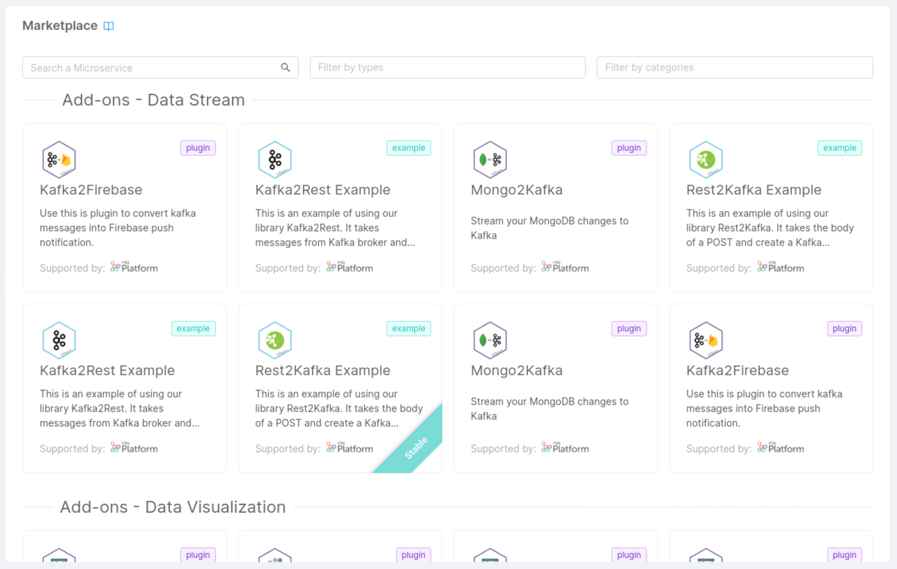
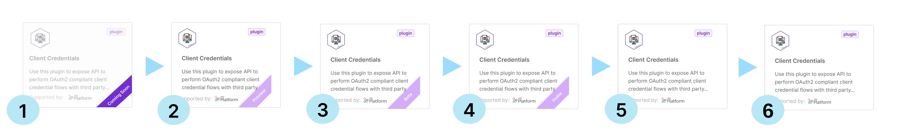

The Mia-Platform Marketplace contains several code resources that facilitate a faster and frictionless building of your architecture.

In the Marketplace, you will be able to choose from a set of **items**, also called **components**, to easily set up a single microservice or a bundle of resources **with predefined and tested functionalities**.

The Marketplace components types you can use include:

* **[Plugin](/plugins/mia-platform-plugins.md)**: a ready-to-use Microservice.  

* **[Template](/marketplace/templates/mia_templates.md)**: a base repository with some boilerplate code from which you can start to create a new Microservice.

* **[Example](/marketplace/examples/mia_examples.md)**: a specific use-case, a ready-to-use model to create a new Microservice. On the contrary of the Template, an Example already contains some ready to use business logic code, that you can later modify to match your exact needs.

* **[Application](/marketplace/applications/mia_applications.md)**: a bundle of resources including Plugins, Templates, and Examples, but also Endpoints, Collections, and Public Variables.

:::info

Templates and Example source code is open source software, and it is hosted on public Git repositories.
Visit the [Mia-Platform Marketplace GitHub page](https://github.com/mia-platform-marketplace) to browse their source code.

:::

### Explore the Marketplace

Mia-Platform Marketplace has two different entry points, both located in the *Design Area* of the Console.

To browse Marketplace Applications, head to the *Applications* section and click on the button *Create new Application*. 
For more information see [the related page](/marketplace/applications/mia_applications.md).

To browse Markeplace Plugins, Templates and Examples, go to the *Microservices* section and click on the button *Create a Microservice*, then click on the option **For Marketplace** of the dropdown menu.

In both cases, you will be able to filter components by **Category**, a property reflecting the purpose, the field, or the use-case a component is associated with (e.g. Data visualization).

The results of your search will always appear organized by Category.

## Marketplace components lifecycle

Each Marketplace component has a predetermined **development lifecycle**:

The following are the expected stages along a Marketplace component lifecycle:

* **Coming soon**: implementation has just started, these components cannot be used yet (users can still be informed about the existence of a new component)

* **Preview**: first usable release, components may include bugs and be subjected to undocumented breaking changes

* **Beta**: implementation is complete, these components won't be subjected to any undocumented breaking change but may still include bugs (hence they must be used with caution)

* **Stable**: implementation is stable (bugs free). Consequently, this stage represents the period before the component's official release and its documentation in the release note.
