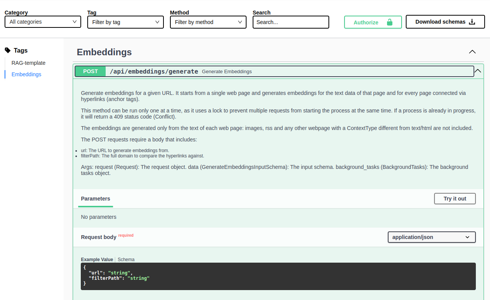

In this tutorial, you will learn how to create a fully functioning RAG application in a Mia-Platform project in just a few minutes.
We will cover the setup of the necessary services and the operations required to have a chatbot that is ready to assist and provide help on specific topics based on the documents provided.

To accomplish this, you will utilize the Marketplace application called **AI RAG Chat**. This application includes:

- the **RAG Chatbot API** service, which leverages the APIs provided by [OpenAI](https://openai.com/) or [Azure OpenAI](https://aka.ms/azure-openai) to receive answers to questions in natural language, and to create _embeddings_, encoded definitions coming from pieces of text extracted from a website.
- the **AI RAG Template Chat** service, a small frontend application written in React that provides a simple chat interface to communicate with the chatbot.
- the **API Gateway** service, that will be used to expose the endpoints to reach the frontend application and communicate with the service.
- several endpoints to expose the necessary APIs from the services to use the application.

:::info
The _RAG Chatbot API_ is a ready-to-use Plugin maintained and supported by Mia-Platform that includes all the necessary logic to build a fully functional RAG application.

However, if you need to deep-dive into the code by yourself, to create a more suitable and customized application, you can use the **AI RAG Chat Template** application instead.
The **AI RAG Chat Template** application includes all the features above, but creates a clone of the [_AI RAG Template_](https://github.com/mia-platform/ai-rag-template) repository in your provider to allow you to customize it accordingly to your needs.
:::

Furthermore, you will install the **API Documentation Aggregator** application and the **API Portal** from the templates.
These will enable us to easily send HTTP requests to the _RAG Chatbot API_ service to store additional documents in a database in a way that can be used by the service to answer questions.

The prerequisites for this tutorial are as follows:

- A connection string to a [MongoDB Atlas instance](https://www.mongodb.com/products/platform/atlas-database) (unfortunately, MongoDB on-premise installations do not currently support the [_Vector Search Index_](https://www.mongodb.com/docs/atlas/atlas-vector-search/vector-search-overview/), required for this process).
- One of the following:
  - if you want to use _OpenAI_ as a provider, an API key to communicate with [OpenAI](https://openai.com/)
  - if you want to use _Azure_ as a provider, a functioning deployment of both an _Embedding model_ and a _Large Language Model_ (you can find more information on how to do this in the related [documentation](https://learn.microsoft.com/en-us/azure/ai-services/openai/how-to/create-resource?pivots=cli)).

## How it works

RAG stands for Retrieval-Augmented Generation, and it is a process to enhance the knowledge of a LLM (large language model), which is an algorithm capable of generating text in natural language.
The goal of RAG is to create applications that can communicate with users and answer questions related to specific topics.

To understand how RAG works, let's consider an example. Imagine you want to create a chatbot that can answer questions about the internal documentation of the product your company sells.
Imagine this documentation is hosted in a website, just like this documentation.
It can be extensive, consisting of multiple files. To handle this large amount of text, it can be divided into smaller pieces called _chunks_.
These chunks can be split in various ways, such as by paragraph, by page, or by the semantic meaning of the text. Each chunk can then be transformed into a single document and stored in a database.

This will allow to compare the question asked by a user with the text saved in the database.
In order to efficiently retrieve documents from the database, it is need to find a reliable method to compare the meaning of the question with the meaning of the chunks to be used.
To achieve this, [_embeddings_](https://platform.openai.com/docs/guides/embeddings) can be created: the text is given to a mathematical model that will generate a multidimensional vector composed of hundreds of values between 0 and 1, effectively representing the meaning of the text.
Then, these embeddings will saved in the database along with the chunk of text used to create them.

By doing this, whenever our chatbot receives a question, it is possible to:

- Generate embeddings from the question.
- Search the database for documents with embeddings that are similar in meaning to the embeddings of the question.
- Retrieve the matched documents and use their text to ensure that the chatbot provides an appropriate answer.

OpenAI has several [embedding models](https://platform.openai.com/docs/guides/embeddings/embedding-models) (that can be also deployed using [Azure AI Foundry](https://oai.azure.com/)), and MongoDB proposes the [Vector Search Index](https://www.mongodb.com/docs/atlas/atlas-vector-search/vector-search-overview/) to efficiently search in a database for documents where embeddings are similar in meaning to our question.

Since embeddings are stored in a database, it is not required to generate them every time the service starts or a question is asked.
However they should be replaced with new embeddings when the documents (e.g. our the internal documentation of our product) receive important updates. There are several methods to generate these embeddings.

If the documentation is available on a website, the most common and straightforward approach is to perform [web scraping](https://en.wikipedia.org/wiki/Web_scraping).
This involves downloading all the pages of the website, recursively fetch all the other pages from the same website connected by hyperlinks, then removing any unnecessary information such as HTML tags, headers, footers, and styles, and generating embeddings from the remaining text.
The **RAG Chatbot API** is a perfect example of a tool that can perform all these operations.
It provides automatic connections to the Azure/OpenAI servers and the MongoDB database, allowing for seamless handling of Vector Indexes.
Additionally, it can generate embeddings by simply providing a URL. With this template, creating a RAG application can be done in just a few minutes.

Another approach to generate embeddings is to start from internal documents, that you might have in form of a text file, a PDF file or multiple files in an zip archive.
The **RAG Chatbot API** includes another endpoint where a file can be uploaded, and the embeddings will be generated automatically from the content of the file.

## 1. Install the required applications

From a new project, you will create two applications: the **API Documentation Aggregator** and the **AI RAG Chat**.

To begin, navigate to the design section and click on _Applications_ in the sidebar. Then, select _Create new Application_.

First, search for and select the **API Documentation Aggregator**. This will install the [_API Gateway_](/runtime_suite/api-gateway/10_overview.md) and the [_Swagger Aggregator_](/runtime_suite/swagger-aggregator/10_overview.md), along with several endpoints to expose the Swagger UI for viewing the APIs exposed by the configured services and retrieving the OpenAPI compliant schema.

:::note
The [API Documentation Aggregator](/runtime_suite_applications/api-documentation-aggregator/10_overview.md) is not required for the chatbot to function, but it is recommended for using the _RAG Chatbot API_ APIs to generate the embeddings.
You can also refer to the instructions [in this tutorial](/console/tutorials/configure-marketplace-components/api-portal.mdx).
:::

Next, proceed to set up the application. When searching in the marketplace, search for **AI RAG Chat**. You can find two different results:

- the _AI RAG Chat_, which is the application where the _RAG Chatbot API_ is provided in form of a [Plugin](/plugins/mia-platform-plugins.md), maintained and supported by the Mia-Platform team
- the _AI RAG Chat Template_, which is the application where the _RAG Chatbot API_ is provided in form of a [Template](/marketplace/templates/mia_templates.md) that will create a repository in your Git provider; while this template represents all the features of the plugin and it is fully functional, you can modify it by adding or removing features according to your needs


It will prompt you to create the _API Gateway_ (you can use the previously created one with the available listener), the _RAG Chatbot API_, and the _AI RAG Template Chat_, along with several endpoints to expose the service APIs for sending questions and generating embeddings.

Finally, create the [API Portal](/runtime_suite/api-portal/10_overview.md).
If it is not already included in the project, navigate to the _Microservices_ section, and then select _Create new microservice_.
Choose _From Marketplace_, and on the following page, search for and create a new _API Portal_.

Once you have created these services, you can safely save the configuration.

## 2. Configure the RAG Chatbot API service

The next step is to configure the _RAG Chatbot API_ service.
From the design section, navigate to the _Microservices_ page and select the service (the default name is _rag-chatbot-api_, but you may have changed its name).
From there, click on the _Environment Variables_ tab where you need to modify the following values:

- `MONGODB_CLUSTER_URI`: This is the full connection string to MongoDB (refer to the [official MongoDB documentation](https://www.mongodb.com/docs/guides/atlas/connection-string/#procedure) to find it).
- `EMBEDDINGS_API_KEY`: An API key to use when communicating with the provider for generating embeddings.
- `LLM_API_KEY`: An API key to use when communicating with the provider for generating responses.

:::note
`EMBEDDINGS_API_KEY` and `LLM_API_KEY` will have the same value unless you use OpenAI for one model and Azure for another.

Remember that you can generate API keys from [the OpenAI Developer Dashboard](https://platform.openai.com/api-keys) or the [Azure Portal](https://platform.openai.com/api-keys).
:::

:::warning
To ensure this information remains secure, it is recommended to include it as [project variables](/console/project-configuration/manage-environment-variables/index.md).
:::

After updating the environment variables of the _RAG Chatbot API_ service, it is time to update the config map: click on the _ConfigMaps & Secrets_ tab and you will be redirected to the Config Map configuration page.

The _RAG Chatbot API_ is created with a precompiled config map that includes all the required keys, but the values need to be included.

Here is an example of what the configuration should look like:

```json
{
  "llm": {
    "type": "openai",
    "name": "gpt-4o-mini"
  },
  "embeddings": {
    "type": "openai",
    "name": "text-embedding-3-small"
  },
  "vectorStore": {
    "dbName": "rag-database",
    "collectionName": "rag-collection",
    "indexName": "vector_index",
    "relevanceScoreFn": "cosine",
    "embeddingKey": "embedding",
    "textKey": "text",
    "maxDocumentsToRetrieve": 3
  }
}
```

More specifically, here is a detailed list of the meaning of each property:

- the `llm.type` key is the LLM provider, could be `azure` or `openai` (default is `openai`)
- the `llm.name` key is the LLM model among those available from [OpenAI](https://platform.openai.com/docs/models), suggested are `gpt-4o` and `gpt-4o-mini`
- the `embeddings.type` key is the Embedding provider, could be `azure` or `openai` (default is `openai`)
- the `embeddings.name` key is the Embedding model used to generate embeddings, among those available from [OpenAI](https://platform.openai.com/docs/models/embeddings), the suggested is `text-embedding-3-small`
- the `vectorStore.dbName` is the name of the database where the embeddings will be saved
- the `vectorStore.collectionName` is the name of the collection where the embeddings will be saved
- the `vectorStore.indexName` is the name of the [MongoDB Search Vector Index](https://www.mongodb.com/docs/atlas/atlas-vector-search/vector-search-overview/), with `vector_index` as suggested name; this is a particular index that the service will automatically create or update at the startup
- the `vectorStore.relevanceScoreFn` is the name of the _similarity search function_ used to retrieve the embedding documents; MongoDB includes three different available functions: `cosine` (suggested), `euclidean` and `dotProduct`
- the `vectorStore.embeddingKey` is the name of the field where the embeddings of a single document are saved, in the shape of a multidimensional array; we suggest using the default value `embedding`
- the `vectorStore.textKey` is the name of the field that contains the original text used to be transformed into embeddings, and that will be used to help the chatbot return the answer; we suggest using the default value `text`
- the `vectorStore.maxDocumentsToRetrieve` is the maximum number of documents that will be extracted and used to help the chatbot return the answer; the default value is `3`, but it is usually suggested to use a value between `2` and `5`, depending on how big the collection of the embeddings is (if the content is small then `2` would be more than enough; on the other hand if there is a lot of content is better to set this value to `5`)

After having configured the config map, you can save the configuration and move to the deploy.

:::info

Here is an example of a valid configuration where both the embedding model used and the large language model used comes from Azure OpenAI:

```json
{
  "llm": {
    "type": "azure",
    "name": "gpt-3.5-turbo",
    "deploymentName": "dep-gpt35-turbo",
    "url": "https://my-endpoint.openai.azure.com/",
    "apiVersion": "2024-05-01-preview"
  },
  "embeddings": {
    "type": "azure",
    "name": "text-embeddings-3-small",
    "deploymentName": "dep-text-embeddings-3-small",
    "url": "https://my-endpoint.openai.azure.com/",
    "apiVersion": "2024-05-01-preview"
  },
  "vectorStore": {
    ...
  }
}
```

Additionally to what we have seen before, the configuration must also include:

- if the `llm.type` is `azure`, then it is also required to add:
  - the `llm.deploymentName` key, which is the name of the deployment of the LLM
  - the `llm.url` key, which is the endpoint of the LLM
  - the `llm.apiVersion` key, which is the API version of the LLM
- if the `embeddings.type` is `azure`, then it is also required to add:
  - the `embeddings.deploymentName` key, which is the name of the deployment of the Embedding
  - the `embeddings.url` key, which is the endpoint of the Embedding
  - the `embeddings.apiVersion` key, which is the API version of the Embedding

The content of `vectorStore` is the same as the one described in the previous section.
:::

## 3. Deploy the configuration and generate embeddings

From the _deploy_ section, you can deploy the new configuration. After verifying that the services are up, we can check if the application is running by accessing the chatbot frontend.
The frontend is accessible through the automatically generated endpoint `/` (e.g., if the project is hosted at `https://my-project.console.my-company.com`, the frontend will be accessible at the same URL).


The frontend will display a page with an input field where you can communicate with the chatbot.
However, at this point, there are no embeddings, so specific questions may not give us the expected response.

To see the list of all the APIs exposed by the configured services, you can go to the swagger UI of the _API Portal_. It can be accessed at the endpoint `/documentations/api-portal`.
In the list of APIs, you will find three APIs with the tag _Embeddings_:

- `POST api/embeddings/generate` to generate embeddings from a webpage
- `POST api/embeddings/generateFromFile` to generate embeddings from a file
- `GET api/embeddings/status` to check the status of the generation process

The `POST api/embeddings/generate` API allows us to generate embeddings starting from a webpage.
The service will download the page, extract all the text, and generate embeddings from it.
It will also search for links on the page and recursively generate embeddings from the linked pages that have the same domain and follow the specified filter path.

The embeddings generation, either from website or from file, can take a while.
Because of this, it is an asynchronous task, meaning that the API response is returned immediately, but the generation process continues in the background.
To check the status of the generation process, you can use the `GET api/embeddings/status` API:

- If the response is `{"status": "running"}`, it means the process is still ongoing.
- If the response is `{"status": "idle"}`, it means there are no active processes at the moment (indicating that the previous process has finished).

The process may take a few seconds to several minutes, depending on how much content from the webpages or the files need to be downloaded and scraped.
It is a good idea to [check the service logs of the pod](/development_suite/monitoring/resources/pods.md) to ensure that everything is progressing smoothly.

:::info
You can run only one generation process at time. In case you try to call again the `/api/embeddings/generate` API while a process is still ongoing, you will receive a `409 Conflict`.
:::

With this information, you have all the knowledge needed to generate the embeddings.

### Generate embeddings from a webpage

From the _API Portal_ you can make a request to the `api/embeddings/generate` API by expanding the corresponding card and clicking on "Try it out".



In the request body, the following information are needed:

- `url` (mandatory): The starting page from which you want to generate embeddings.
- `filterPath` (optional): A more specific path that will be used as a filter when finding new pages to download and analyze.

Let's try with part of the Mia-Platform documentation:

```json
{
    "url": "https://docs.mia-platform.eu/docs/fast_data/what_is_fast_data",
    "filterPath": "https://docs.mia-platform.eu/docs/fast_data"
}
```

:::info
You can execute the same request via _curl_ from your terminal with the following command:

```bash
curl -X POST "https://my-project.console.my-company.com/api/embeddings/generate" \
-H 'accept: application/json' \
-H 'Content-Type: application/json' \
-d "{ \"url\": \"https://docs.mia-platform.eu/docs/fast_data/what_is_fast_data\", \"filterPath\": \"https://docs.mia-platform.eu/docs/fast_data\" }"
```

:::

A click on the `Execute` button and receive an immediate response indicating that the embedding generation has started.
At this point, it is simply needed to wait for the process to complete. To verify if the process is finished, you can send a request to the `/api/embeddings/status` API.
If the response body includes `{ "status": "running" }`, it means that the webpages are still being scraped and embeddings are still being generated.
You can call the API multiple times, and when the response includes `{ "status": "idle" }`, then the process is concluded.

### Generate embeddings from a file

If you need to generate embeddings from a file, you can use to the `api/embeddings/generateFromFile` API, accessible from the _API Portal_.
By expanding the corresponding card and clicking on "Try it out", you will see that this time it is required to upload a file.


By clicking on _Choose file_ you can select a file to upload.
Supported files are the following:

- PDF files (`.pdf`)
- Text files (`.txt`)
- Markdown files (`.md`)
- Archive files (`.zip`, `.tar`, `.gz`) that includes only PDF, text and markdown files

:::info
If you upload an archive file, please ensure that files contains only the required files in the root directory: other files or folders will be ignored.
:::

After a click to the `Execute` button, the service will start the embedding generation process.
As explained above, you can check the status of the process by calling the `/api/embeddings/status` API until the response body includes `{ "status": "idle" }`, meaning the process is concluded.

## 4. Enjoy

Once the process is over, there's no need to re-deploy or restart any service: after a few moments, the MongoDB Vector Index will be updated and the frontend application will be ready to give us meaningful answers based on the generated embeddings.


## Troubleshooting

### I have generated the embeddings, but the chatbot still does not answer correctly to my questions

Check the logs of the _RAG Chatbot API_.
At the very beginning, it should say whether the MongoDB Vector Search Index has been created/updated or if it failed for any reason (e.g. database temporarily not accessible or the collection does not exists yet).
In any case the service will start.

You may need to restart the service pod or manually create (or update) the index.

### The frontend is not visible

Make sure you have correctly configured the ingress route, for example, with Traefik (you can refer to the [documentation](/infrastructure/paas/tools/traefik.md) for more information on how to configure it).
