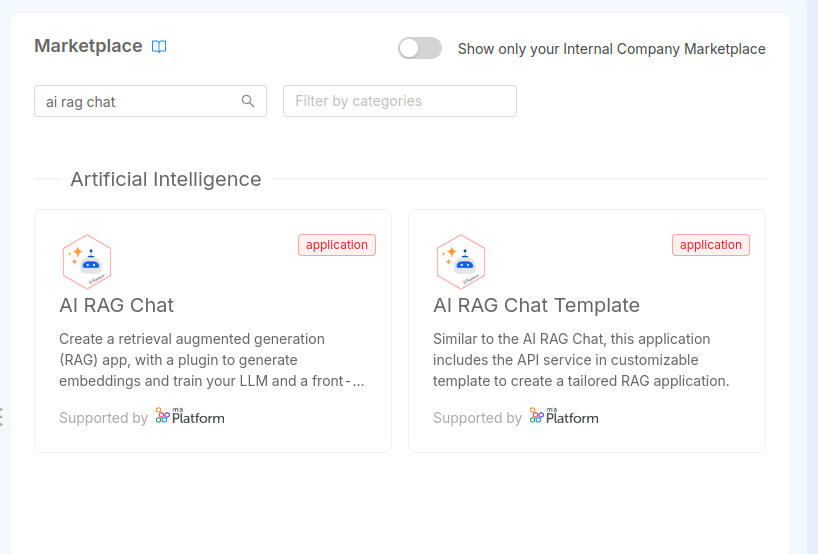
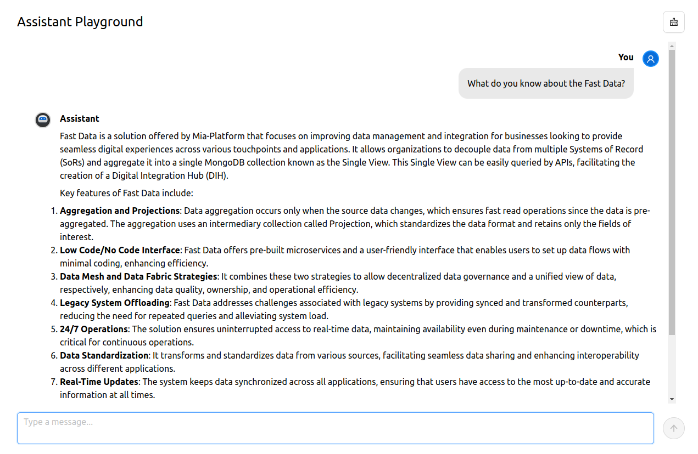

In this tutorial, we will learn how to create a fully functioning RAG application in a Mia-Platform project in just a few minutes. We will cover the setup of the necessary services and the generation of embeddings from any webpage. This will allow us to easily set up a chatbot that is ready to assist and provide help on the subject.

To accomplish this, we will utilize the Marketplace application called **AI RAG Chat**. This application includes the **AI RAG Template**, which leverages the APIs provided by [OpenAI](https://openai.com/) to receive answers to questions in natural language, and to create _embeddings_ from pieces of text extracted from a website. Additionally, we will use the **AI RAG Template Chat**, a small frontend application written in React that provides a quick chat system to communicate with the service.

Furthermore, we will install the **API Documentation Aggregator** application and the **API Portal** from the templates. These will enable us to easily send HTTP requests to the AI RAG Template service in order to generate the embeddings.

The prerequisites for this tutorial are as follows:

- A connection string to a [MongoDB Atlas instance](https://www.mongodb.com/products/platform/atlas-database) (unfortunately, MongoDB on-premise installations do not currently support the retrieval of embeddings from documents).
- An API key to communicate with [OpenAI](https://openai.com/).

## How it works

RAG stands for Retrieval-Augmented Generation, and it is a process to enhance the knowledge of a LLM (large language model), which is an algorithm capable of generating text in natural language. The goal of RAG is to create applications that can communicate with users and answer questions related to specific topics.

To understand how RAG works, let's consider an example. Imagine you want to create a chatbot that can answer questions about the internal documentation of the product your company sells. This documentation can be extensive, consisting of multiple files, just like this documentation. To handle this large amount of text, it can be divided into smaller pieces called "chunks". These chunks can be split in various ways, such as by paragraph, by page, or by the semantic meaning of the text. Each chunk can then be transformed into a single document and stored in a database.

This will allow us to compare the question asked by a user to the text saved in the database. In order to efficiently retrieve documents from the database, we need to find a reliable method to compare the meaning of the question with the meaning of the chunks we want to use. To achieve this, we can create embeddings of our chunks. The text is given to a mathematical model that will generate a multidimensional vector composed of millions of values between 0 and 1, effectively representing the meaning of the text.

By doing this, whenever our chatbot receives a question, we can:

- Generate embeddings of our question.
- Search the database for documents with embeddings that are similar in meaning to the embeddings of the question.
- Retrieve the matched documents and use their text to ensure that the chatbot provides an appropriate answer.

OpenAI has several [embedding models](https://platform.openai.com/docs/guides/embeddings/embedding-models), and MongoDB proposes the [Vector Search Index](https://www.mongodb.com/docs/atlas/atlas-vector-search/vector-search-overview/) to efficiently search in a database for documents where embeddings are similar in meaning to our question.
The embeddings from the internal documentation can be created only once, or whenever there is an important update. There are several methods to execute this process. If the documentation is available on a website, the most common and straightforward approach is to perform [web scraping](https://en.wikipedia.org/wiki/Web_scraping). This involves downloading all the pages of the website, removing any unnecessary information such as HTML tags, headers, footers, and styles, and generating embeddings from the remaining text.

The **AI RAG Template** is a perfect example of a tool that can perform all these operations. It provides automatic connections to the OpenAI servers and the MongoDB database, allowing for seamless handling of Vector Indexes. Additionally, it can generate embeddings by simply providing a URL. With this template, creating a RAG application can be done in just a few minutes.

## 1. Install the required applications

We start a new project by creating two applications: the **API Documentation Aggregator** and the **AI RAG Chat**.

To begin, navigate to the design section and click on _Applications_ in the sidebar. Then, select _Create new Application_.

First, search for and select the **API Documentation Aggregator**. This will install the [_API Gateway_](/runtime_suite/api-gateway/10_overview.md) and the [_Swagger Aggregator_](/runtime_suite/swagger-aggregator/10_overview.md), along with several endpoints to expose the Swagger UI for viewing the APIs exposed by the configured services and retrieving the OpenAPI compliant schema.

:::note
The [API Documentation Aggregator](/runtime_suite_applications/api-documentation-aggregator/10_overview.md) is not required for the chatbot to function, but it is recommended for using the _AI RAG Template_ APIs to generate the embeddings. You can also refer to the instructions [in this tutorial](/console/tutorials/configure-marketplace-components/api-portal.mdx).
:::

Next, proceed to set up the **AI RAG Chat**. It will prompt you to create the _API Gateway_ (using the existing one with the available listener), the _AI RAG Template_, and the _AI RAG Template Chat_, along with several endpoints to expose the service APIs for sending questions and generating embeddings.



Finally, we add the [API Portal](/runtime_suite/api-portal/10_overview.md). If it is not already included in the project, click on _Microservices_ menu in the sidebar, and then select _Create new microservice_. Choose _From Marketplace_, and on the following page, search for and create a new _API Portal_.

Once you have created these services, you can safely save the configuration.

## 2. Configure the AI Rag Template service

The next step is to configure the _AI RAG Template_ service. From the design section, navigate to the _Microservices_ page and select the service (the default name is _ai-rag-template_, but you may have changed its name). From there, click on the _Environment Variables_ tab where you need to modify the following values:

- `MONGODB_CLUSTER_URI`: This is the full connection string to MongoDB.
- `EMBEDDING_API_KEY`: An API key to use when communicating with OpenAI for generating services. It should be the same as the OpenAI API key.
- `LLM_API_KEY`: An API key to use when communicating with OpenAI for generating services. It should also be the same as the OpenAI API key.

:::note
`EMBEDDING_API_KEY` and `LLM_API_KEY` will have the same value: they are the API key that you can generate from [OpenAI](https://platform.openai.com).
:::

:::warning
Since this is information that you don't want to have visible to anyone, it is preferable to include this information as [project variables](/console/project-configuration/manage-environment-variables/index.md).
:::

After updating the environment variables of the service, it is time to update the config map: click on the _ConfigMaps & Secrets_ tab and you will be redirected to the Config Map configuration page.

The _AI RAG Template_ is created with a precompiled config map that includes all the required keys, but the values need to be included.

To be more specific, the configuration should be as follows:

```json
{
  "llm": {
    "name": "gpt-4o-mini"
  },
  "embeddings": {
    "name": "text-embedding-3-small"
  },
  "vectorStore": {
    "dbName": "rag-database",
    "collectionName": "rag-collection",
    "indexName": "vector_index",
    "relevanceScoreFn": "cosine",
    "embeddingKey": "embedding",
    "textKey": "text",
    "maxDocumentsToRetrieve": 3
  }
}
```

To be more specific:

- the `llm.name` key is the LLM model among those available from [OpenAI](https://platform.openai.com/docs/models), suggested are `gpt-4o` and `gpt-4o-mini`
- the `embeddings.name` key is the Embedding model used to generate embeddings, among those available from [OpenAI](https://platform.openai.com/docs/models/embeddings), the suggested is `text-embedding-3-small`
- the `vectorStore.dbName` is the name of the database where the embeddings will be saved
- the `vectorStore.collectionName` is the name of the collection where the embeddings will be saved
- the `vectorStore.indexName` is the name of the [MongoDB Search Vector Index](https://www.mongodb.com/docs/atlas/atlas-vector-search/vector-search-overview/), with `vector_index` as suggested name; this is a particular index that the service will automatically create or update at the startup
- the `vectorStore.relevanceScoreFn` is the name of the _similarity search function_ used to retrieve the embedding documents; MongoDB includes three different available functions: `cosine` (suggested), `euclidean` and `dotProduct`
- the `vectorStore.embeddingKey` is the name of the field where to save the embedding of a single document, in the shape of a multidimensional array; we suggest using the default value `embedding`
- the `vectorStore.textKey` is the name of the field that contains the original text used to be transformed into embeddings, and that will be used to help the chatbot return the answer; we suggest using the default value `text`
- the `vectorStore.maxDocumentsToRetrieve` is the maximum number of documents that will be extracted and used to help the chatbot return the answer; the default value is `3`, but it is usually suggested to use a value between `2` and `5`, depending on how big the collection of the embeddings is

After having configured the config map, we can save the configuration and move to the deploy.

## 3. Deploy the configuration and generate embeddings

From the _deploy_ section, we can deploy the new configuration. After verifying that the services are up, we can check if the application is running by accessing the chatbot frontend. The frontend is accessible through the automatically generated endpoint `/` (e.g., if the project is hosted at `https://my-project.console.my-company.com`, the frontend will be accessible at the same URL).


The frontend will display a page with an input field where we can communicate with the chatbot. However, at this point, we don't have any embeddings, so specific questions may not give us the expected response.

To see the list of all the APIs exposed by the configured services, we can go to the swagger UI of the _API Portal_. It can be accessed at the endpoint `/documentations/api-portal`. In the list of APIs, we can find two APIs with the tag _Embeddings_: `POST api/embeddings/generate` and `GET api/embeddings/status`.

The `POST api/embeddings/generate` API allows us to generate embeddings starting from a webpage. The service will download the page, extract all the text, and generate embeddings from it. It will also search for links on the page and recursively generate embeddings from the linked pages that have the same domain and follow the specified filter path.

Generating embeddings is an asynchronous task, meaning that the response is returned immediately, but the generation process continues in the background. To check the status of the generation process, we can use the `GET api/embeddings/status` API:

- If the response is `{"status": "running"}`, it means the process is still ongoing.
- If the response is `{"status": "idle"}`, it means there are no active processes at the moment (indicating that the previous process has finished).

With this information, we can start generating our embeddings. We can make a request to the `api/embeddings/generate` API by expanding the corresponding card and clicking on "Try it out".


In the request body, we need to provide the following information:

- `url` (mandatory): The starting page from which we want to generate embeddings.
- `filterPath` (optional): A more specific path that will be used as a filter when finding new pages to download and analyze.

Let's try with part of the Mia-Platform documentation:

```json
{
    "url": "https://docs.mia-platform.eu/docs/fast_data/what_is_fast_data",
    "filterPath": "https://docs.mia-platform.eu/docs/fast-data"
}
```

We click on the `Execute` button and receive an immediate response indicating that the embedding generation has started. At this point, we simply need to wait for the process to complete by sending requests to the `/api/embeddings/status` API.

:::info
The process may take a few seconds to several minutes, depending on the number of webpages that need to be downloaded and scraped.

It is a good idea to check the service logs to ensure that everything is progressing smoothly.
:::

## 4. Enjoy

Once the process is over, there's no need to re-deploy or restart any service: after a few moments, the MongoDB Vector Index will be updated and the frontend application is ready to give us meaningful answers based on the embeddings generated.



## Troubleshooting

### I have generated the embeddings, but the chatbot still does not answer correctly to my questions.

Check the logs of the _AI RAG Template_. At the very beginning, it should say whether the MongoDB Vector Search Index has been created/updated or if it failed for any reason (e.g. database temporarily not accessible or the collection does not exists yet). In any case the service will start.

You may need to restart the pod of the service manually create/update the index.

### The frontend is not visible

Make sure you have correctly configured the ingress route, for example, with Traefik (you can refer to the [documentation](/infrastructure/paas/tools/traefik.md) for more information on how to configure it).
