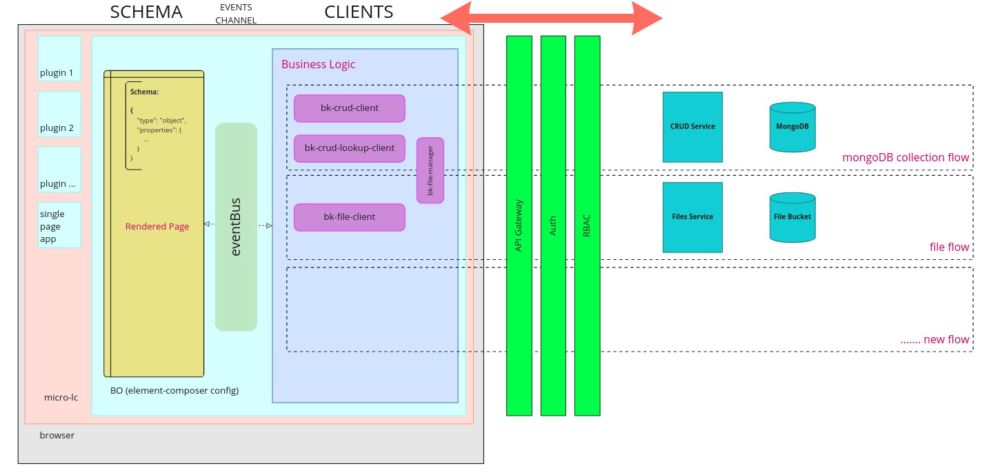

<!--
WARNING: this file was automatically generated by Mia-Platform Doc Aggregator.
DO NOT MODIFY IT BY HAND.
Instead, modify the source file and run the aggregator to regenerate this file.
-->

[bootstrap]: ./30_page_layout.md#bootstrap-aka-initial-state-injection

[add-filter-button]: ./60_components/10_add_filter_button.md
[add-new-button]: ./60_components/20_add_new_button.md
[antd-theme-manager]: ./60_components/30_antd_theme_manager.md
[atlas-dashboard]: ./60_components/40_atlas_dashboard.md
[auto-refresh]: ./60_components/50_auto_refresh.md
[breadcrumbs]: ./60_components/60_breadcrumbs.md
[bulk-actions-button]: ./60_components/70_bulk_actions_button.md
[bulk-delete-button]: ./60_components/80_bulk_delete_button.md
[button]: ./60_components/90_button.md
[crud-client]: ./60_components/100_crud_client.md
[crud-export]: ./60_components/110_crud_export.md
[crud-export-client]: ./60_components/120_crud_export_client.md
[calendar]: ./60_components/130_calendar.md
[card]: ./60_components/140_card.md
[chip]: ./60_components/150_chip.md
[confirmation-modal]: ./60_components/160_confirmation_modal.md
[crud-lookup-client]: ./60_components/170_crud_lookup_client.md
[dropdown-button]: ./60_components/180_dropdown_button.md
[dynamic-form-card]: ./60_components/190_dynamic_form_card.md
[dynamic-form-drawer]: ./60_components/200_dynamic_form_drawer.md
[dynamic-form-modal]: ./60_components/210_dynamic_form_modal.md
[dynamic-title]: ./60_components/220_dynamic_title.md
[expandable-filters]: ./60_components/230_expandable_filters.md
[export-modal]: ./60_components/240_export_modal.md
[file-manager]: ./60_components/250_file_manager.md
[file-picker-drawer]: ./60_components/260_file_picker_drawer.md
[file-picker-modal]: ./60_components/270_file_picker_modal.md
[file-service-client]: ./60_components/280_file_service_client.md
[filter-drawer]: ./60_components/290_filter_drawer.md
[filters-manager]: ./60_components/300_filters_manager.md
[footer-&-item-state]: ./60_components/310_footer_&_item_state.md
[form-card]: ./60_components/320_form_card.md
[form-drawer]: ./60_components/330_form_drawer.md
[form-modal]: ./60_components/340_form_modal.md
[form-wizard]: ./60_components/350_form_wizard.md
[gallery]: ./60_components/360_gallery.md
[import-modal]: ./60_components/370_import_modal.md
[layout]: ./60_components/380_layout.md
[layout-container]: ./60_components/390_layout_container.md
[layout-swap]: ./60_components/400_layout_swap.md
[list]: ./60_components/410_list.md
[loading-animation]: ./60_components/420_loading_animation.md
[navigation-back-arrow]: ./60_components/430_navigation_back_arrow.md
[notification-center]: ./60_components/440_notification_center.md
[notifications]: ./60_components/450_notifications.md
[pagination]: ./60_components/460_pagination.md
[pdf-viewer]: ./60_components/470_pdf_viewer.md
[refresh-button]: ./60_components/480_refresh_button.md
[search-bar]: ./60_components/490_search_bar.md
[state-adapter]: ./60_components/500_state_adapter.md
[table]: ./60_components/510_table.md
[tabs]: ./60_components/520_tabs.md
[title]: ./60_components/530_title.md
[url-parameters-adapter]: ./60_components/540_url_parameters_adapter.md

[events]: ./70_events.md
[push-state]: ./70_events.md#nested-navigation-state---push
[add-new]: ./70_events.md#add-new
[create-data-with-file]: ./70_events.md#create-data-with-file
[create-data]: ./70_events.md#create-data


Back-Kit library provides a full set of [W3C Web Components](https://www.w3.org/TR/components-intro/).

```html
<div>
  <crud-client base-path="my-collection"></crud-client>
  <bk-table></bk-table>
</div>
```

Packed within a configuration file, a set of components creates a **layout** that can be plugged in a rendering engine, for instance a `composition` feature like the one provided by Mia-Platform Microfrontend Composer.

At runtime, when a customized configuration is injected, components are enriched with properties. Properties may be component-specific or related to the `composer`. Indeed, components can receive properties concerning an **authenticated user** and/or a **communication channel**. Such channel is paramount to realize an event-driven communication amongst web components which in return provides isolation for each of them.

A Back-Kit component **should do one thing**, hence a web page header composed by a search bar, buttons and, typographies will contain the same amount of components, linked via the `eventBus`.

Back-Kit prefers to provide **highly scoped components** with fewer configuration degrees of freedom instead of large configuration options that can easily go wrong due to typos that might become really hard to investigate and debug. Thus, Back-Kit provides refresh-buttons, add-new-buttons, *specific-task*-button, in order to aim small and miss small when conceiving a configuration.

Components expose **properties** and/or **attributes** (as the former but accessible also from the HTML document as tag attributes with camelCase syntax re-mapped to hyphen-separated-case), interact via **events** (messages from/to the `eventBus`), and instantiate a [bootstrap] interface.

As a rule of thumb, a component:

1. **sets** default values and user-provided configurations by evaluating **properties**/**attributes**
2. (may/or may not) **reads** the window URL to **bootstrap** an initial state
3. **makes aware/achieves awareness** of happenings onto the webpage using **output/input events**

After the initialization is completed, each component internal state can be modified either by the component own business logic or by an external event the component has been instructed to listen to.

Components interfacing with a given event, either **listen to** it or **emit** it. In the latter case, it requires the page to be aware, for instance, of a *loading* event, or that is *sending* data, whereas the former is referred to event-driven behavior where the component reacts to something that happened elsewhere.

### Components

Available components in Back-Kit library are:

- [Add Filter Button][add-filter-button]
- [Add New Button][add-new-button]
- [Antd Theme Manager][antd-theme-manager]
- [Atlas Dashboard][atlas-dashboard]
- [Auto Refresh][auto-refresh]
- [Breadcrumbs][breadcrumbs]
- [Bulk Actions Button][bulk-actions-button]
- [Bulk Delete Button][bulk-delete-button]
- [Button][button]
- [CRUD Client][crud-client]
- [CRUD Export][crud-export]
- [CRUD Export Client][crud-export-client]
- [Calendar][calendar]
- [Card][card]
- [Chip][chip]
- [Confirmation Modal][confirmation-modal]
- [Crud Lookup Client][crud-lookup-client]
- [Dropdown Button][dropdown-button]
- [Dynamic Form Card][dynamic-form-card]
- [Dynamic Form Drawer][dynamic-form-drawer]
- [Dynamic Form Modal][dynamic-form-modal]
- [Dynamic Title][dynamic-title]
- [Expandable Filters][expandable-filters]
- [Export Modal][export-modal]
- [File Manager][file-manager]
- [File Picker Drawer][file-picker-drawer]
- [File Picker Modal][file-picker-modal]
- [File Service Client][file-service-client]
- [Filter Drawer][filter-drawer]
- [Filters Manager][filters-manager]
- [Footer & Item State][footer-&-item-state]
- [Form Card][form-card]
- [Form Drawer][form-drawer]
- [Form Modal][form-modal]
- [Form Wizard][form-wizard]
- [Gallery][gallery]
- [Import Modal][import-modal]
- [Layout][layout]
- [Layout Container][layout-container]
- [Layout Swap][layout-swap]
- [List][list]
- [Loading Animation][loading-animation]
- [Navigation Back Arrow][navigation-back-arrow]
- [Notification Center][notification-center]
- [Notifications][notifications]
- [Pagination][pagination]
- [Pdf Viewer][pdf-viewer]
- [Refresh Button][refresh-button]
- [Search Bar][search-bar]
- [State Adapter][state-adapter]
- [Table][table]
- [Tabs][tabs]
- [Title][title]
- [URL Parameters Adapter][url-parameters-adapter]

## Data flow



In order to correctly configure a Back-Kit application, it is important to understand how the data flows through the system.

**System to user flow**:

- all data flows originate from a backend resource
- a backend service performs CRUD operations on the resource
- the data passes through:
  - a RBAC service
  - an authentication service
  - a routing service
- the data is then converted from HTTP requests into RxJs events by client components. Each backend service has a corresponding client
- the data is rendered by frontend web-components according to a provided schema

**User to system**:

- user actions trigger RxJs events
- clients convert RxJs events into HTTP requests
- HTTP requests reach the corresponding backend service

### Events

Events are the only mean of communication available to components, no direct/imperative call is performed among components.

Events are emitted/listened to via a **communication channel** such as the `eventBus` (an instance of [rxjs ReplaySubject](https://rxjs.dev/api/index/class/ReplaySubject)).

Components interfacing with a given event, either **listen to** it or **emit** it. In the latter case, it requires the page to be aware, for instance, of a *loading* event, or that is *sending* data, whereas the former is referred to event-driven behavior where the component reacts to something that happened elsewhere.

When setting up the configuration of a plugin which utilizes web components, it is important to verify how each component interacts with the others via events.

It is possible, for instance, for features to require multiple components to be included in the plugin. This is very often the case for client components, which perform crucial business logic for the rendering components to interpret data correctly.

In general, it is recommended to always configure components keeping in mind how they interact with each event, and considering which ones they emit.

Refer to [this list][events] for an overview of default events. For [all components](#components), it is specified how each one interacts with different events.

It is possible to specify a scope for events. For instance, the event [push-state] has scope `nested-navigation-state`.

### Example

Multiple events can be combined. For instance, the component [Add New Button][add-new-button] emits the event [add-new], which notifies the request for creating a new item.

On the other hand, the component [Form Drawer][form-drawer] listens to the same event `add-new`. This event opens the drawer to create a new item, eventually applying default fields from data schema or data provided in the payload of the event.

As a result of this interaction, it will be possible for the user to spawn the Form Drawer component by triggering the `add-new` event via the Add New Button. It is crucial to understand how all communicaiton is performed via events: no imperative call happens between the two components. The Form Drawer will display the same behavior no matter what component emits the `add-new` event, and Add New Button emits the event having no knowledge of which components are listening to it.

The Form Drawer may trigger the following events after listening to the `add-new` event:

- [create-data-with-file]
- [create-data]

If, for instance, the `create-data` event is triggered, the client component [CRUD Client][crud-client], which listens to it, will execute its own logic. In particular, the CRUD Client sends a `POST` to the `CRUD` service base path.

The client is therefore converting the RxJs `create-data` event into an HTTP POST. "CRUD service base path" is a property of the CRUD Client which can be specified in configuration.

This example shows how the user can interact with web components in order to send requests to the backend service (via client components), as well as how components communicate **declaratively** via events with one another.
