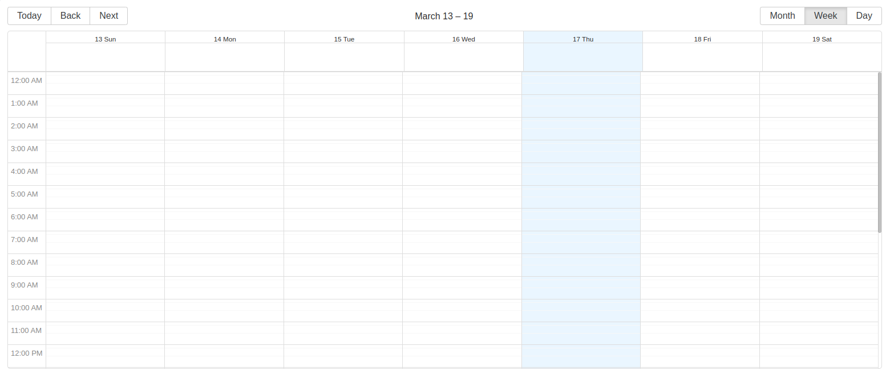

<!--
WARNING: this file was automatically generated by Mia-Platform Doc Aggregator.
DO NOT MODIFY IT BY HAND.
Instead, modify the source file and run the aggregator to regenerate this file.
-->

<!--
WARNING:
This file is automatically generated. Please edit the 'README' file of the corresponding component and run `yarn copy:docs`
-->


[handlebars]: https://handlebarsjs.com/guide/expressions.html
[window-location]: https://developer.mozilla.org/en-US/docs/Web/API/Window/location

[data-schema]: ../30_page_layout.md#data-schema
[filters-options]: ../30_page_layout.md#filters-options

[localized-text]: ../40_core_concepts.md#localization-and-i18n
[dynamic-configurations]: ../40_core_concepts.md#dynamic-configuration
[url-mask]: ../40_core_concepts.md#extracting-data-from-url---urlmask

[add-filter]: ../70_events.md#add-filter
[loading-data]: ../70_events.md#loading-data
[display-data]: ../70_events.md#display-data
[change-query]: ../70_events.md#change-query
[add-new]: ../70_events.md#add-new
[selected-data]: ../70_events.md#selected-data
[update-data]: ../70_events.md#update-data

[bk-filters-manager]: ./300_filters_manager.md




```html
<bk-calendar></bk-calendar>
```

The Calendar is designed to manage a dataset that represents appointments.

Each entry of the dataset should include the following three fields:
  - `startDate`: represents the start date of the appointment
  - `endDate`: represents the end date of the appointment
  - `title`: represents the title of the appointment

At mounting time, the Calendar parses the URL for parameters `date` and `view`, which uses to initialize its state. If not present, the Calendar initializes its state to default values.

Interaction with the Calendar is possible:
  - clicking an appointment triggers the request to allow editing of the associated data item.
    To do so, the Calendar emits a [selected-data] event
  - clicking on an empty time-slot triggers the request to allow creation of the associated data item.
    To do so, the Calendar emits an [add-new] event
  - drag-n-drop of appointments is possible. Dropping an appointment to a new slot notifies that fields `startDate` and `endDate` of the
    associated item should be edited. To do so, the Calendar emits an [update-data] event
  - changing the current view or the displayed time span triggers a request to change data retrieval, adding filters that enable the visualization
    of data items that are relevant to the newly selected time span. To do so, the Calendar emits [add-filter] event.

## How to configure

The Calendar does not require any particular configuration for its basic usage:

```json
{
  "tag": "bk-calendar"
}
```

### View

Property `view` allows to configure the default view of the Calendar.

Three types of view are supported:
  - `day`
  - `week`
  - `month`

If not specified, `month` view is used.

### Rename date filters

Changing the current view or the displayed time span triggers a request to change data retrieval,
adding filters that enable the visualization of data items that are relevant to the newly selected time span.

Modifying the current view or adjusting the displayed time span initiates a request to modify data retrieval.
This process involves requesting to add filters that allow the visualization of data items whose `startDate` and `endDate` fall within the selected time frame.

Property `filtersName` allows to specify a label to be applied to such filters, as shows in the following [example](#example-rename-date-filters).
Default filters names are:
  - `bk-calendar-start-date-filter`
  - `bk-calendar-end-date-filter`

```json
{
  "name": ..., // value of property `filtersName.start`, or "bk-calendar-start-date-filter"
  "operator": "lessEqual",
  "property": "startDate",
  "value": "2021-09-20T00:00:00.000Z"
},
{
  "name": ..., // value of property `filtersName.end`, or "bk-calendar-end-date-filter"
  "operator": "greaterEqual",
  "property": "endDate",
  "value": "2021-09-13T00:00:00.000Z"
}
```

### Hide date filters (with Filters Manager)

The Calendar requires a component like the [Filters Manager][bk-filters-manager] to be included in the page, as it makes use of the [add-filter] event for data filtering.

Filters on `startDate` and `endDate` properties can be hidden by the Filters Manager leveraging [filters-options] in the [data-schema] of the Filters Manager, as shows in the relative [example](#example-hide-date-filters-with-filters-manager).

### Additional creation data

Property `additionalCreatePayload` allows to specify extra data that should be added to the request that the Calendar emits when clicking on an empty time-slot.

[Dynamic configurations][dynamic-configurations] are available in `additionalCreatePayload` configuration, providing access via [handlebars] to:
  - the information of the currently logged user, via `currentUser`
  - information about the pathname of the current URL, via `pathnameParams`.\
    `pathnameParams.params` includes the result of the match between the `urlMask` property and the [pathname][window-location] of the URL, while `pathnameParams.path` holds the full pathname. This requires property [urlMask][url-mask] to be defined.
  - information about the query parameters of the current URL, via `searchParams`.\
    `searchParams.params` includes the result of the match between the `urlMask` property and the [query][window-location] of the URL, while `searchParams.path` holds the full query as a string. This requires property [urlMask][url-mask] to be defined.

This is shown in the examples [Additional Creation Data](#example-additional-creation-data) and [Additional Creation Data With Info From Url](#example-additional-creation-data-with-info-from-url).

## Examples

### Example: Hide date filters with Filters Manager

The Calendar requires a component like the [Filters Manager][bk-filters-manager] to be included in the page, as it makes use of the [add-filter] event for data filtering.
Filters on `startDate` and `endDate` properties can be hidden by the Filters Manager leveraging [filters-options] in the [data-schema] of the Filters Manager.

```json
{
  "tag": "bk-calendar"
},
{
  "tag": "bk-filters-manager",
  "properties": {
    "dataSchema": {
      "title": {"type": "string"},
      "startDate": {
        "type": "string",
        "format": "data-time",
        "filtersOptions": {
          "hidden": true
        }
      },
      "endDate": {
        "type": "string",
        "format": "data-time",
        "filtersOptions": {
          "hidden": true
        }
      }
    }
  }
}
```

### Example: Rename date filters

Property `filtersName` allows to specify a label to be applied to the emitted filters that request the visualization of data items that fall in the calendar current time-span.

A Calendar with a configuration like:
```json
{
  "tag": "bk-calendar",
  "properties": {
    "filtersName": {
      "start": "Start filter",
      "end": "End filter"
    },
  }
}
```

emits [add-filter] events with payload:

```json
{
  "name": "Start filter",
  "operator": "lessEqual",
  "property": "startDate",
  "value": "2021-09-20T00:00:00.000Z"
},
{
  "name": "End filter",
  "operator": "greaterEqual",
  "property": "endDate",
  "value": "2021-09-13T00:00:00.000Z"
}
```

where the `value` keys are set based on the visualized date and the selected [view](#view).


### Example: Additional creation data

Property `additionalCreatePayload` allows to specify a extra data to be included in the request to create a new data element that the Calendar sends whenever an empty time-slot is clicked.

Assuming the current user information to be representable with an object like:

```json
{
  "role": "Admin",
  "name": "Steven",
  "email": "steven@test.com"
}
```

a Calendar configured like:

```json
{
  "tag": "bk-calendar",
  "properties": {
    "additionalCreatePayload": {
      "price": 120,
      "email": "{{currentUser.email}}"
    }
  }
}
```

emits [add-new] events with payload:

```json
{
  "email": "steven@test.com",
  "price": 120
}
```


### Example: Additional creation data with info from URL

Property `additionalCreatePayload` allows to specify a extra data to be included in the request to create a new data element that the Calendar sends whenever an empty time-slot is clicked.
Property [urlMask][url-mask] provides the possibility to use data extraced from the URL in the configuration of `additionalCreatePayload`.


With a URL having pathname:

```
/orders/id-1
```

a Calendar configured like:

```json
{
  "tag": "bk-calendar",
  "properties": {
    "urlMask": "/orders/:id",
    "additionalCreatePayload": {
      "userId": "{{pathnameParams.params.id}}"
    }
  }
}
```

emits [add-new] events with payload:

```json
{
  "userId": "id-1"
}
```

## API

### Properties & Attributes

| property                  | attribute  | type                                   | default                                                                   | description                                                         |
| ------------------------- | ---------- | -------------------------------------- | ------------------------------------------------------------------------- | ------------------------------------------------------------------- |
| `additionalCreatePayload` | -          | {[x: string]: any}                     | {}                                                                        | extra data to be passed in the payload of [add-new] events          |
| `date`                    | -          | Date                                   | `new Date()`                                                              | current date of the calendar                                        |
| `height`                  | `height`   | string                                 | -                                                                         | css-height of the calendar                                          |
| `view`                    | -          | "agenda" \| "day" \| "month" \| "week" | 'month'                                                                   | current view of the calendar                                        |
| `filtersName`             | -          | [FiltersName](#filtersname)            | {start:"bk-calendar-start-date-filter",end:"bk-calendar-end-date-filter"} | names of date filters                                               |
| `urlMask`                 | `url-mask` | [UrlMask][url-mask]                    | -                                                                         | url mask to apply to the current path to extract dynamic parameters |

#### FiltersName

```typescript
type FiltersName = {
  start?: LocalizedText
  end?: LocalizedText
}
```
where [LocalizedText][localized-text] is either a string or an object mapping language acronyms to strings.

### Listens to

| event          | action                      |
| -------------- | --------------------------- |
| [loading-data] | sets internal loading state |
| [display-data] | receives data to display    |

### Emits

| event           | description                                                                                    |
| --------------- | ---------------------------------------------------------------------------------------------- |
| [add-filter]    | requests data to be filtered to only show items that fall in currently visualized span of time |
| [add-new]       | triggers the creation of a new event with the selected `start` and `end`                       |
| [selected-data] | notifies about the click on an event                                                           |
| [update-data]   | triggers the update of the `start` and `end` of an event                                       |
