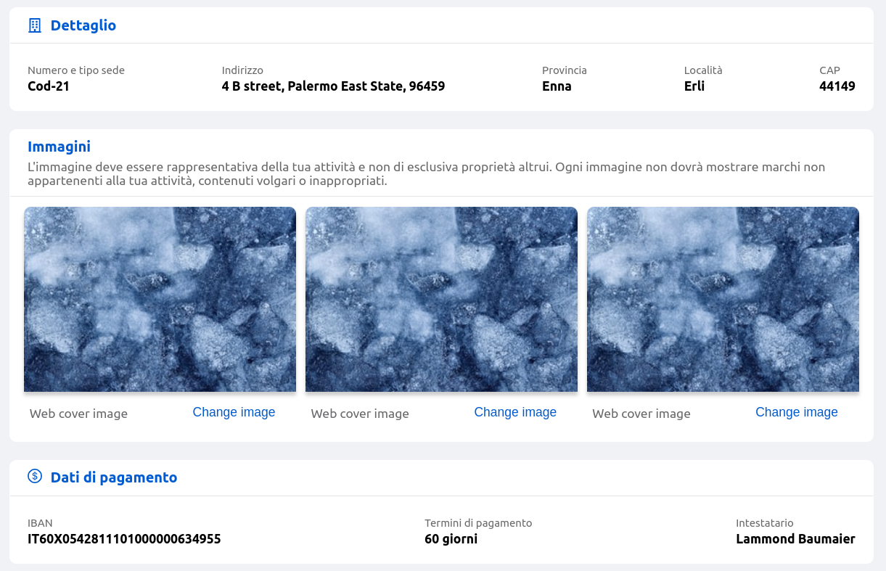

<!--
WARNING:
This file is automatically generated. Please edit the 'README' file of the corresponding component and run `yarn copy:docs`
-->

<<<<<<< HEAD:docs/microfrontend-composer/back-kit/60_components/140_card.md
[img-bk-card]: img/bk-card.png
[img-card-header]: img/card-header.png
=======


>>>>>>> main:docs/business_suite/backoffice/60_components/140_card.md

[ant-icons]: https://ant.design/components/icon
[fontawesome]: https://fontawesome.com/v5/search?m=free&s=solid%2Cregular
[handlebars]: https://handlebarsjs.com/guide/expressions.html

[data-schema]: ../30_page_layout.md#data-schema
[lookups]: ../30_page_layout.md#lookups-deprecated
[visualization-options]: ../30_page_layout.md#visualization-options

[localized-text]: ../40_core_concepts.md#localization-and-i18n
[dynamic-configurations]: ../40_core_concepts.md#dynamic-configuration
[template-configMap]: ../40_core_concepts.md#template---configmap
[helpers]: ../40_core_concepts.md#helpers
[rawObject]: ../40_core_concepts.md#rawObject

[display-data]: ../70_events.md#display-data
[lookup-data]: ../70_events.md#lookup-data
[selected-data]: ../70_events.md#selected-data


[bk-button]: ./90_button.md
[bk-dynamic-form-card]: ./190_dynamic_form_card.md


```html
<bk-card></bk-card>
```
<<<<<<< HEAD:docs/microfrontend-composer/back-kit/60_components/140_card.md
![bk-card][img-bk-card]
=======

>>>>>>> main:docs/business_suite/backoffice/60_components/140_card.md

The Card read-only visualizer for objects, arrays of objects, images.

It is not suited for editing.
That role should be delegated to another component, such as the [Dynamic Form Card][bk-dynamic-form-card] component.

The Card is made by blocks and is recursive, which means that cards can be embedded inside cards.


The Card is made of 3 HTML5 tag

1. `header`
2. `main`
3. `footer`

If either of these keys is absent from the Card configuration, it does not appear in the Card shadow DOM and it does not clutter its internal structure.

## How to configure

To configure the Card, the `cardSchema` property is needed:

```json
{
  "tag": "bk-card",
  "properties": {
    "cardSchema": {
      "header": {
        ...
      },
      "main": {
        ...
      },
      "footer": {
        ...
      }
    }
  }
}
```

`cardSchema` accepts an object with keys: `header`, `main`, `footer` and control the layout of the Card.

### Roles

The Card can be assigned a property `role`, which define a color code

  - `default` - white background and no border
  - `info` - white background, grey border and grey font color
  - `success` - white background, primary-color border and primary-color font color
  - `error` - red background, red border and red main title.


### Dynamic Context

Several properties of the Table allow [dynamic configurations][dynamic-configurations].
By default, such properties are parsed with [handlebars], injecting the the following data as context:
  
  - `data`: the whole datum associated to the Card
  - `arraySource`: array data source associated to the Card
  - `buttonSource`: object data source associated to the Card
  - `args`: an array contianing
    - the datum of a specific field (depending on the property being interpolated)
    - the whole datum associated to the Card

All the above parameters can be dynamically interpolated into properties that allow dynamic configurations through handlebars.

### Layout

Property `cardSchema` is available to control how each section of the Card.
`cardSchema` accepts an object with keys: `header`, `main`, `footer`.

The simplest card layout is an informative card, which is obtained by combining header and footer.

#### Header

Header supports:

- title (h1)
- subtitle (h2)
- badge
- icon

Each one of them is optional and the layout is left-float icon + title + badge and a second line with the subtitle.

<<<<<<< HEAD:docs/microfrontend-composer/back-kit/60_components/140_card.md
![header-example][img-card-header]
=======

>>>>>>> main:docs/business_suite/backoffice/60_components/140_card.md

Title, subtitle and badge can be internationalized using [LocalizedText][localized-text] which is either a string or an object with language support.

Icons are dynamically imported to reduce bundle size. Icons are not downloaded unless actually used.

Available icons are [`@ant-design/icons`][ant-icons] or any [fontawesome public solid or regular icon][fontawesome].

```json
{
  "cardSchema": {
    "header": {
      "icon": "fas fa-building",
      "title": {"en": "Conversation", "it": "Conversazione"},
      "badge": {"en": "Awaiting", "it": "In Attesa"},
      ...
    }
  }
}
```


#### Footer

Footer encapsulates actions and can mount an unlimited number of buttons. Its configuration supports

- title
- subtitle
- subsubtitle
- buttons

The former three are similar to the [header properties](#header).

`buttons` key instead takes either an object or an array of objects that can contain the key `tag`.

When `tag` is not specified it defaults to `button`.
Footer will render the given tag and it will apply any other property of the corresponding configuration object as vanilla JS property on an HTML5 tag.

A user-agent browser default button can be achieved as:

```json
{
  "children": {
    "Click me!"
  }
}
```

but more often a [Button][bk-button] component is useful.

```json
{
  "footer": {
    ...
    "buttons": {
      "tag": "bk-button",
      "content": {
        "it": "Scarica PDF autorizzazione",
        "en": "Download authorization PDF"
      },
      "iconId": "DownloadOutlined",
      "type": "link"
    }
  }
}
```

Multiple buttons can be specified, and support two layouts: `horizontal` and `vertical` (default), which can be controlled with footer property `buttonsLayout`.


Footer supports [dynamic configurations][dynamic-configurations] via [handlebars notation][handlebars].
The [context](#dynamic-context) provided by the Card can be utilized inside handlebars.

```json
{
  "role": "info",
  "cardSchema": {
    ...
    "footer": {
      "subtitle": "{{data.name}}"
    }
  }
}
```

The Card supports all dynamic configurations [helpers], with the limitation that [`template`-`configMap` pair][template-configMap] can be applied to keys
at the first level of the `footer` object, and to keys at the first level of `footer.buttons`.

#### Main

Main is the core part of the Card and the most widely customizable section.
It roughly accepts configuration for 3 different modes (all of which can be combined at will in a single card).

- `object`-mode: displays data from an object data source
- `array`-mode: displays data from an array data source
- `image`-mode: display an image from a URL
- `recursive` mode: displays embedded Cards

The Card cannot operate under multiple modes at the same time.
For instance, whenever the `recursive`-mode field is specified, it is not possible to view data from a data source besides the nested Cards.
The only exception is `object` and `array` modes. It is indeed possible to visualize both object and array fields of a data item.

#### Visualize data

`object`-mode and `array`-mode can be accessed by specifying a [data-schema] to the main section of the Card.

```json
{
  "tag": "bk-card",
  "properties": {
    "cardSchema": {
      "dataSchema": {
        ...
      }
    }
  }
}
```

`object`-mode and `array`-mode allow to describe a data item by displaying its fields accordingly with the provided data-schema.

In this mode, whenever data are received (upon listening to [display-data] events), the first entry is visualized inside the card main section according with the data-schema.
[lookup-data] events are also handled to resolve [lookup data][lookups].


##### Mount web-components in Card body

When provided with a [data-schema], the Card supports [visualization-options].

In particular, the Card allows to insert a generic web-component into its body in place of a field by defining,
in the data-schema description of the corresponding field, all the web-components properties inside the visualization-options.

Web-components that are mounted inside the body of the Card through visualization-options support [dynamic configurations][dynamic-configurations]
with partial Card [context](#dynamic-context) (keys `arraySource` and `objectSource` are **not** supported):

- context key `args.[0]` can be used to access the value of the field being rendered as a web-component,
- while `args.[1]` or `data` provide access to the object representation of the whole datum.


##### Visualize an image

`image`-mode can be accessed through setting key `img` in the main section of the card.

```json
{
  "tag": "bk-card",
  "properties": {
    "cardSchema": {
      "main": {
        "img": "https://source.unsplash.com/random/300x200"
      }
    }
  }
}
```
The value of the `img` field can be furthermore set to a [dynamic value][dynamic-configurations] using [handlebars].

#### Visualize recursive Cards

Providing a `cards` key inside the main section of the Card enables `recursive`-mode. `cards` should contain an array of `cardSchema` objects.

`recursive` is a mode that embeds cards into cards.

```json
{
  "cardSchema": {
    "main": {
      "cards": [
        {
          "header": {...},
          "main": {...},
          ...
        },
        {
          "header": {...},
          "main": {
            "cards": [
              {
                "header": {
                  ...
                }
              }
            ]
          },
          ...
        }
      ]
    }
  }
}
```

## Examples

### Example: Text-only Card

A Card that should be composed by text-only content can be achieved by placing the text content in the footer of the card:

```json
{
  "tag": "bk-card",
  "properties": {
    "role": "info",
    "cardSchema": {
      "footer": {
        "subtitle": "Text"
      }
    }
  }
}
```

A title can be added through the header:

```json
{
  "tag": "bk-card",
  "properties": {
    "role": "info",
    "cardSchema": {
      "header": {
        "title": {"en": "Info", "it": "Info"}
      },
      "footer": {
        "subtitle": "Text"
      }
    }
  }
}
```

### Example: Footer buttons

A Card configured like:

```json
{
  "tag": "bk-card",
  "properties": {
    "footer": {
      "buttons": {
        "tag": "bk-button",
        "content": {
          "it": "Scarica PDF autorizzazione",
          "en": "Download authorization PDF"
        },
        "iconId": "DownloadOutlined",
        "type": "link"
      }
    }
  }
}
```

mounts a [Button][bk-button] in the footer.


Multiple buttons can be specified, and support two layouts: `horizontal` and `vertical` (default).

```json
{
  "role": "info",
  "cardSchema": {
    "footer": {
      "buttonsLayout": "horizontal",
      "buttons": [
        {
          "tag": "bk-button",
          "content": {
            "it": "Scarica PDF autorizzazione",
            "en": "Download authorization PDF"
          },
          "iconId": "DownloadOutlined",
          "type": "link"
        },
        {
          "tag": "bk-button",
          "content": {
            "it": "Fai un'altra richiesta",
            "en": "Make a new request"
          }
        }
      ]
    }
  }
}
```

### Example: Dynamic Footer

The following configuration for the Card:

```json
{
  "tag": "bk-card",
  "properties": {
    "role": "info",
    "cardSchema": {
      "footer": {
        "subtitle": "{{data.name}}"
      }
    }
  }
}
```

with a datum such as:

```json
{
  "name": "Teresa",
  "surname": "Fattorini",
  ...
}
```

displays a Card having footer text equal to "Teresa".

### Example: Dynamic Footer 2

The following configuration for the Card:

```json
{
  "role": "info",
  "cardSchema": {
    ...
    "footer": {
      "buttons": {
        "tag": "bk-button",
        "content": "Details",
        "action": {
          "type": "event",
          "config": {
            "events": {
              "label": "selected-data",
              "payload": "{{rawObject data}}"
            }
          }
        }
      }
    }
  }
}
```

with a datum such as:

```json
{
  "name": "Teresa",
  "surname": "Fattorini"
}
```

displays a Card whose footer mounts a [Button][bk-button] that, upon click, emits a [selected-data] event with payload equal to the Card datum.

```json
{
  "label": "selected-data",
  "payload": {
    "name": "Teresa",
    "surname": "Fattorini",
  }
}
```

:::info
[rawObject][rawObject] is a helper keyword that prevents "data" from being stringified in the payload of the event.
:::


### Example: Dynamically disable a footer button

If is furthermore possible to provide dynamic configurations via a [template-configMap pair][template-configMap] pair.
In such cases, the resulting value is taken from the configMap using the template as key (or `$default`, if the template does not match any configMap key).

For instance, the following configuration for the Card:

```json
{
  "tag": "bk-card",
  "properties": {
    "cardSchema": {
      "footer": {
        "buttons": {
          "tag": "bk-button",
          "content": "Cancel",
          "disabled": {
            "template": "{{data.status}}",
            "configMap": {
              "active": false,
              "$deafult": true
            }
          }
        }
      }
    }
  }
}
```

with datum:

```json
{
  "_id": "product-1",
  "status": "pending"
}
```

resolves to:

```json
{
  "tag": "bk-card",
  "properties": {
    "cardSchema": {
      "footer": {
        "buttons": {
          "tag": "bk-button",
          "disabled": false
        }
      }
    }
  }
}
```

thus displaying a Card whose footer mounts a disabled [Button][bk-button].


On the other hand, a datum like:
```json
{
  "_id": "product-2",
  "status": "actinve"
}
```

resolves to:

```json
{
  "tag": "bk-card",
  "properties": {
    "cardSchema": {
      "footer": {
        "buttons": {
          "tag": "bk-button",
          "disabled": true
        }
      }
    }
  }
}
```

thus displaying a Card whose footer mounts an active [Button][bk-button].


### Example: Handle nested dynamic configuration

A [`template`-`configMap`][template-configMap] interface for [dynamic configurations][dynamic-configurations] can only be applied to keys at the first level of the `footer` object,
and to keys at the first level of the buttons inside the footer.

For instance, the following is **not** a valid configuration:
```json
{
  "tag": "bk-card",
  "properties": {
    "cardSchema": {
      "footer": {
        "buttons": {
          "tag": "bk-button",
          "action": {
            "type": "event",
            "config": {
              "events": {
                "label": { // <- nested too deeply, `label` is not resolved
                  "template": "{{data.status}}",
                  "configMap": {
                    "active": "selected-data",
                    "$deafult": "add-new"
                  }
                },
                "payload": {}
              }
            }
          },
          ...
        }
      }
    }
  }
}
```
since `template`-`configMap` pair is not applied to a first-level key of `buttons`.

An analogous and correct configuration for the above example is:
```json
{
  "tag": "bk-card",
  "properties": {
    "cardSchema": {
      "footer": {
        "buttons": {
          "tag": "bk-button",
          "action": { // <- first level of nesting, `action` is not resolved
            "template": "{{data.status}}",
            "configMap": {
              "active": {
                "type": "event",
                "config": {
                  "events": {
                    "label": "selected-data",
                    "payload": {}
                  }
                }
              },
              "$default": {
                "type": "event",
                "config": {
                  "events": {
                    "label": "add-new",
                    "payload": {}
                  }
                }
              }
            }
          }
        }
      }
    }
  }
}
```

### Example: Display data item

The following configuration encompasses both `object` and `array` mode of the the Card component.

```json
{
  "tag": "bk-card",
  "properties": {
    "cardSchema": {
      "main": {
        "dataSchema": {
          "type": "object",
          "properties": {
            "status": {
              "label": "Status",
              "type": "string"
            },
            "liv1": {
              "type": "array",
              "label": "First Floor",
              "dataSchema": {
                "type": "object",
                "properties": {
                  "name": {
                    "type": "string"
                  },
                  "surname": {
                    "type": "string"
                  }
                }
              }
            },
            "notification": {
              "label": "Notifications",
              "type": "object",
              "format": "localized-text"
            },
            "riderId": {
              "label": "Rider",
              "type": "string",
              "format": "lookup"
            },
            "customerId": {
              "label": "Customer",
              "type": "string",
              "format": "lookup"
            }
          }
        }
      }
    }
  }
}
```

The Card visualizes:
- a `status` string field
- lookups `riderId`, `customerId`
- a nested array `liv1`
- a composite object `notification`

### Example: Display an image

The following configuration renders a Card that operates under `image`-mode.

```json
{
  "tag": "bk-card",
  "properties": {
    "cardSchema": {
      "main": {
        "img": "https://source.unsplash.com/random/300x200"
      }
    }
  }
}
```

The Card visualizes an image retrieved from a specific URL.

### Example: Recursive Cards

`recursive` is a mode that embeds cards into cards. The very same structure described here can be nested by using

```json
{
  "tag": "bk-card",
  "properties": {
    "cardSchema": {
      "main": {
        "cards": [
          {
            "header": {
              "title": "Card 1"
            },
            "footer": {
              "subTitle": "Information 1"
            }
          },
          {
            "header": {
              "title": "Card 2"
            },
            "footer": {
              "subTitle": "Information 2"
            }
          }
        ]
      }
    }
  }
}
```

### Example: Mount a web-component dynamically


The following configuration renders a Card mounting a `div` component in place of the standard view for a field:

```json
{
  "tag": "bk-card",
  "properties": {
    "cardSchema": {
      "main": {
        "dataSchema": {
          "type": "object",
          "properties": {
            "name": {
              "type": "string",
              "visualizationOptions": {
                "tag": "div",
                "properties": {
                  "textContent": "The name is: {{args.[0]}}"
                }
              }
            }
          }
        }
      }
    }
  }
}
```

`args.[0]` refers to the value of the corresponding field (in this case, `name`). `args.[1]` is also available, referencing the full data of the card.

### Example: Forward data to nested cards

Specifying a [data-schema] is useful in `recursive`-mode, to inject data to the nested Cards configurations.

Whenever a Card is provided with a data-schema, it handles [display-data] events by storing internally the first received data item.

Specifying `cards` property in the Card main section prevents such data-item from being visualized, but still grants access to it through handlebars syntax in [dynamic-configurations].

```json
{
  "tag": "bk-card",
  "properties": {
    "cardSchema": {
      "header": {
        "title": "Images"
      },
      "main": {
        "dataSchema": {
          "type": "object",
          "properties": {
            "images": {
              "type": "array",
              "items": {
                "type": "string"
              }
            }
          }
        },
        "cards": [
          {
            "cardSchema": {
              "main": {
                "img": "{{arraySource.images.[0]}}"
              },
              ...
            }
          },
          {
            "cardSchema": {
              "main": {
                "img": "{{arraySource.images.[1]}}"
              },
              ...
            }
          }
        ]
      }
    }
  }
}
```

As deducible from the [data-schema], the Card stores an array of strings in field `images`. Embedded cards are responsible for displaying images using the entries from the array.

## API

### Properties & Attributes

| property                          | attribute | type                                  | default   | description                                                                                              |
| --------------------------------- | --------- | ------------------------------------- | --------- | -------------------------------------------------------------------------------------------------------- |
| `arraySource`                     | -         | [ArraySource](#arraysource)           | {}        | property to inject array source from an external source. This is overridden by the [display-data] event  |
| `cardSchema`                      | -         | [CardSchema](#cardschema)             | {}        | schema that describes the card layout, role and type/style                                               |
| `containerStyle` (__deprecated__) | -         | CSSProperties                         | -         | React-like CSS properties to decorate card container                                                     |
| `customMessageOnAbsentDatum`      | -         | [LocalizedText][localized-text]       | -         | when datum reaches the card without an expected value, a custom message can replace it                   |
| `customMessageOnAbsentLookup`     | -         | [LocalizedText][localized-text]       | -         | overrides lookup value in case it is not resolved                                                        |
| `objectSource`                    | -         | [ObjectSource](#objectsource)         | {}        | property to inject object source from an external source. This is overridden by the [display-data] event |
| `role`                            | -         | "default"\|"info"\|"success"\|"error" | "default" | card role to select color schema                                                                         |

#### ArraySource

```typescript

type ArraySource = {
  [property: string]: {
    [field: string] string | TaggableCustom
  }[]
}

type TaggableCustom = {
  value: string
  tag: string
  properties: Record<string, any>
  data: Record<string, any>
}
```

#### ObjectSource

```typescript

type ArraySource = {
  [property: string]: {
    [field: string] string | TaggableCustom
  }
}

type TaggableCustom = {
  value: string
  tag: string
  properties: Record<string, any>
  data: Record<string, any>
}
```

#### CardSchema

```typescript
type CardSchema = {
  header?: {
    icon?: string
    title?: LocalizedText
    badge?: LocalizedText
    subtitle?: LocalizedText
  }
  main?: {
    dataSchema?: DataSchema
    cards?: CardSchema | CardSchema[]
    img?: string | URL
  }
  footer?: {
    title?: LocalizedText
    subtitle?: LocalizedText
    subsubtitle?: LocalizedText
    buttons?: TaggableCustom | TaggableCustom[]
    buttonsLayout?: 'horizontal' | 'vertical'
  }
}

type TaggableCustom = {
  tag: string
} & {
  [x: property]: any
}
```

where [LocalizedText][localized-text] is either a string or an object mapping language acronyms to strings

### Listens to

| event          | action                                                                       |
| -------------- | ---------------------------------------------------------------------------- |
| [display-data] | displays the first item of the payload according to the card main dataSchema |
| [lookup-data]  | updates data with resolved lookups                                           |

### Emits

<!-- TODO fix links -->

| event                | action                                                                                                                     |
| -------------------- | -------------------------------------------------------------------------------------------------------------------------- |
| configurable event | footer [buttons](#footer) or [custom web-components](#mount-web-components-in-card-body) can be used to emit custom events |
