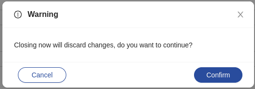

<!--
WARNING:
This file is automatically generated. Please edit the 'README' file of the corresponding component and run `yarn copy:docs`
-->

<<<<<<< HEAD:docs/microfrontend-composer/back-kit/60_components/160_confirmation_modal.md
[img-bk-confirmation-modal]: img/bk-confirmation-modal.png
=======

>>>>>>> main:docs/business_suite/backoffice/60_components/160_confirmation_modal.md
[bk-button]: ./90_button.md

[action]: ../50_actions.md

[require-confirm]: ../70_events.md#require-confirm


```html
<bk-confirmation-modal></bk-confirmation-modal>
```

<<<<<<< HEAD:docs/microfrontend-composer/back-kit/60_components/160_confirmation_modal.md
![confirmation-modal][img-bk-confirmation-modal]
=======

>>>>>>> main:docs/business_suite/backoffice/60_components/160_confirmation_modal.md

The Confirmation Modal prompts the user for confirmation on certain actions.
A dialog box is rendered through a modal with two buttons, one for confirming and one for canceling the action.

The Confirmation Modal becomes visible upon listening to a [require-confirm] event, and uses the event payload to populate its state as follows:

- `title`: the title of the modal.
- `content`: the text content of the modal.
- `okText`: the text content of the "Cancel" button.
- `cancelText`: the text content of the "Confirm" button.
- `onOk`: the callback to execute on confirm. Note: this key cannot be set through configuration. Use `configOk` key instead.
- `onCancel`: the callback to execute on cancel. Note: this key cannot be set through configuration. Use `configCancel` key instead.
- `configOk`: a "tag"-"properties" pair to mount a custom component in place of the default confirmation button. Usually, mounted components are instances of the [Button][bk-button] component.
- `configCancel`: a "tag"-"properties" pair to mount a custom component in place of the default cancel button. Usually, mounted components are instances of the [Button][bk-button] component.


## How to configure

The Confirmation Modal does not require any configuration.

```json
{
  "tag": "bk-confirmation-modal"
}
```

The size of the dialog box body can be set with properties `width` and `height`, which are defaulted to '520px' and '50px'.

### How to require confirmation for an action

Components that allow to emit configurable events (for instance, the [Button][bk-button]) may be used to spawn the Confirmation Modal by emitting a [require-confirm] event.
Doing so, event payload keys `configOk` and `configCancel` should be specified to configure the confirm and cancel buttons, while keys `onCancel`, `onOk`, `okText` and `cancelText` should not be specified, since they are supposed to always be set programmatically.

Components mounted using `configOk` and `configCancel` are automatically set to close the modal upon clicking, and the Confirmation Modal injects its properties `headers` and `credentials` to their properties.

Mounting custom components as confirmation/cancel buttons in the modal allows to require confirmation from the user before executing a [Back-kit Action][action]. A basic [example](#require-confirmation-for-a-delete-request) is available.

Generally, a configuration like the following:

```jsonc
{
  "tag": "bk-button", // or whatever component performs the action that requires confirmation
  "properties": {
    "action": {
      ...// <------ the action that requires confirmation
    }
  }
}
```
should become:
```jsonc
{
  "tag": "bk-button",
  "properties": {
    "action": {
      "type": "event",
      "config": {
        "events": {
          // `require-confirm` event is emitted to spawn the Confirmation Modal
          "label": "require-confirm",
          "payload": {
            ...
            "configOk": { // the "confirm" button of the modal actually performs the action
              "tag": "bk-button",
              "properties": {
                ...
                "action": {
                  ...// <------ the action that requires confirmation
                }
              }
            }
          }
        }
      }
    }
  },
  {
    "tag": "bk-confirmation-modal"
  }
}
```

- The triggering component (usually a Button) should emit a `require-confirm` event. The payload should include a `configOk` key with a `tag`-`properties` pair that describes a Button that, upon click, performs the action,
- the Confirmation Modal listens to the `require-confirm` and becomes visible. The "confirm" button is spawned using the `configOk` field of the event payload,
- when the user confirms, the Button performs the desired action. The Confirmation Modal closes automatically upon clicking any of its buttons.


## Examples

### Example: Require confirmation for a DELETE request

The following snippet of configuration shows a [Button][bk-button] configured to perform a DELETE request to a given endpoint when clicked.

```json
{
  "tag": "bk-button",
  "properties": {
    "content": "Delete",
    "action": {
      "type": "http",
      "config": {
        "url": "orders/old-orders",
        "method": "DELETE"
      }
    }
  }
}
```

In order to require confirmation for this action, it is possible to have the Button spawn the Confirmation Modal instead of performing the REST call, delegating it to the "confirm" button of the modal.

```jsonc
{
  "tag": "bk-button",
  "properties": {
    "content": "Delete",
    "action": {
      "type": "event",
      "config": {
        "events": {
          "label": "require-confirm",
          "payload": {
            "title": {
              "en": "Delete orders?",
              "it": "Rimuoveree ordini?"
            },
            "content": {
              "en": "Are you sure you want to delete these orders?",
              "it": "Sei sicuro di voler rimuobere gli ordini?"
            },
            "configCancel": {
              "tag": "bk-button",
              "properties": {
                "content": "No",
                "type": "ghost"
              }
            },
            "configOk": {
              // confirmation button performs the actual action
              // `configOk` has the same piece of configuration as the initial `bk-button`
              "tag": "bk-button",
              "properties": {
                "content": "Ok",
                "action": {
                  "type": "http",
                  "config": {
                    "url": "orders/old-orders",
                    "method": "DELETE"
                  }
                }
              }
            }
          }
        }
      }
    }
  }
}
```

The button emits a `require-confirm` event. Confirmation modal listens to it and becomes visible, using the payload of the event to populate its state.

In particular, `configOk` key is used to build the confirmation button - in this case, a button that performs the same DELETE call that was previously performed directly by the button.

The cancel button does not perform any action: if clicked, the modal closes and the endpoint is not called.

## API

### Properties & Attributes

| property | attribute | type   | default | description              |
| -------- | --------- | ------ | ------- | ------------------------ |
| `height` | `height`  | string | '50px'  | height of the modal body |
| `width`  | `width`   | string | '520px' | width of the modal body  |

### Listens to

| event             | action                                                                                                         |
| ----------------- | -------------------------------------------------------------------------------------------------------------- |
| [require-confirm] | displays a Confirmation Modal with buttons for the user to confirm or cancel the triggering of certain actions |

### Emits

| event              | description                                                                                                                                       |
| ------------------ | ------------------------------------------------------------------------------------------------------------------------------------------------- |
| configurable event | on confirm or on cancel, it can forward events that were specified in the payload of the triggering event as the callback for the relative button |
