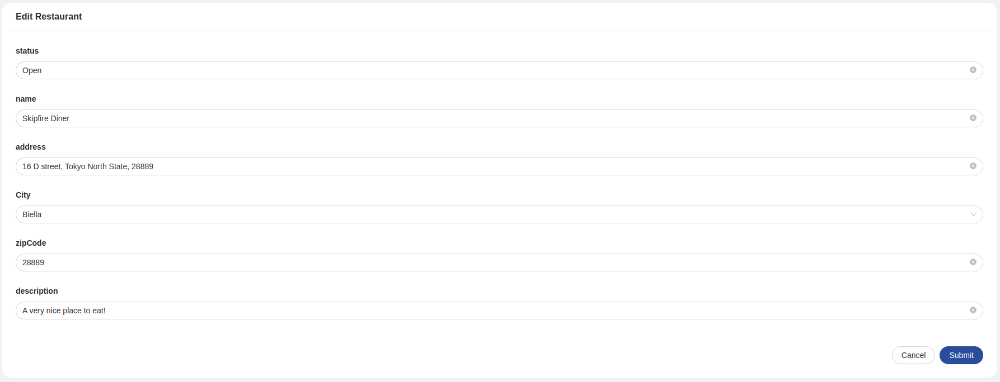

<!--
WARNING: this file was automatically generated by Mia-Platform Doc Aggregator.
DO NOT MODIFY IT BY HAND.
Instead, modify the source file and run the aggregator to regenerate this file.
-->

<!--
WARNING:
This file is automatically generated. Please edit the 'README' file of the corresponding component and run `yarn copy:docs`
-->


[handlebars]: https://handlebarsjs.com/guide/expressions.html

[crud-service]: /runtime_suite/crud-service/10_overview_and_usage.md
[predefined-fields]: /runtime_suite/crud-service/10_overview_and_usage.md
[writable-views]: /runtime_suite/crud-service/50_writable_views.md

[data-schema]: ../30_page_layout.md#data-schema
[form-options]: ../30_page_layout.md#form-options
[helpers]: ../40_core_concepts.md#helpers
[localized-text]: ../40_core_concepts.md#localization-and-i18n
[dynamic configurations]: ../40_core_concepts.md#dynamic-configuration
[inline-queries]: ../40_core_concepts.md#inline-queries
[action]: ../50_actions.md
[file-management]: ../80_flows/10_file_management.md
[bk-button]: ./90_button.md
[bk-crud-client]: ./100_crud_client.md
[bk-file-manager]: ./250_file_manager.md
[bk-confirmation-modal]: ./160_confirmation_modal.md
[bk-file-picker-modal]: ./270_file_picker_modal.md
[bk-file-picker-drawer]: ./260_file_picker_drawer.md

[cardschema-header]: ./140_card.md#header

[display-data]: ../70_events.md#display-data
[require-confirm]: ../70_events.md#require-confirm
[create-data]: ../70_events.md#create-data
[update-data]: ../70_events.md#update-data
[create-data-with-file]: ../70_events.md#create-data-with-file
[update-data-with-file]: ../70_events.md#update-data-with-file
[success]: ../70_events.md#success
[error]: ../70_events.md#error

[lookup-flow]: ../80_flows/40_lookups.md


```html
<bk-dynamic-form-card></bk-dynamic-form-card>
```



The Dynamic Form Card is used to display a card containing a form to edit or create items described by the `dataSchema`.
Custom behavior can also specified, allowing extra actions to be included in the card footer via buttons.

The Dynamic Form Card listens to the [display-data] event to initialize its form.

## How to configure

For a basic usage of the Dynamic Form Card, providing a data-schema to interpret the structure of the data to handle is sufficient.
Several [customizations][data-schema] can be applied to the provided data-schema that tune how the data is handled by the component.
Particularly, but not limited to, every field supports a set of [options][form-options] specific for forms.

```json
{
  "tag": "bk-dynamic-form-card",
  "properties": {
    "dataSchema": {
      "type": "object",
      "properties": {
        "_id_": {
          "type": "string",
          "formOptions": {
            "hidden": true // no input is rendered for _id field, but the Dynamic Form Card still holds its value in the internal representation of the form values
          }
        },
        "__STATE__": {
          "type": "string",
          "default": "PUBLIC",
          "enum": [ // enum string fields are rendered as select fields
            "PUBLIC",
            "DRAFT",
            "TRASH"
          ]
        },
        "name": {
          "type": "string"
        },
        "price": {
          "type": "number"
        },
        ...
      }
    }
  }
}
```

The components operates in two different modes:

- *insert*: submitting the form signals the need for an item creation. Configurable by setting property `submitBehavior` to "add".
- *edit*: submitting the form signals the need for an item creation. Configurable by setting property `submitBehavior` to "edit" (default).

If `submitBehavior` is not specified, the Dynamic Form Card operates in *edit* mode.

When newly fetched data becomes available through a [display-data] event, the Dynamic Form Card initiates its field. The component extracts values from one of the elements within the received data and interprets them based on its data-schema. The `dataIndex` property governs the selection of which data element to use for this purpose by specifying its index. By default, the card selects the first element (corresponding to `dataIndex` value 0) for this process

### Modes

#### Insert

When the component reacts to the [display-data] event and property `submitBehavior` is set to "add", the form initializes its fields with values specified in the payload of the event.

In this mode, upon clicking on the submit button of the footer, the Dynamic Form Card signals the request to push a new item to a CRUD collection, emitting the event [create-data] with payload extracted from the object representation of the form values.
A component such as the [CRUD Client][bk-crud-client] could pick up on the `create-data` event.
If the form contains files, the component emits a [create-data-with-file] event, which signals the need to upload files to a file storage service on top of pushing the item to a CRUD collection.
A component like the [File Manager][bk-file-manager] could listen to this event. Further details on how Back-Kit components can be composed to handle file fields are available in the [specific section][file-management].

A `transactionId` is added to the meta field of the emitted event to handle possible errors.

#### Edit

When the component reacts to the [display-data] event and property `submitBehavior` is set to "add", the form initializes its fields with the values specified in the payload of the event.

By clicking on the submit button, the Dynamic Form Card signals the request to update an item in the CRUD collection, emitting the event [update-data] with payload providing the fields to change in the item. The item to update is identified by its `_id` field, which is a [predefined field][predefined-fields] of [Mia Platform's CRUD Service][crud-service] collections.
A component such as the [CRUD Client][bk-crud-client] could pick up on the `update-data` event.
If the form contains files, the component emits a [update-data-with-file] event, which signals the need to upload files to a file storage service on top of updating the item in the CRUD collection.
A component like the [File Manager][bk-file-manager] could listen to this event. Further details on how Back-Kit components can be composed to handle file fields are available in the [specific section][file-management].

A `transactionId` is added to the meta field of the emitted event to handle possible errors.

### Dynamic Context

Several properties of the Dynamic Form Card allow [dynamic configurations].
By default, such properties are parsed with [handlebars], injecting the current state of the form as context through key `values`, as well as other information.

```typescript
{
  values: Record<string, any>
  currentUser: Record<string, any> // information on currently logged user, if available
}
```

### After Submission

Upon submission, the Dynamic Form Card signals the need to push or update an item in the collection - depending on the [mode](#modes) it is operating under.
Usually, an HTTP-like client takes care of these operations, like the [CRUD Client][bk-crud-client].
It is often useful to perform follow-up tasks after creation or editing of an item.
Properties `onSuccess` and `onFail` allow to append extra tasks to be executed after the successful or unsuccessful submission of the form.
<!--
! Note: scoping action based on operating mode does not make much sense for bk-dynamic-form-card
It is possible to scope actions based on what [mode](#modes) the form is operating under.
-->
Properties `onSuccess` and `onFail` should be configured following the [Back-kit Action][action] infterface.

Form context can be used in `onSuccess` and `onFail` properties using `handlebars` notation, allowing [dynamic configurations]. Actions specified with `onSuccess` and `onFail` are parsed with handlebars, injecting the [default context](#dynamic-context), as well as the response of the submission request:

```typescript
{
  currentUser: Record<string, any>
  values: Record<string, any>
  response: Record<string, any>
}
```

where `values` is the form values and `response` contains an object representation of the content of the payload of the [success] event linked to the form submission request.

An [example](#example-chaining-tasks-after-submission) is available showing how to configure a Dynamic Form Card to perform extra tasks upon submission.

### Footer Buttons

By deafult, a submit button and a cancel button are included in the card footer.

The first one notifies the request for adding or editing an item in CRUD collection, depending on the operating [mode](#modes),
while the cancel button resets the form to its initial values.


#### Extra buttons

Other than the default ones, extra buttons can be specified to be included in the card footer.
These can be configured with property `actions`, as shows in an [example](#example-adding-extra-buttons-to-footer) below.

<!--
!NOTE: this does not make much sense for bk-dynamic-form-card
However, actions can be scoped depending on the card operating [mode](#modes).
-->

Property `actions` is an array of objects, each configuring a button. In particular, each entry of `actions` supports all properties of the [Button][bk-button] component.
<!-- 
!NOTE: property closeAfter has no point in bk-dynamic-form-card
-->

Actions support [dynamic configurations] and are injected with the [default context](#dynamic-context) of the component, which includes the current form values through `values` keyword.

```json
{
  "tag": "bk-dynamic-form-card",
  "properties": {
    ...
    "actions": [
      {
        "content": "Book",
        "action": {
          "type": "http",
          "config": {
            "url": "/new-book",
            "method": "POST",
            "body": {
              "_id": "{{values._id}}"
            }
          }
        }
      }
    ]
  }
}
```

#### Omitting default buttons

It is possible to omit the default submission and cancel buttons by setting properties `omitSubmit` and `omitCancel` to true.


### Confirmation dialog on save

<!-- !NOTE confirmation on close makes no sense for this component -->
It is possible to require confirmation before submitting the form, using the `requireConfirm` property.
`requireConfirm` accepts a boolean or an object value, and defaults to `false`.

An [example](#example-require-confirmation-on-save) is available shows how to configure the Dynamic Form Card to require confirmation before saving.

#### 1. Boolean type

If `requireConfirm` is set to true, the Dynamic Form Card, upon submission, signals that confirmation for an actions is needed with event [require-confirm]. A component such as the [Confirmation Modal][bk-confirmation-modal] could react to the event.

#### 2. Object type

An object such as:
```typescript
{
  cancelText?: LocalizedText // cancel button text
  okText?: LocalizedText     // ok button text
  content?: LocalizedText    // the content text
  title?: LocalizedText      // the title text
}
```
can be provided as value to `requireConfirm`.
[LocalizedText][localized-text] is either a string or an object mapping language acronyms to strings.

```json
{
  "content": {
    "it": "Verrà creato un nuovo elemento, procedere?",
    "en": "A new element will be created, continue?"
  }
}
```

This allows to request customized labels in the confirmation dialog-box.
When structure in this way, the value for property `requireConfirm` is appended to the [require-confirm] event.
If this request is picked up by a component such as the [Confirmation Modal][bk-confirmation-modal], this prompts the user for confirmation via a pop-up dialog-box having the specified labels.

### Integrate custom labels

Custom labels can be specified as [localized text][localized-text], controlling card title, submit and reset buttons labels.
<!-- Such labels can be scoped based on whether the form is in [edit or create](#modes) mode. -->
The provided value for `customLabels` property is merged with the component default labels.

```json
{
  "tag": "bk-dynamic-form-card",
  "properties": {
    ...
    "customLabels": {
      "title": {
        "en": "Add new order",
        "it": "Aggiungi nuovo ordine"
      },
      "ctaLabel": {
        "en": "Submit Order",
        "it": "Salva ordine"
      },
      "cancelButton": {
        "en": "Cancel",
        "it": "Cancella"
      }
    }
  }
}
```


An [example](#example-customizing-labels) is available showing how to configure a Dynamic Form Card to show custom labels.

### File fields with meta-data

Fields described in the data-schema as having the type `object` or `array` and format `file` are rendered in the form as drag-and-drop fields. These fields enable interaction with uploaded files and allow uploading new files.

However, when such fields include a `dataSchema` or `items` property, they are presented within the form as a link along with a button.

The link enables the downloading of the files present in the initial values of the form.
Clicking the button triggers the appearance of components such as [File Picker Modal][bk-file-picker-modal] or [File Picker Drawer][bk-file-picker-drawer], provided they are included in the plugin configuration.
Both the File Picker Modal and File Picker Card offer interaction with the uploaded files and the option to set metadata for newly uploaded files. In this context, the `dataSchema` and `items` properties define the structure of the associated file metadata.

Upon submission, the form initiates a request to push or update data within a CRUD collection and upload new files to a file storage service.
This is accomplished by emitting either a [create-data-with-file] or an [update-data-with-file] event, which can be intercepted by components like the [File Manager][bk-file-manager].

### Working with Views

The Dynamic Form Card can be used with data from [Mia-Platform CRUD Service views][writable-views].

#### Lookups

:::info
More in detail information is available with respect to lookup fields from writable views in the [dedicated section][lookup-flow].
:::

Fields described inside the data-schema as having type `object` or `array` and format `lookup` are rendered respectively as select and multi-select fields in the form.

Options for such fields will be dynamically fetched from the endpoint specified in `basePath` property, using the `/lookup` route provided by the CRUD service (version 6.9.0 or higher), which returns a list of objects. Each option fetched like this should have at least a `label` field, which is used as display value inside the form, and a `value` field which is used as unique identifier for such option.

The form stores selected values for lookup fields in their whole (not just `label` and `value` fields). Extra fields are thus available in submit payload, as well as in form [context](#dynamic-context).

Extra queries can be specified to be applied when fetching options using property `lookupQueries`, which maps ids of lookup fields to ;`MongoDB`-like queries. [Dynamic values][dynamic configurations] are also available in property `lookupQueries`, being provided with [form context](#dynamic-context). An [example](#example-lookup-queries) is available.


### Conditional Fields

#### Conditionally hide/disable fields

Property `conditionalOptions` allows to specify dynamic conditions for specific extra [form-options] to be applied.
This allows to dynamically hide, set to readonly, or disable fields based on the value of the fields within the form.

Property `conditionalOptions` expects an array of objects with fields:
  - `property`: id of the target field to which extra form-options might be applied
  - `query`: the `MongoDB`-like [query][inline-queries] to be used against the current form values in order to establish whether or not to apply the extra form-options to the target field.
  If the query condition is satisfied by the current form values, form-options are applied.
  Note that dynamic values can be used to compare values of two entries of the form, via the [context injected](#dynamic-context) by the form.
  - `option`: the form-options value to be dynamically injected to the target field

Updating form fields triggers new evaluation of the conditional options, thus updating the form fields accordingly when necessary.

An [example](#example-conditionally-disable-a-field) is available.

#### Conditionally reset fields value

For each field it is possible to specify dynamic validity conditions which depend on other fields of the form using the property `conditionalValues`. Fields that do not meet specified conditions have their value reset.

Property `conditionalValues` expects an array of objects with fields:
  - `property`: id of the target field of which to check the value
  - `query`: the MongoDB-like [query][inline-queries] to be used against current form values in order to establish whether or not to reset the value of the target field.
  As long as the query condition is satisfied by the current form values, the field value is considered valid.
  Once this is no longer the case, the field value is reset.
  Note that dynamic values can be used to compare values of two entries of the form, via the [context injected](#dynamic-context) by the form.

Updating form fields triggers new evaluation of the conditional values, thus updating the form fields accordingly when necessary.

An [example](#example-conditionally-reset-a-field) is available.

:::info
Each entry of an array field is singularly matched against the query. Only invalid entries are removed from the array value.
:::


## Examples

### Example: Chaining tasks after submission

Properties [`onFail` and `onSubmit`](#after-submission) allow to specify tasks to be executed after the Dynamic Form Card is submitted.

A Dynamic Form Card instance configured like:
```json
{
  "tag": "bk-dynamic-form-card",
  "properties": {
    ...
    "onSuccess": {
      "type": "file-download",
      "config": {
        "url": "/latest-report"
      }
    },
    "onFail": {
      "insert": {
        "type": "push",
        "config": {
          "url": "/error-faq"
        }
      }
    }
  }
}
```
downloads a file form "/latest-report" path on successful form submission, and navigates to "/error-faq" path in case of error.

`onFail` and `onSuccess` support [dynamic configurations]:

```json
{
  "tag": "bk-dynamic-form-card",
  "properties": {
    ...
    "onSuccess": {
      "type": "push",
      "config": {
        "url": "/orders-details/{{response._id}}"
      }
    }
  }
}
```
The example is a Dynamic Form Card that, after successful submission, navigates to a path that depends on the response of the linked operation (data update or create).


### Example: Adding extra buttons to footer

A Dynamic Form Card that were provided with an `actions` property like:
```json
{
  "tag": "bk-dynamic-form-card",
  "properties": {
    ...
    "actions": [
      {
        "content": "Get Orders",
        "action": {
          "type": "http",
          "config": {
            "url": "/orders",
            "method": "GET"
          }
        }
      },
      {
        "content": "Add Order",
        "action": {
          "type": "http",
          "config": {
            "url": "/orders/new",
            "method": "POST",
            "body": "{{rawObject values}}"
          }
        }
      }
    ]
  }
}
```
adds two buttons to the footer of the card, other than the default buttons:
  - a button with label `Get Orders` which performs a GET request to specified endpoint
  - a button with label `Add Order` which performs a POST request to specified endpoint with an object representation of current form values as payload

:::info
[rawObject][helpers] is a helper keyword that prevents "values" from being stringified in the body of the request.
:::


### Example: Require confirmation on save

The Dynamic Form Card can [request confirmation](#confirmation-dialog-on-save-and-on-close) before submitting the form or.

- With the following configuration:
  ```json
  {
    "tag": "bk-dynamic-form-card",
    "properties": {
      ...
      "requireConfirm": true
    }
  }
  ```
  submitting the form triggers the Dynamic Form Card to signal the need for user confirmation about an action with a [require-confirm] event.


- With the following configuration:
  ```json
  {
    "tag": "bk-dynamic-form-card",
    "properties": {
      ...
      "requireConfirm": {
        "title": {
          "it": "Richiesta conferma",
          "en": "Confirmation Reqired"
        },
        "okText": "OK"
      }
    }
  }
  ```
  submitting the form triggers the Dynamic Form Card to signal the need for user confirmation about an action with a [require-confirm] event, and appends to the this request the specified [internationalized][localized-text] labels.


### Example: Customizing labels

The Dynamic Form Card allows to customize its title, CTA and reset buttons labels. For instance:
```json
{
  "tag": "bk-dynamic-form-card",
  "properties": {
    ...
    "customLabels": {
      "title": {
        "en": "Add new order",
        "it": "Aggiungi nuovo ordine"
      },
      "ctaLabel": {
        "en": "Submit",
        "it": "Submit Order"
      },
      "cancelButton": {
        "en": "Cancel",
        "it": "Cancel"
      }
    }
  }
}
```

Note that not all labels need to be specified when configuring property `customLabels`, as this is merged with default labels.
For instance:

```json
{
  "tag": "bk-dynamic-form-card",
  "properties": {
    ...
    "customLabels": {
      "title": {
        "en": "Add new order",
        "it": "Aggiungi nuovo ordine"
      }
    }
  }
}
```

### Example: Lookup Queries

A Dynamic Form Card configured like the following
```json
{
  "tag": "bk-dynamic-form-card",
  "properties": {
    ...
    "basePath": "/orders",
    "lookupQueries": {
      "dishes": {
        "calories": {
          "$lt": 300
        }
      }
    }
  }
}
```
fetches options for field "dishes" from `orders/lookup/dishes` with the additional condition that "calories" field of dishes collection should be lower than 300, expressed in the query parameters of the request.

Dynamic queries are also available, being provided with [form context](#dynamic-context):
```json
{
  "tag": "bk-dynamic-form-card",
  "properties": {
    ...
    "basePath": "/orders",
    "lookupQueries": {
      "dishes": {
        "calories": {
          "$lt": "{{rawObject maxCalories}}" // rawObject can be used to prevent numeric values from being stringified
        }
      }
    }
  }
}
```
in this case, form field "maxCalories" is used to dynamically compute the additional query to use when fetching options for "dishes" lookup field.

### Example: Working with views

The Dynamic Form Modal should be provided with a value for the `basePath` property when it should interact with data coming form [writable views][writable-views].

```json
{
  "tag": "bk-dynamic-form-card",
  "properties": {
    "dataSchema": {
      "type": "object",
      "properties": {
        "name": {"type": "string"},
        "rider": {"type": "object", "format": "lookup"}
      }
    },
    "basePath": "/orders-view"
  }
}
```
- being "rider" an `object` field with `lookup` format, is rendered as a select field
- options for "rider" select field are dynamically fetched from `/orders-view/lookup/rider`

### Example: Conditionally disable a field

Let us assume a Dynamic Form Card to be configured like the following:
```json
{
  "tag": "bk-dynamic-form-card",
  "properties": {
    ...
    "conditionalOptions": [
      {
        "property": "items",
        "query": {
          "budget": {
            "$lt": "{{rawObject values.totalPrice}}"
          }
        },
        "option": {
          "disable": true
        }
      },
      {
        "property": "isGift",
        "query": {
          "$or": [
            {"status": {"$eq": "OutOfStock"}},
            {"budget": {"$lt": "{{rawObject context.totalPrice}}"}}
          ]
        },
        "option": {
          "hidden": true
        }
      }
    ]
  }
}
```
:::info
In this instance, [helper][helpers] `rawObject` is used to avoid numeric values from being stringified
:::

Notice how [dynamic configurations] can be used in defining queries, which allow to compare values of two entries of the form.
In this case, the `budget` field is compared to the `totalPrice` one.

Using such configuration, field "items" is disabled once field "budget" is lower than field "totalPrice":
```json
{
  "items": ["fork", "spoon", "napkins"],
  "totalPrice": 15,
  "budget": 7
}
```

Once "budget" field is updated to "20", field "items" is no longer disabled.


### Example: Conditionally reset a field

Let us assume a Dynamic Form Card to be configured like the following:

```json
{
  "tag": "bk-dynamic-form-card",
  "properties": {
    ...
    "conditionalValues": [
      {
        "property": "city",
        "query": {
          "city.countryName": {
            "$eq": "country"
          }
        }
      },
      {
        "property": "dishes",
        "query": {
          "calories": {
            "$lt": "{{rawObject context.maxCalories}}"
          }
        }
      }
    ]
  }
}
```

`conditionalValues` sets the following conditions:
  - `city` is an object field with a `countryName` key. If `city.countryName` is not equal to the value of `country` form field, `city` field is reset
  - `dishes` is an array of object field. Each entry of `dishes` is singularly matched against the specified query.
    Entries of dishes that have a field `calories` grater than the current value of the form field `maxCalories` are automatically removed from the `dishes` array.

:::info
In this instance, [helper][helpers] `rawObject` is used to avoid numeric values from being stringified
:::

Then, the following form values are valid according to the above configuration:
```json
{
  "country": "Italy",
  "city": {
    "name": "Milano",
    "countryName": "Italy"
  },
  "dishes": [
    {"name": "Tomato", "calories": 30}, 
    {"name": "Pudding", "calories": 300}, 
  ],
  "maxCalories": 400,
}
```

If the value of field "country" were to be updated to "France", the value of "city" field would be reset, since the first entry of `conditionalValues` would be no longer met:
```json
{
  "country": "France",
  // "city" field is now undefined
  "dishes": [
    {"name": "Tomato", "calories": 30}, 
    {"name": "Pudding", "calories": 300}, 
  ],
  "maxCalories": 400,
}
```

If, furthermore, the value of field "maxCalories" were to be updated to "200", the value of "dishes" field would be updated, resulting in one entry being reset:
```json
{
  "country": "France",
  "dishes": [
    {"name": "Tomato", "calories": 30}
  ],
  "maxCalories": 200,
}
```
Note how each entry of array fields is singularly matched against the query. Only invalid entries are removed from the array value.


## API

### Properties & Attributes

| Property | Attribute | Type | Default | Description |
| --- | --- | --- | --- | --- |
| `dataSchema` | - | [ExtendedJSONSchema7Definition][data-schema] | - | Data schema describing the structure of the data to handle |
| `readonlyOnView` | `read-only-on-view` | boolean | false | if true the form will be displayed as readonly in *edit* [mode](#modes) |
| `editorHeight` | `editor-height` | string \| number | - | Height of the object/array editor field |
| `omitSubmit` | `omit-submit` | boolean | false | Whether or not to include the default submit button |
| `omitCancel` | `omit-cancel` | boolean | false | Whether or not to include the default cancel button |
| `actions` | - | [ButtonWithClose](#buttonwithclose)[] | - | Extra buttons added to the footer |
| `liveSearchItemsLimit` | `live-search-items-limit` | number | 10 | Max items to fetch on regex live search |
| `customLabels` | - | [CustomLabels](#customlabels) | - | Custom localized texts shown as title and button labels |
| `requireConfirm` | - | boolean \| [RequireConfirmOpts](#requireconfirmopts) | false | Whether or not the component should request confirmation on submission |
| `onSuccess` | - | [Action][action][] | - | Action executed after successful submit |
| `onFail` | - | [Action][action][] | - | Action executed after failing submit |
| `lookupQueries` | - | [LookupQueries](#lookupqueries) | - | Extra queries when fetching options for lookup fields in [views](#working-with-views) |
| `conditionalOptions` | - | [ConditionalOption](#conditionaloption)[] | - | Allows specifying dynamic conditions for form-options (hidden / disabled / readonly) to be applied |
| `conditionalValues` | - | [Condition](#condition)[] | - | Allows specifying dynamic conditions for resetting fields |
| `fileFieldsPreview` | `file-fields-preview` | boolean | - | Enables preview of uploaded files in drag-n-drop file fields |
| `enableSubmitOnFormUntouched` | `enable-submit-on-form-untouched` | boolean | - | Allows submitting an unedited form |
| `basePath` | - | string | - | The URL base path to which to send HTTP requests, used when fetching options for lookup field in [views](#working-with-views) |
| `dataIndex` | `data-index` | number | 0 | When newly fetched data are received, this controls the index from which to take values to initialize the form (0 is the first element) |
| `submitBehavior` | `submit-behavior` | "add" \| "edit" | "edit" | Data management strategy when submitting |
| `header` | - | [CardSchema.header][cardschema-header] | - | Card header | 

#### ButtonWithClose

```typescript
type ButtonWithClose = Partial<BkButton>
```
where BkButton references the properties of the [Button][bk-button] component.
<!-- 
!NOTE: property `closeAfter` has no point in bk-dynamic-form-card
-->

#### RequireConfirmOpts

```typescript
type RequireConfirmOpts = boolean | {
  cancelText?: LocalizedText
  okText?: LocalizedText
  content?: LocalizedText
  title?: LocalizedText
}
```

where [LocalizedText][localized-text] is either a string or an object mapping language acronyms to strings.

#### CustomLabels

```typescript
type CustomLabels = {
  title?: LocalizedText
  ctaLabel?: LocalizedText
  saveChangesContent?: LocalizedText
  unsavedChangesContent?: LocalizedText
  cancelLabel?: LocalizedText
}
```

where [LocalizedText][localized-text] is either a string or an object mapping language acronyms to strings.

#### LookupQueries

```typescript
type LookupQueries = {
  [property: string]: Record<string, unknown> | Record<string, unknown>[]
}
```

#### ConditionalOption

```typescript
type ConditionalOption = {
  property: string
  query: Record<string, unknown>
  option: RHDOptions
}

type RHDOptions = {
    hidden?: boolean;
    hiddenOnUpdate?: boolean;
    hiddenOnInsert?: boolean;
  } & {
    readOnly?: boolean;
    readOnlyOnUpdate?: boolean;
    readOnlyOnInsert?: boolean;
  } & {
    disabled?: boolean;
    disabledOnUpdate?: boolean;
    disabledOnInsert?: boolean;
  }
```

#### Condition

```typescript
type Condition = {
  property: string
  query: Record<string, unknown>
}
```

### Listens to

| event | action |
|-------|--------|
| [display-data] | initializes the form to create or update an item, potentially applying default fields from data schema or data provided in the payload of the event |
| [success] | notifies correct data update as a result of form submission. Payload holds the response of the associated HTTP call and is accessible by action in `onSuccess` property via `response` keyword. |
| [error] | notifies that something went wrong during form submission. Payload holds the response of the associated HTTP call and is accessible by action in `onFail` property via `response` keyword. |

### Emits

| event                   | description                                                                                           |
| ----------------------- | ----------------------------------------------------------------------------------------------------- |
| configurable event    | properties such as `onFail`, `onSuccess` or `actions` allow to emit custom events                     |
| [require-confirm]       | triggered when trying to submit the form accordingly to property `requireConfirm`                     |
| [create-data]           | requests data creation                                                                                |
| [update-data]           | requests data update                                                                                  |
| [create-data-with-file] | requests data creation and file upload                                                                |
| [update-data-with-file] | requests data update and file upload                                                                  |
