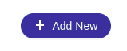

<!--
WARNING: this file was automatically generated by Mia-Platform Doc Aggregator.
DO NOT MODIFY IT BY HAND.
Instead, modify the source file and run the aggregator to regenerate this file.
-->

<!--
WARNING:
This file is automatically generated. Please edit the 'README' file of the corresponding component and run `yarn copy:docs`
-->


[loading-data]: ../70_events.md#loading-data
[nested-navigation-state/back]: ../70_events.md#nested-navigation-state---back
[nested-navigation-state/push]: ../70_events.md#nested-navigation-state---push
[add-new]: ../70_events.md#add-new


```html
<bk-add-new-button></bk-add-new-button>
```


Renders a button. Upon clicking, other components are notified that an item needs to be created.

<!-- TODO Add link to CRUD flow for creating new items -->

## How to configure

Basic usage of the Add New Button does not require any specific configuration.

```json
{
  "tag": "bk-add-new-button"
}
```

### Initial values

Initial values to be appended to the request for creation of the new item can be specified with property `initialValues`.

```json
{
  "tag": "bk-add-new-button",
  "properties": {
    "initialValues": {
      "status": "Sent"
    }
  }
}
```

### Navigate on click

It is possible to set up the Add New Button so that clicking the button triggers to navigate to a specified URL, using property `browseOnButtonClick`.

```json
{
  "tag": "bk-add-new-button",
  "properties": {
    "browseOnButtonClick": {
      "href": "/orders-list"
    }
  }
}
```


## Examples

### Example: Basic Usage with initial values

With such configuration for the Add New Button:
```json
{
  "tag": "bk-add-new-button",
  "properties": {
    "initialValues": {
      "status": "Sent"
    }
  }
}
```
clicking the rendered button requests a new item to be created. The new item should be initialized with field "status" equal to "Sent".

### Example: Navigation

With such configuration for the Add New Button:
```json
{
  "tag": "bk-add-new-button",
  "properties": {
    "browseOnButtonClick": {
      "href": "/orders-list",
      "target": "_blank"
    }
  }
}
```
clicking the rendered button triggers to navigate to route "/orders-list" in a new tab.

## API

### Properties & Attributes

| property | attribute | type | default | description |
|----------|-----------|------|---------|-------------|
|`browseOnButtonClick`| - |[ClickPayload](#clickpayload)|{}|when provided with a valid schema, overrides the button default on-click behavior allowing an `href` linking|
|`initialValues`| - |[AddNewPayload][add-new]|{}|arguments to pass upon click |


#### ClickPayload

```typescript
type ClickPayload = {
  /** Link reference, either relative starting with '/' or absolute */
  href?: string;
  /** Where to open the href. Defaults to _self */
  target?: LinkTarget;
  /** Query params appended to href */
  query?: Record<string, any>;
}
```

### Listens to

| event | action |
|-------|--------|
|[loading-data][loading-data]|sets internal loading state|
|[nested-navigation-state/back][nested-navigation-state/back]|keeps track of navigation steps|
|[nested-navigation-state/push][nested-navigation-state/push]|keeps track of navigation steps|

### Emits

| event | description |
|-------|-------------|
|[add-new][add-new]|notifies the request for creating a new item|
