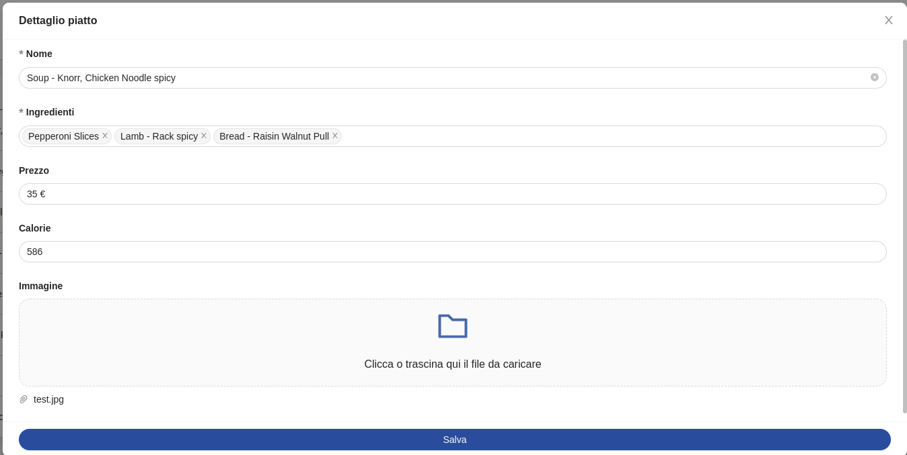
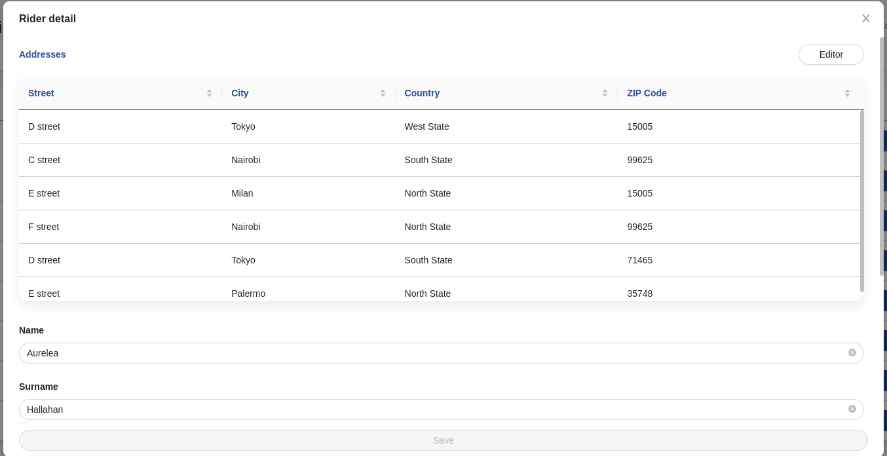
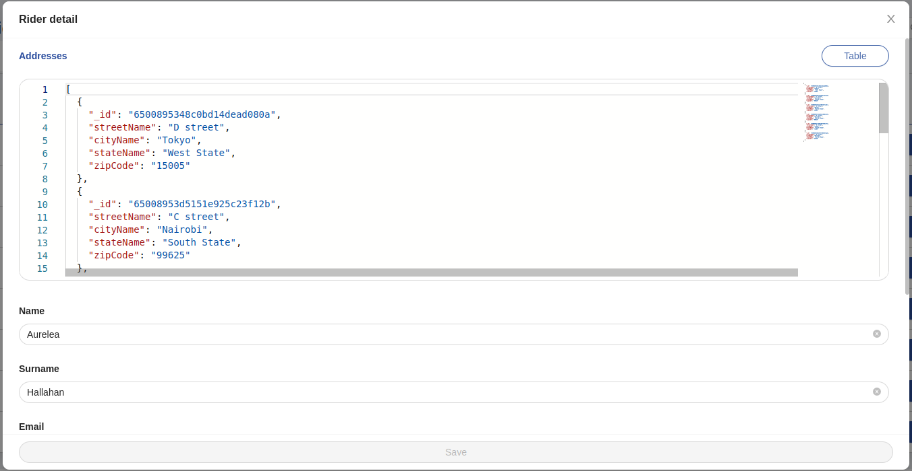

<!--
WARNING: this file was automatically generated by Mia-Platform Doc Aggregator.
DO NOT MODIFY IT BY HAND.
Instead, modify the source file and run the aggregator to regenerate this file.
-->

<!--
WARNING:
This file is automatically generated. Please edit the 'README' file of the corresponding component and run `yarn copy:docs`
-->


[handlebars]: https://handlebarsjs.com/guide/expressions.html
[monaco-editor]: https://microsoft.github.io/monaco-editor/
[csp]: https://developer.mozilla.org/en-US/docs/Web/HTTP/CSP
[micro-lc]: https://micro-lc.io/docs
[microlc-custom-headers]: https://micro-lc.io/add-ons/backend/middleware/#headers
[createObjectURL]: https://developer.mozilla.org/en-US/docs/Web/API/URL/createObjectURL_static

[crud-service]: /runtime_suite/crud-service/10_overview_and_usage.md
[predefined-fields]: /runtime_suite/crud-service/10_overview_and_usage.md
[writable-views]: /runtime_suite/crud-service/50_writable_views.md

[data-schema]: ../30_page_layout.md#data-schema
[nested-schemas]: ../80_examples/20_nested_data.md
[formats]: ../30_page_layout.md#formats

[form-options]: ../30_page_layout.md#form-options
[helpers]: ../40_core_concepts.md#helpers
[localized-text]: ../40_core_concepts.md#localization-and-i18n
[dynamic configurations]: ../40_core_concepts.md#dynamic-configuration
[inline-queries]: ../40_core_concepts.md#inline-queries
[action]: ../50_actions.md
[file-management]: ../80_examples/10_file_management.md
[bk-button]: ./90_button.md
[bk-crud-client]: ./100_crud_client.md
[bk-file-manager]: ./250_file_manager.md
[bk-confirmation-modal]: ./160_confirmation_modal.md
[bk-file-picker-modal]: ./270_file_picker_modal.md
[bk-file-picker-drawer]: ./260_file_picker_drawer.md
[bk-table]: ./510_table.md

[add-new]: ../70_events.md#add-new
[selected-data]: ../70_events.md#selected-data
[require-confirm]: ../70_events.md#require-confirm
[create-data]: ../70_events.md#create-data
[update-data]: ../70_events.md#update-data
[create-data-with-file]: ../70_events.md#create-data-with-file
[update-data-with-file]: ../70_events.md#update-data-with-file
[success]: ../70_events.md#success
[error]: ../70_events.md#error
[nested-navigation-state/push]: ../70_events.md#nested-navigation-state---push
[nested-navigation-state/back]: ../70_events.md#nested-navigation-state---back
[nested-navigation-state/display]: ../70_events.md#nested-navigation-state---dispaly

[lookup-flow]: ../80_examples/40_lookups.md


```html
<bk-dynamic-form-modal></bk-dynamic-form-modal>
```



The Dynamic Form Modal is used to display a modal containing a form to edit or create items described by the `dataSchema`.
Custom behavior can also specified, allowing extra actions to be included in the modal footer via buttons.

The Dynamic Form Modal listens to the [add-new] and [selected-data] events to become visible and initialize its form.

## How to configure

For a basic usage of the Dynamic Form Modal, providing a data-schema to interpret the structure of the data to handle is sufficient.
Several [customizations][data-schema] can be applied to the provided data-schema that tune how the data is handled by the component.
Particularly, but not limited to, every field supports a set of [options][form-options] specific for forms.

```json
{
  "tag": "bk-dynamic-form-modal",
  "properties": {
    "dataSchema": {
      "type": "object",
      "properties": {
        "_id_": {
          "type": "string",
          "formOptions": {
            "hidden": true // no input is rendered for _id field, but the Dynamic Form Modal still holds its value in the internal representation of the form values
          }
        },
        "__STATE__": {
          "type": "string",
          "default": "PUBLIC",
          "enum": [ // enum string fields are rendered as select fields
            "PUBLIC",
            "DRAFT",
            "TRASH"
          ]
        },
        "name": {
          "type": "string"
        },
        "price": {
          "type": "number"
        }
      }
    }
  }
}
```

The Dynamic Form Modal can be opened in two different modes:

- *insert*: submitting the form signals the need for an item creation. This mode is activated upon listening to an [add-new] event
- *edit*: submitting the form signals the need for an item creation. This mode is activated upon listening to an [selected-data] event


### Modes

#### Insert

When the component reacts to the [add-new] event, the modal opens and the form initializes its fields with values specified in the payload of the event. 
In this mode, upon clicking on the submit button of the footer, the Dynamic Form Modal signals the request to push a new item to a CRUD collection, emitting the event [create-data] with payload extracted from the state of the form, particularly its values.
A component such as the [CRUD Client][bk-crud-client] could pick up on the `create-data` event.
If the form contains files, the component emits a [create-data-with-file] event, which signals the need to upload files to a file storage service on top of pushing the item to a CRUD collection.
A component like the [File Manager][bk-file-manager] could listen to this event. Further details on how Back-Kit components can be composed to handle file fields are available in the [specific section][file-management].

A `transactionId` is added to the meta field of the emitted event to handle possible errors.

#### Edit

When the component reacts to the [selected-data] event, the modal opens and the form initializes its fields with the values specified in the payload of the event.

By clicking on the submit button, the Dynamic Form Modal signals the request to update an item in the CRUD collection, emitting the event [update-data] with payload determined the state of the form, particularly its values
The item to update is identified by its `_id` field, which is a [predefined field][predefined-fields] of [Mia Platform's CRUD Service][crud-service] collections.
A component such as the [CRUD Client][bk-crud-client] could pick up on the `update-data` event.
If the form contains files, the component emits a [update-data-with-file] event, which signals the need to upload files to a file storage service on top of updating the item in the CRUD collection.
A component like the [File Manager][bk-file-manager] could listen to this event. Further details on how Back-Kit components can be composed to handle file fields are available in the [specific section][file-management].

A `transactionId` is added to the meta field of the emitted event to handle possible errors.

### Dynamic Context

Several properties of the Dynamic Form Modal allow [dynamic configurations].
By default, such properties are parsed with [handlebars], injecting the current state of the form as context through key `values`, as well as other information.

```typescript
{
  values: Record<string, any>
  currentUser: Record<string, any> // information on currently logged user, if available
}
```

### After Submission

Upon submission, the Dynamic Form Modal signals the need to push or update an item in the collection - depending on the [mode](#modes) it is operating under.
Usually, an HTTP-like client takes care of these operations, like the [CRUD Client][bk-crud-client].
It is often useful to perform follow-up tasks after creation or editing of an item.
Properties `onSuccess` and `onFail` allow to append extra tasks to be executed after the successful or unsuccessful submission of the form.
It is possible to distinguish actions based on what [mode](#modes) the form is operating under.

Properties `onSuccess` and `onFail` should be configured following the [Back-kit Action][action] infterface.

Form context can be used in `onSuccess` and `onFail` properties using `handlebars` notation, allowing [dynamic configurations]. Actions specified with `onSuccess` and `onFail` are parsed with handlebars, injecting the [default context](#dynamic-context), as well as the response of the submission request:

```typescript
{
  currentUser: Record<string, any>
  values: Record<string, any>
  response: Record<string, any>
}
```

where `values` is the form values and `response` contains an object representation of the content of the payload of the [success] event linked to the form submission request.

An [example](#example-chaining-tasks-after-submission) is available showing how to configure a Dynamic Form Modal to perform extra tasks upon submission.

### Footer Buttons

By deafult, a submit button is added to the modal footer, which can be used for signaling the need to add or edit an item in CRUD collection, depending on the operating [mode](#modes).

#### Extra buttons

Other than the default submit button, extra buttons can be specified to be included in the modal footer.
These can be configured with property `actions`, as shows in an [example](#example-adding-extra-buttons-to-footer) below.

The `actions` property can be structured as an array of objects, where each object configures a button. Alternatively, it can provide two arrays that are scoped based on the [operating mode](#modes) of the Dynamic Form Modal.

```json
{
  actions: {
    insert: [
      {
        ... // insert-mode action 1
      },
      {
        ... // insert-mode action 2
      }
    ],
    select: [
      {
        ... // update-mode action 1
      }
    ]
  }
}
```
or
```json
{
  actions: [
    {
      ... // action 1
    },
    {
      ... // action 2
    }
  ]
}
```

Each entry of `actions` supports all properties of the [Button][bk-button] component, with the additional property `closeAfter`, which controls whether or not the modal should be closed after the action is performed (defaults to true).


Actions support [dynamic configurations] and are injected with the [default context](#dynamic-context) of the component, which includes the current form values through `values` keyword.

```json
{
  "tag": "bk-dynamic-form-modal",
  "properties": {
    "dataSchema": {
      "type": "object",
      "properties": {
        "_id": {"type": "string"}
      }
    },
    "actions": [
      {
        "closeAfter": false,
        "content": "Book",
        "action": {
          "type": "http",
          "config": {
            "url": "/new-book",
            "method": "POST",
            "body": {
              "_id": "{{values._id}}"
            }
          }
        }
      }
    ]
  }
}
```

A Dynamic Form Modal that were provided with such `actions` property will add three buttons to the footer of the modal, other than the default button for submission:
  - a button with `Cancel` label which simply closes the modal
  - a button with `Action GET` label which performs a GET request to specified endpoint, and closes the modal afterwards
  - a button with `Action POST` label which performs a POST request to specified endpoint with an object representation of current form values as payload, without closing the modal afterwards

#### Omitting submit button

It is possible to omit the default submission button by setting property `omitSubmit` to true.

### Confirmation dialog on save and on close

It is possible to require confirmation before submitting the form or closing the modal, using the `requireConfirm` property.
`requireConfirm` accepts a boolean or an object value, and defaults to `false`.

It is furthermore possible to scope confirmation request configuration depending on the triggering action, either closing the modal or submitting the form:

```json
{
  "requireConfirm": {
    "onSave": ..., // boolean or object configuration
    "onClose": ... // boolean or object configuration
  }
}
```

An [example](#example-require-confirmation-on-save-and-close) is available shows how to configure the Dynamic Form Modal to require confirmation before saving.

#### 1. Boolean type

If `requireConfirm` is set to true, the Dynamic Form Modal, upon submission or closing, signals that confirmation for an actions is needed with event [require-confirm].
A component such as the [Confirmation Modal][bk-confirmation-modal] could react to the event.

#### 2. Object type

An object such as:
```typescript
{
  cancelText?: LocalizedText // cancel button text
  okText?: LocalizedText     // ok button text
  content?: LocalizedText    // the content text
  title?: LocalizedText      // the title text
}
```
can be provided as value to `requireConfirm`.
[LocalizedText][localized-text] is either a string or an object mapping language acronyms to strings.

```json
{
  "content": {
    "it": "Verrà creato un nuovo elemento, procedere?",
    "en": "A new element will be created, continue?"
  }
}
```

This allows to request customized labels in the confirmation dialog-box.
When structure in this way, the value for property `requireConfirm` is appended to the [require-confirm] event.
If this request is picked up by a component such as the [Confirmation Modal][bk-confirmation-modal], this prompts the user for confirmation via a pop-up dialog-box having the specified labels.


### Integrate custom labels

Custom labels can be specified as [localized text][localized-text], controlling modal title, submit and reset buttons labels.
Such labels can be scoped based on whether the Dynamic Form Modal is in [edit or create mode](#modes).
The provided value for `customLabels` property is merged with the component default labels.

```json
{
  "tag": "bk-dynamic-form-modal",
  "properties": {
    "customLabels": {
      "create": {
        "title": {
          "en": "Add new Order",
          "it": "Aggiungi nuovo ordine"
        }
      },
      "update": {
        "title": {
          "en": "Order Details",
          "it": "Dettaglio ordine"
        }
      }
    }
  }
}
```


An [example](#example-customizing-labels) is available showing how to configure a Dynamic Form Modal to show custom labels.

### Nested objects

By default, the Dynamic Form Modal renders objects and arrays as JSONs inside an [editor][monaco-editor].
This is not true for objects and arrays of specific [formats] such as `file` or `lookup`, and for objects / arrays for which a data-schema is defined.

In particular, properties `allowObjectAsTable` and `allowNavigation` control how object and array fields with a provided `dataSchema`/`items` key (and no specific `format`) are rendered inside the modal.
- `allowObjectAsTable` controls whether or not the nested fields should be rendered as an editor, a read-only table, or both.
- `allowNavigation` allows to emit a [nested-navigation-state/push] event by clicking on the field label, enabling [nested objects navigation][nested-schemas].




<!-- By default, setting `allowNavigation` to true disables editor visualization for nested fields. -->
The following table explains how the two properties interact:

| `allowObjectAsTable` | `allowNavigation` | end result                                                        |
| -------------------- | ----------------- | ----------------------------------------------------------------- |
| true                 | true              | Table visualization only, label can be clicked                    |
| true                 | "show-editor"     | Table + editor, label can be clicked                              |
| true                 | false             | Table + editor, label cannot be clicked                           |
| false                | true              | No table nor editor, label can be clicked (default configuration) |
| false                | "show-editor"     | Editor visualization only, label can be clicked                   |
| false                | false             | Editor visualization only, label cannot be clicked                |

By default, `allowObjectAsTable` is false, `allowNavigation` is true.

:::info
When `allowObjectAsTable` is true, the resulting table supports a subset of the features supported by the [Table][bk-table].
Some of the limitations with respect to the Table include:
  - lookups are not resolved
  - row selection is disabled
  - row click is disabled
:::

### File fields

Fields described in the data-schema as having the type `object` or `array` and format `file` are rendered in the form as drag-and-drop fields.
These fields enable interaction with uploaded files and allow uploading new files.

### Preview file fields

If property `fileFieldsPreview` is set to true, a preview for uploaded image files is provided.

:::caution

Upon uploading a new image file from local storage, the rendered preview is obtained by mounting an `img` html tag with `src` attribute set to the result of applying the [URL.createObjectURL][createObjectURL] facility to the uploaded file. This required to update the [Content Security Policy (CSP)][csp] for HTTP calls, allowing the needed retrieval of `blob:` files. The following CSP rules should be appended:

```
img-src blob:
```

For example, if the plugin orchestration is managed by [micro-lc][micro-lc] (version 2 or higher), additional CSP rules [can be configured][microlc-custom-headers] in its backend thorugh property `publicHeadersMap`. For instance:

```json
{
  "publicHeadersMap": {
    "/public/index.html": {
      "content-security-policy": [
        [
          "script-src 'nonce-**CSP_NONCE**' 'strict-dynamic' 'unsafe-eval'",
          "style-src 'self' 'unsafe-inline'",
          "img-src 'self' https: blob:",
          "object-src 'none'",
          "font-src 'self'",
          "worker-src 'self' blob:",
          "base-uri 'self'"
        ]
      ],
      ...
    }
  }
}
```

:::

### File fields with meta-data

However, when file fields include a `dataSchema` or `items` property, they are presented within the form as a link along with a button.

The link enables the downloading of the files present in the initial values of the form.
Clicking the button triggers the appearance of components such as [File Picker Modal][bk-file-picker-modal] or [File Picker Modal][bk-file-picker-drawer], provided they are included in the plugin configuration.
Both the File Picker Modal and File Picker Modal offer interaction with the uploaded files and the option to set metadata for newly uploaded files. In this context, the `dataSchema` and `items` properties define the structure of the associated file metadata.

Upon submission, the form initiates a request to push or update data within a CRUD collection and upload new files to a file storage service.
This is accomplished by emitting either a [create-data-with-file] or an [update-data-with-file] event, which can be intercepted by components like the [File Manager][bk-file-manager].


### Working with Views

The Dynamic Form Modal can be used with data from [Mia-Platform CRUD Service views][writable-views].

#### Lookups

:::info
More in detail information is available with respect to lookup fields from writable views in the [dedicated section][lookup-flow].
:::

Fields described inside the data-schema as having type `object` or `array` and format `lookup` are rendered respectively as select and multi-select fields in the form.

Options for such fields are dynamically fetched from the endpoint specified in `basePath` property, using the `/lookup` route provided by the CRUD service (version 6.9.0 or higher), which returns a list of objects. Each option fetched like this should have at least a `label` field, which is used as display value inside the form, and a `value` field which is used as unique identifier for such option.

The form stores selected values for lookup fields in their whole (not just `label` and `value` fields). Extra fields are thus available in submit payload, as well as in form [context](#dynamic-context).

Extra queries can be specified to be applied when fetching options using property `lookupQueries`, which maps ids of lookup fields to ;`MongoDB`-like queries. [Dynamic values][dynamic configurations] are also available in property `lookupQueries`, being provided with [form context](#dynamic-context). An [example](#example-lookup-queries) is available.

### Conditional Fields

#### Conditionally hide/disable fields

Property `conditionalOptions` allows to specify dynamic conditions for specific extra [form-options] to be applied.
This allows to dynamically hide, set to readonly, or disable fields based on the value of the fields within the form.


Property `conditionalOptions` expects an array of objects with fields:
  - `property`: id of the target field to which extra form-options might be applied
  - `query`: the `MongoDB`-like [query][inline-queries] to be used against the current form values in order to establish whether or not to apply the extra form-options to the target field.
  If the query condition is satisfied by the current form values, form-options are applied.
  Note that dynamic values can be used to compare values of two entries of the form, via the [context injected](#dynamic-context) by the form.
  - `option`: the form-options value to be dynamically injected to the target field

Updating form fields triggers new evaluation of the conditional options, thus updating the form fields accordingly when necessary.

An [example](#example-conditionally-disable-a-field) is available.

#### Conditionally reset fields value

For each field it is possible to specify dynamic validity conditions which depend on other fields of the form using the property `conditionalValues`. Fields that do not meet specified conditions have their value reset.

Property `conditionalValues` expects an array of objects with fields:
  - `property`: id of the target field of which to check the value
  - `query`: the MongoDB-like [query][inline-queries] to be used against current form values in order to establish whether or not to reset the value of the target field.
  As long as the query condition is satisfied by the current form values, the field value is considered valid.
  Once this is no longer the case, the field value is reset.
  Note that dynamic values can be used to compare values of two entries of the form, via the [context injected](#dynamic-context) by the form.

Updating form fields triggers new evaluation of the conditional values, thus updating the form fields accordingly when necessary.

:::info
Each entry of an array field is singularly matched against the query. Only invalid entries are removed from the array value.
:::

```typescript
type ConditionalOption: {
  property: string
  query: Record<string, unknown>
}
```

```json
{
  "conditionalValues": [
    {
      "property": "city",
      "query": {
        "city.countryName": {
          "$eq": "country" // `city` is an object field with a `countryName` key. If city.countryName is not equal to the value of `country` form field, `city` field is reset.
        }
      }
    },
    {
      "property": "dishes", // dishes is an array. Each entry of dishes is singularly matched against the query!
      "query": {
        "calories": {
          "$lt": "{{rawObject context.maxCalories}}" // assuming dishes is an array of objects, entries of dishes that have a field `calories` grater than the current value of form field `maxCalories` will be automatically removed from the dishes array. Helper `rawObject` is used to avoid numeric values from being stringified
        }
      }
    }
  ]
}
```

For instance, the following form values are valid according to the above configuration:
```json
{
  "country": "Italy",
  "city": {
    "name": "Milano",
    "countryName": "Italy"
  },
  "dishes": [
    {"name": "Tomato", "calories": 30}, 
    {"name": "Pudding", "calories": 300}, 
  ],
  "maxCalories": 400,
}
```

If the value of field "country" were to be updated to "France", the value of "city" field would be reset, since the first entry of `conditionalValues` would be no longer met:
```json
{
  "country": "France",
  // "city" field is now undefined
  "dishes": [
    {"name": "Tomato", "calories": 30}, 
    {"name": "Pudding", "calories": 300}, 
  ],
  "maxCalories": 400,
}
```

If, furthermore, the value of field "maxCalories" were to be updated to "200", the value of "dishes" field would be updated, resulting in one entry being reset:
```json
{
  "country": "France",
  "dishes": [
    {"name": "Tomato", "calories": 30}
  ],
  "maxCalories": 200,
}
```

A complete [example](#example-conditionally-reset-a-field) of configuration for a Dynamic Form Modal that conditionally reset fields is available.

:::info
Each entry of an array field is singularly matched against the query. Only invalid entries are removed from the array value.
:::

## Examples

### Example: Chaining tasks after submission

Properties [`onFail` and `onSubmit`](#after-submission) allow to specify tasks to be executed after the Dynamic Form Modal is submitted.

A Dynamic Form Modal instance configured like:

```json
{
  "tag": "bk-dynamic-form-modal",
  "properties": {
    "dataSchema": {
      "type": "object",
      "properties": {
        "_id": {"type": "string"}
      }
    },
    "onSuccess": {
      "type": "file-download",
      "config": {
        "url": "/latest-report"
      }
    },
    "onFail": {
      "insert": {
        "type": "push",
        "config": {
          "url": "/insert-error-faq"
        }
      },
      "select": {
        "type": "push",
        "config": {
          "url": "/edit-error-faq"
        }
      }
    }
  }
}
```
downloads a file form "/latest-report" path on successful form submission, while in case of error navigates to either "/insert-error-faq" or "/edit-error-faq", depending on the [operaing mode](#modes).

`onFail` and `onSuccess` support [dynamic configurations]:

```json
{
  "tag": "bk-dynamic-form-modal",
  "properties": {
    "dataSchema": {
      "type": "object",
      "properties": {
        "_id": {"type": "string"}
      }
    },
    "onSuccess": {
      "type": "push",
      "config": {
        "url": "/orders-details/{{response._id}}"
      }
    }
  }
}
```
The example is a Dynamic Form Modal that, after successful submission, navigates to a path that depends on the response of the linked operation (data update or create).

### Example: Adding extra buttons to footer

A Dynamic Form Modal that were provided with an `actions` property like:
```json
{
  "tag": "bk-dynamic-form-modal",
  "properties": {
    "dataSchema": {
      "type": "object",
      "properties": {
        "_id": {"type": "string"}
      }
    },
    "actions": {
      "insert": [
        {
          "content": "Get Orders",
          "action": {
            "type": "http",
            "config": {
              "url": "/orders",
              "method": "GET"
            }
          }
        }
      ],
      "select": [
        {
          "closeAfter": false,
          "content": "Add Order",
          "action": {
            "type": "http",
            "config": {
              "url": "/orders/new",
              "method": "POST",
              "body": "{{rawObject values}}"
            }
          }
        }
      ]
    }
  }
}
```
adds one buttons to the footer of the modal, other than the default button for submission:
  - if the Dynamic From Modal is operatin under [*insert* mode](#modes), an extra button with label `Get Orders` which performs a GET request to specified endpoint is added to the footer. Clicking this button closes the modal.
  - if the Dynamic From Modal is operatin under [*edit* mode](#modes), an extra button with label `Add Order` which performs a POST request to specified endpoint with an object representation of current form values as payload.
  Clicking this button does not close the modal (`closeAfter` is false).

:::info
[rawObject][helpers] is a helper keyword that prevents "values" from being stringified in the body of the request.
:::


### Example: Require confirmation on save and close

The Dynamic Form Modal can [request confirmation](#confirmation-dialog-on-save-and-on-close) before submitting the form or closing the modal.

- With the following configuration:
  ```json
  {
    "tag": "bk-dynamic-form-modal",
    "properties": {
      "dataSchema": {
        "type": "object",
        "properties": {
          "_id": {"type": "string"}
        }
      },
      "requireConfirm": true
    }
  }
  ```
  closing or submitting triggers the Dynamic Form Modal to signal the need for user confirmation about an action with a [require-confirm] event.


- With the following configuration:
  ```json
  {
    "tag": "bk-dynamic-form-modal",
    "properties": {
      "dataSchema": {
        "type": "object",
        "properties": {
          "_id": {"type": "string"}
        }
      },
      "requireConfirm": {
        "title": {
          "it": "Richiesta conferma",
          "en": "Confirmation Reqired"
        },
        "okText": "OK"
      }
    }
  }
  ```
  closing or submitting triggers the Dynamic Form Modal to signal the need for user confirmation about an action with a [require-confirm] event, and appends to the this request the specified [internationalized][localized-text] labels.

- With the following configuration:
  ```json
  {
    "tag": "bk-dynamic-form-modal",
    "properties": {
      "dataSchema": {
        "type": "object",
        "properties": {
          "_id": {"type": "string"}
        }
      },
      "requireConfirm": {
        "onSave": {
          "content": {
            "it": "Verrà creato un nuovo ordine, procedere?",
            "en": "A new order will be created, continue?"
          },
          "okText": "OK"
        },
        "onClose": true
      }
    }
  }
  ```
  closing or submitting triggers the Dynamic Form Modal to signal the need for user confirmation about an action with a [require-confirm] event. Only in case of form submission, the Dynamic Form Modal appends specified [internationalized][localized-text] labels to the request.


### Example: Customizing labels

The Dynamic Form Modal allows to customize its title, CTA and reset buttons labels, also distinguishing between [operating mode](#modes).

For instance:

```json
{
  "tag": "bk-dynamic-form-modal",
  "properties": {
    "dataSchema": {
      "type": "object",
      "properties": {
        "_id": {"type": "string"}
      }
    },
    "customLabels": {
      "create": {
        "title": {
          "en": "Add new order",
          "it": "Aggiungi nuovo ordine"
        },
        "ctaLabel": {
          "en": "Submit",
          "it": "Submit Order"
        },
        "cancelButton": {
          "en": "Cancel",
          "it": "Cancel"
        },
        "unsavedChangesContent": {
          "en": "Closing now will discard new order, do you want to continue?",
          "it": "Chiudendo ora si perderà l'ordine non salvato, procedere?"
        },
        "saveChangesContent": {
          "en": "A new order will be created, continue?",
          "it": "Verrà creato un nuovo ordine, procedere?"
        }
      },
      "update": {
        "title": {
          "en": "Order detail",
          "it": "Dettaglio ordine"
        },
        "ctaLabel": {
          "en": "Update Order",
          "it": "Salva Ordine"
        },
        "cancelButton": {
          "en": "Cancel",
          "it": "Cancel"
        },
        "unsavedChangesContent": {
          "en": "Closing now will discard changes to the order, do you want to continue?",
          "it": "Chiudendo ora si perderanno tutte le modifiche non salvate all'ordine, procedere?"
        },
        "saveChangesContent": {
          "en": "The order will be updated, continue?",
          "it": "L'ordine sarà modificato, procedere?"
        }
      }
    }
  }
}
```

Note that not all labels need to be specified when configuring property `customLabels`, as this is merged with default labels.
For instance:

```json
{
  "tag": "bk-dynamic-form-modal",
  "properties": {
    "dataSchema": {
      "type": "object",
      "properties": {
        "_id": {"type": "string"}
      }
    },
    "customLabels": {
      "title": {
        "en": "Order",
        "it": "Ordine"
      }
    }
  }
}
```

The specified title will be applied to the modal independently of the operating mode.

### Example: Working with views

The Dynamic Form Modal should be provided with a value for the `basePath` property when it should interact with data coming form [writable views][writable-views].

```json
{
  "tag": "bk-dynamic-form-modal",
  "properties": {
    "dataSchema": {
      "type": "object",
      "properties": {
        "name": {"type": "string"},
        "rider": {
          "type": "object",
          "format": "lookup"
        }
      }
    },
    "basePath": "/orders-view"
  }
}
```
- being "rider" an `object` field with `lookup` format, is rendered as a select field
- options for "rider" select field are dynamically fetched from `/orders-view/lookup/rider`

### Example: Lookup Queries

A Dynamic Form Modal configured like the following
```json
{
  "tag": "bk-dynamic-form-modal",
  "properties": {
    "dataSchema": {
      "type": "object",
      "properties": {
        "dishes": { "type": "array", "format": "lookup" },
        "maxCalories": { "type": "number" }
      }
    },
    "basePath": "/orders",
    "lookupQueries": {
      "dishes": {
        "calories": {
          "$lt": 300
        }
      }
    }
  }
}
```
fetches options for field "dishes" from `orders/lookup/dishes` with the additional condition that "calories" field of dishes collection should be lower than 300, expressed in the query parameters of the request.

Dynamic queries are also available, being provided with [form context](#dynamic-context):
```json
{
  "tag": "bk-dynamic-form-modal",
  "properties": {
    "dataSchema": {
      "type": "object",
      "properties": {
        "dishes": { "type": "array", "format": "lookup" },
        "maxCalories": { "type": "number" }
      }
    },
    "basePath": "/orders",
    "lookupQueries": {
      "dishes": {
        "calories": {
          "$lt": "{{rawObject maxCalories}}" // rawObject can be used to prevent numeric values from being stringified
        }
      }
    }
  }
}
```
in this case, form field "maxCalories" is used to dynamically compute the additional query to use when fetching options for "dishes" lookup field.

:::info
In the previous example, [helper][helpers] `rawObject` is used to avoid numeric values from being stringified
:::

### Example: Conditionally disable a field

Let us assume a Dynamic Form Modal to be configured like the following:

```json
{
  "tag": "bk-dynamic-form-modal",
  "properties": {
    "dataSchema": {
      "type": "object",
      "properties": {
        "items": {"type": "array"},
        "budget": {"type": "number"},
        "totalPrice": {"type": "number"},
        "isGift": {"type": "boolean"},
        "status": {"type": "string", "enum": ["Available", "OutOfStock"]}
      }
    },
    "conditionalOptions": [
      {
        "property": "items",
        "query": {
          "budget": {
            "$lt": "{{rawObject values.totalPrice}}"
          }
        },
        "option": {
          "disable": true
        }
      },
      {
        "property": "isGift",
        "query": {
          "$or": [
            {"status": {"$eq": "OutOfStock"}},
            {"budget": {"$lt": "{{rawObject context.totalPrice}}"}}
          ]
        },
        "option": {
          "hidden": true
        }
      }
    ]
  }
}
```

:::info
In this instance, [helper][helpers] `rawObject` is used to avoid numeric values from being stringified
:::

Notice how [dynamic configurations] can be used in defining queries, which allow to compare values of two entries of the form.
In this case, the `budget` field is compared to the `totalPrice` one.

Using such configuration, field "items" is disabled once field "budget" is lower than field "totalPrice":
```json
{
  "items": ["fork", "spoon", "napkins"],
  "totalPrice": 15,
  "budget": 7
}
```

Once "budget" field is updated to "20", field "items" is no longer disabled.


### Example: Conditionally reset a field

Let us assume a Dynamic Form Modal to be configured like the following:
```json
{
  "tag": "bk-dynamic-form-modal",
  "properties": {
    "dataSchema": {
      "type": "object",
      "properties": {
        "city": {
          "type": "object",
          "dataSchema": {
            "type": "object",
            "properties": {
              "name": {"type": "string"},
              "countryName": {"type": "string"}
            }
          }
        },
        "country": {"type": "string"},
        "dishes": {
          "type": "array",
          "items": {
            "type": "object",
            "properties": {
              "name": {"type": "string"},
              "calories": {"type": "number"}
            }
          }
        },
        "maxCalories": {"type": "number"}
      }
    },
    "conditionalValues": [
      {
        "property": "city",
        "query": {
          "city.countryName": {
            "$eq": "country"
          }
        }
      },
      {
        "property": "dishes",
        "query": {
          "calories": {
            "$lt": "{{rawObject context.maxCalories}}"
          }
        }
      }
    ]
  }
}
```
`conditionalValues` sets the following conditions:
  - `city` is an object field with a `countryName` key. If `city.countryName` is not equal to the value of `country` form field, `city` field is reset
  - `dishes` is an array of object field. Each entry of `dishes` is singularly matched against the specified query.
    Entries of dishes that have a field `calories` grater than the current value of the form field `maxCalories` are automatically removed from the `dishes` array.

:::info
In this instance, [helper][helpers] `rawObject` is used to avoid numeric values from being stringified
:::

Then, the following form values are valid according to the above configuration:
```json
{
  "country": "Italy",
  "city": {
    "name": "Milano",
    "countryName": "Italy"
  },
  "dishes": [
    {"name": "Tomato", "calories": 30}, 
    {"name": "Pudding", "calories": 300}, 
  ],
  "maxCalories": 400,
}
```

If the value of field "country" were to be updated to "France", the value of "city" field would be reset, since the first entry of `conditionalValues` would be no longer met:
```json
{
  "country": "France",
  // "city" field is now undefined
  "dishes": [
    {"name": "Tomato", "calories": 30}, 
    {"name": "Pudding", "calories": 300}, 
  ],
  "maxCalories": 400,
}
```

If, furthermore, the value of field "maxCalories" were to be updated to "200", the value of "dishes" field would be updated, resulting in one entry being reset:
```json
{
  "country": "France",
  "dishes": [
    {"name": "Tomato", "calories": 30}
  ],
  "maxCalories": 200,
}
```
Note how each entry of array fields is singularly matched against the query. Only invalid entries are removed from the array value.

## API

### Properties & Attributes


| Property | Attribute | Type | Default | Description |
| --- | --- | --- | --- | --- |
| `rootElementSelector` | `root-element-selector` | string | - | Selector to specify where the container should be appended |
| `dataSchema` | - | [ExtendedJSONSchema7Definition][data-schema] | - | Data schema describing the fields of the collection to filter |
| `allowObjectAsTable` | `allow-object-as-table` | boolean | false | Allows visualizing objects and arrays without specific format and a data schema in both an editor and read-only table |
| `readonlyOnView` | `read-only-on-view` | boolean | false | Upon marking this prop as true, on selecting a record, the form will be displayed as readonly, with no possibility to edit |
| `editorHeight` | `editor-height` | string \| number | - | Height of the object/array editor field |
| `allowNavigation` | `allow-navigation` | boolean \| 'show-editor' | true | When true, objects and arrays are displayed as a clickable label which allows navigating to nested objects and arrays if a dataSchema is specified. When 'show-editor', the navigation is allowed, and the object/array fields are displayed in a JSON editor. When false, the navigation is not allowed, and the object/array fields are displayed in a JSON editor |
| `width` | - | string \| number | - | Width of the modal |
| `height` | - | string \| number | - | Height of the modal |
| `omitSubmit` | `omit-submit` | boolean | false | Whether or not to include the default submit button |
| `actions` | - | [ButtonWithClose](#buttonwithclose)[] \| {insert: ButtonWithClose[]; select: ButtonWithClose[]} | - | Actions added as buttons to the footer |
| `liveSearchItemsLimit` | `live-search-items-limit` | number | 10 | Max items to fetch on regex live search |
| `customLabels` | - | [CustomLabels](#customlabels) \| {insert: CustomLabels, update: CustomLabels} | - | Custom localized texts shown as title and CTA button label |
| `requireConfirm` | - | boolean \| [RequireConfirmOpts](#requireconfirmopts) \| {onSave: RequireConfirmOpts, onSave: RequireConfirmOpts} | false | Whether or not the component should request confirmation before closing and/or before saving |
| `onSuccess` | - | [Action][action][] \| {insert: Action[], update: Action[]} | - | Action executed after successful submit |
| `onFail` | - | [Action][action][] \| {insert: Action[], update: Action[]} | - | Action executed after failing submit |
| `lookupQueries` | - | [LookupQueries](#lookupqueries) | - | Extra queries when fetching options for lookup fields in [views](#working-with-views) |
| `conditionalOptions` | - | [ConditionalOption](#conditionaloption)[] | - | Allows specifying dynamic conditions for form-options (hidden / disabled / readonly) to be applied |
| `conditionalValues` | - | [Condition](#condition)[] | - | Allows specifying dynamic conditions for resetting field |
| `fileFieldsPreview` | `file-fields-preview` | boolean | - | Enables preview of uploaded files in drag-n-drop file fields |
| `enableSubmitOnFormUntouched` | `enable-submit-on-form-untouched` | boolean | - | Allows submitting an unedited form |
| `basePath` | - | string | - | The URL base path to which to send HTTP requests, used when fetching options for lookup field in [views](#working-with-views) |

#### ButtonWithClose

```typescript
type ButtonWithClose = Partial<BkButton> & {
  closeAfter?: boolean
}
```
where BkButton references the properties of the [Button][bk-button] component.

#### RequireConfirmOpts

```typescript
type RequireConfirmOpts = boolean | {
  cancelText?: LocalizedText
  okText?: LocalizedText
  content?: LocalizedText
  title?: LocalizedText
}
```

where [LocalizedText][localized-text] is either a string or an object mapping language acronyms to strings.

#### CustomLabels

```typescript
type CustomLabels = {
  title?: LocalizedText
  ctaLabel?: LocalizedText
  saveChangesContent?: LocalizedText
  unsavedChangesContent?: LocalizedText
}
```

where [LocalizedText][localized-text] is either a string or an object mapping language acronyms to strings.

#### LookupQueries

```typescript
type LookupQueries = {
  [property: string]: Record<string, unknown> | Record<string, unknown>[]
}
```

#### ConditionalOption

```typescript
type ConditionalOption = {
  property: string
  query: Record<string, unknown>
  option: RHDOptions
}

type RHDOptions = {
    hidden?: boolean;
    hiddenOnUpdate?: boolean;
    hiddenOnInsert?: boolean;
  } & {
    readOnly?: boolean;
    readOnlyOnUpdate?: boolean;
    readOnlyOnInsert?: boolean;
  } & {
    disabled?: boolean;
    disabledOnUpdate?: boolean;
    disabledOnInsert?: boolean;
  }
```

#### Condition

```typescript
type Condition = {
  property: string
  query: Record<string, unknown>
}
```

### Listens to

| event                             | action                                                                                                                                                                                          |
| --------------------------------- | ----------------------------------------------------------------------------------------------------------------------------------------------------------------------------------------------- |
| [add-new]                         | opens the modal to create a new item, potentially applying default fields from data schema or data provided in the payload of the event                                                         |
| [selected-data]                   | opens the modal to edit a selected item, filling in its fields from the data provided in the payload of the event                                                                               |
| [nested-navigation-state/push]    | updates internal representation of the current navigation path by adding one step                                                                                                               |
| [nested-navigation-state/back]    | updates internal representation of the current navigation path by removing the specified number of steps                                                                                        |
| [nested-navigation-state/display] | updates internal representation of the current navigation and closes the modal                                                                                                                  |
| [success]                         | notifies correct data update as a result of form submission. Payload holds the response of the associated HTTP call and is accessible by action in `onSuccess` property via `response` keyword. |
| [error]                           | notifies that something went wrong during form submission. Payload holds the response of the associated HTTP call and is accessible by action in `onFail` property via `response` keyword.      |

### Emits


| event                   | description                                                                                                             |
| ----------------------- | ----------------------------------------------------------------------------------------------------------------------- |
| configurable event      | properties such as `onFail`, `onSuccess` or `actions` allow to emit custom events                                       |
| [require-confirm]       | triggered when trying to close the modal with unsaved data. `requireConfirm` property allows to customize this behavior |
| [create-data]           | requests data creation                                                                                                  |
| [update-data]           | requests data update                                                                                                    |
| [create-data-with-file] | requests data creation and file upload                                                                                  |
| [update-data-with-file] | requests data update and file upload                                                                                    |
