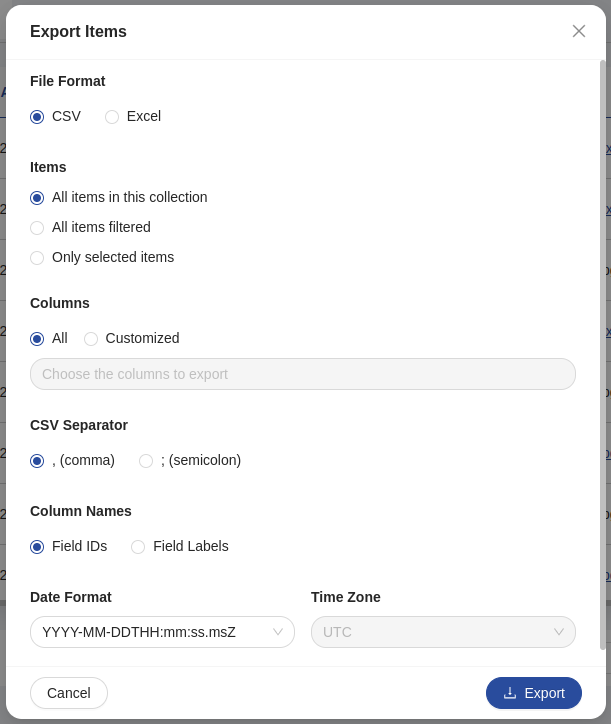

<!--
WARNING: this file was automatically generated by Mia-Platform Doc Aggregator.
DO NOT MODIFY IT BY HAND.
Instead, modify the source file and run the aggregator to regenerate this file.
-->

<!--
WARNING:
This file is automatically generated. Please edit the 'README' file of the corresponding component and run `yarn copy:docs`
-->

[bk-export-client]: ./120_crud_export_client.md
[format-specifiers]: https://www.mongodb.com/docs/manual/reference/operator/aggregation/dateToString/#std-label-format-specifiers
[UTC-offsets]: https://en.wikipedia.org/wiki/List_of_UTC_offsets
[Olson-timezone-identifier]: https://en.wikipedia.org/wiki/List_of_tz_database_time_zones


[export-data]: ../70_events.md#export-data
[export-data/request-config]: ../70_events.md#export-data---request-config
[export-data/user-config]: ../70_events.md#export-data---user-config




```html
<bk-export-modal></bk-export-modal>
```

The Export Modal renders a form inside a modal with standard fields that allow user to configure a data export task.

It opens whenever a component signals the need to specify configuration for an export task. That is, whenever a [export-data/request-config] event is received.

It is usually best to have this event emitted by a component like the [CRUD Export Client][bk-export-client], which uses it to open the modal with an associated `transactionId`.
For instance, the [CRUD Export Client][bk-export-client] emits a [export-data/request-config] event upon listening to an [export-data] event.
<!-- TODO add link to export flow -->

The Export Modal allows the user to specify:
  - the format onto which data should be exported ("csv" or "xlsx")
  - what fiters to apply to the data to be exported. Options are to export the whole collection, to apply the same filters that have been applied to the current visualization of the collection, to export selected items only
  - what fields of the collection to include in the export result
  - if the specified format is "csv", what separator to use (comma or semicolon)
  - the date format of each date type field, if any
  - the date time zone of each date type field, if any 

Upon submitting the form, the Export Modal signals the need to export data accordingly with the specified options.
A component like the [CRUD Export Client][bk-export-client] might pick up on the export request.


## How to configure

The Export Modal does not require any particular configuration, however it is possible to specify the options for the date format and date time zone select inputs.

```json
{
  "tag": "bk-export-modal"
}
```

### Date format options

To specify the options for the date format select inputs, `dateFormatOptions` must be used. The default is `YYYY-MM-DDTHH:mm:ss.msZ`.
They accept an array of `Options`:

```typescript
type Option = {
  label: string
  value: string
}
```

The value must be a `MongoDB` supported format. See [Format Specifiers][format-specifiers] for more information.

```json
{
  "tag": "bk-export-modal",
  "properties": {
    "dateFormatOptions": [
      {"value": "%d-%m-%Y", "label": "DD-MM-YYYY"}
    ]
  }
}
```

### Time zone options

To specify the options for the date time zone, `dateTimeZoneOptions` must be used. The default is `UTC time`.

It is an array of `Option` like the one described above. The value must be an [UTC Offsets][UTC-offsets] or a [Olson Timezone Identifier][Olson-timezone-identifier].

```json
{
  "tag": "bk-export-modal",
  "properties": {
    "dateTimeZoneOptions": [
      {"value": "+01:00", "label": "(GMT +01:00) Berlin/Rome"},
      {"value": "Africa/Cairo", "label": "Cairo"}
    ]
  }
}
```


### Locale

The texts of the Export Modal can be customized through the property `customLocale`, which accepts an object shaped like the following:

```typescript
type Locale = {
  modalTitle: LocalizedText
  fileFormat: LocalizedText
  fileFormatCSVOption: LocalizedText
  fileFormatExcelOption: LocalizedText
  items: LocalizedText
  itemsAllOption: LocalizedText
  itemsFilteredOption: LocalizedText
  itemsSelectedOption: LocalizedText
  columns: LocalizedText
  columnsAllOption: LocalizedText
  columnsCustomizedOption: LocalizedText
  columnsCustomizedPlaceholeder: LocalizedText
  csvSeparator: LocalizedText
  csvSeparatorCommaOption: LocalizedText
  csvSeparatorSemicolonOption: LocalizedText
  okButton: LocalizedText
  cancelButton: LocalizedText
  columnsName: LocalizedText
  columnNameIdOption: LocalizedText
  columnNameLabelOption: LocalizedText
  format: string
  formatCustomizedPlaceholder: string
  timezone: string,
  timezoneCustomizedPlaceholder: string
}
```

## API

### Properties & Attributes

| property            | attribute | type             | default | description                                 |
| ------------------- | --------- | ---------------- | ------- | ------------------------------------------- |
| dateFormatOptions   |     -     | Option[] | [{value: '%Y-%m-%d', label: 'YYYY-MM-DD'}, {value: '%Y-%m-%d %H:%M', label: 'YYYY-MM-DD HH:mm'}] | The list of options for the date format select |
| dateTimeZoneOptions |     -     | Option[] | [{value: '\<the-current-timezone\>', label: '\<the-current-timezone-name\>'}] | The list of options for the date time zone select |

### Listens to

| event                        | action                |
| ---------------------------- | --------------------- |
| [export-data/request-config] | prompts modal opening |


### Emits

| event                     | description                                               |
| ------------------------- | --------------------------------------------------------- |
| [export-data/user-config] | notifies the bus of user config for next export data task |
