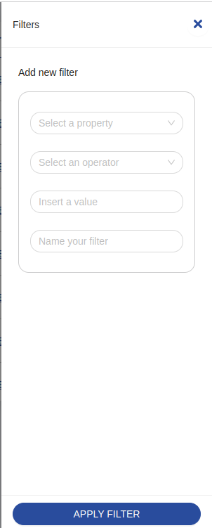

<!--
WARNING:
This file is automatically generated. Please edit the 'README' file of the corresponding component and run `yarn copy:docs`
-->

<<<<<<< HEAD:docs/microfrontend-composer/back-kit/60_components/290_filter_drawer.md
[img-bk-filter-drawer]: img/bk-filter-drawer.png
=======

>>>>>>> main:docs/business_suite/backoffice/60_components/290_filter_drawer.md
[crud-service]: /runtime_suite/crud-service/10_overview_and_usage.md
[writable-views]: /runtime_suite/crud-service/50_writable_views.md

[data-schema]: ../30_page_layout.md#data-schema
[filters-options]: ../30_page_layout.md#filters-options
[filter-operators]: ../40_core_concepts.md#filter-operators
[filter]: ../40_core_concepts.md#filters

[add-filter]: ../70_events.md#add-filter
[filter]: ../70_events.md#filter
[change-filter]: ../70_events.md#change-filter
[lookup-data]: ../70_events.md#lookup-data
[loading-data]: ../70_events.md#loading-data

[bk-filters-manager]: ./300_filters_manager.md


```html
<bk-filter-drawer></bk-filter-drawer>
```

<<<<<<< HEAD:docs/microfrontend-composer/back-kit/60_components/290_filter_drawer.md
![filter-drawer][img-bk-filter-drawer]
=======

>>>>>>> main:docs/business_suite/backoffice/60_components/290_filter_drawer.md

The Filter Drawer allows to compile a [filter] and signal the need for it to be applied on top of the already applied filters.
In particular, submitting the Filter Drawer injects the compiled filter into the payload of an [add-filter] event, which is listened by components such as the [Filters Manger][bk-filters-manager].

The Filter Drawer becomes visible whenever the request to provide support for applying filters is signaled.
That is, whenever events [filter] or [change-filter] are received.
The [change-filter] event allows to carry an object representation of a filter in its payload that is used by the Filter Drawer to initialize its fields.


## How to configure

For its most basic usage, the Filter Drawer requires a [data-schema] describing the fields of the collection to filter.

```json
{
  "tag": "bk-filter-drawer",
  "properties": {
    "dataSchema": {
      "type": "object",
      "properties": {
        "_id": {"type": "string"},
        "name": {"type": "string"}
      }
    }
  }
}
```

### Filters Options

[Data-schema][data-schema] supports [options][filters-options] that are specific for how the data should be interpreted within the context of data filtering.

In particular,
  - `hidden` controls whether the property should not be available to be selected for compiling a filter
  - `availableOperators` controls what [operators][filter-operators] should be available for the given property.
  Note that the type of each property also limits the available operators


### Lookup fields (writable views)

The Filter Drawer renders the filter value field as a select or a multi-select for fields described inside the data-schema as having type `object` or `array` and format `lookup`.

Options for such fields will be dynamically fetched from the endpoint specified in `basePath` property, using the `/lookup` route provided by the [CRUD Service][crud-service] to [writable views][writable-views] (version 6.9.0 or higher) , which returns a list of objects.
Each option fetched like this should have at least a `label` field, which is used as display value inside the form, and a `value` field which is used as unique identifier for such option.

## Examples

### Example: Basic Usage

Through a Filter Drawer configured like:

```json
{
  "tag": "bk-filter-drawer",
  "properties": {
    "dataSchema": {
      "type": "object",
      "properties": {
        "name": {"type": "string"},
        "price": {"type": "number"}
      }
    }
  }
}
```

it is possible to create a filter on property "name" and a filter on property "price".
After selecting the desired property, the Filter Drawer allows to select an [operator][filter-operators] for the filter among those that are compatible with the property type.
Finally, a value can be provided. The kind input field to provide the value changes according to the [type and format][data-schema] of the selected property, as well as the operator.
Upon submission, the resulting filter is propagated through the payload of an [add-filter] event. For instance,

```json
{
  "label": "add-filter",
  "payload": {
    "property": "name",
    "operator": "contains",
    "value": "Smith"
  }
}
```

### Example: Filters options

With a Filter Drawer configured like:

```json
{
  "tag": "bk-filter-drawer",
  "properties": {
    "dataSchema": {
      "type": "object",
      "properties": {
        "name": {
          "type": "string",
          "filtersOptions": {
            "hidden": true
          }
        },
        "price": {
          "type": "number",
          "filtersOptions": {
            "availableOperators": ["equals", "doesNotEqual"]
          }
        }
      }
    }
  }
}
```

Due to the value of `filtersOptions` fields in the data-schema, it is possible to compile a filter only for property "price", and only based on operators "equal" and "doesNotEqual".

## API

### Properties & Attributes


| property               | attribute                 | type                                         | default | description                                                  |
| ---------------------- | ------------------------- | -------------------------------------------- | ------- | ------------------------------------------------------------ |
| `dataSchema`           | -                         | [ExtendedJSONSchema7Definition][data-schema] | -       | data-schema describing the fields of the collection to query |
| `liveSearchItemsLimit` | `live-search-items-limit` | number                                       | 10      | max items to fetch on regex live search                      |
| `liveSearchTimeout`    | `live-search-timeout`     | number                                       | 5000    | live-search timeout                                          |
| `rootElementSelector`  | `root-element-selector`   | string                                       | -       | root element to append the drawer to                         |
| `width`                | `width`                   | string                                       | -       | width occupied by the component                              |
| `editorHeight`         | `editor-height`           | string \| number                             | -       | height of object/array editor                                |
| `basePath`             | -                         | string                                       | -       | endpoint to use to fetch lookup options                      |

### Listens to


| event           | action                                                            |
| --------------- | ----------------------------------------------------------------- |
| [filter]        | claims the drawer, closing concurrent ones, to enter a new filter |
| [change-filter] | enters filter edit mode                                           |
| [lookup-data]   | receives lookup data                                              |
| [loading-data]  | sets the component to loading state                               |

### Emits


| event        | description                                                    |
| ------------ | -------------------------------------------------------------- |
| [add-filter] | when done filling the form, notices deployment of a new filter |
