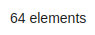

<!--
WARNING:
This file is automatically generated. Please edit the 'README' file of the corresponding component and run `yarn copy:docs`
-->

<<<<<<< HEAD:docs/microfrontend-composer/back-kit/60_components/310_footer_&_item_state.md
[img-bk-footer]: img/bk-footer.png
=======

>>>>>>> main:docs/business_suite/backoffice/60_components/310_footer_&_item_state.md
[crud-service]: /runtime_suite/crud-service/10_overview_and_usage.md
[predefined-fields]: /runtime_suite/crud-service/10_overview_and_usage.md#predefined-collection-properties

[bk-crud-client]: ./100_crud_client.md

[loading-data]: ../70_events.md#loading-data
[count-data]: ../70_events.md#count-data
[selected-data-bulk]: ../70_events.md#selected-data-bulk
[nested-navigation-state/push]: ../70_events.md#nested-navigation-state---push
[nested-navigation-state/back]: ../70_events.md#nested-navigation-state---back
[update-state-bulk]: ../70_events.md#update-state-bulk


```html
<bk-footer></bk-footer>
```

<<<<<<< HEAD:docs/microfrontend-composer/back-kit/60_components/310_footer_&_item_state.md
![footer][img-bk-footer]
=======

>>>>>>> main:docs/business_suite/backoffice/60_components/310_footer_&_item_state.md

The Footer & Item State renders an element counter and button acting on a selected dataset subset. It is designed to be placed as footer of a plugin page.

The Footer & Item State keeps track of selected items monitoring the [selected-data-bulk] event.
When all selected items share the same `__STATE__` field, a button is rendered.
`__STATE__` field is one of the [predefined fields][predefined-fields] in collections handled vis [Mia Platform's CRUD Service][crud-service].
Upon clicking the button, a request is sent to update the `__STATE__` field of selected items in a bulk operation.
This is achieved by the emission of an [update-state-bulk] event.
A component like the [CRUD Client][bk-crud-client] may manage this event.

## How to configure

The Footer & Item State does not require any explicit configuration.

```json
{
  "tag": "bk-footer"
}
```

It is possible to disable the state change functionality by setting `disableStateChange` property to true.

## API

### Properties & Attributes

| property             | attribute              | type    | default |           description                |
| -------------------- | ---------------------- | ------- | ------- | ------------------------------------ |
| `disableStateChange` | `disable-state-change` | boolean | false   | toggles state change functionalities |

### Listens to

| event                          | action                                                                                                |
| ------------------------------ | ----------------------------------------------------------------------------------------------------- |
| [loading-data]                 | sets internal loading state                                                                           |
| [count-data]                   | adjusts footer counter to currently viewed dataset                                                    |
| [selected-data-bulk]           | prepares callToAction on a given dataset subset                                                       |
| [nested-navigation-state/push] | updates internal representation of the current nesting path by adding one step                        |
| [nested-navigation-state/back] | updates internal representation of the current nesting path by removing the specified number of steps |

### Emits

| event               | description                                             |
| ------------------- | ------------------------------------------------------- |
| [update-state-bulk] | Updates the state of selected items in a bulk operation |
