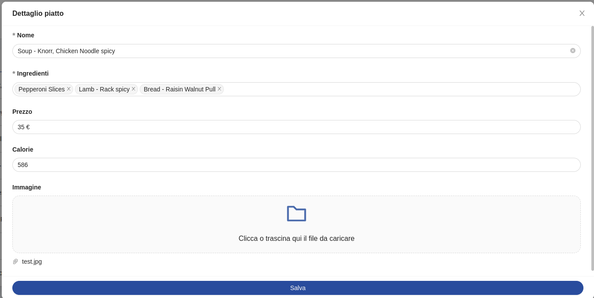
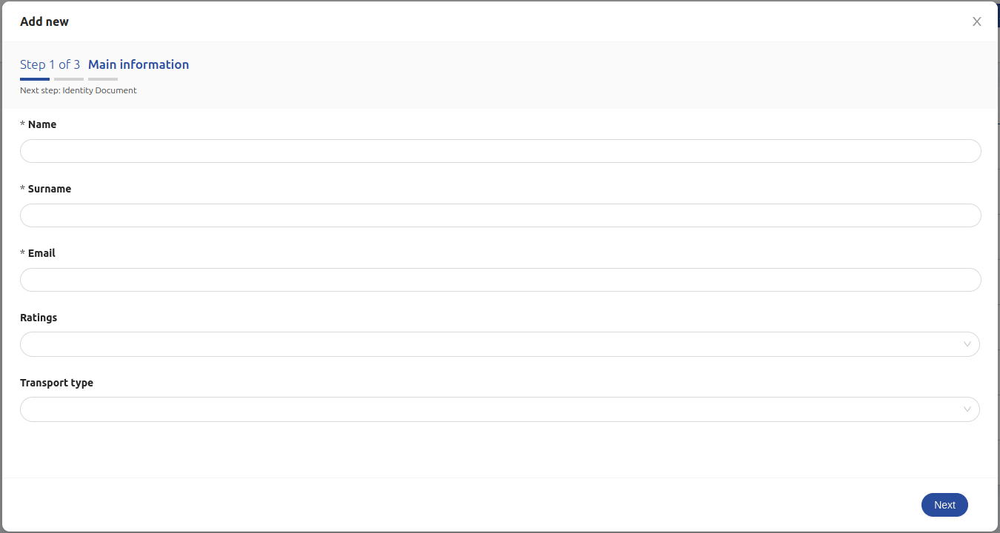

<!--
WARNING:
This file is automatically generated. Please edit the 'README' file of the corresponding component and run `yarn copy:docs`
-->

<<<<<<< HEAD:docs/microfrontend-composer/back-kit/60_components/340_form_modal.md
[img-bk-form-modal]: img/bk-form-modal.png
[img-wizard-form-modal]: img/wizard-form-modal.png
[img-wizard-form-modal-accordion]: img/wizard-form-modal-accordion.png
=======


>>>>>>> main:docs/business_suite/backoffice/60_components/340_form_modal.md
[monaco-editor]: https://microsoft.github.io/monaco-editor/
[handlebars]: https://handlebarsjs.com/guide/expressions.html

[crud-service]: /runtime_suite/crud-service/10_overview_and_usage.md
[predefined-fields]: /runtime_suite/crud-service/10_overview_and_usage.md
[writable-views]: /runtime_suite/crud-service/50_writable_views.md

[data-schema]: ../30_page_layout.md#data-schema
[nested-schemas]: ../80_flows/20_nested_objects.md
[form-options]: ../30_page_layout.md#form-options
[helpers]: ../40_core_concepts.md#helpers
[localized-text]: ../40_core_concepts.md#localization-and-i18n
[dynamic configurations]: ../40_core_concepts.md#dynamic-configuration
[inline-queries]: ../40_core_concepts.md#inline-queries

[bk-button]: ./90_button.md
[bk-crud-client]: ./100_crud_client.md
[bk-table]: ./510_table.md
[bk-dynamic-form-modal]: ./210_dynamic_form_modal.md
[bk-form-wizard]: ./350_form_wizard.md
[bk-file-manager]: ./250_file_manager.md
[bk-file-picker-modal]: ./270_file_picker_modal.md
[bk-file-picker-drawer]: ./260_file_picker_drawer.md
[bk-confirmation-modal]: ./160_confirmation_modal.md
[bk-notifications]: ./450_notifications.md

[add-new]: ../70_events.md#add-new
[add-new-external]: ../70_events.md#add-new-external
[selected-data]: ../70_events.md#selected-data
[require-confirm]: ../70_events.md#require-confirm
[create-data]: ../70_events.md#create-data
[update-data]: ../70_events.md#update-data
[create-data-with-file]: ../70_events.md#create-data-with-file
[update-data-with-file]: ../70_events.md#update-data-with-file
[success]: ../70_events.md#success
[error]: ../70_events.md#error
[nested-navigation-state/push]: ../70_events.md#nested-navigation-state---push
[nested-navigation-state/back]: ../70_events.md#nested-navigation-state---back
[nested-navigation-state/display]: ../70_events.md#nested-navigation-state---dispaly


:::caution
This component is deprecated. The [Dynamic Form Modal][bk-dynamic-form-modal] or the [Form Wizard][bk-form-wizard] should be used instead.
:::

```html
<bk-form-modal></bk-form-modal>
```

<<<<<<< HEAD:docs/microfrontend-composer/back-kit/60_components/340_form_modal.md
![form-modal][img-bk-form-modal]
=======

>>>>>>> main:docs/business_suite/backoffice/60_components/340_form_modal.md

The Form Modal is used to display a modal containing a form to edit or create items described by the `dataSchema`.

## How to configure

For a basic usage of the Form Modal, providing a data-schema to interpret the structure of the data to handle is sufficient.
Several [customizations][data-schema] can be applied to the provided data-schema that tune how the data is handled by the component.
Particularly, but not limited to, every field supports a set of [options][form-options] specific for forms.

```json
{
  "tag": "bk-form-modal",
  "properties": {
    "dataSchema": {
      "type": "object",
      "properties": {
        "_id_": {
          "type": "string",
          "formOptions": {
            "hidden": true // no input is rendered for _id field, but the Form Modal still holds its value in the internal representation of the form values
          }
        },
        "__STATE__": {
          "type": "string",
          "default": "PUBLIC",
          "enum": [ // enum string fields are rendered as select fields
            "PUBLIC",
            "DRAFT",
            "TRASH"
          ]
        },
        "name": {
          "type": "string"
        },
        "price": {
          "type": "number"
        },
        ...
      }
    }
  }
}
```

The Form Modal can be opened in three different modes:

- *insert*: submitting the form signals the need for an item creation. This mode is activated upon listening to an [add-new] event
- *edit*: submitting the form signals the need for an item creation. This mode is activated upon listening to an [selected-data] event
- *external*: submitting the form triggers a POST request being performed to an endpoint specified with `extraEndpoint` property. This mode is activated upon listening to an [add-new-external] event

### Modes

#### Insert

When the component reacts to the [add-new] event, the modal opens and the form initializes its fields with values specified in the payload of the event. 
In this mode, upon clicking on the submit button of the footer, the Form Modal signals the request to push a new item to a CRUD collection, emitting the event [create-data] with payload extracted from the state of the form, particularly its values.
A component such as the [CRUD Client][bk-crud-client] could pick up on the `create-data` event.
If the form contains files, the component emits a [create-data-with-file] event, which signals the need to upload files to a file storage service on top of pushing the item to a CRUD collection.
A component like the [File Manager][bk-file-manager] could listen to this event.

A `transactionId` is added to the meta field of the emitted event to handle possible errors.

#### Edit

When the component reacts to the [selected-data] event, the modal opens and the form initializes its fields with the values specified in the payload of the event.

By clicking on the submit button, the Form Modal signals the request to update an item in the CRUD collection, emitting the event [update-data] with payload determined the state of the form, particularly its values
The item to update is identified by its `_id` field, which is a [predefined field][predefined-fields] of [Mia Platform's CRUD Service][crud-service] collections.
A component such as the [CRUD Client][bk-crud-client] could pick up on the `update-data` event.
If the form contains files, the component emits a [update-data-with-file] event, which signals the need to upload files to a file storage service on top of updating the item in the CRUD collection.
A component like the [File Manager][bk-file-manager] could listen to this event.

A `transactionId` is added to the meta field of the emitted event to handle possible errors.

#### External

When the component reacts to the [add-new-external] event AND the property `extraEndpoint` is specified, the modal opens and the form initializes its fields with the values specified in the payload of the event.

By clicking on the submit button, the Form Modal performs a HTTP POST to the endpoint specified in the `extraEndpoint` property, using its values as body.

The outcome of the HTTP request is notified to other components emitting either [success] or [error] event.  Either way, a `triggeredBy` field is injected into the meta of the event with value `bk-form-modal-extra-endpoint`. Components such as the [Notifications][bk-notifications] leverage `triggeredBy` for displaying push notifications.

If the form contains files, the POST is performed with a multipart body.

### After submission

When done filling up the form, usually the Form Modal requests data update or creation (via an [update-data] or [create-data] event) according to the operating [mode](#modes).
Usually an http-like client takes care of these operations.
It is often useful to perform other tasks upon successful creation or editing.
The prop `afterFinishEvents` allows to append events or `pushState` navigation instructions.
This feature can be configured by providing to `afterFinishEvents`

1. a string, which will pipe an event using its value as label
2. an array of strings, launching multiple events in the given order
3. an event,

```typescript
{
  label: string
  payload: Record<string, any>
  meta?: Record<string, any>
}
```

4. an array of events,
5. a **single** `pushState` context, which is a generic object data and an optional URL to perform navigation

```typescript
{
  data: any
  url?: string
}
```

:::caution
if `data` is an object and current `window.history.state` is an object, they are merged with priority to `data`'s keys
:::

Form context can be used into the events/pushState sent after submission using [handlebars] notation.
Each event payload and both `pushState` arguments are parsed with handlebars injecting the following context

```typescript
{
  values: Record<string, any>
  response: Record<string, any>
}
```

where `values` is the form values and `response` contains an object representation of the content of the payload of the [success] event linked to the form submission request.


### Confirmation dialog on save and on close

It is possible to require confirmation before submitting the form or closing the modal, using the `requireConfirm` property.
`requireConfirm` accepts a boolean or an object value, and defaults to `false`.

It is furthermore possible to scope confirmation request configuration depending on the triggering action, either closing the modal or submitting the form:

```json
{
  "requireConfirm": {
    "onSave": ..., // boolean or object configuration
    "onClose": ... // boolean or object configuration
  }
}
```

#### 1. Boolean type

If `requireConfirm` is set to true, the Form Modal, upon submission or closing, signals that confirmation for an actions is needed with event [require-confirm].
A component such as the [Confirmation Modal][bk-confirmation-modal] could react to the event.

#### 2. Object type

An object such as:
```typescript
{
  cancelText?: LocalizedText // cancel button text
  okText?: LocalizedText     // ok button text
  content?: LocalizedText    // the content text
  title?: LocalizedText      // the title text
}
```
can be provided as value to `requireConfirm`.
[LocalizedText][localized-text] is either a string or an object mapping language acronyms to strings.

```json
{
  "content": {
    "it": "Verrà creato un nuovo elemento, procedere?",
    "en": "A new element will be created, continue?"
  }
}
```

This allows to request customized labels in the confirmation dialog-box.
When structure in this way, the value for property `requireConfirm` is appended to the [require-confirm] event.
If this request is picked up by a component such as the [Confirmation Modal][bk-confirmation-modal], this prompts the user for confirmation via a pop-up dialog-box having the specified labels.


### Integrate custom labels

Custom labels can be specified as [LocalizedText][localized-text] as modal title, CTA button label, require confirm message.
Such labels can be scoped based on whether the form is in [edit or create mode](#modes).

```json
{
  "tag": "bk-form-modal",
  "properties": {
    ...
    "customLabels": {
      "create": {
        "title": {
          "en": "Add new order",
          "it": "Aggiungi nuovo ordine"
        },
        "ctaLabel": {
          "en": "Submit",
          "it": "Submit Order"
        },
        "unsavedChangesContent": {
          "it": "Chiudendo ora si perderà l'ordine non salvate, procedere?",
          "en": "Closing now will discard new order, do you want to continue?"
        },
        "saveChangesContent": {
          "it": "Verrà creato un nuovo ordine, procedere?",
          "en": "A new order will be created, continue?"
        }
      },
      "update": {
        "title": {
          "en": "Order detail",
          "it": "Dettaglio ordine"
        },
        "ctaLabel": {
          "en": "Update Order",
          "it": "Salva Ordine"
        },
        "unsavedChangesContent": {
          "it": "Chiudendo ora si perderanno tutte le modifiche non salvate all'ordine, procedere?",
          "en": "Closing now will discard changes to the order, do you want to continue?"
        },
        "saveChangesContent": {
          "it": "Verrà creato un nuovo ordine, procedere?",
          "en": "A new order will be created, continue?"
        }
      }
    }
  }
}
```

Not all keys need to be specified, as `customLabels` is merged with default labels.
For instance, the following is a valid configuration of `customLabels`:

```json
{
  "tag": "bk-form-modal",
  "properties": {
    ...
    "customLabels": {
      "create": {
        "title": {
          "en": "Add new order",
          "it": "Aggiungi nuovo ordine"
        }
      },
      "update": {
        "title": {
          "en": "Order detail",
          "it": "Dettaglio ordine"
        }
      }
    }
  }
}
```


### Nested objects

By default, objects and arrays are displayed in the Form Modal as JSONs inside an [editor][monaco-editor].
This is not true for objects and arrays of specific [formats][data-schema] such as `file` or `multilookup`, and for objects / arrays for which a data-schema is defined.

In particular, properties `allowObjectAsTable` and `allowNavigation` control how object and array fields with a provided data-schema (and no specific `format`) are rendered inside the modal.
- `allowObjectAsTable` controls whether or not the nested fields should be rendered as an editor, a read-only table, or both.
- `allowNavigation` allows to emit a [nested-navigation-state/push] event by clicking on the [nested field][nested-schemas] label

By default, setting `allowNavigation` to true disables editor visualization for nested fields. The following table explains how the two properties interact:

| `allowObjectAsTable` | `allowNavigation` | end result |
| -------------------- | ----------------- | ---------- |
| true | true | Table visualization only, label can be clicked |
| true | "show-editor" | Table + editor, label can be clicked |
| true | false | Table + editor, label cannot be clicked |
| false | true | No table nor editor, label can be clicked (default configuration) |
| false | "show-editor" | Editor visualization only, label can be clicked |
| false | false | Editor visualization only, label cannot be clicked |

By default, `allowObjectAsTable` is false, `allowNavigation` is true.

:::info
When `allowObjectAsTable` is true, the resulting table supports a subset of the features supported by the [Table component][bk-table].
Some of the limitations with respect to the Table include:
  - lookups are not resolved
  - row selection is disabled
  - row click is disabled
:::


### File fields with meta-data

Fields described in the data-schema as having the type `object` or `array` and format `file` are rendered in the form as drag-and-drop fields. These fields enable interaction with uploaded files and allow uploading new files.

However, when such fields include a `dataSchema` or `items` property, they are presented within the form as a link along with a button.

The link enables the downloading of the files present in the initial values of the form.
Clicking the button triggers the appearance of components such as [File Picker Modal][bk-file-picker-modal] or [File Picker Drawer][bk-file-picker-drawer], provided they are included in the plugin configuration.
Both the File Picker Modal and File Picker Drawer offer interaction with the uploaded files and the option to set metadata for newly uploaded files. In this context, the `dataSchema` and `items` properties define the structure of the associated file metadata.

Upon submission, the form initiates a request to push or update data within a CRUD collection and upload new files to a file storage service.
This is accomplished by emitting either a [create-data-with-file] or an [update-data-with-file] event, which can be intercepted by components like the [File Manager][bk-file-manager].


### Wizard


<<<<<<< HEAD:docs/microfrontend-composer/back-kit/60_components/340_form_modal.md
![wizard-form-modal][img-wizard-form-modal]
=======

>>>>>>> main:docs/business_suite/backoffice/60_components/340_form_modal.md

It is possible to split data insertion into multiple steps via the `wizard` property.

:::info
Wizard representation is currently only availabe when inserting new data, not in case of update.
:::

`wizard` allows values like the following:

- `true`
- `false`
- an array of objects like:

```typescript
{
  keys: string[],
  labels: {
    wizardNext?: LocalizedText
    wizardPrevious?: LocalizedText
    wizardAddNew?: LocalizedText
    wizardSubmit?: LocalizedText
    stepperTitle?: LocalizedText
    stepperSubtitle?: LocalizedText
    accordionHeader?: LocalizedText
    accordionEmptyComponent?: LocalizedText
  }
  asForm?: boolean
}
```

Each such element maps to a step of the wizard as follows:

| property | description |
|----------|-------------|
| `keys` | fields to display in the step |
| `labels` | localized labels with the text to show |
| `asForm` | whether to visualize a single nested object as a form / nested array accordion of forms. Ignored if the step includes more than one field |

If a step meets the following requirements:

- only includes one field
- the field is of type `object` or `array` and has a property `dataSchema`
- `asForm` is set to true

Then the field will be displayed as a form in case of an `object` field, or as an accordion of forms in case of an `array` field.

<<<<<<< HEAD:docs/microfrontend-composer/back-kit/60_components/340_form_modal.md
![wizard-form-modal-accordion][img-wizard-form-modal-accordion]
=======

>>>>>>> main:docs/business_suite/backoffice/60_components/340_form_modal.md

`labels` are mapped to displayed text as follows:

| key | description |
|----------|-------------|
| `wizardNext` | Button for going to next step |
| `wizardPrevious` | Button for going back to previous step |
| `wizardAddNew` | Button for adding a new element to an array, when displayed as an accordion |
| `wizardSubmit` | Button for submitting the form in the final step |
| `stepperTitle` | Title of the stepper component |
| `stepperSubtitle` | Subtitle of the stepper component |
| `accordionHeader` | Title of the accordion panel. An incremental is automatically added as panels are added to the accordion |
| `accordionEmptyComponent` | Text to display when the accordion is empty |

By default, `wizard` property is false.

When set to `true`:

- the fields are automatically split so that:
  - the first group contains all fields that are not nested objects or nested arrays
  - each of the following steps contains one of the remaining fields, with `asForm` set to true
- default labels are applied.

## API

### Properties & Attributes


| property | attribute | type | default | description |
|----------|-----------|------|---------|-------------|
|`afterFinishEvents`| - |ConfigurableEvents| - |events or state push to concatenate after successful finish action has been performed |
|`allowAutoDisableDeps`|`allow-auto-disable-deps`|boolean|false|if true, dependent lookup and multilookup select fields are automatically disabled in case of no options |
|`customMessageOnAbsentLookup`| - |[LocalizedText][localized-text]| - |override lookup value in case lookup is not resolved due to lack of data |
|`liveSearchTimeout`|`live-search-timeout`|number|5000|live-search timeout|
| `rootElementSelector` | `root-element-selector` | string | - | Selector to specify where the container should be appended |
| `dataSchema` | - | [ExtendedJSONSchema7Definition][data-schema] | - | Data schema describing the fields of the collection to filter |
| `readonlyOnView` | `read-only-on-view` | boolean | false | Upon marking this prop as true, on selecting a record, the form will be displayed as readonly, with no possibility to edit |
| `editorHeight` | `editor-height` | string \| number | - | Height of the object/array editor field |
| `allowNavigation` | `allow-navigation` | boolean \| 'show-editor' | true | When true, objects and arrays are displayed as a clickable label which allows navigating to nested objects and arrays if a dataSchema is specified. When 'show-editor', the navigation is allowed, and the object/array fields are displayed in a JSON editor. When false, the navigation is not allowed, and the object/array fields are displayed in a JSON editor |
| `width` | - | string \| number | - | Width of the modal |
| `liveSearchItemsLimit` | `live-search-items-limit` | number | 10 | Max items to fetch on regex live search |
| `customLabels` | - | [CustomLabels](#customlabels) \| {insert: CustomLabels, update: CustomLabels} | - | Custom localized texts shown as title and CTA button label |
| `requireConfirm` | - | boolean \| [RequireConfirmOpts](#requireconfirmopts) \| {onSave: RequireConfirmOpts, onSave: RequireConfirmOpts} | false | Whether or not the component should request confirmation before closing and/or before saving |
|`allowObjectAsTable`|`allow-object-as-table`|boolean|false|allows to visualize objects and arrays without specific format and a dataschema in both a editor and read-only table|
|`extraEndpoint`|`extra-endpoint`|string| - |when specified, it is possible to perform a POST request to an external collection specified by the endpoint |
|`height`|`height`|string|'60vh'|height of the modal |
|`wizard`| - |boolean \| [WizardStepSchema](#wizardstepschema)[]| - |array of options for setting up a wizard. If true, a default wizard is utilized.|

#### RequireConfirmOpts

```typescript
type RequireConfirmOpts = boolean | {
  cancelText?: LocalizedText
  okText?: LocalizedText
  content?: LocalizedText
  title?: LocalizedText
}
```

where [LocalizedText][localized-text] is either a string or an object mapping language acronyms to strings.

#### CustomLabels

```typescript
type CustomLabels = {
  title?: LocalizedText
  ctaLabel?: LocalizedText
  saveChangesContent?: LocalizedText
  unsavedChangesContent?: LocalizedText
}
```

where [LocalizedText][localized-text] is either a string or an object mapping language acronyms to strings.


#### WizardStepSchema

```typescript
type WizardStepSchema = {
  keys: string[],
  labels: {
    wizardNext?: LocalizedText
    wizardPrevious?: LocalizedText
    wizardAddNew?: LocalizedText
    wizardSubmit?: LocalizedText
    stepperTitle?: LocalizedText
    stepperSubtitle?: LocalizedText
    accordionHeader?: LocalizedText
    accordionEmptyComponent?: LocalizedText
  }
  asForm?: boolean
}
```

### Listens to

| event | action |
|-------|--------|
| [add-new] | opens the modal to create a new item, potentially applying default fields from data schema or data provided in the payload of the event |
| [add-new-external] | opens the modal to perform a POST request, filling in its fields from the data provided in the payload of the event |
| [selected-data] | opens the modal to edit a selected item, filling in its fields from the data provided in the payload of the event |
| [nested-navigation-state/push] | updates internal representation of the current navigation path by adding one step |
| [nested-navigation-state/back] | updates internal representation of the current navigation path by removing the specified number of steps |
| [nested-navigation-state/display] | updates internal representation of the current navigation and closes the modal |
| [success] | notifies correct data update as a result of form submission |
| [error] | notifies that something went wrong during form submission |

### Emits


| event                   | description                                                                        |
| ----------------------- | ---------------------------------------------------------------------------------- |
| configurable event    | property `afterFinishEvents` allows to emit custom events                          |
| [require-confirm]       | triggered when trying to submit the form accordingly to property `requireConfirm`  |
| [create-data]           | requests data creation                                                             |
| [update-data]           | requests data update                                                               |
| [create-data-with-file] | requests data creation and file upload                                             |
| [update-data-with-file] | requests data update and file upload                                               |
