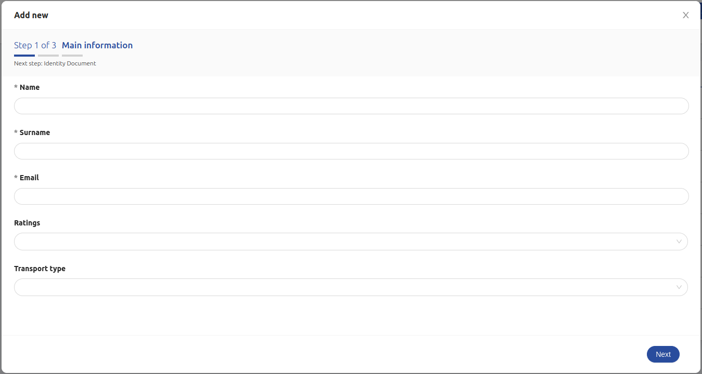
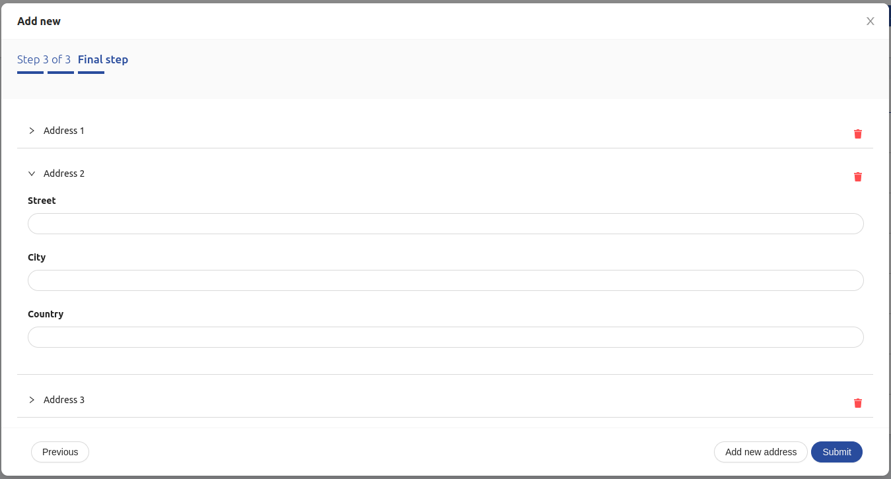

<!--
WARNING: this file was automatically generated by Mia-Platform Doc Aggregator.
DO NOT MODIFY IT BY HAND.
Instead, modify the source file and run the aggregator to regenerate this file.
-->

<!--
WARNING:
This file is automatically generated. Please edit the 'README' file of the corresponding component and run `yarn copy:docs`
-->


[handlebars]: https://handlebarsjs.com/guide/expressions.html

[crud-service]: /runtime_suite/crud-service/10_overview_and_usage.md
[predefined-fields]: /runtime_suite/crud-service/10_overview_and_usage.md#predefined-collection-properties
[writable-views]: /runtime_suite/crud-service/50_writable_views.md

[data-schema]: ../30_page_layout.md#data-schema
[form-options]: ../30_page_layout.md#form-options
[helpers]: ../40_core_concepts.md#helpers
[localized-text]: ../40_core_concepts.md#localization-and-i18n
[dynamic configurations]: ../40_core_concepts.md#dynamic-configuration
[action]: ../50_actions.md

[bk-dynamic-form-modal]: ./210_dynamic_form_modal.md
[bk-button]: ./90_button.md

[modes]: ./210_dynamic_form_modal.md#modes
[after-submission]: ./210_dynamic_form_modal.md#after-submission
[footer-buttons]: ./210_dynamic_form_modal.md#footer-buttons
[working-with-views]: ./210_dynamic_form_modal.md#working-with-views
[conditional-fields]: ./210_dynamic_form_modal.md#conditional-fields
[modal-examples]: ./210_dynamic_form_modal.md#examples

[add-new]: ../70_events.md#add-new
[selected-data]: ../70_events.md#selected-data
[require-confirm]: ../70_events.md#require-confirm
[create-data]: ../70_events.md#create-data
[update-data]: ../70_events.md#update-data
[create-data-with-file]: ../70_events.md#create-data-with-file
[update-data-with-file]: ../70_events.md#update-data-with-file
[error]: ../70_events.md#error
[success]: ../70_events.md#success
[nested-navigation-state/push]: ../70_events.md#nested-navigation-state---push
[nested-navigation-state/back]: ../70_events.md#nested-navigation-state---back
[nested-navigation-state/display]: ../70_events.md#nested-navigation-state---dispaly


```html
<bk-form-wizard></bk-form-wizard>
```



The Form Wizard is an extension of the [Dynamic Form Modal][bk-dynamic-form-modal] that allows to split data insertion / editing into multiple steps.
Each step consists of a form or an accordion of forms and allows to fill-in / edit a subset of the data properties.
Navigation through wizard steps is possible through buttons displayed inside the footer of the modal.
Upon reaching the last step, it is possible to submit the wizard, which signals the need for an item creation / update, with data obtained by aggregating form values from each of the wizard steps.


## How to configure

For basic usage of the Form Wizard Providing a data-schema to interpret the structure of the data to handle is sufficient.
Several [customizations][data-schema] can be applied to the provided data-schema that tune how the data is handled by the component.
Particularly, but not limited to, every field supports a set of [options][form-options] specific for forms.

Additionally, by default, the From Wizard analyzes the provided data-schema to automatically configure each step of the wizard.
All fields that are not nested objects or nested arrays are displayed as a form in the first step of the modal.
Each of the following steps is composed of a single nested object or array field, the fields of which are editable through a form.

```json
{
  "tag": "bk-form-wizard",
  "properties": {
    "dataSchema": {
      "type": "object",
      "properties": {
        "_id": {
          "type": "string"
        },
        "__STATE__": {
          "type": "string"
        },
        "name": {
          "type": "string"
        },
        "price": {
          "type": "number"
        },
        "color": {
          "type": "object",
          "dataSchema": {
            "type": "object",
            "properties": {
              "red": {"type": "number"},
              "green": {"type": "number"},
              "blue": {"type": "number"}
            }
          }
        },
        "variants": {
          "type": "array",
          "items": {
            "type": "object",
            "properties": {
              "shape": {"type": "string"},
              "size": {"type": "string"}
            }
          }
        }
      }
    }
  }
}
```

A Form Wizard configured as above results in a wizard with three steps.
  - the first step displays a form with fields "_id", "\_\_STATE__", "name", "price"
  - the second step displays a form with fields "red", "green", "blue"
  - the third step displays an accordion of forms, each one with fields "shape", "size"




The Form Wizard can be opened in two different modes, just like the [Dynamic Form Modal][modes]:

- *insert*: submitting the form signals the need for an item creation. This mode is activated upon listening to an [add-new] event
- *edit*: submitting the form signals the need for an item creation. This mode is activated upon listening to an [selected-data] event


### Customize wizard steps

Property `wizard` allows to configure each step specifying an array of objects with three properties, `keys`, `labels`, `asForm`.

```typescript
type WizardStepSchema = {
  keys: string[],
  labels: {
    wizardNext?: LocalizedText
    wizardPrevious?: LocalizedText
    wizardAddNew?: LocalizedText
    stepperTitle?: LocalizedText
    stepperSubtitle?: LocalizedText
    accordionHeader?: LocalizedText
    accordionEmptyComponent?: LocalizedText
  }
  asForm?: boolean
}
```

Each such element maps to a step of the wizard as follows:

| property | description                                                                                                                              |
| -------- | ---------------------------------------------------------------------------------------------------------------------------------------- |
| `keys`   | fields to display in the step                                                                                                            |
| `labels` | [localized labels][localized-text] with the text to show                                                                                 |
| `asForm` | whether to visualize nested objects as a form, or nested arrays as an accordion of forms. Step must include one field. Defaults to true. |

If a step meets the following requirements:
  - only includes one field
  - the field is of type `object` or `array` and has a property `dataSchema`
  - `asForm` is set to true (as per default)

Then the field will be displayed as a form in case of an `object` field, or as an accordion of forms in case of an `array` field.

`labels` are mapped to displayed text as follows:

| key                       | description                                                                                              |
| ------------------------- | -------------------------------------------------------------------------------------------------------- |
| `wizardNext`              | Button for going to next step                                                                            |
| `wizardPrevious`          | Button for going back to previous step                                                                   |
| `wizardAddNew`            | Button for adding a new element to an array, when displayed as an accordion                              |
| `wizardSubmit`            | Button for submitting the form in the final step                                                         |
| `stepperTitle`            | Title of the stepper component                                                                           |
| `stepperSubtitle`         | Subtitle of the stepper component                                                                        |
| `accordionHeader`         | Title of the accordion panel. An incremental is automatically added as panels are added to the accordion |
| `accordionEmptyComponent` | Text to display when the accordion is empty                                                              |

### Dynamic Context

Analogously to the [Dynamic Form Modal][bk-dynamic-form-modal], several properties of the Wizard Form allow [dynamic configurations].
By default, such properties are parsed with [handlebars], injecting the current state of the whole wizard as context through key `values`, and the state of the current step through key `step`, as well as other information.

```typescript
{
  values: Record<string, any> // aggregated values of all steps
  step: Record<string, any> // values of current step
  currentUser: Record<string, any> // information on currently logged user, if available
}
```

### After Submission

The Form Wizard supports properties `onSuccess` and `onFail`, that allow to append extra tasks to be executed after the successful or unsuccessful submission of the wizard, just like the [Dynamic Form Modal][after-submission].

Extra context key `step` is available in [context](#dynamic-context) injected into `onSuccess` and `onFail` actions:

```typescript
{
  currentUser: Record<string, any>
  values: Record<string, any>
  step: Record<string, any>
  response: Record<string, any>
}
```

where `step` is the state of the form of the current step, `values` is the aggregated values of all steps, `response` contains an object representation of the content of the payload of the [success] event linked to the submission request.

### Footer Buttons

By deafult, the footer of the modal rendered by Form Wizard includes the following buttons:
  - two buttons for navigating through the wizard steps,
  - a button to add a new form to an accordion of forms, in case the current step includes a single field of type array of objects,
  - in case the current step is the last step of the wizard, a submit button. This can be used for signaling the need to add or edit an item in CRUD collection, depending on the operating [mode][modes].

#### Extra buttons

Other than the default buttons included in the modal footer, extra buttons can be specified to be included in the modal footer, using property `actions`, just like the [Dynamic Form Modal][footer-buttons].

Extra buttons are added to the footer of the modal for each step of the wizard.

#### Omitting submit button

It is possible to omit the default submission button by setting property `omitSubmit` to true.

### Confirmation dialog on save and on close

It is possible to ask for confirmation on close and/or on save, and also customize the confirmation dialog texts.
This is achieved with property `requireConfirm`, analogously to the [Dynamic Form Modal][bk-dynamic-form-modal].


### Integrate custom labels

Just like the [Dynamic Form Modal][bk-dynamic-form-modal], custom labels can be specified as [localized text][localized-text], controlling copies within the Form Wizard. Additionally, extra custom labels can be [specified for each wizard step](#customize-wizard-steps).


### Working with Views

Analogously to the [Dynamic Form Modal][working-with-views], the Wizard Form is designed to be able to interact with [Mia-Platform CRUD Service views][writable-views].

### Conditional Fields

Properties `conditionalOptions` and `conditionalValues` can be used to set-up custom form behavior that is conditional to the current state of the wizard, just like for the [Dynamic Form Modal][conditional-fields].


### Locale

The texts of the Form Wizard can be customized through the property `customLocale`, which accepts an object shaped like the following:

```typescript
type Locale = {
  create: {
    title: LocalizedText
    ctaLabel: LocalizedText
    unsavedChangesContent: LocalizedText
    saveChangesContent: LocalizedText
    wizardNext?: LocalizedText
    wizardPrevious?: LocalizedText
    wizardAddNew?: LocalizedText
    stepperTitle?: LocalizedText
    stepperSubtitle?: LocalizedText
    accordionHeader?: LocalizedText
    accordionEmptyLabel?: LocalizedText
  }
  update: {
    title: LocalizedText
    ctaLabel: LocalizedText
    unsavedChangesContent: LocalizedText
    saveChangesContent: LocalizedText
    wizardNext?: LocalizedText
    wizardPrevious?: LocalizedText
    wizardAddNew?: LocalizedText
    stepperTitle?: LocalizedText
    stepperSubtitle?: LocalizedText
    accordionHeader?: LocalizedText
    accordionEmptyLabel?: LocalizedText
  },
  form: {
    validationMessages:{
      default: LocalizedText,
      required: LocalizedText,
      enum: LocalizedText,
      whitespace: LocalizedText,
      date:{
        format: LocalizedText,
        parse: LocalizedText,
        invalid: LocalizedText
      },
      types:{
        string: LocalizedText,
        method: LocalizedText,
        array: LocalizedText,
        object: LocalizedText,
        number: LocalizedText,
        date: LocalizedText,
        boolean: LocalizedText,
        integer: LocalizedText,
        float: LocalizedText,
        regexp: LocalizedText,
        email: LocalizedText,
        url: LocalizedText,
        hex: LocalizedText,
        file: LocalizedText
      },
      string:{
        len: LocalizedText,
        min: LocalizedText,
        max: LocalizedText,
        range: LocalizedText
      },
      number:{
        len: LocalizedText,
        min: LocalizedText,
        max: LocalizedText,
        range: LocalizedText
      },
      array:{
        len: LocalizedText,
        min: LocalizedText,
        max: LocalizedText,
        range: LocalizedText,
        unique: LocalizedText
      },
      pattern:{
        mismatch: LocalizedText
      }
    },
    datePicker: {
      lang: {
        locale: LocalizedText,
        placeholder: LocalizedText,
        rangePlaceholder: {
          start: LocalizedText,
          stop: LocalizedText
        },
        today: LocalizedText,
        now: LocalizedText,
        backToToday: LocalizedText,
        ok: LocalizedText,
        clear: LocalizedText,
        month: LocalizedText,
        year: LocalizedText,
        timeSelect: LocalizedText,
        dateSelect: LocalizedText,
        monthSelect: LocalizedText,
        yearSelect: LocalizedText,
        decadeSelect: LocalizedText,
        monthBeforeYear: 'true' | 'false',
        previousMonth: LocalizedText,
        nextMonth: LocalizedText,
        previousYear: LocalizedText,
        nextYear: LocalizedText,
        previousDecade: LocalizedText,
        nextDecade: LocalizedText,
        previousCentury: LocalizedText,
        nextCentury: LocalizedText
      },
      timePickerLocale:{
        placeholder: LocalizedText
      }
    },
    filePicker:{
      drawerTitle: LocalizedText,
      filePickerTitle: LocalizedText,
      dragAndDropCaption: LocalizedText,
      ctaLabel: LocalizedText
    },
    objectEditor:{
      editorView: LocalizedText,
      tableView: LocalizedText
    },
    editor:{
      editorView: LocalizedText,
      rawView: LocalizedText
    },
    geopoint:{
      latitude: LocalizedText,
      longitude: LocalizedText,
      phLatitude: LocalizedText,
      phLongitude: LocalizedText
    },
    element: LocalizedText,
    elements: LocalizedText,
    true: LocalizedText,
    false: LocalizedText
  }
}
```

where [LocalizedText][localized-text] is either a string or an object mapping language acronyms to strings.


## Examples

Configuration examples for the [Dynamic Form Modal][modal-examples] also apply to the Form Wizard.

### Example: Default Wizard Steps

A Form Wizard configured like the following:

```json
{
  "tag": "bk-form-wizard",
  "properties": {
    "dataSchema": {
      "type": "object",
      "properties": {
        "_id": {
          "type": "string"
        },
        "__STATE__": {
          "type": "string"
        },
        "name": {
          "type": "string"
        },
        "price": {
          "type": "number"
        },
        "color": {
          "type": "object",
          "dataSchema": {
            "type": "object",
            "properties": {
              "red": {"type": "number"},
              "green": {"type": "number"},
              "blue": {"type": "number"}
            }
          }
        },
        "variants": {
          "type": "array",
          "items": {
            "type": "object",
            "properties": {
              "shape": {"type": "string"},
              "size": {"type": "string"}
            }
          }
        }
      }
    }
  }
}
```
results in a wizard with three steps.
  - the first step displays a form with fields "_id", "\_\_STATE__", "name", "price"
  - the second step displays a form with fields "red", "green", "blue"
  - the third step displays an accordion of forms, each one with fields "shape", "size"


### Example: Customize Wizard Steps

A Form Wizard configured like the following:

```json
{
  "tag": "bk-form-wizard",
  "properties": {
    "wizard": [
      {
        "keys": [
          "name",
          "color"
        ],
        "labels": {
          "stepperTitle": {
            "en": "Name & Color",
            "it": "Nome & Colore"
          }
        }
      },
      {
        "keys": [
          "variants"
        ],
        "labels": {
          "stepperSubtitle": {
            "en": "Final step",
            "it": "Ultimo step"
          },
          "wizardAddNew": {
            "en": "Add new variant",
            "it": "Aggiungi nuova variante"
          },
          "accordionHeader": {
            "en": "Variant",
            "it": "Variante"
          }
        }
      }
    ],
    "dataSchema": {
      "type": "object",
      "properties": {
        "name": {
          "type": "string"
        },
        "color": {
          "type": "object",
          "dataSchema": {
            "type": "object",
            "properties": {
              "red": {"type": "number"},
              "green": {"type": "number"},
              "blue": {"type": "number"}
            }
          }
        },
        "variants": {
          "type": "array",
          "items": {
            "type": "object",
            "properties": {
              "shape": {"type": "string"},
              "size": {"type": "string"}
            }
          }
        }
      }
    }
  }
}
```

results in a wizard with two steps:
  - the first step displays a form with fields "name", "color". Note that "color" is **not** displayed as a separate form, but rather as a default object field - which consists of a text editor
  - the second step displays an accordion of forms, each one with fields "shape", "size"

Note that custom labels are specified for both steps.

## API

### Properties & Attributes

| Property | Attribute | Type | Default | Description |
| --- | --- | --- | --- | --- |
| `rootElementSelector` | `root-element-selector` | string | - | Selector to specify where the container should be appended |
| `dataSchema` | - | [ExtendedJSONSchema7Definition][data-schema] | - | Data schema describing the fields of the collection to filter |
| `wizard` | - | [WizardStepSchema](#customize-wizard-steps) | - | Array of options for setting up the wizard steps. A default wizard is utilized is not specified |
| `width` | - | string \| number | - | Width of the modal |
| `height` | - | string \| number | - | Height of the modal |
| `omitSubmit` | `omit-submit` | boolean | false | Whether or not to include the default submit button |
| `actions` | - | [ButtonWithClose](#buttonwithclose)[] \| {insert: ButtonWithClose[]; select: ButtonWithClose[]} | - | Actions added as buttons to the footer |
| `liveSearchItemsLimit` | `live-search-items-limit` | number | 10 | Max items to fetch on regex live search |
| `customLabels` | - | [CustomLabels](#customlabels) \| {insert: CustomLabels, update: CustomLabels} | - | Custom localized texts shown as title and CTA button label |
| `requireConfirm` | - | boolean \| [RequireConfirmOpts](#requireconfirmopts) \| {onSave: RequireConfirmOpts, onSave: RequireConfirmOpts} | false | Whether or not the component should request confirmation before closing and/or before saving |
| `onSuccess` | - | [Action][action][] \| {insert: Action[], update: Action[]} | - | Action executed after successful submit |
| `onFail` | - | [Action][action][] \| {insert: Action[], update: Action[]} | - | Action executed after failing submit |
| `lookupQueries` | - | [LookupQueries](#lookupqueries) | - | Extra queries when fetching options for lookup fields in [views](#working-with-views) |
| `conditionalOptions` | - | [ConditionalOption](#conditionaloption)[] | - | Allows specifying dynamic conditions for form-options (hidden / disabled / readonly) to be applied |
| `conditionalValues` | - | [Condition](#condition)[] | - | Allows specifying dynamic conditions for resetting field |
| `fileFieldsPreview` | `file-fields-preview` | boolean | - | Enables preview of uploaded files in drag-n-drop file fields |
| `enableSubmitOnFormUntouched` | `enable-submit-on-form-untouched` | boolean | - | Allows submitting an unedited form |
| `basePath` | - | string | - | The URL base path to which to send HTTP requests, used when fetching options for lookup field in [views](#working-with-views) |

#### ButtonWithClose

```typescript
type ButtonWithClose = Partial<BkButton> & {
  closeAfter?: boolean
}
```
where BkButton references the properties of the [Button][bk-button] component.

#### RequireConfirmOpts

```typescript
type RequireConfirmOpts = boolean | {
  cancelText?: LocalizedText
  okText?: LocalizedText
  content?: LocalizedText
  title?: LocalizedText
}
```

where [LocalizedText][localized-text] is either a string or an object mapping language acronyms to strings.

#### CustomLabels

```typescript
type CustomLabels = {
  title?: LocalizedText
  ctaLabel?: LocalizedText
  saveChangesContent?: LocalizedText
  unsavedChangesContent?: LocalizedText
}
```

where [LocalizedText][localized-text] is either a string or an object mapping language acronyms to strings.

#### LookupQueries

```typescript
type LookupQueries = {
  [property: string]: Record<string, unknown> | Record<string, unknown>[]
}
```

#### ConditionalOption

```typescript
type ConditionalOption = {
  property: string
  query: Record<string, unknown>
  option: RHDOptions
}

type RHDOptions = {
    hidden?: boolean;
    hiddenOnUpdate?: boolean;
    hiddenOnInsert?: boolean;
  } & {
    readOnly?: boolean;
    readOnlyOnUpdate?: boolean;
    readOnlyOnInsert?: boolean;
  } & {
    disabled?: boolean;
    disabledOnUpdate?: boolean;
    disabledOnInsert?: boolean;
  }
```

#### Condition

```typescript
type Condition = {
  property: string
  query: Record<string, unknown>
}
```

### Listens to

| event | action |
|-------|--------|
| [add-new] | opens the modal to create a new item, potentially applying default fields from data schema or data provided in the payload of the event |
| [selected-data] | opens the modal to edit a selected item, filling in its fields from the data provided in the payload of the event |
| [nested-navigation-state/push] | updates internal representation of the current navigation path by adding one step. The wizard is disabled if the user navigated inside a nested field, and renders a single form with fields of the visualized nested object. |
| [nested-navigation-state/back] | updates internal representation of the current navigation path by removing the specified number of steps. The wizard is disabled if the user navigated inside a nested field, and renders a single form with fields of the visualized nested object. |
| [nested-navigation-state/display] | updates internal representation of the current navigation and closes the modal. The wizard is disabled if the user navigated inside a nested field, and renders a single form with fields of the visualized nested object. |
| [success] | notifies correct data update as a result of form submission. Payload holds the response of the associated HTTP call and is accessible by action in `onSuccess` property via `response` keyword. |
| [error] | notifies that something went wrong during form submission. Payload holds the response of the associated HTTP call and is accessible by action in `onFail` property via `response` keyword. |

### Emits


| event                   | description                                                                                                             |
| ----------------------- | ----------------------------------------------------------------------------------------------------------------------- |
| configurable event      | properties such as `onFail`, `onSuccess` or `actions` allow to emit custom events                                       |
| [require-confirm]       | triggered when trying to close the modal with unsaved data. `requireConfirm` property allows to customize this behavior |
| [create-data]           | requests data creation                                                                                                  |
| [update-data]           | requests data update                                                                                                    |
| [create-data-with-file] | requests data creation and file upload                                                                                  |
| [update-data-with-file] | requests data update and file upload                                                                                    |
