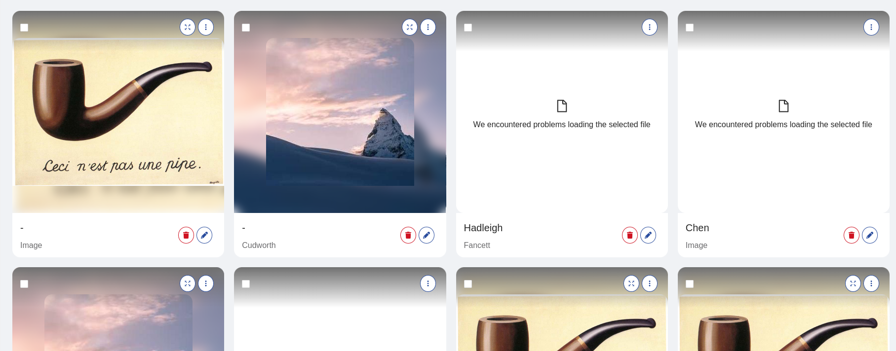

<!--
WARNING: this file was automatically generated by Mia-Platform Doc Aggregator.
DO NOT MODIFY IT BY HAND.
Instead, modify the source file and run the aggregator to regenerate this file.
-->

<!--
WARNING:
This file is automatically generated. Please edit the 'README' file of the corresponding component and run `yarn copy:docs`
-->


[handlebars]: https://handlebarsjs.com/guide/expressions.html

[localized-text]: ../40_core_concepts.md#localization-and-i18n
[dynamic-configurations]: ../40_core_concepts.md#dynamic-configuration
[helpers]: ../40_core_concepts.md#helpers

[actions]: ../50_actions.md

[display-data]: ../70_events.md#display-data
[selected-data-bulk]: ../70_events.md#selected-data-bulk
[selected-data]: ../70_events.md#selected-data

[bk-footer]: ./320_footer_&_item_state.md
[bk-bulk-actions]: ./70_bulk_actions_button.md


```html
<bk-gallery></bk-gallery>
```



The Gallery allows to visualize image files within an adaptive grid, as well as other data.

Each item of the grid is composed of:
  - readonly data 
    - title
    - subtitle
    - thumbnail
    - preview
  - actions (buttons, action menu, clickable image)

The thumbnail is immediately visible in the item, while the preview is displayed inside a [modal](#preview-modal).

The Gallery listens to [display-data] event to retrieve the data to visualize. Each element of the dataset is mapped to one grid item.

## How to configure

The Gallery component should be provided with a value for property `thumbnailSource` that describes the [path](#xpath) to reach the URL of the image to display
within the data item.

```json
{
  "tag": "bk-gallery",
  "properties": {
    "thumbnailSource": "image.url"
  }
}
```

### Appearance

#### Gallery Items

Gallery items are placed into a grid, which adapts to the screen size.

Each of the Gallery item can be configured in size using properties `itemHeight` and `itemWidth`, controlling height and width respectively.

If `itemHeight` is not specified, items adapt their height to their content.

Property `itemWidth` supports both numeric values (these are interpreted as pixels) or "small", "medium", "large".
This property controls the attempted width of each Gallery item, but may vary slightly due to the adaptive nature of the grid.

`gutter` property can be used to control the spacing around each Gallery item.

#### Preview Modal

Unless property `disableExpand` is set to true, the preview image of an item can be visualized inside a modal.
The modal can be configured in size using `modalWidth` and `modalHeight`, and a title can be specified with `modalTitle` (if not specified, the item title is used).

### Data

Each Gallery item allows to visualize an image (thumbnail), a preview within a modal (preview) and two types of text (title and subtitle).

The properties that control how each item sets these options are:
- `thumbnailSource`
- `previewSource`
- `titleSource`
- `subTitleSource`

If not specified, the `previewSource` is set to be equal to `thumbnailSource`.

Upon listening to a [display-data] event, the Gallery component uses these properties to render one item per data row.

The properties `titleSource`, `subTitleSource`, `thumbnailSource`, and `previewSource` accept either a string or an object with keys `path` and `default`.

When set as a string, these properties should indicate the path within the data source from which to extract the required information.

Alternatively, if an object is used, the `path` key guides the property to the relevant data, while the `default` key provides a value to display if the path points to undefined values.

Additionally, `thumbnailSource` and `previewSource` also support key `template`. This is used to interpolate the extracted value within a string, through keyword `file`.

For instance, the following are all valid configurations for `thumbnailSource`:

```json
{
  "thumbnailSource": {
    "path": "document.url",
    "default": "default/file.jpg",
    "template": "full/{{file}}"
  }
}
```

```json
{
  "thumbnailSource": {
    "path": "document.url",
    "default": "default/file.jpg",
  }
}
```

```json
{
  "thumbnailSource": "document.url"
}
```

### Dynamic Context

The Gallery supports properties that allow [dynamic configurations][dynamic-configurations].
By default, such properties are parsed with [handlebars], injecting the following context:

Each action in the Gallery component has access to the following input data:
```typescript
{
  thumbnail: ..., // source for thumbnail image of the item
  preview: ..., // source for preview image of the item
  title: ..., // title of the item
  subTitle: ..., // subtitle of the item
  context: ... // all data fields of Gallery item
  ... // all data fields of Gallery item
}
```

### Actions

`onImageClick`, `onTitleClick`, `onSubTitleClick` and `actions` properties allow to add [Back-kit Actions][actions] to the Gallery.

#### Callbacks

Properties `onImageClick`, `onTitleClick`, `onSubTitleClick` are expected to follow the [Back-kit Action][actions] interface.
Their callbacks are executed upon clicking to the thumbnail, the title or the subtitle respectively.

The Gallery supports [dynamic configurations][dynamic-configurations] in these properties.
They are parsed with [handlebars], injecting the [context](#dynamic-context) of the Gallery.

#### Buttons & Actions menu

Property `actions`, on the other hand, is an array of objects that have keys: `iconId`, `content`, `danger`, `action`.

The first two entries of `actions` are rendered as buttons (thus, a value for `iconId` should be specified).
The rest of the actions are rendered inside a popup menu within each Gallery item.

[Dynamic configurations][dynamic-configurations] is available in `actions` property.
In particular, the `action` key of each entry of `actions` property is parsed with [handlebars], injecting the [context](#dynamic-context) of the Gallery.

```json
{
  "actions": [
    {
      "iconId": "fas fa-users",
      "action": {
        "type": "http",
        "config": {
          "url": "/url",
          "method": "POST",
          "body": {
            "field1": "{{thumbnail}}", // <- the source of the thumbnail image
            "field2": "{{name}}" // <- the "name" field of the data entry associated to the Gallery item
          }
        }
      }
    }
  ]
}
```

### Checkbox

Each item can be selected through a checkbox, unless `disableSelection` property is set to true.

Selecting emits a [selected-data-bulk] event with all selected items.

Components like the [Footer][bk-footer] or the [Bulk Actions][bk-bulk-actions] react to [selected-data-bulk] events.


### Locale

The texts of the Gallery can be customized through the property `customLocale`, which accepts an object shaped like the following:

```typescript
type Locale = {
  modalClose: LocalizedText
  expandTitle: LocalizedText
  actionsMenuTitle: LocalizedText
  brokenFile: LocalizedText
  absentFile: LocalizedText
}
```

where [LocalizedText][localized-text] is either a string or an object mapping language acronyms to strings.


## Examples

### Example: Basic Usage

The most basic way to use the Gallery component to visualize a dataset is to set properties `thumbnailSource`, `previewSource`, `titleSource`, `subTitleSource`.

A Gallery configured like the following:

```json
{
  "tag": "bk-gallery",
  "properties": {
    "thumbnailSource": "avatar.url",
    "previewSource": "profileImageUrl",
    "titleSource": "name",
    "subTitleSource": "description"
  }
}
```

that receives a dataset like:

```json
[
  {
    "name": "Bruce",
    "description": "I like football!",
    "avatar": {
      "fileName": "avatar1.jpg",
      "url": "/avatar/avatar1.jpg"
    },
    "profileImageUrl": "/profile/profile1.jpg"
  },
  {
    "name": "Emily",
    "description": "Nature enthusiast!",
    "avatar": {
      "fileName": "avatar2.png",
      "url": "/avatar/avatar2.png"
    },
    "profileImageUrl": "/profile/profile2.jpg"
  }
]
```

Then the Gallery displays two items,

one with:
  - title equal to "Bruce"
  - subTitle equal to "I like football!"
  - thumbnail equal to `/avatar/avatar1.jpg`
  - preview equal to `/profile/profile1.jpg`

and the second one with;
  - title equal to "Emily"
  - subTitle equal to "Nature enthusiast!"
  - thumbnail equal to `/avatar/avatar2.png`
  - preview equal to `/profile/profile2.jpg`

### Example: Basic Usage

Assuming the following configuration for the Gallery component:

```json
{
  "tag": "bk-gallery",
  "properties": {
    "titleSource": "objField.arrField.[0]",
    "subTitleSource": "objField.stringField",
    "thumbnailSource": "document"
  }
}
```

Upon receiving notification of the following data being fetched:

```json
[
  {
    "objField": {
      "arrField": [
        "test"
      ],
      "stringField": "foo"
    },
    "document": "some/path.jpg"
  }
]
```

The Gallery renders a single item with
  - title equal to "test"
  - subTitle equal to "foo"
  - thumbnail equal to "some/path.jpg"
  - preview equal to "some/path.jpg"

Since `previewSource` is not specified, the preview is same as the thumbnail.

### Example: Gallery with default values

Properties `titleSource`, `subTitleSource`, `thumbnailSource`, `previewSource` can be set to an object with `path` and `default` keys.
Key `path` is used to reach the desired data within the fields of the data element associated to the Gallery item,
while `default` provides a fallback value in case the path is not resolved.

For instance, a Gallery configured like:
```json
{
  "tag": "bk-gallery",
  "properties": {
    "titleSource": "objField.arrField.[0]",
    "subTitleSource": "objField.stringField",
    "thumbnailSource": "document",
    "previewSource": {
      "path": "objField.preview",
      "default": "default/file.jpg"
    }
  }
}
```

That renders the following simplified data:
```json
[
  {
    "objField": {
      "arrField": [
        "test"
      ],
      "stringField": "foo"
    },
    "document": "some/path.jpg"
  }
]
```

results is a single item with
  - title equal to "test"
  - subTitle equal to "foo"
  - thumbnail equal to "some/path.jpg"
  - preview equal to "default/file.jpg"


### Example: Gallery with complex image source

Properties `thumbnailSource`, `previewSource` can be set to an object with a `path`, `default`, `template` keys.
  - `path` is used to reach the desired data within the fields of the data element associated to the Gallery item
  - `default` provides a fallback value in case the path is not resolved
  - `template` interpolates the extracted value within a string, through keyword `file`

For instance, a Gallery configured like:
```json
{
  "tag": "bk-gallery",
  "properties": {
    "thumbnailSource": {
      "path": "document",
      "default": "default/file.jpg",
      "template": "full/{{file}}"
    }
  }
}
```

That renders the following simplified data:
```json
[
  {
    "objField": {
      "arrField": [
        "test"
      ],
      "stringField": "foo"
    },
    "document": "some/path.jpg"
  }
]
```

results in a single item having thumbnail equal to "full/some/path.jpg".

In case `path` is unresolved, `default` is utilized. Key `default` is **not** interpolated inside `template`.

For instance, assuming the same input data and configuration:
```json
{
  "tag": "bk-gallery",
  "properties": {
    "thumbnailSource": {
      "path": "unk",
      "default": "default/file.jpg",
      "template": "full/{{file}}"
    }
  }
}
```

the resulting `thumbnail` is "default/file.jpg" and **not** "full/default/file.jpg


### Example: Add callback to clickinging image

The Gallery allows to specify [Back-kit Actions][actions] to be executed upon clickinging a Gallery image, title, or subtitle.

For instance, the following configuration for the Gallery:

```json
{
  "tag": "bk-gallery",
  "properties": {
    "thumbnailSource": "image.url",
    "onImageClick": {
      "type": "event",
      "config": {
        "events": {
          "label": "selected-data",
          "payload": "{{rawObject context}}"
        }
      }
    }
  }
}
```

with the following underlying data:

```json
[
  {
    "name": "Roasted Chicken",
    "description": "Very tasty!",
    "calories": 650
  },
  {
    "name": "Salad",
    "description": "Healthy dish",
    "calories": 150
  },
  
]
```

renders two Gallery items that, upon being clicked on its thumbnail, emit a [selected-data] event with payload equal to the object representation of its associated data element.

Clicking on the image of the first element, the Gallery emits a [selected-data] event with payload:

```json
{
  "name": "Roasted Chicken",
  "description": "Very tasty!",
  "calories": 650
}
```

:::info
[rawObject][helpers] is a helper keyword that prevents "context" from being stringified in the payload of the event.
:::


### Example: Action with dynamic context

The Gallery allows to insert buttons to its items to perform custom [actions].

For instance, the following configuration for the Gallery:

```json
{
  "tag": "bk-gallery",
  "properties": {
    "thumbnailSource": "image.url",
    "actions": [
      {
        "iconId": "fas fa-users",
        "action": {
          "type": "http",
          "config": {
            "url": "/add-recipe",
            "method": "POST",
            "body": {
              "image": "{{thumbnail}}",
              "name": "{{name}}"
            }
          }
        }
      }
    ]
  }
}
```

with the following underlying data:

```json
[
  {
    "image": {
      "name": "chicken.jpg",
      "url": "file-storage/chicken.jpg",
    },
    "name": "Roasted Chicken",
    "description": "Very tasty!"
  }
]
```

renders one Gallery item with a button that, upon clicking, executes a POST call to the endpoint `/add-recipe`, with body:

```json
{
  "image": "file-storage/chicken.jpg",
  "name": "Roasted Chicken"
}
```

## API

### Properties & Attributes

| property           | attribute           | type                                               | default  | description                                                                      |
| ------------------ | ------------------- | -------------------------------------------------- | -------- | -------------------------------------------------------------------------------- |
| `thumbnailSource`  | -                   | TemplateXPath                                      | -        | source path to thumbnail image                                                   |
| `previewSource`    | -                   | TemplateXPath                                      | -        | source path to preview image (if not specified, `thumbnailSource` is used)       |
| `titleSource`      | -                   | [XPath](#xpath)                                    | -        | source path to title text                                                        |
| `subTitleSource`   | -                   | [XPath](#xpath)                                    | -        | source path to subtitle text                                                     |
| `disableSelection` | `disable-selection` | boolean                                            | false    | whether to disable the possibility to select Gallery items                       |
| `actions`          | -                   | [GalleryAction](#galleryaction) \| GalleryAction[] | -        | available actions per Gallery item                                               |
| `onImageClick`     | -                   | [Action][actions]                                  | -        | action to execute on image click                                                 |
| `onTitleClick`     | -                   | [Action][actions]                                  | -        | action to execute on title click                                                 |
| `onSubTitleClick`  | -                   | [Action][actions]                                  | -        | action to execute on subtitle click                                              |
| `disableExpand`    | `disable-expand`    | boolean                                            | false    | whether to disable the possibility of viewing the image inside a modal (preview) |
| `modalWidth`       | `modal-width`       | number \| string                                   | -        | width of the preview modal                                                       |
| `modalHeight`      | `modal-height`      | number \| string                                   | -        | height of the preview modal                                                      |
| `modalTitle`       | `modal-title`       | string                                             | -        | title of the preview modal (if not specified, the item title is used)            |
| `gutter`           | `gutter`            | number                                             | 20       | gutter of Gallery items (vertical and horizontal spacing among Gallery items)    |
| `primaryKey`       | `primary-key`       | string                                             | "_id"    | key used for indexing Gallery items                                              |
| `itemHeight`       | `item-height`       | number \| string                                   | -        | height of Gallery items. If not specified, items adapt to their content          |
| `itemWidth`        | `item-width`        | number \| "small" \| "medium" \| "large"           | "medium" | attempted width of Gallery items                                                 |


#### XPath

```typescript
type XPath = string | {
  path?: string
  default?: LocalizedText
}
```

where [LocalizedText][localized-text] is either a string or an object mapping language acronyms to strings.

#### TemplateXPath

```typescript
type TemplateXPath = XPath | {
  path?: string
  default?: LocalizedText
  template: string
}
```

where [XPath](#xpath) is either a string or an object with keys `path` and `default`
where [LocalizedText][localized-text] is either a string or an object mapping language acronyms to strings.

#### GalleryAction

```typescript
type GalleryAction = {
  iconId?: string,
  content?: string,
  danger?: boolean,
  action: Action
}
```

### Listens to

| event          | action                   |
| -------------- | ------------------------ |
| [display-data] | receives data to display |


### Emits

| event                | action                                                                                                      |
| -------------------- | ----------------------------------------------------------------------------------------------------------- |
| configurable event | properties like `actions`, `onImageClick` allow the Gallery to emit custom events                           |
| [selected-data-bulk] | notifies about a change in the items selected through checkboxes                                            |
