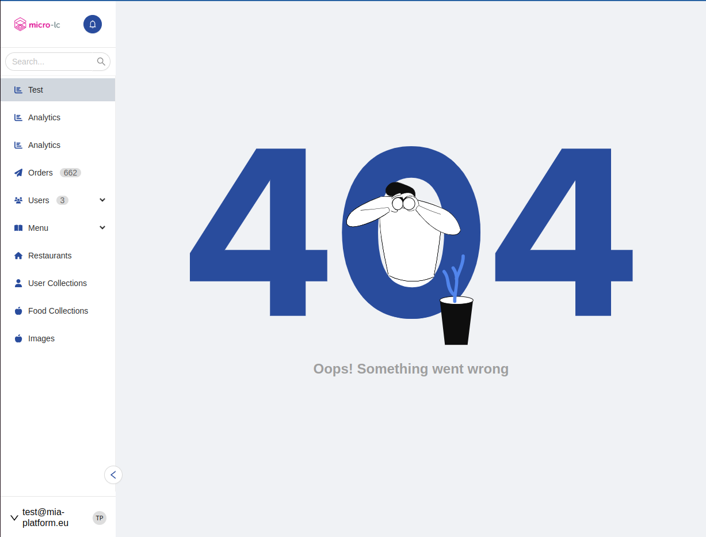

<!--
WARNING: this file was automatically generated by Mia-Platform Doc Aggregator.
DO NOT MODIFY IT BY HAND.
Instead, modify the source file and run the aggregator to regenerate this file.
-->

<!--
WARNING:
This file is automatically generated. Please edit the 'README' file of the corresponding component and run `yarn copy:docs`
-->


[micro-lc]: https://github.com/micro-lc/micro-lc
[RequestInit]: https://microsoft.github.io/PowerBI-JavaScript/interfaces/_node_modules_typedoc_node_modules_typescript_lib_lib_dom_d_.requestinit.html

[localized-text]: ../40_core_concepts.md#localization-and-i18n

[http-action]: ../50_actions.md#rest-calls




```html
<bk-layout></bk-layout>
```

Displays a menu, analogous to the [micro-lc] (version 2.0.0+) menu, which allows to navigate amongst plugins.


:::caution
The Layout component is not supported by [micro-lc] version <2.0.0. `micro-lc` version 2.0.0+ (or a custom rendering engine) should be used.
:::

## How to configure

The Layout can be configured in a number of ways. To include items to the menu, `menuItems` property should be specified.

```json
{
  "tag": "bk-layout",
  "properties": {
    "menuItems": [
      {
        "id": "orders",
        "label": {
          "en": "Orders",
          "it": "Ordini"
        },
        "type": "application"
      },
      {
        "id": "riders",
        "label": {
          "en": "Riders",
          "it": "Rider"
        },
        "type": "application"
      }
    ]
  }
}
```

### Mode

Four modes are available, controlling how the menu is rendered. Generally, the Layout is composed of a top-bar and a side-bar

- `fixedSideBar`
  - the top-bar includes components such as the logo and the user-menu
  - the side-bar includes the menu items. The side-bar can be collapsed, but is always visible
- `overlaySideBar`
  - the top-bar includes components such as the logo and the user-menu
  - the side-bar includes the menu items. The side-bar becomes visible and is hidden through a CTA
- `leftMenu`
  - the whole menu is included in the side-bar, the top-bar is not rendered
- `topBar`
  - the whole menu is included in the top-bar, the side-bar is not rendered


### Logo

An image can be rendered as a logo using property `logo`, which is an object with keys:
- `altText`: alt-text of the image
- `onClickHref`: link to which to navigate when the logo is clicked
- `url`:
  - if `url` is initialized to a string, represents the URL of the image to use as logo
  - if `url` is initialized to an object with keys `path` and (optionally) `default`, the logo source is retrieved by applying `path` (in JavaScript notation) to the current user's object-like representation. The user information is obtained during bootstrap using property `userInfoUrl` as endpoint. An [example](#dynamic-logo) is available.

### Help Menu

Property `helpMenu` accepts an object with key `helpHref`. The Layout uses it to render a button which redirects to a help page.

### User Menu

The Layout fetches information about the currently logged user by calling the endpoint specified in property `userInfoUrl`.

A user-menu can be rendered inside Layout, by configuring property `userMenu`. The user menu allows to log-out and displays information about he logged user.

`userMenu` accepts keys:
- `logout`: object with keys `url`, `method`, `redirectUrl` representing the call to execute to log-out
- `userPropertiesMapping`: maps properties of the currently logged user to keys `name` and `avatar`, which are displayed within the user-menu

An [example](#example-user-information) is available.

:::caution
Property `userInfoUrl` is available inside `userMenu` but is deprecated. Instead, apply property `userInfoUrl` directly to the properties of Layout.

For instance, from:
```json
{
  "tag": "bk-layout",
  "properties": {
    "userMenu": {
      "userInfoUrl": "/user-info"
    }
  }
}
```

to

```json
{
  "tag": "bk-layout",
  "properties": {
    "userInfoUrl": "/user-info"
  }
}
```
:::

### Head

The tab title and the fav icon can be specified with property `head`, which accepts an object with keys `favIconUrl`, `title`.

### Menu Items

Items in the menu. These can be of two types, `href` or `application`:
- `href` menu items behave like links, navigating to a configurable page upon click
- `application` pages navigate to a plugin

Multiple menu items can be grouped into recursive structures, `categories` (collapsible) and `groups` (non-collapsible).

All types of menu item have internationalized labels [LocalizedText][localized-text].

#### Href

```typescript
interface HrefMenuItem {
  /** Link's destination */
  href: string

  /** Icon of the menu item */
  icon?: string

  /** Unique identifier of the href */
  id: string

  /** Label of the menu item */
  label?: LocalizedText

  /** Specifies where to open the linked document */
  target?: '_blank' | '_self' | '_parent' | '_top'

  /** Type of the item: hyperlink to another page */
  type: 'href'

  /** Data to display next to the item label or http configuration to fetch it */
  badge?: string | HttpConfig
}
```

#### Application

```typescript
interface ApplicationMenuItem {
  /** Icon to visualize */
  icon?: string

  /** Unique identifier of the corresponding micro-lc application  */
  id: string
  
  /** Label of the menu item */
  label?: LocalizedText
  
  /** Identifiers of micro-lc other applications that also correspond to the item */
  selectedAlsoOn?: string[]
  
  /** Type of the item: micro-lc application */
  type: 'application'

  /** Data to display next to the item label or http configuration to fetch it */
  badge?: string | HttpConfig
}
```

#### Category

```typescript
interface CategoryMenuItem {
  /** Menu items included in the category */
  children?: MenuItem[]

  /** Icon to visualize */
  icon?: string

  /** Unique identifier of the category */
  id: string

  /** Label of the menu item */
  label?: LocalizedText

  /** Type of the item: collapsible sub-menu */
  type: 'category'

  /** Data to display next to the item label or http configuration to fetch it */
  badge?: string | HttpConfig
}

```

#### Group

```typescript
interface GroupMenuItem {
  /** Menu items included in the group */
  children?: MenuItem[]

  /** Unique identifier of the group */
  id: string

  /** Label of the menu item */
  label?: LocalizedText

  /** Type of the item: non-collapsible group of items */
  type: 'group'

  /** Data to display next to the item label or http configuration to fetch it */
  badge?: string | HttpConfig
}
```

#### Badges

The `badge` property can be used to specify an extra value to be displayed next to the label within the corresponding item menu.

If `badge` is of type `HttpConfig`, it specifies the parameters of a REST call that is used by the Layout at bootstrap time to fetch the data to display.

Type `HttpConfig` is a subset of the supported configuration for [Http Actions][http-action], accpeting keys
  - `url`: url to call
  - `method`: REST method to use
  - `body`: body to attach to the call
  - `config`: extra configurations, such as headers


## Examples

### Example: Display a menu

The following configuration for the Layout component

```json
{
  "tag": "bk-layout",
  "properties": {
    "mode": "fixedSideBar",
    "menuItems": [
      {
        "icon": {
          "library": "@fortawesome/free-solid-svg-icons",
          "selector": "faChartBar"
        },
        "id": "dashboards-analytics",
        "label": "Analytics",
        "type": "application"
      },
      {
        "icon": {
          "library": "@fortawesome/free-solid-svg-icons",
          "selector": "faPaperPlane"
        },
        "id": "ordersList",
        "label": {
          "en": "Orders",
          "it": "Ordini"
        },
        "type": "application",
        "badge": {
          "url": "/v2/orders/count?_st=PUBLIC,DRAFT",
          "method": "GET"
        }
      },
      {
        "icon": {
          "library": "@fortawesome/free-solid-svg-icons",
          "selector": "faUsers"
        },
        "id": "usersCategory",
        "label": "Users",
        "type": "category",
        "badge": "3",
        "children": [
          {
            "icon": {
              "library": "@fortawesome/free-solid-svg-icons",
              "selector": "faBiking"
            },
            "id": "ridersList",
            "label": "Riders",
            "type": "application",
            "badge": {}
          },
          {
            "icon": {
              "library": "@fortawesome/free-solid-svg-icons",
              "selector": "faUserTag"
            },
            "id": "customersList",
            "label": "Customers",
            "type": "application"
          }
        ]
      },
      {
        "icon": {
          "library": "@fortawesome/free-solid-svg-icons",
          "selector": "faAppleAlt"
        },
        "id": "food-collections",
        "label": "Food Collections",
        "type": "application"
      }
    ],
    "head": {
      "favIconUrl": "https://www.mia-platform.eu/static/img/favicon/apple-icon-60x60.png",
      "title": "Frontend"
    }
  }
}
```

renders a menu with items structured as follows (assuming english as browser language):

```
- Analytics
- Orders
- Users
  - Riders
  - Customers
```


### Example: Dynamic Logo

With the following configuration

```json
{
  "tag": "bk-layout",
  "properties": {
    "userInfoUrl": "/user-info",
    "logo": {
      "altText": "Logo",
      "url": {
        "path": "companyImg",
        "default": "./default-logo.png"
      }
    }
  }
}
```
and assuming the data fetched from `/user-info` is

```json
{
  "name": "Sarah Cyprus",
  "companyImg": "https://logos.test/img/logo-1.png",
  "role": "admin"
}
```

a Layout is rendered with a logo image having source "https://logos.test/img/logo-1.png".

While with data fetched from `/user-info` having no "companyImg" key, like

```json
{
  "name": "Sarah Cyprus",
  "role": "admin"
}
```
a Layout is rendered with a logo image having source "./default-logo.png", specified as default inside the `logo` property.

### Example: User information

Assuming an instance of a Layout component to be configured like

```json
{
  "tag": "bk-layout",
  "properties": {
    "userInfoUrl": "/user-info",
    "userMenu": {
      "logout": {
        "method": "POST",
        "url": "/logout"
      },
      "userPropertiesMapping": {
        "image": "avatar"
      }
    },
  }
}
```

and assuming the data fetched from `/user-info` is

```json
{
  "name": "Sarah Cyprus",
  "image": "https://logos.test/img/avatar-1.png",
  "role": "admin",
  ...
}
```

then the user menu rendered by the Layout is composed of the label "Sara Cyprus" and the avatar image with source "https://logos.test/img/avatar-1.png".

The value to use for the avatar is mapped to the "image" key of the user information through `userPropertiesMapping` field of `userMenu` property.

Loggin out can be performed from the user-menu, which performs a POST call to endpoint "/logout".

## API

### Properties & Attributes

| property       | attribute       | type                     | default          | description                                         |
| -------------- | --------------- | ------------------------ | ---------------- | --------------------------------------------------- |
| userInfoUrl    | user-info-url   | string                   | -                | URL called in GET to retrieve user data             |
| mode           | mode            | [Mode](#mode)            | "overlaySideBar" | controls how the menu is visualized                 |
| logo           | -               | [Logo](#logo)            | -                | logo to be visualized in the menu                   |
| menuItems      | -               | [MenuItem](#menuitems)[] | -                | describes the items in the menu                     |
| helpMenu       | -               | [HelpMenu](#helpmenu)    | -                | controls the help button on the menu                |
| userMenu       | -               | [UserMenu](#usermenu)    | -                | controls the user information section of the menu   |
| head           | -               | [Head](#head)            | -                | controls tab visualization options                  |
| sideBarWidth   | side-bar-width  | number                   | 200              | Width of the sidebar in pixels, if applicable       |
| collapsedWidth | collapsed-width | number                   | 80               | Width of collapsed sidebar in pixels, if applicable |


#### Mode
```typescript
type Mode = 'fixedSideBar' | 'overlaySideBar' | 'leftMenu' | 'topBar'
```

#### Logo

<!-- TODO: `url` supports {urlDarkImage: string, urlLightImage: string} type too, update once dark-mode is supported -->
```typescript
type Logo {
  /** Alternative text to display if the logo is not found  */
  altText?: string

  /** Link to navigate to when the logo is clicked */
  onClickHref?: string

  /** URL of the logo image, or path to get it from user-info */
  url?: string | {
    path: string
    default?: string
  }
}
```

#### MenuItems

```typescript
type MenuItem = HrefMenuItem | ApplicationMenuItem | CategoryMenuItem | GroupMenuItem

interface HrefMenuItem {
  /** Link's destination */
  href: string

  /** Icon of the menu item */
  icon?: string

  /** Unique identifier of the href */
  id: string

  /** Label of the menu item */
  label?: LocalizedText

  /** Specifies where to open the linked document */
  target?: '_blank' | '_self' | '_parent' | '_top'

  /** Type of the item: hyperlink to another page */
  type: 'href'

  /** Data to display next to the item label or http configuration to fetch it */
  badge?: string | HttpConfig
}

interface ApplicationMenuItem {
  /** Icon to visualize */
  icon?: string

  /** Unique identifier of the corresponding micro-lc application  */
  id: string
  
  /** Label of the menu item */
  label?: LocalizedText
  
  /** Identifiers of micro-lc other applications that also correspond to the item */
  selectedAlsoOn?: string[]
  
  /** Type of the item: micro-lc application */
  type: 'application'

  /** Data to display next to the item label or http configuration to fetch it */
  badge?: string | HttpConfig
}

interface CategoryMenuItem {
  /** Menu items included in the category */
  children?: MenuItem[]

  /** Icon to visualize */
  icon?: string

  /** Unique identifier of the category */
  id: string

  /** Label of the menu item */
  label?: LocalizedText

  /** Type of the item: collapsible sub-menu */
  type: 'category'

  /** Data to display next to the item label or http configuration to fetch it */
  badge?: string | HttpConfig
}

interface GroupMenuItem {
  /** Menu items included in the group */
  children?: MenuItem[]

  /** Unique identifier of the group */
  id: string

  /** Label of the menu item */
  label?: LocalizedText

  /** Type of the item: non-collapsible group of items */
  type: 'group'

  /** Data to display next to the item label or http configuration to fetch it */
  badge?: string | HttpConfig
}

interface GroupMenuItem {
  /** Url to call */
  url: string
  
  /** Rest method to use */
  method: 'GET' | 'POST' | 'PUT' | 'PATCH' | 'DELETE'
  
  /** Body to attach to the call */
  body?: Record<string, any> | string | null
  
  /** Extra configuration, such as headers */
  config?: Omit<HttpClientConfig, 'body'>
}

type HttpConfig = {
  /** URL to call */
  url: string
  /** REST method to call */
  method: HttpMethods
  /** body of the REST call */
  body?: Record<string, any> | string | null
  /** further configuration */
  config?: Omit<HttpClientConfig, 'body'>
}

type HttpClientConfig = Omit<RequestInit, 'method'> & {
  /* search params to apply to the call */
  params?: string | Record<string, string> | string[][] | URLSearchParams
  /* wether or not the result should be sent back without any transformation (by default, response is either sent back as text or an object). If true, `downloadAsFile` is ignored. */
  raw?: boolean
  /* whether the result should be downloaded as file. Only supported for POST and GET calls. */
  downloadAsFile?: boolean
}
```

Where:
- [LocalizedText][localized-text] is either a string or an object mapping language acronyms to strings
- [RequestInit] refers to the standard Typescript interface


#### HelpMenu

```typescript
type HelpMenu {
  /** Link to the help page */
  helpHref: string
}
```

#### UserMenu

```typescript
type UserMenu {
  /** Configuration needed to perform user logout */
  logout?: {
    /** Method used to perform the call to the URL specified in the 'url' property */
    method?: 'GET' | 'POST'

    /** URL to be redirected to after the logout */
    redirectUrl?: string

    /** URL called to log out the user. The method used is the one specified in the 'method' property */
    url?: string
  }


  /** @deprecated URL called in GET to retrieve user data */
  userInfoUrl: string

  /** Mapping between the properties returned from the user info URL call and the ones expected by the component */
  userPropertiesMapping?: Record<string, 'name' | 'avatar' | string>
}
```

#### Head

```typescript
type Head {
  /** Url of the fav icon */
  favIconUrl?: string

  /** Title of the tab */
  title?: string
}
```


### Listens to

None

### Emits

None
