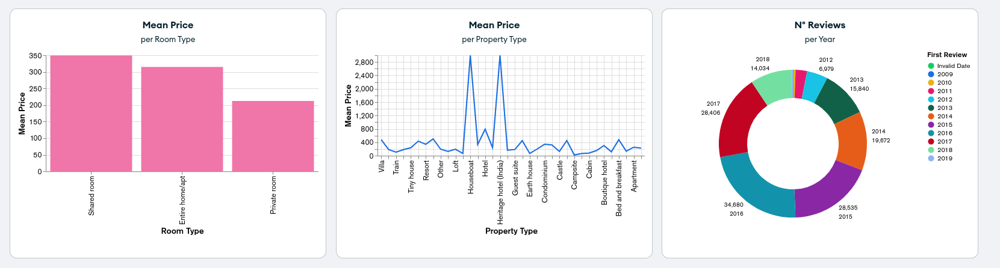

<!--
WARNING:
This file is automatically generated. Please edit the 'README' file of the corresponding component and run `yarn copy:docs`
-->


[marketplace]: /marketplace/overview_marketplace.md
[mongodb-atlas]: https://www.mongodb.com/atlas/database

[data-schema]: ../30_page_layout.md#data-schema

[change-query]: ../70_events.md#change-query


```html
<bk-atlas-dashboard></bk-atlas-dashboard>
```


The Atlas Dashboard embeds a read-only dashboard from [`MongoDB Atlas`][mongodb-atlas].
The Atlas Dashboard embeds of a dashboard from `MongoDB Atlas` which displays data (or filtered data when alongside a filtering component).


## How to configure

The Atlas Dashboard should be provided with properties:
  - `baseUrl`: URL to reach the dashboard to visualized
  - `dashboardId`: id of the dashboard to visualize
  <!-- - `dataSchema` data-schema describing the fields of the collection -->

```json
{
  "tag": "bk-atlas-dashboard",
  "properties": {
    "baseUrl": "/mongo-db/project-1",
    "dashboardId": "dashboard-orders"
  }
}
```

### Authentication

To embed an authenticated dashboard, an authentication service must be reachable by the Atlas Dashboard.
Properties `apiKey` and `authEndpoint` are used by the Atlas Dashboard to perform authentication.

For instance, service `atlas-dashboard-authentication` is available in [Mia Platform Marketplace][marketplace] as an authentication backend solution.

### Filters

<!-- TODO explain decently -->
The Atlas Dashboard component listens to filtering events in order to replicate the applied filters to the visualized dashboard.

This is achieved by listening to [change-query] events, and requires a [data-schema] that describes the structure of the data to be assigned to the Atlas Dashboard.
Upon listening to the `change-query` event, keys `search`, `filters`, `characteristic` of the event payload are converted to queries compatible with `MongoDB Atlas` service, and the dashboard is rerendered with new filters.


The Atlas Dashboard component listens to filtering events to synchronize applied filters with the displayed dashboard.
This synchronization is achieved by monitoring [change-query] events and relies on a [data-schema] that defines the structure of the data, which must be provided to the Atlas Dashboard.

When the component detects a `change-query` event, it processes the event payload's `search`, `filters`, and `characteristic` keys, converting them into queries compatible with the `MongoDB Atlas` service. Subsequently, a new call to the service is made, leading to the re-rendering of the dashboard with the updated filters.

```json
{
  "tag": "bk-atlas-dashboard",
  "properties": {
    "dataSchema": {
      "type": "object",
      "properties": {
        "name": {
          "type": "string"
        },
        ...
      }
    }
  }
}
```

## Known issues

### Flickering size

It could happen that the component keeps resizing. This is due to scaling problems of the embedded `Mongo Atlas` `iframe`.
This is a known issue of Mongo Atlas, which can be temporarily fixed adding some padding to the component:

```json
{
  "tag": "bk-atlas-dashboard",
  "attributes": {
    "style": "padding: 0.5px"
  },
  ...
}
```

## API

### Properties & Attributes

| property       | attribute       | type                                         | default       | description                                                                           |
| -------------- | --------------- | -------------------------------------------- | ------------- | ------------------------------------------------------------------------------------- |
| `apiKey`       | `api-key`       | string                                       | -             | apikey to call the authentication route from a trusted entity. Leave empty if not set |
| `authEndpoint` | `auth-endpoint` | string                                       | -             | endpoint for the dashboard authentication                                             |
| `background`   | `background`    | string                                       | "transparent" | background color of the dashboard. Possible values are color hex code, CSS color name |
| `baseUrl`      | `base-url`      | string                                       | -             | base URL of the embedded dashboard                                                    |
| `dashboardId`  | `dashboard-id`  | string                                       | -             | dashboard id of the embedded dashboard                                                |
| `dataSchema`   | -               | [ExtendedJSONSchema7Definition][data-schema] | -             | data-schema describing the fields of the collection                                   |

### Listens to

| event          | action                           |
| -------------- | -------------------------------- |
| [change-query] | applies filters to its dashboard |


### Emits

None
