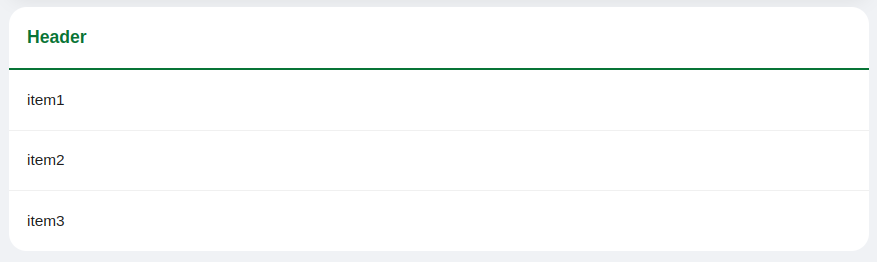

<!--
WARNING: this file was automatically generated by Mia-Platform Doc Aggregator.
DO NOT MODIFY IT BY HAND.
Instead, modify the source file and run the aggregator to regenerate this file.
-->

<!--
WARNING:
This file is automatically generated. Please edit the 'README' file of the corresponding component and run `yarn copy:docs`
-->


[lookups]: ../30_page_layout.md#lookups-deprecated
[localized-text]: ../40_core_concepts.md#localization-and-i18n

[display-data]: ../70_events.md#display-data
[loading-data]: ../70_events.md#loading-data


```html
<bk-simple-list></bk-simple-list>
```



The List displays a list of primitive elements (strings, numbers, ...) or [lookup fields][lookups].


## How to configure

Property `datasourceKey` should be provided in the List configuration, matching one of the fields of the underlying data.

Upon receiving newly fetched data (via a [display-data] event), the List component extracts the value of the field indicated by `datasourceKey` from the first data entry.

```json
{
  "tag": "bk-simple-list",
  "properties": {
    "datasourceKey": "products"
  }
}
```

### Title

The List title is configurable via the property `label`, which is expected to be either a sting, a [localized object][localized-text], or an object with the following fields:

| property | type                            | description                             |
| -------- | ------------------------------- | --------------------------------------- |
| title    | [LocalizedText][localized-text] | title of the list (h1)                  |
| subtitle | LocalizedText                   | subtitle (h2) displayed below the title |
| badge    | LocalizedText                   | badge displayed right of the title      |
| icon     | string                          | icon displayed left of the title        |

## Examples

With the following configuration, the List renders the field `items` of the retrieved data.

```json
{
  "tag": "bk-simple-list",
  "properties": {
    "label": {
      "icon": "fas fa-building",
      "title": {"en": "Conversation", "it": "Conversazione"},
      "badge": {"en": "Awaiting", "it": "In Attesa"},
      "subtitle": {"en": "This is a conversation", "it": "Questa è una conversazione"}
    },
    "datasourceKey": "products"
  }
},
```

If the data looks like:

```json
[
  {
    "name": "Company 1",
    "products": [
      "Blue Pants", "Red Shirt", "Gray Socks"
    ]
  },
  {
    "name": "Company 2",
    "products": [
      "Green Shoes"
    ]
  }
]
```

the rendered data by the List can be represented by an array as:

```json
[
  ["Blue Pants"],
  ["Red Shirt"],
  ["Gray Socks"]
]
```


## API

### Properties & Attributes

| property                      | attribute        | type                                         | default | description                                                                                          |
| ----------------------------- | ---------------- | -------------------------------------------- | ------- | ---------------------------------------------------------------------------------------------------- |
| `datasourceKey`               | `datasource-key` | string                                       | -       | the object key that will be used to pick the data to show.                                           |
| `customMessageOnAbsentLookup` | -                | [LocalizedText][localized-text]              | -       | override lookup value in case lookup is not resolved due to lack of data                             |
| `label`                       | -                | LocalizedText \| [HeaderProps](#headerprops) | -       | header of the list.                                                                                  |
| `height`                      | `height`         | string \| number                             | -       | max height of the body of the list before. Overflowing data is accessible through vertical scrolling |


#### HeaderProps

```typescript
type HeaderProps = {
  title: LocalizedText
  subtitle: LocalizedText
  badge: LocalizedText
  icon: string 
}
```

where [LocalizedText][localized-text] is either a string or an object mapping language acronyms to strings.

### Listens to

| event          | action                               |
| -------------- | ------------------------------------ |
| [display-data] | retrieved data to display            |
| [loading-data] | choose when to show the list spinner |

### Emits

None
