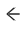

<!--
WARNING:
This file is automatically generated. Please edit the 'README' file of the corresponding component and run `yarn copy:docs`
-->

<<<<<<< HEAD:docs/microfrontend-composer/back-kit/60_components/430_navigation_back_arrow.md
[img-bk-navigation-back-arrow]: img/bk-navigation-back-arrow.png
=======

>>>>>>> main:docs/business_suite/backoffice/60_components/430_navigation_back_arrow.md
[nested-navigation-state/back]: ../70_events.md#nested-navigation-state---back
[nested-navigation-state/push]: ../70_events.md#nested-navigation-state---push


```html
<bk-navigation-back-arrow></bk-navigation-back-arrow>
```

The Navigation Back Arrow renders a button with left arrow icon, which upon clicking notifies the request to go back one step in the nesting path. The Navigation Back Arrow is only visible in nested pages.

<<<<<<< HEAD:docs/microfrontend-composer/back-kit/60_components/430_navigation_back_arrow.md
![navigation-back-arrow][img-bk-navigation-back-arrow]
=======

>>>>>>> main:docs/business_suite/backoffice/60_components/430_navigation_back_arrow.md

## How to configure

The Navigation Back Arrow component does not require any configuration.

```json
{
  "tag": "bk-navigation-back-arrow"
}
```

## API

### Properties & Attributes

None

### Listens to


| event | action|
|-------|--------|
|[nested-navigation-state/push][nested-navigation-state/push]|updates internal representation of the current navigation path by adding one step|
|[nested-navigation-state/back][nested-navigation-state/back]|updates internal representation of the current navigation path by removing the specified number of steps|

### Emits


| event | description |
|-------|-------------|
|[nested-navigation-state/back][nested-navigation-state/back]|notifies to go back one step in the navigation path|
