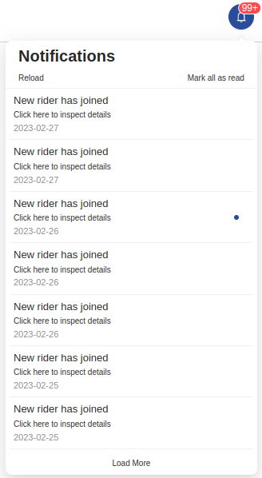

<!--
WARNING: this file was automatically generated by Mia-Platform Doc Aggregator.
DO NOT MODIFY IT BY HAND.
Instead, modify the source file and run the aggregator to regenerate this file.
-->

<!--
WARNING:
This file is automatically generated. Please edit the 'README' file of the corresponding component and run `yarn copy:docs`
-->


[anchor]: https://developer.mozilla.org/en-US/docs/Web/HTML/Element/a
[replace]: https://developer.mozilla.org/en-US/docs/Web/API/Location/replace
[pushState]: https://developer.mozilla.org/en-US/docs/Web/API/History/pushState
[history]: https://developer.mozilla.org/en-US/docs/Web/API/History

[localized-text]: ../40_core_concepts.md#localization-and-i18n

[bk-state-adapter]: ./500_state_adapter.md

[add-filter]: ../70_events.md#add-filter


```html
<bk-notification-center></bk-notification-center>
```



The Notification Center allows to handle notifications. It works by dealing with a backend source with a simple REST API interface.

The Notification Center expects to be linked to a dataset of notifications like:

```typescript
type Notification = {
  _id: string
  creatorId: string
  createdAt: string
  title: string
  readState?: boolean
  content?: string
  onClickCallback?: CallbackHref
}

type CallbackHref = {
  content: content: string | {url: string, data: any};
}
```

`onClickCallback` field in retrieved notifications allows to controls the navigation destination upon [clicking the notification](#click-strategies).

## How to configure

The base endpoint form which to retrieve notifications should be provided using property `endpoint`.
Property `endpoint` defaults to "/api/v1/bk-notification-center".

```json
{
  "tag": "bk-notification-center",
  "property": {
    "endpoint": "/notifications"
  }
}
```

### Backend communication

The Notification Center needs a backend service to retrieve and interact with notifications.
Backend base endpoint can be configured using the `endpoint` property, defaults to "/api/v1/bk-notification-center".

Following is a description of the endpoints called by the component that should be exposed by the service.

#### GET - `/own`

This endpoint should return the list of paged notifications that the currently logged-in user should visualize. The notifications
should be ordered by creation date descending.

##### Query Parameters

Query parameters `skip` and `limit` help querying the notification pagination.
These can be configured using properties `limitQueryParam`, `skipQueryParam`, `limit`.

```json
{
  "type": "object",
  "properties": {
    "limit": {
      "description": "Limits the number of documents, max 200 elements, minimum 1",
      "type": "integer",
      "minimum": 1
    },
    "skip": {
      "description": "Skip the specified number of documents",
      "type": "integer",
      "minimum": 0
    }
  },
  "required": ["skip", "limit"]
}
```

##### Response

```json
{
  "type": "array",
  "items": {
    "type": "object",
    "properties": {
      "title": {
        "anyOf": [
          {"type": "string"},
          {"type": "object"}
        ]
      },
      "content": {
        "anyOf": [
          {"type": "string"},
          {"type": "object"}
        ]
      },
      "readState": {
        "type": "boolean"
      },
      "createdAt": {
        "type": "string"
      },
      "onClickCallback": {
        "kind": {
          "type": "string",
          "enum": [
            "href"
          ]
        },
        "content": {
          "type": "string"
        }
      }
    },
    "required": [
      "title",
      "createdAt"
    ]
  }
}
```

#### PATCH - `/read-state/:notificationId`

This endpoint should change the read state of a specific notification given its id.

##### Body

```json
{
  "type": "object",
  "properties": {
    "readState": {
      "type": "boolean"
    }
  }
}
```

#### PATCH - `/read-state/own`

This endpoint should change the read state of all the notifications that the currently logged-in user can retrieve.

```json
{
  "type": "object",
  "properties": {
    "readState": {
      "type": "boolean"
    }
  }
}
```

### Click strategies

Clicking on a notification within the Notification Center may trigger a navigation event.

The property `clickStrategy` controls what navigation method should be executed (`href`, `replace`, `push`).
The specified navigation method uses as input arguments the value of the field [`onClickCallback`](#notification-object) of the clicked notification.

An on-click-strategy correspond to what happens when a notification is clicked.
- `default` and `href` create an invisible [anchor] and click it
- `replace` triggers [window.location.replace][replace]
- `push` pushes onto [window.history][history] stack

The value of `onClickCallback` field in a clicked notification is used as input arguments for the triggered navigation method.

Consequently, for any value of `clickStrategy`, the type of `onClickCallback` can be a string.

Additionally, if `clickStrategy` is `push`, `onClickCallback` may also be an object with keys `url` and `data`, corresponding to the main arguments of the [window.history.pushState][pushState] method. The value of `data` is injected into the state of the destination page through a key set by property `pushStateKey`. An associated example is shown [below](#example-navigate-to-a-page-and-emit-an-event).

Further control over the navigation behavior is provided by property `allowExternalHrefs`, controlling whether or not browsing to external external web pages and href is allwed when `clickStrategy` is `default`, `href` or `replace`.

### Custom labels

Property `locales` enables the user to apply custom [localized labels][localized-text] within the webcomponent.
Availabe keys are:

- `title`
- `loadingButton`
- `dateFormat`
- `errorMessage`
- `noNotification`
- `readAll`
- `reload`
- `backOnTop`

Not all keys need to be specified. An [example](#example-custom-labels) is available.

To each key, it is possible to attach either a string value (which overrides any browser language settings)
or a localized string given by a key/value map such as

```javascript
{
  en: "English Translation",
  'en-AU': "English Translation",
  zh: "中文翻译",
  ...
}
```

### Resource fetching mode

The Notification Center can be configured to automatically fetch new notifications using property `mode`. Available values are:
- `polling`
- `default`
- `none`

If set to `default` or `none`, data is **not** fetched automatically.

If `polling`, the Notification Center attempts fetches new data every 10 seconds. The property `pollingFrequency` can be used to tune the fetching frequency (in milliseconds).

## Examples

### Example: navigate to a page on notification click

A Notification Center instance configured like:

```json
{
  "tag": "bk-notification-center",
  "properties": {
    "clickConfig": "href"
  }
}
```

upon clicking on a notification like:

```json
{
  "_id": "notificaiton-112",
  "title": "New Order",
  "onClickCallback": "/orders"
}
```

navigates to url "/orders"

### Example: navigate to a page and emit an event (interaction with State Adapter)

When `clickConfig` is set to `push`, the Notification Center may be used in conjunction with a component such as the [State Adapter][bk-state-adapter],
which consumes the page state to emit custom events.

For instance, given two plugins located at "/plugin-1" and "/plugin-2" where:

- "/plugin-1" includes an instance of the Notification Center like:

  ```json
  {
    "tag": "bk-notification-center",
    "properties": {
      "endpoint": "/notifications",
      "clickConfig": "push",
      "pushStateKey": "notification-center-state"
    }
  }
  ```

- "/plugin-2" includes an instance of the State Adapter like:

  ```json
  {
    "tag": "bk-state-adapter",
    "properties": {
      "configMap": {
        "notification-center-state": "add-filter"
      }
    }
  }
  ```

clicking on a notification in "/plugin-1" like:

```json
{
  "onClickCallback": {
    "url": "/plugin-2",
    "data": {
      "property": "lastname",
      "operator": "equal",
      "value": "Smith"
    }
  }
}
```

triggers navigation to "/plugin-2". Once there an event with label [add-filter] and payload

```json
{
  "property": "lastname",
  "operator": "equal",
  "value": "Smith"
}
```

is emitted by the State Adapter.

### Example: Custom labels

The following is a valid configuration, in which the default title of the Notification Center is overwritten.

```json
{
  "tag": "bk-notification-center",
  "properties": {
    "locales": {
      "title": {
        "en": "Notification center title",
        "it": "Titolo centro notifiche"
      }
    }
  }
}
```

The other component labels are set to their default values.

## API

### Properties & Attributes

| property | attribute | type | default | description |
|----------|-----------|------|---------|-------------|
|`endpoint`|`endpoint`|string|"/api/v1/bk-notification-center"|API endpoint for HTTP calls|
|`headers`| - |{ [x: string]: string; }|{}|headers included in any HTTP request|
|`limit`|`limit`|number|10|controls pagination limit while fetching notifications|
|`locales`| - |[PartialTranslations](#partialtranslations)|{}|key-value list to customize components default labels|
|`clickStrategy`|`click-strategy`|[ClickStrategies](#clickstrategies)|"default"|strategy to implement upon clicking a notification|
|`limitQueryParam`|`limit-query-param`|string"limit"|the query parameter which controls notification pagination page size while fetching data|
|`skipQueryParam`|`skip-query-param`|string|"skip"|the query parameter which controls notification pagination skip while fetching data|
|`pushStateKey`|`push-state-key`|string|"bk-notification-center"|the key used to scope the content callback context in `window.history.state` when `clickStrategy` is "push"|
|`allowExternalHrefs`|`allow-external-hrefs`|string|false|when true, notification links can browse to external web pages and href are not checked to ensure they are relative to self-website|
|`mode`|`mode`|[ResourceFetchingMode](#resourcefetchingmode)|"default"|strategy to implement for automatically fetching notifications|
|`pollingFrequency`|`pollingFrequency`|number|10000|frequency of notifications automatic fetching (in milliseconds), if mode is set to `polling`|

#### ClickStrategies

```typescript
enum ClickStrategies =
  'default' |
  'href' |
  'replace' |
  'push'
```
#### PartialTranslations

```typescript
type PartialTranslations = {
  title?: LocalizedText
  loadingButton?: LocalizedText
  dateFormat?: LocalizedText
  errorMessage?: LocalizedText
  noNotification?: LocalizedText
  readAll?: LocalizedText
  reload?: LocalizedText
  backOnTop?: LocalizedText
}
```

#### ResourceFetchingMode

```typescript
enum ResourceFetchingMode =
  'polling' |
  'default' |
  'none'
```

### Listens to

None

### Emits

None
