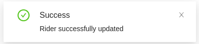

<!--
WARNING: this file was automatically generated by Mia-Platform Doc Aggregator.
DO NOT MODIFY IT BY HAND.
Instead, modify the source file and run the aggregator to regenerate this file.
-->

<!--
WARNING:
This file is automatically generated. Please edit the 'README' file of the corresponding component and run `yarn copy:docs`
-->


[events]: ../10_overview.md#events

[localized-text]: ../40_core_concepts.md#localization-and-i18n

[actions]: ../50_actions.md
[http-actions]: ../50_actions.md#rest-calls

[bk-button]: ./90_button.md
[bk-gallery]: ./370_gallery.md
[bk-crud-client]: ./100_crud_client.md
[bk-notifications]: ./460_notifications.md

[create-data]: ../70_events.md#create-data
[update-data]: ../70_events.md#update-data
[display-data]: ../70_events.md#display-data
[success]: ../70_events.md#success
[error]: ../70_events.md#error




```html
<bk-notifications></bk-notifications>
```

The Notifications displays toast notifications about events happening on the [EventBus][events] according to the maps provided as properties.

Whenever a notification is received of a successful or failed HTTP request,
the Notifications looks for the triggering event of the request within the keys of its `successEventMap` map or its `errorEventMap` map.
If the keys is found, the corresponding value is used to populate the state of a toast notification which is then rendered.

It is also possible to show notifications whenever a specified request is received - that is, whenever an event with a certain label is listened. 

## How to configure

The Notifications should have at least one property between `successEventMap`, `errorEventMap` and `customEventMap`.

```json
{
  "tag": "bk-notifications",
  "properties": {
    "successEventMap": {
      "create-data": {
        "title": {
          "en": "Data was created correctly!",
          "it": "Dato creato correttamente!"
        },
        "content": {
          "en": "The data has been created correctly",
          "it": "I dati sono stati creati correttamente"
        },
        "type": "success"
      }
    }
  }
}
```

Whenever a component notifies of a successful or failed HTTP request,
the Notifications looks for the triggering event of the request within the keys of its `successEventMap` map or its `errorEventMap` map.
If the keys is found, the corresponding value is used to populate the state of a toast notification which is then rendered.

Technically, properties `successEventMap` and `errorEventMap` map the `triggeredBy` field from the `meta` of [success] and [error] events to notification properties.
Field `triggeredBy` includes the label of the event that triggered the HTTP request to which the `success` / `error` event is associated.

When a `success` or `error` event is received with `triggeredBy` field included in one of these two maps, a toast notification is rendered with state set to the corresponding notification properties.
An [example](#example-notifications-for-crud-operations) is available.

It is also possible to show notifications whenever an event with a certain label is listened.
To achieve this, property `customEventMap` can be utilized.
This works analogously to `successEventMap` and `errorEventMap`, but notification properties are mapped to event labels instead of the `triggeredBy` fields.
An [example](#example-notifications-from-generic-events) is available.

Each notification can be configured with the following properties:

| property | type                                        | description                                                  |
| -------- | ------------------------------------------- | ------------------------------------------------------------ |
| title    | [LocalizedText][localized-text]             | localized text to be used as notification title              |
| content  | LocalizedText                               | localized text to be used as notification content            |
| type     | "success" \| "error" \| "info" \| "warning" | enum of possible notification styling (i.e. icons, color...) |


### Locale

The texts of the Notifications can be customized through the property `customLocale`, which accepts an object shaped like the following:

```typescript
type Locale = {
  infoTitle: LocalizedText
  successTitle: LocalizedText
  warningTitle: LocalizedText
  errorTitle: LocalizedText
}
```

where [LocalizedText][localized-text] is either a string or an object mapping language acronyms to strings.


## Examples

### Example: notifications for CRUD operations

Some components automatically emit [success] and [error] events to notify the result of a generic action.
For instance, the [CRUD Client][bk-crud-client] reacts to events like [create-data] and [update-data] by performing REST calls against a configurable endpoint.
Depending on the outcome of such a call, the CRUD Client then emits a [success] or [error] event, holding in its `meta` the name of the triggering event, inside field `triggeredBy`.

With a configuration like the following,
```json
{
  {
    "tag": "bk-notifications",
    "properties": {
      "successEventMap": {
        "create-data": {
          "title": "Data correctly created!",
          "content": "The data has been created correctly",
          "type": "success"
        }
      },
      "errorEventMap": {
        "create-data": {
          "title": "Data not created",
          "content": "An error occurred while creating data",
          "type": "error"
        }
      }
    }
  },
  {
    "tag": "bk-crud-client",
    "properties": {
      "basePath": "/base-path",
      "dataSchema": {
        "type": "object",
        "properties": {
          "_id": {"type": "string"}
        }
      }
    }
  }
}
```

when a `create-data` event is emitted:

  1) the CRUD Client performs a POST call to "/base-path"
  2) assuming the call to be successful, the CRUD Client emits a `success` event with `meta`:

  ```json
  {
    "triggeredBy": "create-data"
  }
  ```

  3) the Notifications component reacts listens to the event, comparing the value of `triggeredBy` to the keys of its `successEventMap`.
  A notification is displayed with state specified in the value of the first matching key:

  ```json
  {
    "title": "Data correctly created!",
    "content": "The data has been created correctly",
    "type": "success"
  }
  ```

### Example: notifications for specific events

The Notifications can be configured to listen to specific events and display notifications when received, through the property `customEventMap`.

The following configurations displays a notification everytime a [display-data] event is received.

```json
{
  "tag": "bk-notifications",
  "properties": {
    "customEventMap": {
      "display-data": {
        "title": "Data updated",
        "content": "The dataset has been updated",
        "type": "info"
      }
    }
  }
}
```

### Example: notifications for Back-kit Actions

Components that allow to configure [Back-kit Actions][actions], such as [Button][bk-button] or [Gallery][bk-gallery], may integrate with the [Notifications][bk-notifications].

Some actions trigger a [success] or [error] event based on their result (for instance, [actions of type `http`][http-actions]).
In such cases, it is possible to specify the `triggeredBy` key in the action configuration, which is injected into the meta field of such events. This value is then matched by the Notifications with its properties `successEventMap` and `errorEventMap`.

On the other hand, actions that emit events can be mapped to notifications leveraging property `customEventMap`.

In the following configuration, a Button component is configured to perform an HTTP call, and the Notifications to alert on the request outcome.

```json
{
  {
    "tag": "bk-notifications",
    "properties": {
      "successEventMap": {
        "data-fetch": {
          "title": "Data correctly fetched!",
          "content": "The data has been fetch correctly",
          "type": "success"
        }
      },
      "errorEventMap": {
        "data-fetch": {
          "title": "Data not fetched",
          "content": "An error occurred while fetching data",
          "type": "error"
        }
      }
    }
  },
  {
    "tag": "bk-button",
    "properties": {
      "content": "Get Orders",
      "action": {
        "type": "http",
        "config": {
          "url": "/orders",
          "method": "GET",
          "triggeredBy": "data-fetch" // <---- field `triggeredBy` is injected into success/error event
        }
      }
    }
  }
}
```

The `triggeredBy` field of the action configuration is injected by actions into the [success] / [error] event that is emitted to notify the outcome of the HTTP request.

## API

### Properties & Attributes

| property               | attribute                | type                                                     | default    | description                                                                                                                      |
| ---------------------- | ------------------------ | -------------------------------------------------------- | ---------- | -------------------------------------------------------------------------------------------------------------------------------- |
| `customEventMap`       | -                        | [NotificationsMap](#notificationsmap)                    | -          | map containing the labels of any event that should be notified to the related notification properties                            |
| `duration`             | `duration`               | number                                                   | -          | lingering time for the notification in seconds                                                                                   |
| `errorEventMap`        | -                        | [NotificationsMap](#notificationsmap)                    | -          | map containing the labels of any event that triggered an [error] that should be notified to the related notification properties  |
| `location`             | -                        | "topRight" \| "topLeft" \| "bottomRight" \| "bottomLeft" | "topRight" | corner location where the notification should be displayed                                                                       |
| `rootElementSelectors` | `root-element-selectors` | string                                                   | -          | selector to specify where the notification should be appended                                                                    |
| `successEventMap`      | -                        | [NotificationsMap](#notificationsmap)                    | -          | map containing the labels of any event that triggered a [success] that should be notified to the related notification properties |


#### NotificationsMap

```typescript
type NotificationsMap {
  [key: string]: {
    title?: LocalizedText
    content?: LocalizedText
    type?: 'success' | 'info' | 'error' | 'warning'
  }
}
```

where [LocalizedText][localized-text] is either a string or an object mapping language acronyms to strings.

### Listens to

| event              | action                                                                                                                                    |
| ------------------ | ----------------------------------------------------------------------------------------------------------------------------------------- |
| [success]          | displays a notification if the `triggeredBy` field contained in the `meta` of the event has been mapped in the `successEventMap` property |
| [error]            | displays a notification if the `triggeredBy` field contained in the `meta` of the event has been mapped in the `errorEventMap` property   |
| configurable event | displays a notification on any event mapped in the `customEventMap` property                                                              |

### Emits

None
