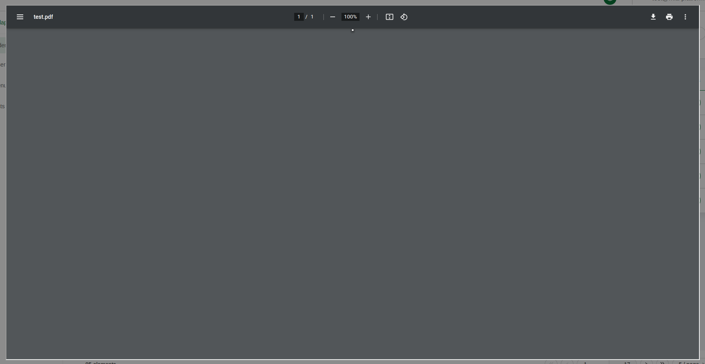

<!--
WARNING: this file was automatically generated by Mia-Platform Doc Aggregator.
DO NOT MODIFY IT BY HAND.
Instead, modify the source file and run the aggregator to regenerate this file.
-->

<!--
WARNING:
This file is automatically generated. Please edit the 'README' file of the corresponding component and run `yarn copy:docs`
-->


[show-in-viewer]: ../70_events.md#show-in-viewer


```html
<bk-pdf-viewer></bk-pdf-viewer>
```



allows to visualize PDF files in the browser through an `iframe` which embeds the default browser PDF viewer.
While the Pdf Viewer is capable of previewing various file types, it is recommended to restrict its use primarily to the visualization of PDF files.

Upon listening to the [show-in-viewer] event, the Pdf Viewer retrieves the URL of the file to preview from the event payload and shows it.

## How to configure

The Pdf Viewer does not require any configuration.

```json
{
  "tag": "bk-pdf-viewer"
}
```

## API

### Properties & Attributes

None

### Listens to

| event            | action               |
| ---------------- | -------------------- |
| [show-in-viewer] | opens PDF in brawser |

### Emits

None
