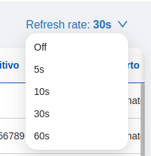

<!--
WARNING:
This file is automatically generated. Please edit the 'README' file of the corresponding component and run `yarn copy:docs`
-->

<<<<<<< HEAD:docs/microfrontend-composer/back-kit/60_components/50_auto_refresh.md
[img-bk-auto-refresh]: img/bk-auto-refresh.png
=======

>>>>>>> main:docs/business_suite/backoffice/60_components/50_auto_refresh.md

[bk-crud-client]: ./100_crud_client.md

[change-query]: ../70_events.md#change-query
[loading-data]: ../70_events.md#loading-query


```html
<bk-auto-refresh></bk-auto-refresh>
```

<<<<<<< HEAD:docs/microfrontend-composer/back-kit/60_components/50_auto_refresh.md
![auto-refresh][img-bk-auto-refresh]
=======

>>>>>>> main:docs/business_suite/backoffice/60_components/50_auto_refresh.md

The Auto Refresh component allows refreshing some resources with the selected interval.

It renders a label-like dorpdown button. The label of the button informs on the refresh frequency.
The dropdown menu opens upon hovering on the button and allows to select a new refresh interval.

The refreshing happens by emitting a [change-query] event with an empty payload every interval.
A component like the [CRUD Client][bk-crud-client] could.

## How to configure

For its most basic usage, the Auto Refresh component does not require any configuration.

```json
{
  "tag": "bk-auto-refresh"
}
```

By default, the Auto Refresh enables users to select the refresh interval for data requests, with options of 5, 10, 30, or 60 seconds. The initial refresh interval is initially set to 0, indicating that data refresh is not requested.

It is possible to set the interval options and a default interval using the `intervals` and `initialInterval` properties. Both of these properties are interpreted in seconds.


```json
{
  "tag": "bk-auto-refresh",
  "properties": {
    "intervals": [10, 30, 60, 120],
    "initialInterval": 10
  }
}
```

## Examples

The following configuration

```json
{
  "tag": "bk-auto-refresh",
  "properties": {
    "intervals": [10, 30, 60, 120],
    "initialInterval": 10
  }
}
```

requests data refresh every 10 seconds, and can be set to 10, 30, 60, 120 seconds.

## API

### Properties & Attributes

| property          | attribute          | type     | default         | description                    |
| ----------------- | ------------------ | -------- | --------------- | ------------------------------ |
| `intervals`       | -                  | number[] | [5, 10, 30, 60] | a list of intervals in seconds |
| `initialInterval` | `initial-interval` | number   | 0               | initial interval value         |

### Listens to

| event          | action                      |
| -------------- | --------------------------- |
| [loading-data] | sets internal loading state |

### Emits

| event          | description                                                                                |
| -------------- | ------------------------------------------------------------------------------------------ |
| [change-query] | requires data refresh without modifying current `CRUD` query by attaching an empty payload |
