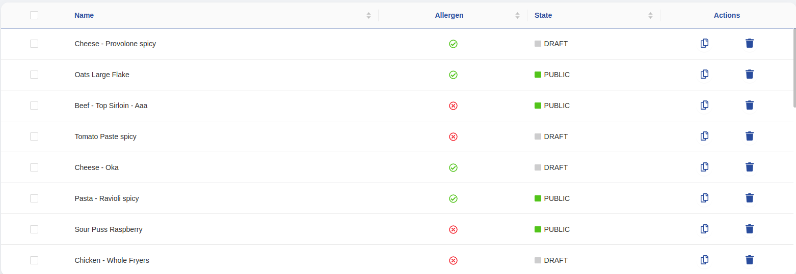

<!--
WARNING: this file was automatically generated by Mia-Platform Doc Aggregator.
DO NOT MODIFY IT BY HAND.
Instead, modify the source file and run the aggregator to regenerate this file.
-->

<!--
WARNING:
This file is automatically generated. Please edit the 'README' file of the corresponding component and run `yarn copy:docs`
-->


[handlebars]: https://handlebarsjs.com/
[handlebars-syntax]: https://handlebarsjs.com/guide/expressions.html
[fontawesome]: https://fontawesome.com/v5.15/icons?d=gallery&p=2&s=regular,solid&m=free
[events]: ../10_overview.md#events
[TinyColor]: https://github.com/bgrins/TinyColor

[data-schema]: ../30_page_layout.md#data-schema
[nested-schemas]: ../80_examples/20_nested_data.md
[visualization-options]: ../30_page_layout.md#visualization-options

[localized-text]: ../40_core_concepts.md#localization-and-i18n
[dynamic-configurations]: ../40_core_concepts.md#dynamic-configuration
[inline-queries]: ../40_core_concepts.md#inline-queries
[rawObject]: ../40_core_concepts.md#rawObject
[rawObjectOrEmptyStr]: ../40_core_concepts.md#rawObjectOrEmptyStr
[template-configMap]: ../40_core_concepts.md#template---configMap

[bk-button]: ./90_button.md
[bk-dynamic-form-modal]: ./210_dynamic_form_modal.md
[bk-breadcrumbs]: ./60_breadcrumbs.md
[bk-pagination]: ./470_pagination.md

[nested-navigation-state/push]: ../70_events.md#nested-navigation-state---push
[nested-navigation-state/back]: ../70_events.md#nested-navigation-state---back
[nested-navigation-state/display]: ../70_events.md#nested-navigation-state---display
[delete-data]: ../70_events.md#delete-data
[display-data]: ../70_events.md#display-data
[selected-data]: ../70_events.md#selected-data
[selected-data-bulk]: ../70_events.md#selected-data-bulk
[download-file]: ../70_events.md#download-file
[change-query]: ../70_events.md#change-query
[loading-data]: ../70_events.md#loading-data
[lookup-data]: ../70_events.md#lookup-data
[duplicate-data]: ../70_events.md#duplicate-data
[require-confirm]: ../70_events.md#require-confirm


```html
<bk-table></bk-table>
```



The Table displays a dataset in rows and columns according to a given [data-schema].
An actions column can be configured to add extra functionalities.

The Table listens to the [display-data] event to initialize its form.

By clickinging on a row, the Table issues a request to prompt the user with a way of editing/visualizing the corresponding item - ie, emits a [selected-data] event.
A component like the [Dynamic Form Modal][bk-dynamic-form-modal] could act upon such request.

By default, rows can be selected through a checkbox. When this happens, the Table notifies it by emitting a [selected-data-bulk] event.

## How to configure

The Table needs to be provided with a [data-schema] in order to understand the structure of the dataset to render

```json
{
  "tag": "bk-table",
  "properties": {
    "dataSchema": {
      "type": "object",
      "properties": {
        "name": {"type": "string"},
        "surname": {"type": "string"}
      }
    }
  }
}
```

### Object and Array Fields

While rendering an array or an object from a compliant [data-schema] (either `array` or `object` key type), multiple options are available

#### Object

The Table can render object fields in various ways, depending on the field description in the provided [data-schema].

1. When no extra key is explicitly set, the object renders either as `{...}` or `{}` depending on whether there are keys or not.
2. When a data-schema is set to the object field description, the Table triggers [nested visualization](#nested-data) of objects.
3. When the object field is specified to have `format` equal to "localized-text", the object must be interpreted as a [localized string][localized-text]. The Table will render the proper language key according with browser settings.
4. When the object field is set to have specific [visualization-options], the Table renders the field accordingly.
  In particular, the `template` key of the visualization-options is useful with object fields, as it interpolates an [handlebars] template using the current cell context.
  ```json
  {
    "user": {
      "type": "object",
      "visualizationOptions": {
        "template": "{{name}} {{surname}}"
      }
    }
  }
  ```
  Hence if datum is given by
  ```json
  {
    "name": "john",
    "surname": "does"
  }
  ```
  and template is `"{{name}} {{surname}}"`, then the table renders `john doe`.

An [example](#example-object-visualization) is available showcasing how a Table can be configured to display object data.

#### Array

The Table can render array fields in various ways, depending on the field description in the provided [data-schema].

1. When no extra key is explicitly set, the array informs about the number of elements contained within the array.
2. When a data-schema is set to the object field description, the Table triggers [nested visualization](#nested-data) of arrays.
3. When the array field is set to have specific [visualization-options], the Table renders the field accordingly.
    - The `joinDelimiter` key of the visualization-options joins the array elements using the given delimiter as argument of `Array.prototype.join`
    ```json
    {
      "users": {
        "type": "array",
        "visualizationOptions": {
          "joinDelimiter": ","
        }
      }
    }
    ```
    - The `template` key of the visualization-options interpolates an [handlebars] template using the current cell context.
    ```json
    {
      "users": {
        "type": "array",
        "visualizationOptions": {
          "template": "{{[0]}} {{[1]}}"
        }
      }
    }
    ```
    Hence if datum is given by
    ```json
    [
      "Ding", "Magnus", "Ian"
    ]
    ```
    and template is `{{[0]}}, {{[1]}}, ...`, then the table renders `Ding, Magnus, ...`.

An [example](#example-array-visualization) is available showcasing how a Table can be configured to display array data.

### Nested Data

By default, the Table is responsive to emitted requests for showing [nested data][nested-schemas].
Namely, the Table listens to events:
  - [nested-navigation-state/push], which notifies the request to navigate into a nested field
  - [nested-navigation-state/back], which notifies the request to navigate back one or multiple steps from a nested field
  - [nested-navigation-state/display], which notifies the request to display the data inside a nested field

Upon receiving these events, the Table updates itself to show the details of the currently displayed nested field.

This behavior can be disabled by setting property `allowNavigation` to false.

```json
{
  "tag": "bk-table",
  "properties": {
    "dataSchema": {
      "type": "object",
      "properties": {
        "_id": {"type": "string"},
        "name": {"type": "string"},
        
        "spouse": {
          "type": "object",
          "dataSchema": { // <-- nested data-schema, for spouse object
            "type": "object",
            "properties": {
              "mame": {"type": "string"},
              "address": {"type": "string"}
            }
          }
        },
        
        "children": {
          "type": "array",
          "items": { // <-- nested data-schema, for children array
            "type": "object",
            "properties": {
              "firstName": {"type": "string"},
              "dateOfBirth": {"type": "string", "format": "date"}
            }
          }
        }
      }
    }
  }
}
```

The Table allows to emit [nested-navigation-state/push] events by clicking on cells that contain nested objects or arrays,
as long as a nested schema is provided for the corresponding field.
If a component such as the [Pagination][bk-pagination] receives such requests, a [nested-navigation-state/display] event is emitted,
triggering the Table to update itself and display the nested data.

By default, the Table renders a button in the action column in nested visualizations, if the field is not readonly, which allows to request the object represented by the corresponding row to be deleted.
To remove the default actions rendered by the Table in nested visualization, [`navigationRowAction` property](#configuring-nested-actions-via-navigationrowactions) should be set to:
```json
{
  "kind": "icons",
  "actions": [] 
}
```

:::caution
Components such as the [Breadcrumbs][bk-breadcrumbs] and the [Pagination][bk-pagination] should always be included in the plugin when navigation is enabled.
:::

### Display Path

Property `displayedDataPath` enables to display a nested array of an element of the received data.
It consists of the path to the desired object, like: `data.[0].orders`.
The first key is always `data`.

Upon listening to a [display-data] event, which lists fetched data, the Table uses property `displayDataPath` to reach an array field, and attempts to display that field according to the provided data-schema.
Therefore, the data-schema must describe the field reached by `displayDataPath`, rather than the all the fields of the underlying collection.

```json
{
  "tag": "bk-table",
  "properties": {
    "displayedDataPath": "data.[0].orders", // -> enters `orders` field of first data item
    "dataSchema": { // -> data-schema of `orders` field
      "type": "object",
      "properties": {
        "name": {
          "type": "string"
        },
        "price": {
          "type": "number"
        }
      }
    }
  }
}
```

Refer to the provided [example](#example-visualize-one-elements-array-field-displayeddatapath) for further details.

### Dynamic Context

Several properties of the Table allow [dynamic configurations][dynamic-configurations].
By default, such properties are parsed with [handlebars], injecting the the following data as context:

  - `args`: an array with the arguments of a table cell:
    - value: containing the value of the cell
    - record: an object representation of the corresponding row
    - index: a number with the index of the corresponding row into the table
  - `currentUser`: an object with the logged user's data
  - `headers`: an object containing the headers

All the above parameters can be dynamically interpolated into properties that allow dynamic configurations through handlebars.

### Web Component into cells

The Table allows to insert a generic web-component into the the cells of a specific column by defining, in the data-schema description of the corresponding field, all the web-components properties inside the [visualization-options].

Refer to the [below example](#example-web-component-inside-cells) for an example of configuration.

```json
{
  "tag": "bk-table",
  "properties": {
    "dataSchema": {
      "type": "object",
      "properties": {
        "name": {
          "type": "string",
          "label": "Name as Button",
          "visualizationOptions": {
            "tag": "my-button",
            "properties": {
              "content": "Click Me!"
            }
          }
        }
      }
    }
  }
}
```

Dynamically mounted components are automatically injected with the property `eventBus`, which is the [communication channel][events] shared by components.
This allows mounted components to communicate with other components by events emission.

The Table supports [dynamic configurations][dynamic-configurations] in dynamically mounted components properties, providing access in its configuration to its [context](#dynamic-context).

An [example](#example-dynamic-web-component-post-call-with-row-as-body) is available showing how to configure a Table to include a button inside a cell that performs a POST request with the corresponding row as body, as well as an [example](#example-dynamic-web-component-disable-button-depending-on-row-value) to include a button that is active or disabled based on the value of a within in the corresponding row.


```json
{
  "tag": "bk-table",
  "properties": {
    "dataSchema": {
      "type": "object",
      "properties": {
        "name": {
          "type": "string",
          "label": "Name as Button",
          "visualizationOptions": {
            "tag": "my-button",
            "properties": {
              "content": "{{args.[0]}}" // the value of the `name` field is injected as property to the component
            }
          }
        }
      }
    }
  }
}
```

### Actions

The Table allows to configure an actions column.
Configurable buttons or generic components are rendered inside the actions columns, and can be controlled through properties `rowActions`, `customActions`, `navigationRowActions`.

#### Configuring actions via `rowActions`

Each action specified through property `rowActions` is rendered as a button inside the action cell of each row of the table.

Actions configured this way can either
  - emit an event, or
  - perform an POST call

in both cases, the payload/body is set to an object representation of the corresponding row.


Property `rowActions` accepts an object with keys `kind` and `actions`.

| property  |  type  |     values     |            description             |
| --------- | ------ | -------------- | ---------------------------------- |
|  `kind`   | string | "icons", "cta" | how to display the action triggers |
| `actions` | array  |       -        |         available actions          |

```json
{
  "tag": "bk-table",
  "properties": {
    "dataSchema": {
      "type": "object",
      "properties": {
        "name": {"type": "string"}
      }
    },
    "rowActions": {
      "kind": "icons",
      "actions": [
        {
          "kind": "event",
          "danger": "true",
          "content": "duplicate-data",
          "label": "Duplicate Data",
          "icon": "far fa copy",
          "meta": {},
          "requireConfirm": false
        }
      ]
    }
  }
}
```

Each entry of key `actions` is mapped to a call to action and rendered as a button.

| property         | type              | values                       | description                                                                                                               |
| ---------------- | ----------------- | ---------------------------- | ------------------------------------------------------------------------------------------------------------------------- |
| `kind`           | string            | `httpPost`, `event`          | when `event` fires an event in the `eventBus`, otherwise performs a `POST` request with the content of the row as body    |
| `danger`         | boolean           | `true`, `false`, undefined   | set danger mode on action. Defaults to false                                                                              |
| `content`        | string            | -                            | when `event` it is the label of the [events] to emit, otherwise the `POST` request destination href                       |
| `label`          | string            | -                            | a label to render with the row action button                                                                              |
| `icon`           | string            | -                            | [Fontawesome fas or far icon][fontawesome]                                                                                |
| `meta`           | object            | -                            | the `meta` of the event when `kind` is `event`                                                                            |
| `requireConfirm` | object or boolean | -                            | signals the need to prompt user confirmation before executing the action. Defaults to false                               |

An [example](#example-action-with-rowactions) is available to showcase how to configure `rowActions` property in the Table.

If the key `requireConfirm` is undefined or set to false, the corresponding CTA does not expect user confirmation before execution.
When set to true, the CTA indicates the need for user confirmation before execution. This is achieved by emitting a [require-confirm] event.
Additionally, the property `requireConfirm` can be configured as an object to request specific labels to be associated with the confirmation prompt presented to the user.
This is achieved by emitting a [require-confirm] event, injecting the specified object into the event payload, and involves specifying the following keys:

| property     | type   | values | description                                     |
| ------------ | ------ | ------ | ----------------------------------------------- |
| `cancelText` | object | -      | Cancel button [localized label][localized-text] |
| `content`    | object | -      | Localized label used as content of the modal    |
| `okText`     | object | -      | Confirm button localized label                  |
| `title`      | object | -      | Localized label used as title of the modal      |

Keys `content` and `title` support interpolation via [handlebars] using the current row values with resolved lookups.
For instance, the following is a valid entry for key "content":
```
Confirmation needed before deleting item: {{name}}. Continue?
```
where `{{name}}` is resolved with the content of field "name" in the row corresponding to the clicked row.

#### Configuring actions via `customActions`

Property `customActions` allows to mount web-components inside the action column of the Table.

```json
{
  {
    "tag": "bk-table",
    "properties": {
      "dataSchema": {
        "type": "object",
        "properties": {
          "name": {"type": "string"}
        }
      },
      "customActions": [{
        "tag": "bk-button",
        "properties": {
          "content": "My button"
        }
      }]
    }
  }
}
```

Property `customActions` shape is either an `array` of `tag`-`properties` pairs or an `array` of nested custom actions, as per the following schema:

```json
{
  "type": "array",
  "oneOf": [
    {
      "type": "object",
      "properties": {
        "tag": "string",
        "properties": {
          "type": "object"
        }
      }
    },
    {
      "type": "object",
      "properties": {
        "keys": {
          "type": "array",
          "items": {
            "type": "string"
          }
        },
        "customActions": {
          "type": "object",
          "properties": {
            "tag": "string",
            "properties": {
              "type": "object"
            }
          }
        }
      }
    }
  ]
}
```

In the first case, each element of the array is a `tag`-`properties` pair, respectively representing the html tag of the component to mount and its properties.

| property     | type                 | values | description                            |
| ------------ | -------------------- | ------ | -------------------------------------- |
| `tag`        | string               | string | custom component to mount              |
| `properties` | {[key: string]: any} | object | properties injected into the component |

It is often useful mounting the [Button][bk-button] components inside the actions columns of the Table because of its flexibility.

An [example](#example-action-with-customactions) is available to showcase how to configure `customActions` property in the Table.


The Table supports [dynamic configurations][dynamic-configurations] in the `properties` field of web-components mounted this way, providing access in its configuration to its [context](#dynamic-context).

An [example](#example-disable-an-action-if-a-field-is-empty) is available to show how dynamic configurations can be integrated with `customActions` property.

[Nested navigation][nested-schemas] does not preserve `customActions`.
To configure `customActions` in nested navigation mode the second type of `customActions` allowed by the JSON schema above is helpful.

A full configuration [example](#example-actions-in-nested-table-with-customactions) is available to show how `customActions` can be used to set CTAs inside a Table in a nested view.

```json
{
  "customActions": [
    {
      "keys": [],
      "customActions": [ // <-- Table actions before entering nested data
        {
          "tag": "bk-button",
          "properties": {...}
        }
      ]
    },
    {
      "keys": ["level1", "level2"],
      "customActions": [ // <-- Table actions when visualizing data inside "level1.level2"
        {
          "tag": "bk-button",
          "properties": {...}
        }
      ]
    }
  ]
}
```

#### Configuring nested actions via `navigationRowActions`

The Table does not preserve actions created with `rowActions` property when is rendering [nested data][nested-schemas].
Property `navigationRowActions` allows to specify actions available when the table is displaying nested data.

As of now, actions created via `navigationRowActions` only allow to signal the need to edit the data of the corresponding table row,
or to delete the item represented by the corresponding
Property [`customActions`](#configuring-actions-via-customactions) should be utilized in order to configure actions in nested views with a greater degree of freedom.

`navigationRowActions` is an object such as

| property | type | values | description |
|-----------------------|------|---------|-------------|
| `kind` | string | `cta`, `icons` | whether to display the action in form of text or icon. |
| `actions` | array of actions | any | describes the behavior of each. |

Where each entry of `actions` represent

| property            | type    | values               | description                                                                            |
| ------------------- | ------- | -------------------- | -------------------------------------------------------------------------------------- |
| `requireConfirm`    | booelan | -                    | Whether or not to require confirm before executing the action                          |
| `danger`            | boolean | -                    | set danger mode on action                                                              |
| `type`              | string  | "delete" \| "detail" | whether to request deletion or edit of the object associated to the corresponding row. |
| `disableInReadonly` | boolean | -                    | Whether or not to disable the action for read-only nested objects.                     |
| `icon`              | string  | string               | The [fontawesome icon][fontawesome] for the button                                     |

```json
  {
    "kind": "icons",
    "actions": [{
      "danger": true,
      "requireConfirm": true,
      "type": "delete",
      "disableInReadonly": true,
      "icon": "far fa-trash-can"
    }]
  }
```

Property `navigationRowAction` defaults to:

```json
{
  "kind": "icons",
  "actions": [{
    "requireConfirm": true,
    "type": "delete",
    "disableInReadonly": true
  }]
}
```

which will alllow to request rows to be deleted when the displayed nested data is not read-only.

To remove the default actions rendered by the Table in nested visualization, `navigationRowAction` should be set to:

```json
{
  "kind": "icons",
  "actions": [] 
}
```


### Fix columns

Property `fixedColumns` can be used to fix columns with respect to horizontal scrolling.
It takes either a number that represents the number of columns to fix from left or an object with `left` and/or `right` keys and a number as value.

The following are all valid configurations of `fixedColumns` property:

```json
{
  "tag": "bk-table",
  "properties": {
    "fixedColumns": {
      "left": 2,
    }
  }
}
```

```json
{
  "tag": "bk-table",
  "properties": {
    "fixedColumns": {
      "right": 1
    }
  }
}
```

```json
{
  "tag": "bk-table",
  "properties": {
    "fixedColumns": {
      "left": 2,
      "right": 1
    }
  }
}
```

```json
{
  "tag": "bk-table",
  "properties": {
    "fixedColumns": 2 // equivalent to: "fixedColumns": {"left": 2}
  }
}
```

### Highlighted rows

It is possible to use property `highlightedRows` to map a color (expressed as a CSS-valid color string) to a [mongo-like query][inline-queries].
The background of rows that match any of these queries is set to the corresponding color.
In particular, rows are highlighted with the color of the first matching query.

Property `highlightedRows` should be expressed as an array of objects with keys `color` and `query`.
  - the color can be expressed as the CSS valid string representation of a color, or an object with keys `r`, `g`, `b`
  The following are all valid entries:
  ```
  #f2e8e2
  rgb(230, 155, 114)
  {r: 230, g: 155, b: 114}
  ```
  Broadly speaking, `color` key supports all types supported as input by [TinyColor] library.
  - the query is the object representation of a mongo-like query

An [example](#example-highlight-rows) is available to show how to configure highlighted rows in the Table.

:::info
Input colors are converted to their RGB representation. If an alpha channel is present, a white background is assumed.
For instance, color `rgba(255, 0, 0, 0.5)` is converted to `rgb(255, 128, 128)`.
:::

Queries support [dynamic values][dynamic-configurations] through [handlebars notation][handlebars-syntax].
The Table provides inline queries with [context](#dynamic-context):
  - `args`: an array with row arguments:
    - first element and second element both have an object containing the row content
    - third element stores the number with the cell index within the table rows
  - `currentUser`: an object with the logged user's data
  - `headers`: an object containing the headers

An [example](#example-highlight-rows-comparing-fields-between-them) is available to show how to leverage dynamic configuration when configuring highlighted rows in the Table.

### Browse on row click

The property `browseOnRowSelect` allows to navigate to a specified link when a table row is clicked, overriding the default behavior.
`browseOnRowSelect` accepts an object such as

```json
{
  "href": "destination/url",
  "target": "_self",
  "query": {
    "id": "{{data._id}}"
  },
  "navigationType": "push"
}
```

| property         | type                 | values                    | description                                       |
| ---------------- | -------------------- | ------------------------- | ------------------------------------------------- |
| `href`           | string               | -                         | link reference. Only relative links are accepted. |
| `target`         | string               | -                         | where to open the href. Defaults to "_self"       |
| `query`          | {[key: string]: any} | -                         | query parameters                                  |
| `navigationType` | string               | "push", "replace", "href" | method used for navigation if target is "_self"   |

Where `navigationType` values are mapped to navigation methods as follows:

| value     | method                    |
| --------- | ------------------------- |
| `push`    | `window.history.push`     |
| `replace` | `window.history.replace`  |
| `href`    | `window.location.replace` |


### File Fields

Fields that have type `array` or `object` and format `file` contain metadata information about one or multiple files stored in file storage service.
Property `openFileInViewerRegex` allows to control how the Table interacts such file fields.

`openFileInViewerRegex` is either a string, an array of strings, or an object that maps a string to one between "view" and "download".
```typescript
type FileInViewerRegex = string | string[] | {
  [regex: string]: "view" | "download"
}
```

`openFileInViewerRegex` represents a set of regex expressions, which are matched against the name of the files stored in file cells.
If one matches, the corresponding cell becomes clickable and the file is requested to be opened inside a viewer (default) or is requested to be downloaded.
Both actions are achieved by emitting a [download-file] event, injecting key `showInViewer` to the meta of the event to control whether to download or visualize the file.

### Locale

The texts of the Table can be customized through the property `customLocale`, which accepts an object shaped like the following:

```typescript
type Locale = {
  actionsTitle?: LocalizedText
  element?: LocalizedText
  elements?: LocalizedText
  moreActions?: LocalizedText
}
```

where [LocalizedText][localized-text] is either a string or an object mapping language acronyms to strings.


## Examples

### Example: Object Visualization

Assuming an instance of the Table configured like:

```json
{
  "tag": "bk-table",
  "properties": {
    "dataSchema": {
      "type": "object",
      "properties": {
        "name": {
          "type": "string"
        },
        "description": {
         "type": "object",
         "format": "localized-text"
        },
        "book": {
          "type": "object",
          "visualizationOptions": {
            "template": "{{code}} - {{price}} $"
          }
        }
      }
    }
  }
}
```

displaying data like:

```json
[
  {
    "name": "Deledda",
    "description": {
      "en": "Nobel prize winner in 1926",
      "it": "Vincitrice del premio nobel nel 1926"
    },
    "book": {
      "code": "cv-432",
      "name": "Canne al vento",
      "price": 10
    },
  },
  {
    "name": "Hesse",
    "description": {
      "en": "Nobel prize winner in 1946",
      "it": "Vincitore del premio nobel nel 1946"
    },
    "book": {
      "code": "st-123",
      "name": "Steppenwolf",
      "price": 12
    }
  }
]
```

assuming the browser language to be English, then the rendered data can be represented by an array as:

```json
[
    ["Deledda", "Nobel prize winner in 1926", "cv-432 - 10 $"],
    ["Hesse", "Nobel prize winner in 1946", "st-123 - 12 $"]
]
```

### Example: Array Visualization

Assuming an instance of the Table configured like:

```json
{
  "tag": "bk-table",
  "properties": {
    "dataSchema": {
      "type": "object",
      "properties": {
        "name": {
          "type": "string"
        },
        "colors": {
          "type": "array",
          "visualizationOptions": {
            "template": "{{[0]}}, {{[1]}} and more"
          }
        },
        "sizes": {
          "type": "object",
          "visualizationOptions": {
            "joinDelimiter": ","
          }
        }
      }
    }
  }
}
```

displaying data like:

```json
[
  {
    "name": "Pants",
    "colors": ["black", "blue", "gray"],
    "sizes": ["s", "m", "l", "xl"]
  },
  {
    "name": "Shirt",
    "colors": ["red", "yellow", "blue", "brown"],
    "sizes": ["m", "xl"]
  }
]
```

then the rendered data can be represented by an array as:

```json
[
  ["name", "colors", "sizes"], // table header
  ["Pants", "black blue and more", "s, m, l, xl"],
  ["Shirt", "red yellow and more", "m, xl"]
]
```

### Example: Web Component inside cells

An instance of the Table configured like the following:

```json
{
  "tag": "bk-table",
  "properties": {
    "dataSchema": {
      "type": "object",
      "properties": {
        "name": {
          "type": "string",
          "label": "Name as Button",
          "visualizationOptions": {
            "tag": "bk-button",
            "properties": {
              "content": "Click Me!"
            }
          }
        }
      }
    }
  }
}
```

mounts a [Button][bk-button] component inside each cell of the "name" column, injected with the specified properties.

### Example: Dynamic Web Component (POST call with row as body)

Given the following configuration for an instance of the Table:

```json
{
  "tag": "bk-table",
  "properties": {
    "dataSchema": {
      "type": "object",
      "properties": {
        "name": {
          "type": "string",
          "label": "CTA",
          "visualizationOptions": {
            "tag": "bk-button",
            "properties": {
              "content": "{{currentUser.name}}",
              "action": {
                "type": "http",
                "config": {
                  "method": "POST",
                  "url": "/path?{{args.[1].id}}={{args.[1]}}",
                  "body": "{{rawObject args.[1]}}",
                  "config": {
                    "headers": "{{rawObject headers}}"
                  }
                }
              }
            }
          }
        }
      }
    }
  }
}
```

And this (simplified) [context](#dynamic-context): 

- args
  ```json
    ["Column Name", {"id": "row-id"}, 4]
  ```  

- currentUser
  ```json
    { "name": "Bob" }
  ```

- headers
  ```json
    { "content-type": "application/json" }
  ```

Then the above configuration is equivalent to:

```json
{
  "tag": "bk-table",
  "properties": {
    "dataSchema": {
      "type": "object",
      "properties": {
        "name": {
          "type": "string",
          "label": "CTA",
          "visualizationOptions": {
            "tag": "bk-button",
            "properties": {
              "content": "Bob",
              "action": {
                "type": "http",
                "config": {
                  "method": "POST",
                  "url": "/path?row-id=4",
                  "body": {
                    "id": "row-id"
                  },
                  "config": {
                    "headers": {
                      "content-type": "application/json"
                    }
                  }
                }
              }
            }
          }
        }
      }
    }
  }
}
```

which renders a table in which cells of column "name" include a [Button][bk-button] that perform a POST call.
The Button properties depend on the data in the the clicked row.

:::info
[rawObject][rawObject] is a helper keyword that prevents "values" from being stringified in the body of the request.
:::

### Example: Dynamic Web Component (disable button depending on row value)

It is possible to provide a [`template`-`configMap` pair][template-configMap] instead of a value for a property.
In such cases, the value of the property is taken from the configMap using template as key (or `$default`, if the template does not match any `configMap` key).

For instance, the following configuration:
```json
{
  "tag": "bk-table",
  "properties": {
    "dataSchema": {
      "type": "object",
      "properties": {
        "name": {
          "type": "string",
          "label": "CTA",
          "visualizationOptions": {
            "tag": "bk-button",
            "properties": {
              "content": "Abort order",
              "disabled": {
                "template": "{{currentUser.role}}",
                "configMap": {
                  "Superadmin": false,
                  "Admin": false,
                  "$default": true
                }
              }
            }
          }
        }
      }
    }
  }
}
```
renders a table in which cells of column "name" include a [Button][bk-button] that is always disabled unless the current user has property `role` set to "Admin" or "Superadmin".

### Example: visualize one element's array field (`displayedDataPath`)

In this example, the Table displays the value of the `orders` array field of the first element received.

```json
{
  "tag": "bk-table",
  "properties": {
    "displayedDataPath": "data.[0].orders", // -> enters `orders` field of first data item
    "dataSchema": { // -> data-schema of `orders` field
      "type": "object",
      "properties": {
        "name": {
          "type": "string"
        },
        "price": {
          "type": "number"
        }
      }
    }
  }
}
```

Upon listening to a [display-data] event, which lists fetched data, the Table uses property `displayDataPath` to reach the "orders" field of the first element, and attempts to display that field according to the provided data-schema.
Therefore, entries of "orders" are expected to have string field "name" and numeric field "price".

If the payload of the `display-data` event were to be:

```json
{
  "data": [
    {
      "_id": "id-1",
      "orders": [
        {"name": "clock", "price": 100},
        {"name": "pants", "price": 50},
      ]
    },
    {
      "_id": "id-2",
      "orders": [
        {"name": "shirt", "price": 20}
      ]
    }
  ]
}
```

then the data rendered by the Table is:

```json
[
  {"name": "clock", "price": 100},
  {"name": "pants", "price": 50}
]
```

### Example: Action with `rowActions`

A Table component configured like the following:

```json
{
  "tag": "bk-table",
  "properties": {
    "dataSchema": {
      "type": "object",
      "properties": {
        "_id": {"type": "string"}
      }
    },
    "rowActions": {
      "kind": "icons",
      "actions": [
        {
          "kind": "event",
          "content": "duplicate-data",
          "label": "Duplicate Data",
          "icon": "far fa copy"
        }
      ]
    }
  }
}
```

renders an action column which includes a button that, upon being clicked, emits a [duplicate-data] event with an object representation of the corresponding row injected as payload.

### Example: Action with `customActions`

A Table component configured like the following:

```json
{
  {
    "tag": "bk-table",
    "properties": {
      "dataSchema": {
        "type": "object",
        "properties": {
          "_id": {"type": "string"},
          "name": {"type": "string"}
        }
      },
      "customActions": [{
        "tag": "bk-button",
        "properties": {
          "content": "Cancel order",
          "action": {
            "type": "http",
            "config": {
              "url": "/cancel-order",
              "method": "POST",
              "body": "{{rawObject args.[1]}}"
            }
          }
        }
      }]
    }
  }
}
```

renders an action column which includes a [Button][bk-button] that, upon being clicked, emits a POST call to a URL `/cancel-order` with an object representation of the corresponding row as body.

:::info
[rawObject][rawObject] is a helper keyword that prevents "values" from being stringified in the body of the request.
:::

In particular, assuming data like:

```json
[
  {
    "_id": "id-1",
    "name": "PC"
  },
  {
    "_id": "id-2",
    "name": "Mouse"
  },
  {
    "_id": "id-3",
    "name": "Smart phone"
  }
]
```

the rendered Table includes an action "Cancel order" in each row.
Clicking on the action of the first row triggers a POST request with body:

```json
{
  "_id": "id-1",
  "name": "PC"
}
```

### Example: Actions in nested table with `customActions`

Assuming a Table to be configured like the following:

```json
{
    "tag": "bk-table",
    "properties": {
      "dataSchema": {
        "type": "object",
        "properties": {
          "_id": {"type": "string"},
          "articles": {
            "type": "array",
            "items": {
              "type": "object",
              "properties": {
                "name": {"type": "string"},
                "details": {
                  "type": "object",
                  "dataSchema": {
                    "type": "object",
                    "properties": {
                      "code": {"type": "string"},
                      "fragile": {"type": "boolean"}
                    }
                  }
                }
              }
            }
          }
        }
      },
      "customActions": [
        {
          "keys": [],
          "customActions": [
            {
              "tag": "bk-button",
              "properties": {
                "content": "Cancel order",
                "action": {
                  "type": "http",
                  "config": {
                    "url": "/cancel-order",
                    "method": "POST",
                    "body": "{{rawObject args.[1]}}"
                  }
                }
              }
            }
          ]
        },
        {
          "keys": ["articles", "details"],
          "customActions": [
            {
              "tag": "bk-button",
              "properties": {
                "content": "Refresh",
                "action": {
                  "type": "http",
                  "config": {
                    "url": "/order/{{args.[1].code}}",
                    "method": "GET"
                  }
                }
              }
            }
          ]
        }
      ]
    }
}
```

The action with button `Cancel order` appears on the home of the nested setup.
All other nesting level have no `customAction` but the `details` reached from `articles` which instead displays a button with label `Refresh`.

In particular, assuming data like:

```json
[
  {
    "_id": "id-1",
    "": [
      {
        "name": "Pants",
        "details": {
          "code": "order-123",
          "fragile": false
        }
      },
      {
        "name": "Sweater",
        "details": {
          "code": "order-456",
          "fragile": false
        }
      }
    ]
  },
  {
    "_id": "id-2",
    "": [
      {
        "name": "Vase",
        "details": {
          "code": "order-987",
          "fragile": true
        }
      }
    ]
  }
]
```

the rendered Table can be represented by the following array:

```json
[
  ["_id", "articles"], // Table header
  ["id-1", "2 Elements"],
  ["id-2", "1 Element"],
]
```
At this stage, an action "Cancel order" is available.

Clicking on the first cell of the "articles" column, the user requests visualization of the corresponding nested data.
The Table complies to such request by re-rendering and showing:

```json
[
  ["name", "details"], // Table header
  ["Pants", "{...}"],
  ["Sweater", "{...}"],
]
```
At this stage, no action is available.

Clicking on the second cell of the "details" column, the Table re-renders and shows:

```json
[
  ["code", "fragile"], // Table header
  ["order-456", "X"]
]
```
At this stage, an action "Refresh" is available. With the above from the example, the action would trigger a GET call to "/order/order-456".


### Example: Disable an action if a field is empty

The following example showcases how a [Button][bk-button] can be mounted inside the Table action column with `customActions`,
and disabled based on whether or not the value of a cell of a specific column in the corresponding row is defined.

The configuration leverages the [`rawObjectOrEmptyStr`][rawObjectOrEmptyStr] custom helper, as well as the [`template`-`configMap`][template-configMap] interface.

```json
{
  "tag": "bk-table",
  "properties": {
    "dataSchema": {
      "type": "object",
      "properties": {
        "_id": {"type": "string"},
        "avatar": {"type": "object", "format": "file"}
      }
    },
    "customActions": [
      {
        "tag": "bk-button",
        "properties": {
          "content": "Download Avatar Image",
          "disabled": {
            "template": "{{rawObjectOrEmptyStr args.[1].avatar}}",
            "configMap": {
              "": true,
              "$default": false
            }
          },
          "action": {
            "type": "file-download",
            "config": {
              "url": "/order/{{args.[1]._id}}/avatar"
            }
          }
        }
      }
    ]
  }
}
```

This configuration of the Table component renders a table which mounts a [Button][bk-button] component as action button,
which is always enabled unless field "avatar" of the corresponding row is empty.

### Example: Disable default actions in nested table

To remove the default actions rendered by the Table in [nested visualization](#nested-data), `navigationRowAction` property should be set to:

```json
{
  "kind": "icons",
  "actions": [] 
}
```

For instance, the following configuration renders a Table that does not include the default data actions associated to [nested visualizations](#nested-data).

```json
{
  "tag": "bk-table",
  "properties": {
    "dataSchema": {
      "type": "object",
      "properties": {
        "_id": {"type": "string"},
        "articles": {
          "type": "array",
          "items": {
            "type": "object",
            "properties": {
              "name": {"type": "string"}
            }
          }
        }
      }
    },
    "navigationRowActions": {
      "kind": "icons",
      "actions": [] 
    }
  }
}
```


### Example: Highlight rows

Assuming the following configuration for the Table:

```json
{
  "properties": {
    "dataSchema": {
      "type": "object",
      "properties": {
        "severity": {
          "type": "string",
          "enum": ["High", "Medium", "Low"]
        },
        "pets": {
          "type": "array"
        }
      }
    },
    "highlightedRows": [
      {
        "color": "#ff0000",
        "query": {"severity": "High"}
      },
      {
        "color": "blue",
        "query": {"pets.0": {"$exists": true}}
      }
    ]
  }
}
```

Table rows with field `severity` equal to "High" will have a red (`#ff0000`) background color,
while rows with array field `pets` having at least one element will have their background color set to blue.

### Example: Highlight rows comparing fields between them

Assuming the following configuration for the Table:

```json
{
  "properties": {
    "dataSchema": {
      "type": "object",
      "properties": {
        "email": {
          "type": "string"
        },
        "payed": {
          "type": "number"
        },
        "owed": {
          "type": "number"
        }
      }
    },
    "highlightedRows": [
      {
        "color": "yellow",
        "query": {"email": "{{currentUser.emailAddress}}"}
      },
      {
        "color": "green",
        "query": {"payed": {"$gte": "{{rawObject args.[1].owed}}"}}
      }
    ]
  }
}
```

Table rows with field `email` equal to the `emailAddress` field of the logged user will be highlighted with a yellow color,
while rows with field `payed` larger than field `owed`, will be set to green color.

## API

### Properties & Attributes

| property | attribute | type | default | description |
|----------|-----------|------|---------|-------------|
|`allowNavigation`|`allow-navigation`|boolean|true|when `true`, it is possible to navigate to nested objects and arrays if a dataSchema is specified|
|`browseOnRowSelect`| - |[ClickPayload](#clickpayload)| - |if set, a click on a row will navigate you to another location |
|`customActions`| - |[CustomAction](#customactions)[]| - |list of custom components, rendered in the action column |
|`customMessageOnAbsentLookup`| - |[LocalizedText][localized-text]| - |override lookup value in case lookup is not resolved due to lack of data |
|`dataSchema`| - |[ExtendedJSONSchema7Definition][data-schema]| - |data schema describing the fields of the collection to display |
|`disableRowClick`|`disable-row-click`|boolean|false|when `true`, a click on a row does not trigger an event|
|`disableRowSelection`|`disable-row-selection`|boolean|false|when `true`, checkbox in the first column will not be displayed|
|`disableRowSelectionChange`|`disable-row-selection-change`|boolean|false|when `true`, selecting a row through the checkbox in the first column does not trigger an event|
|`initialSortDirection`| - |"descend" \| "ascend"| - |initial sorting direction to use when component bootstraps |
|`initialSortProperty`|`initial-sort-property`|string| - |Initial property to sort on when component bootstraps |
|`loadingOnStart`|`loading-on-start`|boolean|true|whether the table should be in loading state on connection|
|`maxLines`|`max-lines`|number| - |force lines that will be displayed together |
|`navigationRowActions`| - |[NavigationDataActions](#navigationdataactions)| {"kind": "icons", "actions": [{ "requireConfirm": true, "type": "delete", "disableInReadonly": true}]} |actions in nested objects.|
|`openFileInViewerRegex`| - |[FileInViewerRegex](#fileinviewerregex)| - |regex expressions, matched against file values to request a preview of the file or for it to be downloaded. |
|`resizableColumns`|`resizable-columns`|boolean|false|whether the table columns can be resized. When `true`, columns can be resized from the table header|
|`rowActions`| - |[DataActions](#dataactions)| - |list of actions to render per row |
|`showArrayPopover`|`show-array-popover`|boolean|false|whether to display a popup on mouse-over on array cells, showing their value. Not available for arrays of objects or arrays of arrays.|
|`fixedColumns`| - | number \| {'left': number; 'right': number} | - |either the number of columns to fix from left or an object containing how many columns to fix from left and/or right|
|`displayedDataPath`| - | string | - | specify an object path as datasource for displayed data |
|`highlightedRows`| - | [QueryStyleRule](#querystylerule) \| QueryStyleRule[] | - | highlights rows matched by a mongo-like queries |

#### ClickPayload

```typescript
type ClickPayload = {
  /** Link reference, either relative starting with '/' or absolute */
  href?: string
  /** Where to open the href. Defaults to _self */
  target?: LinkTarget
  /** Query params appended to href */
  query?: Record<string, any>
  
  navigationType?: 'push', 'replace', 'href'
}

type LinkTarget = '_blank' | '_self' | '_parent' | '_top' | string
```

#### CustomActions

```typescript
type CustomActions = ComponentTemplate[] | Array<{
  keys?: string[]; customActions?: ComponentTemplate[]
}>

type CustomComponents = {
  tag: string
  properties: Record<string, unknown>
}

```

#### NavigationDataActions

`navigationRowActions` is an object of type `NavigationDataActions`, which is an object such as

```typescript
type NavigationDataActions = {
  kind: 'icons' | 'cta',
  actions: {
    type: delete | detail,
    danger?: true,
    requireConfirm?: boolean | RequireConfirmOpts,
    disableInReadonly?: boolean,
    icon?: string
  }[]
}
```

#### FileInViewerRegex

```typescript
type FileInViewerRegex = string | string[] | {
  [regex: string]: "view" | "download"
}
```

#### DataActions

```typescript
type DataActions = {
  kind: 'icons' | 'cta'
  actions: DataCustomActions[]
}

type DataCustomActions = {
  kind: 'icons' | 'cta'
  content: string
  meta?: Record<string, any>
  requireConfirm?: RequireConfirmOpts | boolean
}

type RequireConfirmOpts = {
  cancelText?: LocalizedText
  content?: LocalizedText
  okText?: LocalizedText
  title?: LocalizedText
}
```

where [LocalizedText][localized-text] is either a string or an object mapping language acronyms to strings.


#### QueryStyleRule

```typescript
type QueryStyleRule = {
  color: ColorInput
  query: Query
}
```

Where:
  - `ColorInput` can be expressed as the CSS valid string representation of a color (for instance, `#f2e8e2` or `rgb(230, 155, 114)`), or an object such as `{r: 230, g: 155, b: 114}`.
  Broadly speaking, `color` key supports all types supported as input by [TinyColor] library.
  - `Query` is the object representation of a [mongo-like query][inline-queries]


### Listens to

| event                             | action                                                                                                   |
| --------------------------------- | -------------------------------------------------------------------------------------------------------- |
| [loading-data]                    | sets internal loading state                                                                              |
| [lookup-data]                     | receives lookup data                                                                                     |
| [display-data]                    | receives data to display, deselects items by emitting a [selected-data-bulk]                             |
| [nested-navigation-state/push]    | updates internal representation of the current navigation path by adding one step                        |
| [nested-navigation-state/back]    | updates internal representation of the current navigation path by removing the specified number of steps |
| [nested-navigation-state/display] | updates internal representation of the data to display in navigation                                     |

### Emits

| event                             | description                                                                                                 |
| --------------------------------- | ----------------------------------------------------------------------------------------------------------- |
| configurable event              | [actions](#actions) or [custom web components](#web-component-into-cells) can be used to emit custom events |
| [require-confirm]                 | triggered when trying to submit the form accordingly to property `requireConfirm`                           |
| [change-query]                    | requires data sorting according with the sorted property                                                    |
| [download-file]                   | requires a file to be previewed or downloaded                                                               |
| [selected-data]                   | notifies about the click on a row                                                                           |
| [selected-data-bulk]              | notifies about a change in the rows selected through the checkboxes in the first column                     |
| [nested-navigation-state/push]    | notifies to add a step in the navigation path                                                               |
| [nested-navigation-state/display] | notifies data to display (emitetd upon column sorting)                                                      |
