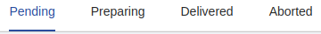

<!--
WARNING:
This file is automatically generated. Please edit the 'README' file of the corresponding component and run `yarn copy:docs`
-->

<<<<<<< HEAD:docs/microfrontend-composer/back-kit/60_components/520_tabs.md
[img-bk-tabs]: img/bk-tabs.png
=======

>>>>>>> main:docs/business_suite/backoffice/60_components/520_tabs.md
[handlebars]: https://handlebarsjs.com/guide/expressions.html

[events]: ../10_overview.md#events
[filters]: ../40_core_concepts.md#filters
[filter-operators]: ../40_core_concepts.md#filter-operators
[localized-text]: ../40_core_concepts.md#localization-and-i18n
[dynamic-configuration]: ../40_core_concepts.md#dynamic-configuration

[bk-crud-client]: ./100_crud_client.md

[change-query]: ../70_events.md#change-query
[nested-navigation-state/push]: ../70_events.md#nested-navigation-state---push
[nested-navigation-state/back]: ../70_events.md#nested-navigation-state---back
[change-layout]: ../70_events.md#change-layout


```html
<bk-tabs></bk-tabs>
```

<<<<<<< HEAD:docs/microfrontend-composer/back-kit/60_components/520_tabs.md
![tabs][img-bk-tabs]
=======

>>>>>>> main:docs/business_suite/backoffice/60_components/520_tabs.md

The Tabs component offers a fixed set of [filters], presented as tabs. Each tab is associated to a list of filters.
By default, selecting a tab triggers a request to replace the filters associated with the previously selected tab and apply the filters of the newly selected tab during data retrieval.
To achieve this behavior, the Tabs component injects the chosen filters into the payload of a [change-query] event, utilizing the `characteristic` key.

## How to configure

The Tabs component requires property `tabs` to be configured with an array of objects, where each entry is mapped to a tab.

```json
{
  "tag": "bk-tabs",
  "properties": {
    "tabs": [
      {
        "key": "pending",
        "title": "Pending",
        "filters": [
          {
            "property": "status",
            "operator": "equal",
            "value": "Pending"
          },
        ]
      },
      {
        "key": "preparing",
        "title": "Preparing",
        "filters": [
          {
            "property": "status",
            "operator": "equal",
            "value": "Preparing"
          }
        ]
      }
    ]
  }
}
```

Each entry of `tabs` property is an object which supports keys:
  - `key`: the id of the tab
  - `title`: the [localized label][localized-text] associated to the tab
  - `order`: the tab order number
  - `filters`: array of [filters](#filters-configuration) that will be applied when the tab is opened
  - `event`: event launched when the tab is opened

### Filters

The Tabs component allows to assign [filters] to each rendered tab using the `filters` key in the entries of the `tabs` property.

Each filter is composed of an object with keys
  - `property`: id of the field to use for the filter
  - `operator`: [filter operator][filter-operators] to use for the filter
  - `value`: input value to be compared in each data element against the value of the specified property, using to the specified operator

The `value` key supports [dynamic configurations][dynamic-configuration], allowing both access to information about the currently logged user and to perform basic time arithmetic.

#### Dynamic Filters: accessing Current User

The Tabs component allows [dynamic configurations][dynamic-configuration] through [handlebar notation][handlebars].
The provided dynamic context is the information of the current user using key `currentUser`.

For instance:
```json
{
  "properties": {
    "tabs": [
      {
        "key": "currentuser",
        "title": "Current User",
        "filters": [
          {
            "property": "name",
            "operator": "equal",
            "value": "{{currentUser.name}}"
          }
        ]
      }
    ]
  }
}
```

#### Dynamic Filters: time-based filters

When filtering by a date field, it is possible to set the `value` of the filter to the keyword `$today`, which represents the current date.
Furthermore, it is also possible to perform basic arithmetic operations on date values by setting value to an object with keys:

  - `value`: the base value (`$today` keyword is supported)
  - `offset`: number representing how much to add / subtract from the `value`
  - `operation`: whether to add or subtract the `offest` to the `value`
  - `unit`: unit of measure of the `offset` ('day', 'week', 'month', ...)


### Emitting custom Events

It is possible to associate the opening of a tab to the emission of a configurable event.
When entries of `tabs` property have their key `event` populated, selecting the tab triggers the emission of such event instead of the default request to update the data filtering query.


## Examples

### Example: Basic Usage

Assuming the Tabs component to be configured like:

```json
{
  "tag": "bk-tabs",
  "properties": {
    "tabs": [
      {
        "key": "pending",
        "title": {
          "en": "Pending",
          "it": "In attesa"
        },
        "filters": [
          {
            "property": "status",
            "operator": "equal",
            "value": "Pending"
          }
        ]
      },
      {
        "key": "preparing",
        "title": {
          "en": "Preparing",
          "it": "In preparazione"
        },
        "filters": [
          {
            "property": "status",
            "operator": "equal",
            "value": "Preparing"
          }
        ]
      }
    ]
  }
}
```

upon connection to the page, the first tab is automatically selected, resulting in the emission of a [change-query] event with payload

```json
{
  "characteristic": {
    "property": "status",
    "operator": "equal",
    "value": "Pending"
  }
}
```

Upon selecting the second tab, a [change-query] event with the following payload is emitted:

```json
{
  "characteristic": {
    "property": "status",
    "operator": "equal",
    "value": "Pending"
  }
}
```

A component like the [CRUD Client][bk-crud-client] could listen to such events.

### Example: Dynamic access to user information

The Tabs component allows [dynamic configurations][dynamic-configuration] through [handlebar notation][handlebars].

For instance, given the following configuration:

```json
{
  "tag": "bk-tabs",
  "properties": {
    "tabs": [
      {
        "key": "currentuser",
        "title": "Current User",
        "filters": [
          {
            "property": "nickname",
            "operator": "equal",
            "value": "{{currentUser.username}}"
          }
        ]
      }
    ]
  }
}
```

assuming the currently logged user to be representable with the following object:

```json
{
  "name": "Sara",
  "surname": "Smith",
  "username": "sara_smith_123"
}
```

selecting the tab in the example triggers the emission of a [change-query] event with payload:

```json
{
  "characteristic": [
    {
      "property": "nickname",
      "operator": "equal",
      "value": "sara_smith_123"
    }
  ]
}
```

### Example: Time based filters

When filtering by a date, it is possible to use the special keyword in the value key `$today`, which represents the current date.
For example:
```json
{
  "tag": "bk-tabs",
  "properties": {
    "tabs": [
      {
        "key": "ordered",
        "title": "Ordered",
        "filters": [
          {
            "property": "orderedAt",
            "operator": "less",
            "value": "$today"
          }
        ]
      }
    ]
  }
}
```

It is also possible to perform basic arithmetic operations on date values.
For example, a Tab component configured like the following:
```json
{
  "tag": "bk-tabs",
  "properties": {
    "tabs": [
      {
        "key": "old",
        "title": "Old Orders",
        "filters": [
          {
            "property": "orderedAt",
            "operator": "less",
            "value": {
              "value": "$today",
              "offset": 1,
              "unit": "month",
              "operation": "subtract"
            }
          }
        ]
      }
    ]
  }
}
```
emits the request to fetch data for which the date of the "orderedAt" field is previous to one month before the current date.

Time based operations are also available in case of filters with operator `between`, in which the `value` should be an array.
For instance:

```json
{
  "tag": "bk-tabs",
  "properties": {
    "tabs": [
      {
        "key": "recent",
        "title": "Recently Ordered",
        "filters": [
          {
            "property": "orderedAt",
            "operator": "between",
            "value": [
              {
                "value": "$today",
                "offset": 1,
                "unit": "week",
                "operation": "subtract"
              },
              "$today"
            ]
          }
        ]
      }
    ]
  }
}
```
emits a request to fetch data for which the value of "orderedAt" field is a date included between one week ago and the current date.

### Example: Custom Event

The Tabs component can be used to emit custom events **instead of** the default [change-query] event.
For instance, assuming the Tabs component to be configured like:

```json
{
  "tag": "bk-tabs",
  "properties": {
    "tabs": [
      {
        "key": "orders",
        "title": {
          "en": "Orders",
          "it": "Ordini"
        },
        "event": {
          "label": "change-layou",
          "payload": {
            "layout": "riders-layout"
          }
        }
      },
      {
        "key": "customers",
        "title": {
          "en": "Customers",
          "it": "Clienti"
        },
        "filters": [
          {
            "label": "change-layout",
            "payload": {
              "layout": "customers-layout"
            }
          }
        ]
      }
    ]
  }
}
```

upon connection to the page, the first tab is automatically selected, resulting in the emission of a [change-layout] event with payload

```json
{
  "layout": "riders-layout"
}
```

Upon selecting the second tab, a [change-layout] event with the following payload is emitted:
```json
{
  "layout": "customers-layout"
}
```

## API

### Properties & Attributes


| property | attribute | type          | default | description                   |
| -------- | --------- | ------------- | ------- | ----------------------------- |
| `tabs`   | -         | [Tab](#tab)[] | -       | array with tabs configuration |

#### Tab

```typescript
type Tab = {
  title: LocalizedText
  filters?: ConfigurableTabFilter[]
  event?: Partial<Event>
  order?: number
  key: string
}

type ConfigurableTabFilter = {
  operator: FilterOperator
  property: string
  value: string | number | boolean | any[] | DateOptions
}

type DateOptions = {
  value: string
  offset: number
  operation: 'add' | 'subtract'
  unit: 'day' | 'week' | 'month' | 'year' | 'hour' | 'minute' | 'second' | 'millisecond'
}
```

where
  - [LocalizedText][localized-text] is either a string or an object that maps languages acronyms to strings
  - [FilterOperator][filter-operators] is one of the supported filter operators
  - [Event][events] is the object representation of an event, thus an object with keys `label`, `payload`, `meta`

### Listens to

| event                          | action                                                                                                   |
| ------------------------------ | -------------------------------------------------------------------------------------------------------- |
| [nested-navigation-state/push] | updates internal representation of the current navigation path by adding one step                        |
| [nested-navigation-state/back] | updates internal representation of the current navigation path by removing the specified number of steps |

### Emits


| event                | description                                   |
| -------------------- | --------------------------------------------- |
| configurable event | custom events can be emitted on tabs opening |
| [change-query]       | requests filtering on dataset                 |
