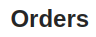

<!--
WARNING:
This file is automatically generated. Please edit the 'README' file of the corresponding component and run `yarn copy:docs`
-->

<<<<<<< HEAD:docs/microfrontend-composer/back-kit/60_components/530_title.md
[img-bk-title]: img/bk-title.png
=======

>>>>>>> main:docs/business_suite/backoffice/60_components/530_title.md
[localized-text]: ../40_core_concepts.md#localization-and-i18n


```html
<bk-title></bk-title>
```

<<<<<<< HEAD:docs/microfrontend-composer/back-kit/60_components/530_title.md
![title][img-bk-title]
=======

>>>>>>> main:docs/business_suite/backoffice/60_components/530_title.md

The Title renders a header title.

## How to configure

The title text should be specified using `content` property. [Localized objects][localized-text] are supported.

```json
{
  "tag": "bk-title",
  "properties": {
    "content": {
      "en": "Products list",
      "it": "Listat dei prodotti"
    }
  }
}
```

## API

### Properties & Attributes

| property  | attribute | type                            | default | description       |
| --------- | --------- | ------------------------------- | ------- | ----------------- |
| `content` | -         | [LocalizedText][localized-text] | -       | localized content |

### Listens to

None

### Emits

None
