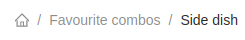

<!--
WARNING: this file was automatically generated by Mia-Platform Doc Aggregator.
DO NOT MODIFY IT BY HAND.
Instead, modify the source file and run the aggregator to regenerate this file.
-->

<!--
WARNING:
This file is automatically generated. Please edit the 'README' file of the corresponding component and run `yarn copy:docs`
-->


[data-schema]: ../30_page_layout.md#data-schema

[nested-navigation-state/push]: ../70_events.md#nested-navigation-state---push
[nested-navigation-state/back]: ../70_events.md#nested-navigation-state---back
[display-data]: ../70_events.md#display-data


```html
<bk-breadcrumbs></bk-breadcrumbs>
```



The Breadcrumbs provide a visual representation of the the current nesting path, and allows to go back to any nesting level.

## How to configure

The Breadcrumbs component should be supplied with a [data-schema] containing field labels from the underlying data.
These labels are used to display the nesting path in the provided visual representation.

```json
{
  "tag": "bk-breadcrumb",
  "properties": {
    "dataSchema": {
      "type": "object",
      "properties": {
        "colors": {
          "type": "array",
          "items": {
            "type": "object",
            "properties": {
              "r": {"type": "number"},
              "g": {"type": "number"},
              "b": {"type": "number"}
            }
          }
        }
      }
    }
  }
}
```


## Examples

A Breadcrumbs component configured like:

```json
{
  "tag": "bk-breadcrumb",
  "properties": {
    "dataSchema": {
      "type": "object",
      "properties": {
        "product": {
          "type": "object",
          "label": {
            "en": "Product",
            "it": "Prodotto"
          },
          "dataSchema": {
            "type": "object",
            "properties": {
              "colors": {
                "type": "array",
                "items": {
                  "type": "object",
                  "properties": {
                    "r": {"type": "number"},
                    "g": {"type": "number"},
                    "b": {"type": "number"}
                  }
                }
              }
            }
          }
        }
      }
    }
  }
}
```

upon receiving two [nested-navigation-state/push] events with payload including `selectedKey` property like:

```json
{
  "selectedKey": "product"
}
```
and
```json
{
  "selectedKey": "colors"
}
```

(which notify the request to enter the visualization of nested field `product` and nested field `colors` respectively),
and assuming the browser language setting to be set to english,

visualizes a nesting path that can be represented by a string like:
```
<home-icon>/Product/Colors
```

## API

### Properties & Attributes

| property     | attribute   | type                                         | default | description                                                    |
| ------------ | ----------- | -------------------------------------------- | ------- | -------------------------------------------------------------- |
| `dataSchema` | -           | [ExtendedJSONSchema7Definition][data-schema] | -       | data schema describing the fields of the collection to display |
| `showHome`   | `show-home` | boolean                                      | true    | toggles visualization of a "home" icon at breadcrumbs 0-level  |

### Listens to

| event                          | action                                                                                   |
| ------------------------------ | ---------------------------------------------------------------------------------------- |
| [nested-navigation-state/push] | updates the representation of the nesting path by adding one step                        |
| [nested-navigation-state/back] | updates the representation of the nesting path by removing the specified number of steps |
| [display-data]                 | attempts to recreate current nesting path with new data. If fails, goes back to 0-level  |

### Emits

| event                          | description                                                           |
| ------------------------------ | --------------------------------------------------------------------- |
| [nested-navigation-state/back] | notifies to go back the specified number of steps in the nesting path |
