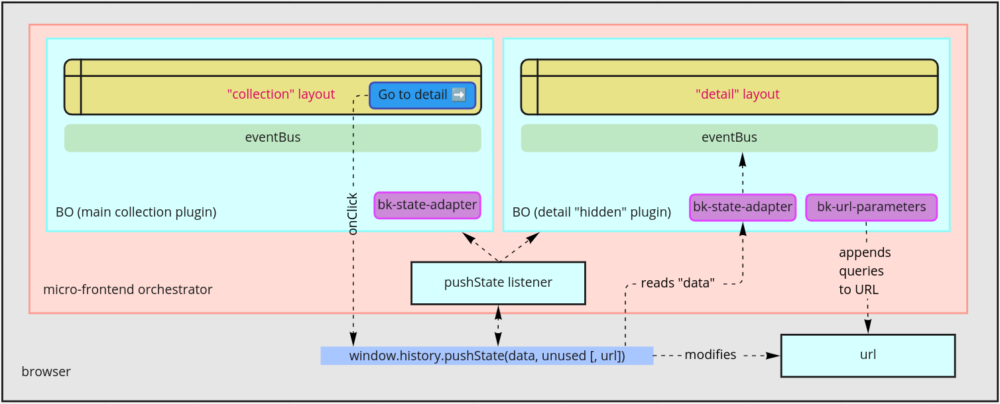

<!--
WARNING: this file was automatically generated by Mia-Platform Doc Aggregator.
DO NOT MODIFY IT BY HAND.
Instead, modify the source file and run the aggregator to regenerate this file.
-->

[window.history.push]: https://developer.mozilla.org/en-US/docs/Web/API/History/pushState
[window.history.replace]: https://developer.mozilla.org/en-US/docs/Web/API/History/replaceState

[change-query]: ../70_events.md#change-query

[bk-url-parameters]: ../60_components//540_url_parameters_adapter.md
[bk-crud-client]: ../60_components/100_crud_client.md
[bk-crud-lookup-client]: ../60_components/170_crud_lookup_client.md
[bk-state-adapter]: ../60_components/500_state_adapter.md
[bk-button]: ../60_components/90_button.md

[afterFinishEvents]: ../60_components/330_form_drawer.md#after-submission


Microfrontend Composer is a set of micro-frontend plugins. An orchestrator of micro-frontends should provide a mechanism for page/plugin navigation.

In this regard `Back-Kit` provides a set of `webcomponents` which can handle navigation main features given that the micro-frontend orchestrator is
actively listening the [pushState][window.history.push] / [replaceState][window.history.replace] events.

Let's take on a real life example. Two separate plugins represent a main "collection", rendered with a table and http-client to fetch data, and a "detail" overview,
made with a card and an http-client which probably requires filtering on data to fetch.



A button is clicked to navigate to the detail plugin.

Since the orchestrator cannot use a `location.href` otherwise it would be reloaded making the operation anti-pattern, we could use the `history` API provided by the browser. On click we provide all information needed to change plugin.

1. a context of data we would like to carry along (i.e. the unique `id` of the detail we're navigating to)
2. the relative url (possibly with queries)

The micro-frontend orchestrator will provide plugin swapping capabilities by replacing the sandboxed document
in which is mounting plugins and the browser will

1. modify the URL string
2. insert the data context into `window.history.state`

`Back-Kit` provides two components that are suitable to handle the landing on a new plugin.

## URL Parameters Adapter

The [URL Parameters Adapter][bk-url-parameters] provides a URL mask to separate the plugin URL (handled by the micro-frontend orchestrator) and the rest of the pathname useful to scope the detail plugin

```json
{
  "tag": "bk-url-parameters",
  "properties": {
    "urlMask": "/detail/:id",
    "redirectUrl": "/collection"
  }
}
```

and if the `:id` key is not found it may prevent further navigation and push back.
This component listens to the `window.location.href` only

### Interplay with CRUD Client and CRUD Lookup Client

While The [URL Parameters Adapter][bk-url-parameters] sends a [change-query] event with payload `{id: "<some id>"}`, the `change-query` subscribers which are the [CRUD Client][bk-crud-client] and the [CRUD Lookup Client][bk-crud-lookup-client] will permanently modify their http fetching query by including a default search parameters formed as `?...&id=<some id>&...`.\
This URL editing will scope the entire page providing the concept of a "detail" layout with respect to the "collection" layout centered on a table.

## State Adapter

The [State Adapter][bk-state-adapter] provides the capability to inject `pushState` data into the `EventBus` like if the user already performed some operations.

If the button clicked on the "collection" plugin provides a special key `__BK_INIT` (whose name is configurable), its all content will be parsed to the `EventBus`

```javascript
window.history.state = {
  __BK_INIT: [
    {
      label: "add-new",
      payload: {
        detailId: "624ecd5642247867845498fb"
      }
    }
  ]
}
```

in the previous example `EventBus` will pipe an `add-new` event with the given `detailId` payload. The corresponding action on a [Button][bk-button] embedded into the "collection" plugin would be

```json
{
  "tag": "bk-button",
  "properties": {
    "content": "Add new item",
    "action": {
      "type": "push",
      "config": {
        "url": "/detail",
        "state": {
          "__BK_INIT": [
            {
              "label": "add-new",
              "payload": {"detailId": "<some kind of reference>"}
            }
          ]
        }
      }
    }
  }
}
```

## Example - food delivery

Suppose you have food delivery orders listed in the main "collection" using a table.
The main table expects a field named `orderId` as primary table index. A form is used to create a new
order

```json
// orders-list.json

{
  {
    "tag": "bk-table",
    "properties": {
      "dataSchema": {
        "type": "object",
        "properties": {
          "orderId": { "type": "string" }
        }
      }
    }
  },
  {
    "tag": "bk-add-new-button"
  },
  {
    "tag": "bk-form-drawer",
    "properties": {
      "dataSchema": "<as above>",
      "afterFinishEvents": {
        "data": {
          "__BK_INIT": [
            {
              "label": "add-new",
              "payload": {"orderId": "{{response.orderId}}"}
            }
          ]
        },
        "url": "/order-details/{{response.orderId}}"
      }
    }
  }
}
```

On form submission, if the creation POST is, successful a context is provided with the HTTP response context to the [afterFinishEvents].

According to the configuration shown above a `pushState` is called and navigation to `/order-details/<new id>` is handled by the micro-frontend orchestrator.

On landing onto `order-details` plugin, we should focus on the following config

```json
// order-details.json

{
  {
    "tag": "bk-url-parameters",
    "properties": {
      "eventLabel": "change-query",
      "urlMask": "/order-details/:_id",
      "redirectUrl": "/orders-list"
    }
  },
  {
    "tag": "bk-state-adapter"
  },
  {
    "tag": "bk-form-drawer",
    "properties": {
      "dataSchema": {
        "type": "object",
        "properties": {
          "orderId": { "type": "string" }
        }
      }
    }
  }
}
```

The [URL Parameters Adapter][bk-url-parameters] will attempt current URL matching against the given mask. If it fails it will
redirect according to the provided property.

Otherwise it will attempt to send the matched content to the `EventBus` using a property called
`eventLabel` which defaults to [change-query].

Hence, let's suppose we land on `/order-details/624ecd5642247867845498fb`, The URL Parameters Adapter will
send a `change-query` event with payload

```javascript
const payload = {
  _id: "624ecd5642247867845498fb"
}
```

where `_id` is taken from the `urlMask` configuration.

Meanwhile, The [State Adapter][bk-state-adapter] awaits a given delay timeout and then checks the `window.history.state`
which was injected when `pushState` was called and if it finds a key `__BK_INIT` (which is overridable)
and then pipe the array content to the `EventBus`.

According to the incoming config the `EventBus` will receive an `add-new` event with payload
given by `{orderId: "624ecd5642247867845498fb"}`.

The form drawer into the "details" plugin will then open by subscribing the `add-new` event and
thus using the body to prefill the `orderId` field.
