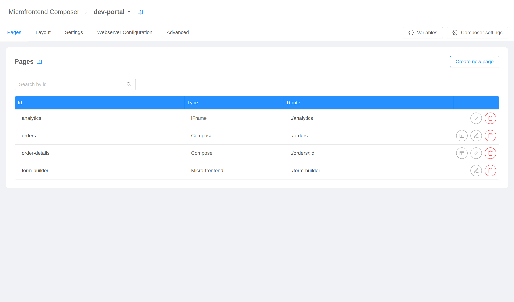
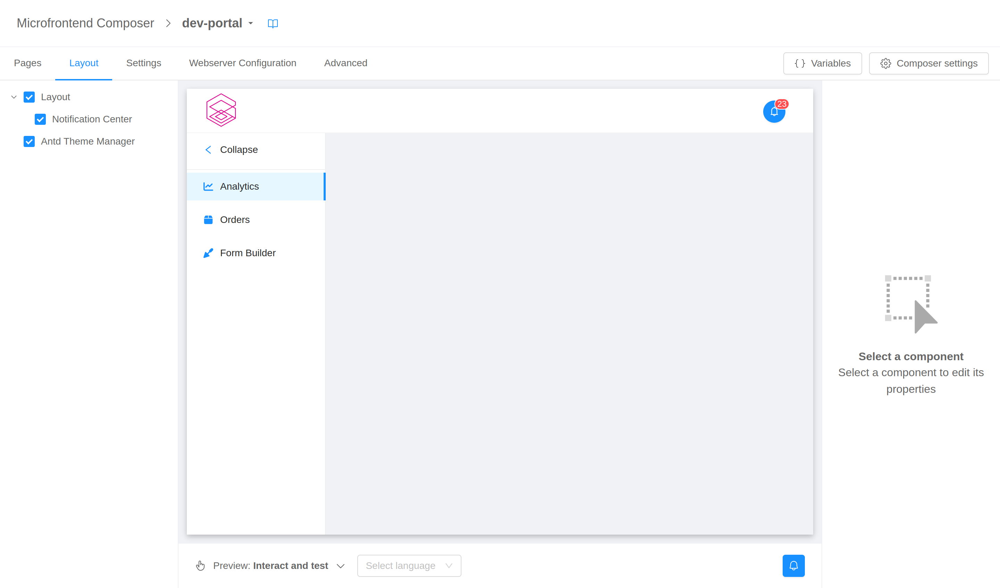
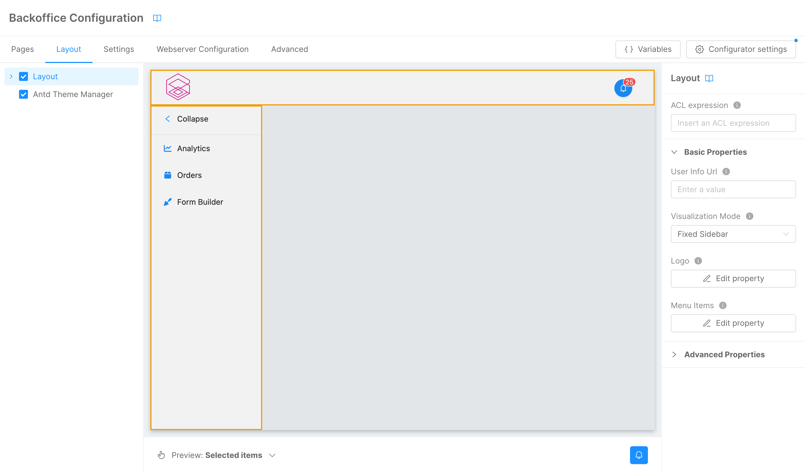
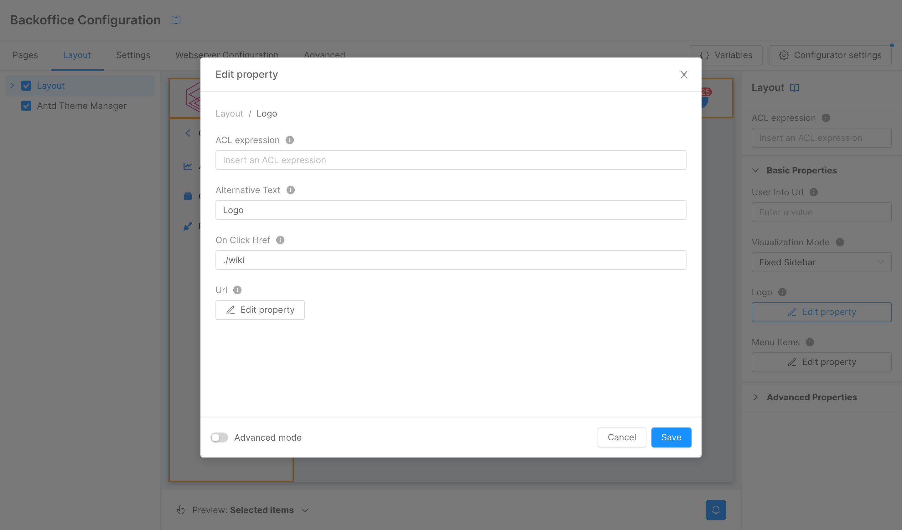
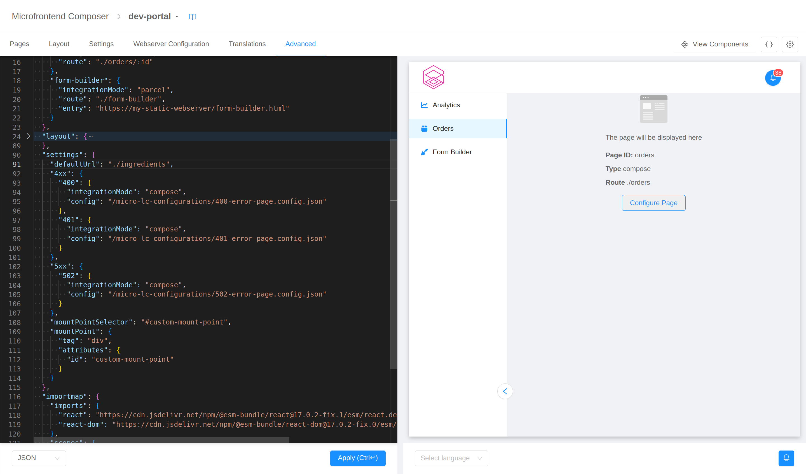

The first section of the configurator targets the general structure of the frontend. It is divided into five tabs:

1. [pages](#pages), where you can overview the frontend structure and quickly adding or removing pages,
2. [layout](#layout), where you can configure the frontend layout in a no-code fashion,
3. [settings](#settings), where frontend global and shared settings reside,
4. [webserver configuration](#webserver-configuration), where settings regarding the underlying server are made accessible, and
5. [advanced](#advanced-configuration), from which it is possible to review and edit the raw configuration.

## Pages

The first tab is _Pages_, it allows you to view, create, modify, and delete the pages (i.e., [micro-lc applications](https://micro-lc.io/docs/guides/applications/)) composing your frontend.

### Create new page

Clicking on the _Add new page_ button will open the page creation wizard, which will lead to the page setup thought two steps, [page details](#page-details) and [page options](#page-options).

#### Page details

On the first step of the wizard you will be asked to specify some basic details regarding the page.

The requested fields are:

- _page type_: the type of the new page chosen among
  - [compose](https://micro-lc.io/docs/guides/applications/compose): a dynamically composed page constructed with HTML5 elements or web components following a provided configuration;
  - [micro-frontend](https://micro-lc.io/docs/guides/applications/parcels): a framework-agnostic component directly managed by the orchestrator, which needs to be supplied with the assets entry point;
  - [iFrame](https://micro-lc.io/docs/guides/applications/iframes): an HTML page embedded in an iframe tag with full strict encapsulation;
- _id_: the unique identifier of the page;
- _page rendering route_: the path on which the page will be rendered;
- _acl expression_: an optional [logical expression](https://micro-lc.io/add-ons/backend/middleware#acl-application)
  evaluated against user's groups and permissions to determine whether they can view the page.

#### Page options

The second and last step is a type-specific form for page options.

For **compose pages**, available fields are:

- _input mode_: whether the page configuration is saved inline (_inline_ option) or in a separate file (_external_ option);
- _configurations manager endpoint_ (only if input mode is _external_): endpoint from which the configuration file can be fetched;
- _configuration source_ (only if input mode is _external_): name of the file containing the page configuration;
- _template_ (only if input mode is _external_): a [configuration template](./20_compose_pages.md#templates) carrying a pre-defined, pre-arranged set of components.

For **micro-frontend pages**, available fields are:

- _entry_: a JSON object carrying information regarding the [entry points](https://micro-lc.io/docs/guides/applications/parcels#usage) of the micro-frontend;
- _properties_: a JSON object of [properties](https://micro-lc.io/docs/guides/applications/parcels#properties) to inject in the micro-frontend;
- _inject base_: a flag stating whether a `<base>` tag has to be [injected](https://micro-lc.io/docs/guides/applications/parcels#injectbase) in the micro-frontend.

:::tip
The editors will help you writing configurations hinting the correct properties JSON schemas.
:::

For **iFrame pages**, available fields are:

- _source_: the URL of the page to embed;
- _source document_: an inline HTML document to embed (overriding _source_);
- _attributes_: `<iframe>` HTML tag valid
  [attributes](https://developer.mozilla.org/en-US/docs/Web/HTML/Element/iframe#attributes) written in a JSON object fashion.

:::tip
The editors will help you writing configurations hinting the correct properties JSON schemas.
:::

### Edit page

The buttons placed in the last column of the page table allows you to interact with existing pages.

From left to right, available actions are:

- _edit page_ (only for compose pages): to open the section for [compose pages configuration](./20_compose_pages.md);
- _edit details_: to re-open the [page creation wizard](#create-new-page) in edit mode;
- _delete_: to delete the page.

## Layout

Through the _Layout_ tab you can configure your frontend [layout](https://micro-lc.io/docs/guides/layout) components in a no-code fashion.

In this tab, the configurator is divided into three sections: 
- a left menu that lists the components composing the layout,
- a central live, interactive preview, and
- a right menu where single component properties can be configured.

### Components list

The drawer on the left of the page shows a list of all the **custom components** (i.e., not-standard HTML tags) used in the layout configuration. The items will be nested according to the actual DOM tree.

:::tip
The only standard HTML tags allowed to be shown in the left menu are `<header>`, `<main>`, `<aside>`, and `<footer>`. These tags – which are containers with a semantic meaning – may help structuring the components tree.
:::

Selecting an item from this list will **highlight** the corresponding component in the [central preview](#live-preview) and show its **properties** for editing in the [right drawer](#components-properties-editor).

Components can be **hidden** from the page unchecking the box on their left. Keep in mind that components will just be hidden, and not removed from the DOM (technically speaking a `display: none` styling will be applied to them). To remove components from the page entirely you have to resort to the [advanced configuration](#advanced-configuration).

### Live preview

The center of the page shows a live preview of what the final layout will look like.

The preview has two modes, one where you can **interact with the page** as you would do with the final frontend, and one where an overlay is placed on top of the page allowing you to **select components** in page without triggering their normal click behavior. You can switch between this two modes with the selector in the bottom left corner of the preview (or with key keyboard shortcut `CTRL + Space`).

In "select" mode, a click on a component will **highlight** it, **select** it in the [left menu](#components-list), and show its **properties** for editing in the [right drawer](#components-properties-editor).

Since the preview is a real, functioning frontend, components may fire calls to backend or Web APIs (e.g., navigation events or local storage accesses). To avoid disrupting the configuration flow, these events are caught and mocked. You will receive **notifications** regarding them – alongside with any **error** that may occur in page – in the notification center in the bottom right corner of the preview.

### Components properties editor

The drawer on the right of the page allows you to view and edit the properties of the components in page through a system of forms.

When a component is selected (through the [left menu](#components-list) or the [preview](#live-preview)), the right menu will show its properties possibly divided into _basic_ and _advanced_ for an easier consultation.

Different properties will have different means of editing – depending on the type of the property itself –. From a high-level point of view, they can be divided into **primitive** properties, which can be edited directly from the menu, and **non-primitive** properties, for which a modal will be spawned.

Some properties will be marked as **Shared**. This means that it is possible to assign them a common reusable property of the same type. In order to do so, create a Shared Property in the [Shared Properties](20_compose_pages.md#shared-properties) section.

:::tip
Modals have the option to turn on an **Advanced mode** that will make available a code editor to edit the property.

:::tip

#### ACL expression

Components will also have a special property called `aclExpression`, which can be used to [control](https://micro-lc.io/add-ons/backend/middleware#acl-application) whether certain portions of the configuration are removed based on a logical expression evaluated against user's groups and permissions.

The property is configurable at two levels.

- On a **component level** from the properties form itself to limit the presence of the whole component definition. 
  
  For example, with the following configuration

  

  the layout component will not be included if the configuration is not fetched by a user with the _admin_ group.

- On a **property level** for all the properties (and sub-properties) of type `object`. 
  
  For example, with the following configuration
  
  

  the property `logo` of the layout will not be included if the configuration is not fetched by a user with the _admin_ group.

## Settings

The _Settings_ tab collects several frontend global settings. The default configurations in most cases should be sufficient, so it will probably not be necessary to use this section.

### URIs

The URIs section allow you to configure the default [landing URL](https://micro-lc.io/api/micro-lc-web-component#defaulturl), and the URI of a [custom composer](https://micro-lc.io/api/micro-lc-web-component#composeruri).

### Custom error pages

In this section you can configure personalized [error pages](https://micro-lc.io/docs/guides/applications/error-pages) for 4xx and 5xx errors.

For each page you need to provide the status code and the [configuration](https://micro-lc.io/docs/guides/applications/error-pages#custom-error-pages).

:::tip
The editors will help you writing configurations hinting the correct properties JSON schemas.
:::

### Mount point

This section is dedicated to the personalization of micro-lc [mount point](https://micro-lc.io/docs/guides/layout#mount-point), both in terms of [selector](https://micro-lc.io/api/micro-lc-web-component#mountpointselector) and of [configuration](https://micro-lc.io/api/micro-lc-web-component#mountpointselector).

:::tip
The editors will help you writing configurations hinting the correct properties JSON schemas.
:::

### Import map

Here you can specify a global [import map](https://micro-lc.io/api/micro-lc-web-component#importmap).

:::tip
The editors will help you writing configurations hinting the correct properties JSON schemas.
:::

### Shared properties

In this final section you can define global [shared properties](https://micro-lc.io/api/micro-lc-web-component#shared) for frontend page.

:::tip
The editors will help you writing configurations hinting the correct properties JSON schemas.
:::

## Webserver configuration

The _Webserver Configuration_ tab gives you access to the configuration of the [service](https://micro-lc.io/add-ons/backend/middleware/) responsible for serving frontend static files and configurations.

### Entry point

Here you can find the HTML file used as entry point for the frontend allowing you to fine tune how [micro-lc web component](https://micro-lc.io/api/micro-lc-web-component) is configured.

### Content types

From this section you can [tell the service](https://micro-lc.io/add-ons/backend/middleware#content-type) which [content type](https://developer.mozilla.org/en-US/docs/Web/HTTP/Headers/Content-Type) to use when serving files with specific extentions.

### Headers

This section allows you to specify [additional headers](https://micro-lc.io/add-ons/backend/middleware#headers) to include in static files responses.

## Advanced configuration

The _Advanced configuration_ tab is built to give the highest degree of configurability, providing access to the final JSON configuration. In this visualization the page is divided in two section, a **code editor** on the left and a **live preview** on the right.

The editor on the left is where the configuration can be viewed and edited. It supports both **JSON** and **YAML** with the possibility to switch (and convert the content) using the selector in the bottom left corner.

:::tip
The editor will help you writing the configuration hinting the correct JSON schema and validating the content live.
:::

The updates made with the editor are not immediately reflected in the preview on the right: only after the **"Apply" button** is clicked the modification are saved and the preview is refreshed and aligned with the configuration.

:::warning
Any modification made with the editor **will not be saved** unless the _"Apply"_ button is clicked.
:::

Since the preview is a real, functioning frontend, components may fire calls to backend or Web APIs (e.g., navigation events or local storage accesses). To avoid disrupting the configuration flow, these events are caught and mocked. You will receive **notifications** regarding them – alongside with any **error** that may occur in page – in the notification center in the bottom right corner of the page.

